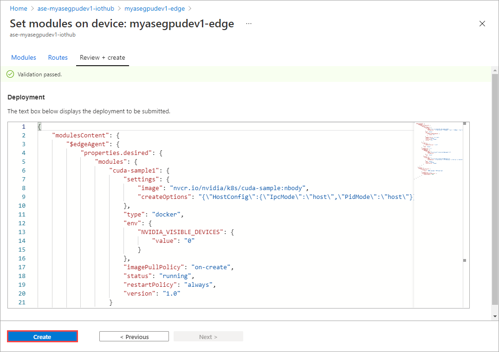
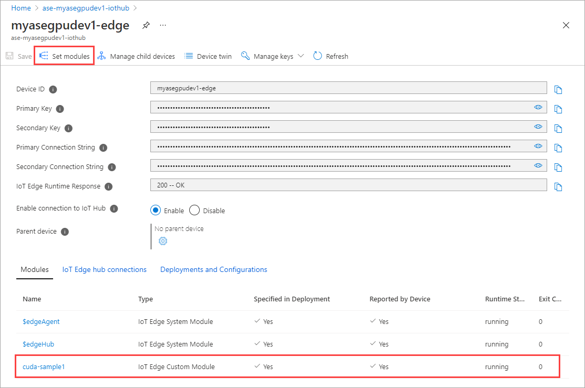

# Deploy an IoT Edge workload using GPU sharing on your Azure Stack Edge Pro

This article describes how containerized workloads can share the GPUs on your Azure Stack Edge Pro GPU device. The approach involves enabling the Multi-Process Service (MPS) and then specifying the GPU workloads via an IoT Edge deployment. 

## Prerequisites

Before you begin, make sure that:

1. You've access to an Azure Stack Edge Pro GPU device that is activated as described in [Activate Azure Stack Edge Pro GPU](azure-stack-edge-gpu-deploy-activate.md).

1. You've enabled compute role on the device. A Kubernetes cluster was also created on the device when you configured compute on the device as per the instructions in [Configure compute on your Azure Stack Edge Pro device](azure-stack-edge-gpu-deploy-configure-compute.md).

1. You have the Kubernetes API endpoint from the **Device** page of your local web UI. For more information, see the instructions in [Get Kubernetes API endpoint](azure-stack-edge-gpu-deploy-configure-compute.md#get-kubernetes-endpoints). You have added this Kubernetes API endpoint to the `hosts` file on your client that will be accessing the device.


1. You've access to a client system with a [Supported operating system](azure-stack-edge-gpu-system-requirements.md#supported-os-for-clients-connected-to-device). If using a Windows client, the system should run PowerShell 5.0 or later to access the device.

    1. If you want to pull and push your own container images, make sure that the system has Docker client installed. If using a Windows client, [Install Docker Desktop on Windows](https://docs.docker.com/docker-for-windows/install/).  

1. You have created a namespace and a user. You have also granted user the access to this namespace. You have the `kubeconfig` file of this namespace installed on the client system that you'll use to access your device. For detailed instructions, see [Connect to and manage a Kubernetes cluster via kubectl on your Azure Stack Edge Pro GPU device](azure-stack-edge-gpu-create-kubernetes-cluster.md#configure-cluster-access-via-kubernetes-rbac). 

1. Save the following deployment `json` on your local system. You'll use information from this file to run the IoT Edge deployment. This deployment is based on [Simple CUDA containers](https://docs.nvidia.com/cuda/wsl-user-guide/index.html#running-simple-containers) that are publicly available from Nvidia. 

    ```json
        {
        "modulesContent": {
            "$edgeAgent": {
                "properties.desired": {
                    "modules": {
                        "cuda-sample1": {
                            "settings": {
                                "image": "nvcr.io/nvidia/k8s/cuda-sample:nbody",
                                "createOptions": "{\"HostConfig\":{\"IpcMode\":\"host\",\"PidMode\":\"host\"}}"
                            },
                            "type": "docker",
                            "env": {
                                "NVIDIA_VISIBLE_DEVICES": {
                                    "value": "0"
                                }
                            },
                            "status": "running",
                            "restartPolicy": "always",
                            "version": "1.0"
                        },
                        "cuda-sample2": {
                            "settings": {
                                "image": "nvcr.io/nvidia/k8s/cuda-sample:nbody",
                                "createOptions": "{
                                                    "HostConfig": {
                                                        "IpcMode": "host",
                                                        "PidMode": "host"
                                                     }
                                                  }"
                            },
                            "type": "docker",
                            "env": {
                                "NVIDIA_VISIBLE_DEVICES": {
                                    "value": "0"
                                }
                            },
                            "status": "running",
                            "restartPolicy": "always",
                            "version": "1.0"
                        }
                    },
                    "runtime": {
                        "settings": {
                            "minDockerVersion": "v1.25"
                        },
                        "type": "docker"
                    },
                    "schemaVersion": "1.1",
                    "systemModules": {
                        "edgeAgent": {
                            "settings": {
                                "image": "mcr.microsoft.com/azureiotedge-agent:1.0",
                                "createOptions": ""
                            },
                            "type": "docker",
                            "env": {
                                "SendRuntimeQualityTelemetry": {
                                    "value": "false"
                                }
                            }
                        },
                        "edgeHub": {
                            "settings": {
                                "image": "mcr.microsoft.com/azureiotedge-hub:1.0",
                                "createOptions": "{\"HostConfig\":{\"PortBindings\":{\"443/tcp\":[{\"HostPort\":\"443\"}],\"5671/tcp\":[{\"HostPort\":\"5671\"}],\"8883/tcp\":[{\"HostPort\":\"8883\"}]}}}"
                            },
                            "type": "docker",
                            "status": "running",
                            "restartPolicy": "always"
                        }
                    }
                }
            },
            "$edgeHub": {
                "properties.desired": {
                    "routes": {
                        "route": "FROM /messages/* INTO $upstream"
                    },
                    "schemaVersion": "1.1",
                    "storeAndForwardConfiguration": {
                        "timeToLiveSecs": 7200
                    }
                }
            }
        }
    }
    ```

## Verify GPU driver, CUDA version

The first step is to verify that your device is running required GPU driver and CUDA versions.

1. [Connect to the PowerShell interface of your device]().

1. Run the following command:

    `Get-HcsGpuNvidiaSmi`

1. In the Nvidia smi output, make a note of the GPU version and the CUDA version on your device. If you are running Azure Stack Edge 2102 software, this version would correspond to the following driver versions:

    - GPU driver version: 460.32.03
    - CUDA version: 11.2
    
    Here is an example output:

    ```powershell
    [10.100.10.10]: PS>Get-HcsGpuNvidiaSmi
    K8S-1HXQG13CL-1HXQG13:
    
    Tue Feb 23 10:34:01 2021
    +-----------------------------------------------------------------------------+
    | NVIDIA-SMI 460.32.03    Driver Version: 460.32.03    CUDA Version: 11.2     |
    |-------------------------------+----------------------+----------------------+
    | GPU  Name        Persistence-M| Bus-Id        Disp.A | Volatile Uncorr. ECC |
    | Fan  Temp  Perf  Pwr:Usage/Cap|         Memory-Usage | GPU-Util  Compute M. |
    |                               |                      |               MIG M. |
    |===============================+======================+======================|
    |   0  Tesla T4            On   | 0000041F:00:00.0 Off |                    0 |
    | N/A   40C    P8    15W /  70W |      0MiB / 15109MiB |      0%      Default |
    |                               |                      |                  N/A |
    +-------------------------------+----------------------+----------------------+
    
    +-----------------------------------------------------------------------------+
    | Processes:                                                                  |
    |  GPU   GI   CI        PID   Type   Process name                  GPU Memory |
    |        ID   ID                                                   Usage      |
    |=============================================================================|
    |  No running processes found                                                 |
    +-----------------------------------------------------------------------------+
    [10.100.10.10]: PS>  
    ```


1. Keep this session open as you will use it to view the Nvidia smi output throughout the article.


## Example deployment 1

You can now deploy an application on your device when the Multi-Process Service is not running. The deployment is via the Azure portal in the `iotedge` namespace that exists on your device.

### Deploy modules via portal

Deploy IoT Edge modules via the Azure portal.

1. Make sure that the IoT Edge service is running on your device.

    

1. Select the IoT Edge tile in the right-pane. Go to **IoT Edge > Properties**. In the right-pane, select the IoT Hub resource associated with your device.

    

1. In the IoT Hub resource, go to **Automatic Device Management > IoT Edge**. In the right-pane, select the IoT Edge device associated with your device.

    

1. Select **Set modules**.

    

1. Select **+ Add > + IoT Edge module**.

    

1. On the **Module Settings** tab, provide the **IoT Edge module name** and **Image URI**. Set **Image pull policy** to **On create**.

    
1. On the **Environment Variables** tab, specify **NVIDIA_VISIBLE_DEVICES** as **0**.

    

1. On the **Container Create Options** tab, provide the following options:

    ```json
    {
      "HostConfig": {
        "IpcMode": "host",
        "PidMode": "host"
      }
    }    
    ```
    The options are displayed as follows:

    

    Select **Add**.

1. The module that you added should show as **Running**. Select **Review + Create**.

    

1. Select **Create**. The module is now added.

    

1. On the **Modules** tab, the **Runtime status** of the module that you added shows as **Running**. Select **Set modules** to add a second module.

    

1. Repeat all the steps to add a module that you followed when adding the first module. In this example, provide the name of the module as `cuda-sample2`. 

    

    Use the same environment variable as both the modules will share the same GPU.

    

    Use the same container create options that you provided for the first module and select **Add**.

    

1. On the **Set modules** page, select **Create + Review** and then select **Create**. 

    

1. The **Runtime status** of both the modules should now show as **Running**.  


    


### Create user in IoT Edge namespace

1. [Connect to the PowerShell interface of your device](azure-stack-edge-gpu-connect-powershell-interface.md#connect-to-the-powershell-interface).

1. Create a new user in the `iotedge` namespace. Run the following command:

    `New-HcsKubernetesUser -UserName <user name>`

    Here is an example output:

    ```powershell
    [10.100.10.10]: PS>New-HcsKubernetesUser -UserName iotedgeuser
    apiVersion: v1
    clusters:
    - cluster:
        certificate-authority-data: 
    ===========================//snipped //======================// snipped //=============================
        server: https://compute.myasegpudev.wdshcsso.com:6443
      name: kubernetes
    contexts:
    - context:
        cluster: kubernetes
        user: iotedgeuser
      name: iotedgeuser@kubernetes
    current-context: iotedgeuser@kubernetes
    kind: Config
    preferences: {}
    users:
    - name: iotedgeuser
      user:
        client-certificate-data: 
    ===========================//snipped //======================// snipped //=============================
        client-key-data: 
    ===========================//snipped //======================// snipped ============================
    PQotLS0tLUVORCBSU0EgUFJJVkFURSBLRVktLS0tLQo=
    ```

1. Copy the output displayed in plain text. Save the output as a *config* file (with no extension) in the `.kube` folder of your user profile on your local machine, for example, `C:\Users\<username>\.kube`. 

1. Grant the user that you created, access to the `iotedge` namespace. Run the following command:

    `Grant-HcsKubernetesNamespaceAccess -Namespace iotedge -UserName <user name>`    

    Here is an example output:

    ```python
    [10.100.10.10]: PS>Grant-HcsKubernetesNamespaceAccess -Namespace iotedge -UserName iotedgeuser
    [10.100.10.10]: PS>    
    ```

### Example workload #1

1. Open a new PowerShell session.

1. List the applications started in the IoT Edge deployment. Run the following command: 

    `kubectl get deployment -n iotedge`

    Here is an example output:

    ```powershell
    PS C:\WINDOWS\system32> kubectl get deployment -n iotedge
    NAME           READY   UP-TO-DATE   AVAILABLE   AGE
    cuda-sample1   1/1     1            1           4d
    cuda-sample2   1/1     1            1           26h
    edgeagent      1/1     1            1           6d19h
    edgehub        1/1     1            1           4d
    iotedged       1/1     1            1           6d19h
    PS C:\WINDOWS\system32>
    ```
    There are two modules, `cuda-sample1` and `cuda-sample2` running on your device.

1. List the pods running in the `iotedge` namespace. Run the following command:

    `kubectl get pods -n iotedge`   

    Here is an example output:

    ```powershell
    PS C:\WINDOWS\system32> kubectl get pods -n iotedge
    NAME                           READY   STATUS    RESTARTS   AGE
    cuda-sample1-97c494d7f-lnmns   2/2     Running   0          50s
    cuda-sample2-d9f6c4688-2rld9   2/2     Running   0          45s
    edgeagent-6565f58f8c-xplfs     2/2     Running   2          6d19h
    edgehub-7bbb498c76-r5g78       2/2     Running   5          4d
    iotedged-55fdb7b5c6-npgrk      1/1     Running   2          6d19h
    PS C:\WINDOWS\system32>   
    ```

    There are two pods, `cuda-sample1-97c494d7f-lnmns` and `cuda-sample2-d9f6c4688-2rld9` running on your device.

1. Get a shell to the first running container. Run the following command:

    `kubectl exec -it <Name of the pod> -c <name of the container> -n <Name of the namespace> -- bash `   

    Here is an example output:

    ```powershell

    ```

    Repeat this command to get a shell to the second container running on your device. Here is an example output:

    ```powershell

    ```

1. Run n-body simulation on both the containers that you are connected to. For more information, see [N-body simulation](https://physics.princeton.edu//~fpretori/Nbody/intro.htm).

    Here is an example output from the first container:

    ```powershell

    ```

    Here is an example output from the second container:

    ```powershell

    ```

1. While both the containers are running the n-body simulation, view the GPU utilization from the Nvidia smi output. Go to the PowerShell interface of the device and run `Get-HcsGpuNvidiaSmi`.

    Here is an example output when both the containers are running the n-body simulation:

    ```powershell
       [10.100.10.10]: PS>Get-HcsGpuNvidiaSmi
    K8S-1HXQG13CL-1HXQG13:
    
    Tue Feb 23 10:52:18 2021
    +-----------------------------------------------------------------------------+
    | NVIDIA-SMI 460.32.03    Driver Version: 460.32.03    CUDA Version: 11.2     |
    |-------------------------------+----------------------+----------------------+
    | GPU  Name        Persistence-M| Bus-Id        Disp.A | Volatile Uncorr. ECC |
    | Fan  Temp  Perf  Pwr:Usage/Cap|         Memory-Usage | GPU-Util  Compute M. |
    |                               |                      |               MIG M. |
    |===============================+======================+======================|
    |   0  Tesla T4            On   | 0000041F:00:00.0 Off |                    0 |
    | N/A   69C    P0    70W /  70W |    439MiB / 15109MiB |    100%      Default |
    |                               |                      |                  N/A |
    +-------------------------------+----------------------+----------------------+
    
    +-----------------------------------------------------------------------------+
    | Processes:                                                                  |
    |  GPU   GI   CI        PID   Type   Process name                  GPU Memory |
    |        ID   ID                                                   Usage      |
    |=============================================================================|
    |    0   N/A  N/A    165921      C   /usr/local/bin/nbody              109MiB |
    |    0   N/A  N/A    166288      C   /usr/local/bin/nbody              109MiB |
    |    0   N/A  N/A    178148      C   nbody                             109MiB |
    |    0   N/A  N/A    178199      C   nbody                             109MiB |
    +-----------------------------------------------------------------------------+
    [10.100.10.10]: PS>
    ```
    As you can see, there are two containers running with n-body simulation on GPU 0. You can also view their corresponding memory usage.

1. Stop the module deployment. In the IoT Hub resource for your device:
    1. Go to Automatic Device Deployment > IoT Edge. Select the IoT Edge device corresponding to your device.

    1. Go to **Set modules** and select a module. 

    

    1. On the **Modules** tab, select a module.
    
    

    1.  On the **Module settings** tab, set **Desired status** to stopped. Select **Update**.

    

    1. Repeat the steps to stop the second module deployed on the device. Select **Review + create** and then select **Create**. This should update the deployment.

    
 
    1. Refresh Set modules page multiple time. until the module **Runtime status** shows as **Stopped**.

     
    


## Example workload #2

You can now deploy the n-body simulation on two CUDA containers when MPS is running on your device. First, you'll enable MPS on the device.


1. [Connect to the PowerShell interface of your device](azure-stack-edge-gpu-connect-powershell-interface.md).

1. To enable MPS on your device, run the `Start-HcsGpuMPS` command.

    ```powershell
    [10.100.10.10]: PS>Start-HcsGpuMPS
    K8S-1HXQG13CL-1HXQG13:
    Set compute mode to EXCLUSIVE_PROCESS for GPU 0000191E:00:00.0.
    All done.
    Created nvidia-mps.service
    [10.100.10.10]: PS>    
    ```
1. Run the deployment using the same deployment `yaml` you used earlier.

    Here is an example output:

    ```yml
    PS C:\WINDOWS\system32> kubectl get deployment -n iotedge
    NAME           READY   UP-TO-DATE   AVAILABLE   AGE
    cuda-sample1   1/1     1            1           3d6h
    cuda-sample2   1/1     1            1           8h
    edgeagent      1/1     1            1           6d1h
    edgehub        1/1     1            1           3d6h
    iotedged       1/1     1            1           6d1h
    PS C:\WINDOWS\system32> kubectl get pods -n iotedge
    NAME                           READY   STATUS    RESTARTS   AGE
    cuda-sample1-97c494d7f-ksplj   2/2     Running   3          3d3h
    cuda-sample2-d9f6c4688-gq756   2/2     Running   0          8h
    edgeagent-6565f58f8c-xplfs     2/2     Running   2          6d1h
    edgehub-7bbb498c76-r5g78       2/2     Running   5          3d6h
    iotedged-55fdb7b5c6-npgrk      1/1     Running   2          6d1h
    PS C:\WINDOWS\system32> 
    ```

1. Get the Nvidia smi output from the PowerShell interface of the device. You can see the `nvidia-cuda-mps-server` process running in addition to the two processes corresponding to the CUDA containers created by the deployment.

    Here is an example output:

    ```yml
    [10.100.10.10]: PS>Get-HcsGpuNvidiaSmi
    K8S-1HXQG13CL-1HXQG13:
    
    Mon Feb 22 16:45:37 2021
    +-----------------------------------------------------------------------------+
    | NVIDIA-SMI 460.32.03    Driver Version: 460.32.03    CUDA Version: 11.2     |
    |-------------------------------+----------------------+----------------------+
    | GPU  Name        Persistence-M| Bus-Id        Disp.A | Volatile Uncorr. ECC |
    | Fan  Temp  Perf  Pwr:Usage/Cap|         Memory-Usage | GPU-Util  Compute M. |
    |                               |                      |               MIG M. |
    |===============================+======================+======================|
    |   0  Tesla T4            On   | 0000191E:00:00.0 Off |                    0 |
    | N/A   70C    P0    70W /  70W |    242MiB / 15109MiB |    100%   E. Process |
    |                               |                      |                  N/A |
    +-------------------------------+----------------------+----------------------+
    
    +-----------------------------------------------------------------------------+
    | Processes:                                                                  |
    |  GPU   GI   CI        PID   Type   Process name                  GPU Memory |
    |        ID   ID                                                   Usage      |
    |=============================================================================|
    |    0   N/A  N/A    193260    M+C   /usr/local/bin/nbody              107MiB |
    |    0   N/A  N/A    7062        C   nvidia-cuda-mps-server             25MiB |
    |    0   N/A  N/A    198185    M+C   /usr/local/bin/nbody              107MiB |
    +-----------------------------------------------------------------------------+
    ```

1. Run n-body simulation on the first container. Here is an example output:

    ```powershell
    root@cuda-sample1-97c494d7f-lnmns:/# nbody -benchmark -i=1000
    Run "nbody -benchmark [-numbodies=<numBodies>]" to measure performance.
    ==============// snipped //===================//  snipped  //=============
    > Compute 7.5 CUDA device: [Tesla T4]
    40960 bodies, total time for 1000 iterations: 33730.211 ms
    = 49.739 billion interactions per second
    = 994.789 single-precision GFLOP/s at 20 flops per interaction
    root@cuda-sample1-97c494d7f-lnmns:/#
    ```
1. Run n-body simulation on the second container. Here is an example output:

    ```powershell
    root@cuda-sample2-d9f6c4688-2rld9:/# nbody -benchmark -i=1000
    Run "nbody -benchmark [-numbodies=<numBodies>]" to measure performance.
    ==============// snipped //===================//  snipped  //=============
    > Compute 7.5 CUDA device: [Tesla T4]
    40960 bodies, total time for 1000 iterations: 33721.926 ms
    = 49.752 billion interactions per second
    = 995.033 single-precision GFLOP/s at 20 flops per interaction
    root@cuda-sample2-d9f6c4688-2rld9:/#
    ```

1. Get the Nvidia smi output from the PowerShell interface of the device when both the containers are running the n-body simulation. Here is an example output. There are five process corresponding to 

    ```powershell
    [10.57.51.94]: PS>Get-HcsGpuNvidiaSmi
    K8S-1HXQG13CL-1HXQG13:
    
    Mon Feb 22 16:51:37 2021
    +-----------------------------------------------------------------------------+
    | NVIDIA-SMI 460.32.03    Driver Version: 460.32.03    CUDA Version: 11.2     |
    |-------------------------------+----------------------+----------------------+
    | GPU  Name        Persistence-M| Bus-Id        Disp.A | Volatile Uncorr. ECC |
    | Fan  Temp  Perf  Pwr:Usage/Cap|         Memory-Usage | GPU-Util  Compute M. |
    |                               |                      |               MIG M. |
    |===============================+======================+======================|
    |   0  Tesla T4            On   | 0000041F:00:00.0 Off |                    0 |
    | N/A   70C    P0    69W /  70W |    456MiB / 15109MiB |    100%      Default |
    |                               |                      |                  N/A |
    +-------------------------------+----------------------+----------------------+
    
    +-----------------------------------------------------------------------------+
    | Processes:                                                                  |
    |  GPU   GI   CI        PID   Type   Process name                  GPU Memory |
    |        ID   ID                                                   Usage      |
    |=============================================================================|
    |    0   N/A  N/A      7062      C   nvidia-cuda-mps-server             25MiB |
    |    0   N/A  N/A    111405    M+C   nbody                             107MiB |
    |    0   N/A  N/A    111423    M+C   nbody                             107MiB |
    |    0   N/A  N/A    193260    M+C   /usr/local/bin/nbody              107MiB |
    |    0   N/A  N/A    198185    M+C   /usr/local/bin/nbody              107MiB |
    +-----------------------------------------------------------------------------+
    ```
    
## Next steps

- [Deploy a stateless application on your Azure Stack Edge Pro](azure-stack-edge-j-series-deploy-stateless-application-kubernetes.md).
