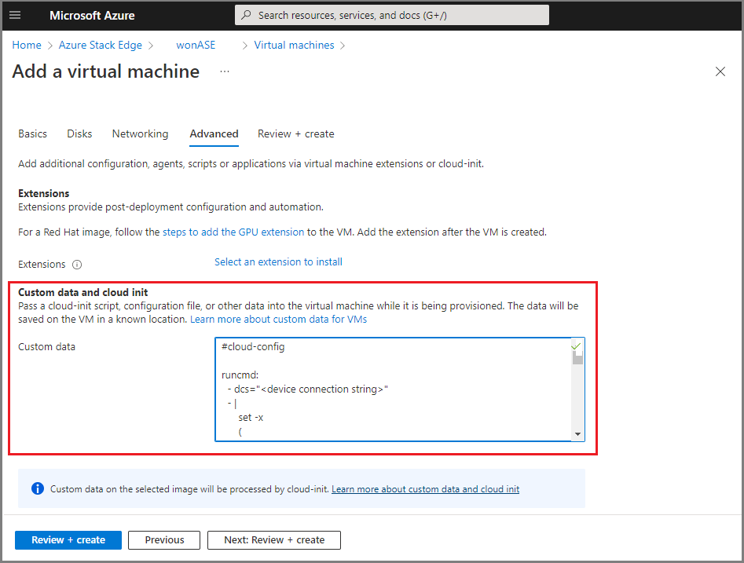
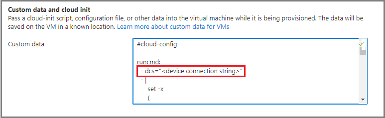
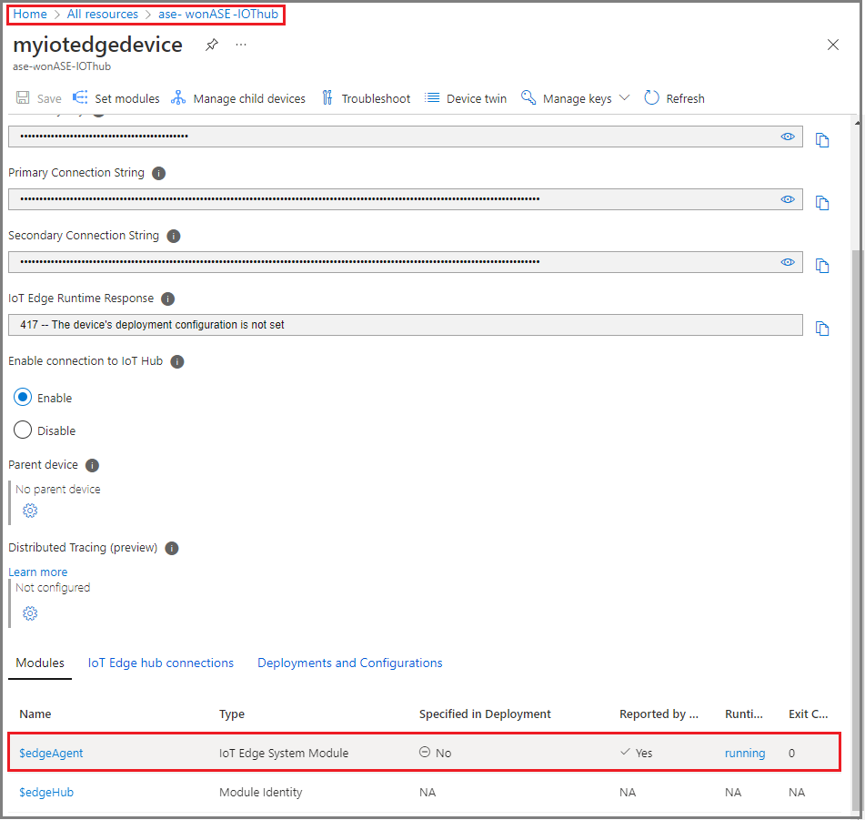

# Deploy IoT Edge on an Ubuntu VM on Azure Stack Edge

[!INCLUDE [applies-to-GPU-and-pro-r-and-mini-r-skus](../../includes/azure-stack-edge-applies-to-gpu-pro-r-mini-r-sku.md)]

This article describes how to deploy an IoT Edge runtime on an Ubuntu VM running on your Azure Stack Edge device. For new development work, use the self-serve deployment method described in this article as it uses the latest software version.

## High-level flow

The high-level flow is as follows:

1. Create or identify the IoT Hub or [Azure IoT Hub Device Provisioning Service (DPS)](../iot-dps/about-iot-dps.md) instance.
1. Use Azure CLI to acquire the Ubuntu 20.04 LTS VM image.
1. Upload the Ubuntu image onto the Azure Stack Edge VM image library.
1. Deploy the Ubuntu image as a VM using the following steps:
   1. Provide the name of the VM, the username, and the password. Creating another disk is optional.
   1. Set up the network configuration.
   1. Provide a prepared *cloud-init* script on the *Advanced* tab.

## Prerequisites

Before you begin, make sure you have:

- An Azure Stack Edge device that you've activated. For detailed steps, see [Activate Azure Stack Edge Pro GPU](azure-stack-edge-gpu-deploy-activate.md).
- Access to the latest Ubuntu 20.04 VM image, either the image from Azure Marketplace or a custom image that you're bringing:

   ```$urn = Canonical:0001-com-ubuntu-server-focal:20_04-lts:20.04.202007160```
   
  Use steps in [Search for Azure Marketplace images](azure-stack-edge-gpu-create-virtual-machine-marketplace-image.md#search-for-azure-marketplace-images) to acquire the VM image.

## Prepare the cloud-init script

To deploy the IoT Edge runtime onto the Ubuntu VM, use a *cloud-init* script during the VM deployment. 

Use steps in one of the following sections:

- [Prepare the cloud-init script with symmetric key provisioning](azure-stack-edge-gpu-deploy-iot-edge-linux-vm.md#use-symmetric-key-provisioning).
- [Prepare the cloud-init script with IoT Hub DPS](azure-stack-edge-gpu-deploy-iot-edge-linux-vm.md#use-dps).

### Use symmetric key provisioning

To connect your device to IoT Hub without DPS, use the steps in this section to prepare a *cloud-init* script for the VM creation *Advanced* page to deploy the IoT Edge runtime and Nvidia’s container runtime.

1. Use an existing IoT Hub or create a new Hub. Use these steps to [create an IoT Hub](../iot-hub/iot-hub-create-through-portal.md).

1. Use these steps to [register your Azure Stack Edge device in IoT Hub](../iot-edge/how-to-provision-single-device-linux-symmetric.md#register-your-device).

1. Retrieve the Primary Connection String from IoT Hub for your device, and then paste it into the location below for *DeviceConnectionString*.
 
**Cloud-init script for symmetric key provisioning**

```azurecli

#cloud-config

runcmd:
  - dcs="<DeviceConnectionString>"
  - |
      set -x
      (

        # Wait for docker daemon to start

        while [ $(ps -ef | grep -v grep | grep docker | wc -l) -le 0 ]; do 
          sleep 3
        done
        
        if [ $(lspci | grep NVIDIA | wc -l) -gt 0 ]; then

          #install Nvidia drivers

          apt install -y ubuntu-drivers-common
         ubuntu-drivers devices
          ubuntu-drivers autoinstall

          # Install NVIDIA Container Runtime

          curl -s -L https://nvidia.github.io/nvidia-container-runtime/gpgkey | apt-key add -
          distribution=$(. /etc/os-release;echo $ID$VERSION_ID)
          curl -s -L https://nvidia.github.io/nvidia-container-runtime/$distribution/nvidia-container-runtime.list | tee /etc/apt/sources.list.d/nvidia-container-runtime.list
          apt update
          apt install -y nvidia-container-runtime
        fi
        
        # Restart Docker

        systemctl daemon-reload
        systemctl restart docker

        # Install IoT Edge

        apt install -y aziot-edge

        if [ ! -z $dcs ]; then
          iotedge config mp --connection-string $dcs
          iotedge config apply
        fi
      if [ $(lspci | grep NVIDIA | wc -l) -gt 0 ]; then      
         reboot
      fi       ) &

apt:
  preserve_sources_list: true
  sources:
    msft.list:
      source: "deb https://packages.microsoft.com/ubuntu/20.04/prod focal main"
      key: |
        -----BEGIN PGP PUBLIC KEY BLOCK-----
        Version: GnuPG v1.4.7 (GNU/Linux)

        mQENBFYxWIwBCADAKoZhZlJxGNGWzqV+1OG1xiQeoowKhssGAKvd+buXCGISZJwT
        LXZqIcIiLP7pqdcZWtE9bSc7yBY2MalDp9Liu0KekywQ6VVX1T72NPf5Ev6x6DLV
        7aVWsCzUAF+eb7DC9fPuFLEdxmOEYoPjzrQ7cCnSV4JQxAqhU4T6OjbvRazGl3ag
        OeizPXmRljMtUUttHQZnRhtlzkmwIrUivbfFPD+fEoHJ1+uIdfOzZX8/oKHKLe2j
        H632kvsNzJFlROVvGLYAk2WRcLu+RjjggixhwiB+Mu/A8Tf4V6b+YppS44q8EvVr
        M+QvY7LNSOffSO6Slsy9oisGTdfE39nC7pVRABEBAAG0N01pY3Jvc29mdCAoUmVs
        ZWFzZSBzaWduaW5nKSA8Z3Bnc2VjdXJpdHlAbWljcm9zb2Z0LmNvbT6JATUEEwEC
        AB8FAlYxWIwCGwMGCwkIBwMCBBUCCAMDFgIBAh4BAheAAAoJEOs+lK2+EinPGpsH
        /32vKy29Hg51H9dfFJMx0/a/F+5vKeCeVqimvyTM04C+XENNuSbYZ3eRPHGHFLqe
        MNGxsfb7C7ZxEeW7J/vSzRgHxm7ZvESisUYRFq2sgkJ+HFERNrqfci45bdhmrUsy
        7SWw9ybxdFOkuQoyKD3tBmiGfONQMlBaOMWdAsic965rvJsd5zYaZZFI1UwTkFXV
        KJt3bp3Ngn1vEYXwijGTa+FXz6GLHueJwF0I7ug34DgUkAFvAs8Hacr2DRYxL5RJ
        XdNgj4Jd2/g6T9InmWT0hASljur+dJnzNiNCkbn9KbX7J/qK1IbR8y560yRmFsU+
        NdCFTW7wY0Fb1fWJ+/KTsC4=
        =J6gs
        -----END PGP PUBLIC KEY BLOCK----- 
packages:
  - moby-cli
  - moby-engine
write_files:
  - path: /etc/systemd/system/docker.service.d/override.conf
    permissions: "0644"
    content: |
      [Service]
      ExecStart=
      ExecStart=/usr/bin/dockerd --host=fd:// --add-runtime=nvidia=/usr/bin/nvidia-container-runtime --log-driver local

```

### Use DPS

Use steps in this section to connect your device to DPS and IoT Central. You'll prepare a *script.sh* file to deploy the IoT Edge runtime as you create the VM.

1. Use the existing IoT Hub and DPS, or create a new IoT Hub.

   - Use these steps to [create an IoT Hub](../iot-hub/iot-hub-create-through-portal.md).
   - Use these steps to [create the DPS, and then link the IoT Hub to the DPS scope](../iot-dps/quick-setup-auto-provision.md).

1. Go to the DPS resource and create an individual enrollment.  

   1. Go to **Device Provisioning Service** > **Manage enrollments** > **Add individual enrollment**.
   1. Make sure that the selection for **Symmetric Key for attestation type and IoT Edge device** is **True**. The default selection is **False**.
   1. Retrieve the following information from the DPS resource page:
      - **Registration ID**. We recommend that you use the same ID as the **Device ID** for your IoT Hub.
      - **ID Scope** which is available in the [Overview menu](../iot-dps/quick-create-simulated-device-symm-key.md#prepare-and-run-the-device-provisioning-code).
      - **Primary SAS Key** from the Individual Enrollment menu.
1. Copy and paste values from IoT Hub (IDScope) and DPS (RegistrationID, Symmetric Key) into the script arguments.

**Cloud-init script for IoT Hub DPS**

```azurecli

#cloud-config

runcmd:
    - dps_idscope="<DPS IDScope>"
    - registration_device_id="<RegistrationID>"
    - key="<Symmetric Key>"
    - |
      set -x
      (
      
      wget https://github.com/Azure/iot-edge-config/releases/latest/download/azure-iot-edge-installer.sh -O azure-iot-edge-installer.sh \
      && chmod +x azure-iot-edge-installer.sh \
      && sudo -H ./azure-iot-edge-installer.sh -s $dps_idscope -r $registration_device_id -k $key \
      && rm -rf azure-iot-edge-installer.sh
      
      # Wait for docker daemon to start

      while [ $(ps -ef | grep -v grep | grep docker | wc -l) -le 0 ]; do 
        sleep 3
      done

      systemctl stop aziot-edge

      if [ $(lspci | grep NVIDIA | wc -l) -gt 0 ]; then

        #install Nvidia drivers

        apt install -y ubuntu-drivers-common
        ubuntu-drivers devices
        ubuntu-drivers autoinstall

        # Install NVIDIA Container Runtime

        curl -s -L https://nvidia.github.io/nvidia-container-runtime/gpgkey | apt-key add -
        distribution=$(. /etc/os-release;echo $ID$VERSION_ID)
        curl -s -L https://nvidia.github.io/nvidia-container-runtime/$distribution/nvidia-container-runtime.list | tee /etc/apt/sources.list.d/nvidia-container-runtime.list
        apt update
        apt install -y nvidia-container-runtime
      fi

      # Restart Docker

      systemctl daemon-reload
      systemctl restart docker

      systemctl start aziot-edge    
      if [ $(lspci | grep NVIDIA | wc -l) -gt 0 ]; then      
         reboot
      fi
      ) &
write_files:
  - path: /etc/systemd/system/docker.service.d/override.conf
    permissions: "0644"
    content: |
      [Service]
      ExecStart=
      ExecStart=/usr/bin/dockerd --host=fd:// --add-runtime=nvidia=/usr/bin/nvidia-container-runtime --log-driver local

```

## Deploy IoT Edge runtime

Deploying the IoT Edge runtime is part of VM creation, using the *cloud-init* script mentioned above.

Here are the high-level steps to deploy the VM and IoT Edge runtime:

1. Acquire the Ubuntu VM image from Azure Marketplace. For detailed steps, follow the instructions in [Use Azure Marketplace image to create VM image for your Azure Stack Edge](azure-stack-edge-gpu-create-virtual-machine-marketplace-image.md).

   1. In the [Azure portal](https://portal.azure.com), go to Azure Marketplace.
   1. Connect to the Azure Cloud Shell or a client with Azure CLI installed. For detailed steps, see [Quickstart for Bash in Azure Cloud Shell](../cloud-shell/quickstart.md).
   
     > [!NOTE]
     > Closing the shell session will delete all variables created during the shell session. Reopening the session will require recreating the variables.

     c. Run the following command to set the subscription.
   
     ```
     az account set –subscription <subscription id>
     ```
   
2. Use steps in [Search for Azure Marketplace images](azure-stack-edge-gpu-create-virtual-machine-marketplace-image.md#search-for-azure-marketplace-images) to search the Azure Marketplace for an Ubuntu 20.04 LTS image.
   
   Example of an Ubuntu 20.04 LTS image:
  
   ```
   $urn = Canonical:0001-com-ubuntu-server-focal:20_04-lts:20.04.202007160
   ```

3. Create a new managed disk from the Marketplace image. For detailed steps, see [Use Azure Marketplace image to create VM image for your Azure Stack Edge](azure-stack-edge-gpu-create-virtual-machine-marketplace-image.md).
    
4. Export a VHD from the managed disk to an Azure Storage account. For detailed steps, see [Export a VHD from the managed disk to Azure Storage](azure-stack-edge-gpu-create-virtual-machine-marketplace-image.md#export-a-vhd-from-the-managed-disk-to-azure-storage).

5. Follow these steps to create an Ubuntu VM using the VM image.
   1. Specify the *cloud-init* script on the **Advanced** tab. To create a VM, see [Deploy GPU VM via Azure portal](azure-stack-edge-gpu-deploy-gpu-virtual-machine.md?tabs=portal) or [Deploy VM via Azure portal](azure-stack-edge-gpu-deploy-virtual-machine-portal.md).

      

   1. Specify the appropriate device connection strings in the *cloud-init* to connect to the IoT Hub or DPS device. For detailed steps, see [Provision with symmetric keys](azure-stack-edge-gpu-deploy-iot-edge-linux-vm.md#use-symmetric-key-provisioning) or [Provision with IoT Hub DPS](azure-stack-edge-gpu-deploy-iot-edge-linux-vm.md#use-dps).

      

  If you didn't specify the *cloud-init* during VM creation, you'll have to manually deploy the IoT Edge runtime after the VM is created:

  1. Connect to the VM via SSH.
  1. Install the container engine on the VM. For detailed steps, see [Create and provision an IoT Edge device on Linux using symmetric keys](../iot-edge/how-to-provision-single-device-linux-symmetric.md#install-a-container-engine) or [Quickstart - Set up IoT Hub DPS with the Azure portal](../iot-dps/quick-setup-auto-provision.md).


## Verify the IoT Edge runtime

Use these steps to verify that your IoT Edge runtime is running.

1. Go to IoT Hub resource in the Azure portal.
1. Select the IoT Edge device.
1. Verify that the IoT Edge runtime is running.

    

   To troubleshoot your IoT Edge device configuration, see [Troubleshoot your IoT Edge device](../iot-edge/troubleshoot.md?view=iotedge-2020-11&tabs=linux&preserve-view=true).

   <!-- Cannot get the link to render properly for version at https://learn.microsoft.com/azure/iot-edge/troubleshoot?view=iotedge-2020-11 -->

## Update the IoT Edge runtime

To update the VM, follow the instructions in [Update IoT Edge](../iot-edge/how-to-update-iot-edge.md?view=iotedge-2020-11&tabs=linux&preserve-view=true). To find the latest version of Azure IoT Edge, see [Azure IoT Edge releases](../iot-edge/how-to-update-iot-edge.md?view=iotedge-2020-11&tabs=linux&preserve-view=true).
    
## Next steps

To deploy and run an IoT Edge module on your Ubuntu VM, see the steps in [Deploy IoT Edge modules](../iot-edge/how-to-deploy-modules-portal.md?view=iotedge-2020-11&preserve-view=true).

To deploy Nvidia’s DeepStream module, see [Deploy the Nvidia DeepStream module on Ubuntu VM on Azure Stack Edge Pro with GPU](azure-stack-edge-deploy-nvidia-deepstream-module.md).

To deploy NVIDIA DIGITS, see [Enable a GPU in a prefabricated NVIDIA module](../iot-edge/configure-connect-verify-gpu.md?preserve-view=true&view=iotedge-2020-11#enable-a-gpu-in-a-prefabricated-nvidia-module).