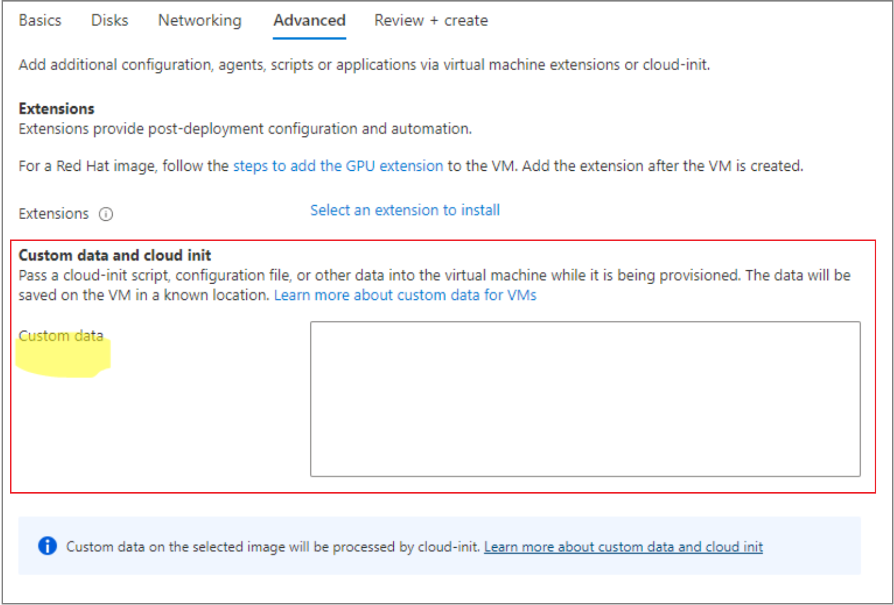
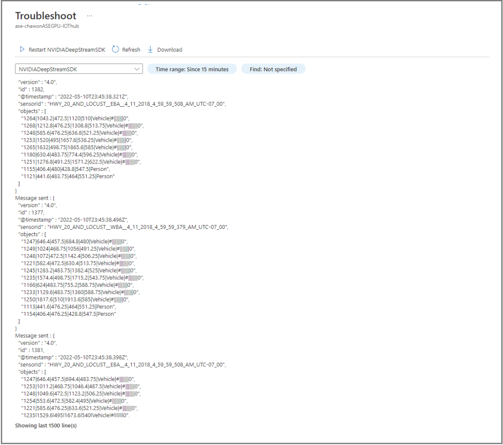

# Deploy IoT Edge on an Ubuntu VM on Azure Stack Edge

[!INCLUDE [applies-to-GPU-and-pro-r-and-mini-r-skus](../../includes/azure-stack-edge-applies-to-gpu-pro-r-mini-r-sku.md)]

This article describes how to deploy IoT Edge runtime on an Ubuntu VM running on your Azure Stack Edge device. 

> [!NOTE]
> If you use the IoT Edge solution in a production environment , we recommend that you deploy IoT Edge on an Ubuntu VM. The managed IoT Edge solution on Azure Stack Edge has limited features and functionality.

## About IoT Edge runtime on Ubuntu VM

For new development work, we recommend that you don't use the managed version of the IoT Edge solution due to limited features and [known issues](https://microsoft.github.io/iotedge-k8s-doc/knownissues.html). Instead, deploy a recent IoT Edge runtime version on an Ubuntu VM that is running on your Azure Stack Edge using the steps described in this article.

To help facilitate the deployment of the IoT Edge runtime onto the Ubuntu VM, you can deploy the IoT Edge runtime using a `cloud-init` script during the VM deployment.  

## Migrating workloads from a managed IoT Edge solution on Azure Stack Edge to IoT Edge on an Ubuntu VM on Azure Stack Edge

To migrate your existing workloads from a managed IoT Edge solution to a newly deployed IoT Edge on Ubuntu VM on Azure Stack Edge, connect the IoT Edge device from your IoT Hub to the Ubuntu VM. Use the connection string from the IoT Edge device from IoT Hub. You'll use this later to connect.  

## Prerequisites

Before you begin, make sure you have:

- An Azure Stack Edge device that you've activated. For detailed steps, see [Activate Azure Stack Edge Pro GPU](azure-stack-edge-gpu-deploy-activate.md).
- Access to the latest Ubuntu 20.04 VM image, either an image from Azure Marketplace or a custom image that you're bringing.

## Prepare the custom script

Per SME comment from Vivek, develop a short flow chart of the overall steps, so customer has context before doing the details

To proceed, use steps in one of the following sections:

- [Provision with symmetric keys](azure-stack-edge-gpu-deploy-iot-edge-linux-vm.md#provision-with-symmetric-keys)
- [Provision with IoT Hub Device Provisioning Service](azure-stack-edge-gpu-deploy-iot-edge-linux-vm.md#provision-with-iot-hub-device-provisioning-service)

### Provision with symmetric keys

To connect your device to IoT Hub without Azure IoT Device Provisioning Service, the process in this section will walk you through to prepare a cloud-init script that would be used during the VM creation advance page to deploy the IoT Edge runtime and Nvidia’s container runtime (if applicable).  

1. Use an existing IoT Hub or create a new Hub. Use these steps to [create the IoT Hub](../iot-hub/iot-hub-create-through-portal.md).

1. Use these steps to [register your Azure Stack Edge device in IoT Hub](../iot-edge/how-to-provision-single-device-linux-symmetric.md#register-your-device).

1. Retrieve the primary connection string from IoT Hub for your device, and then paste it into the appropriate location below.

**Cloud-init script**

```python
#cloud-config 
runcmd:
dcs="<connection string>" 
| 
    set -x 
    ( 
    # Wait for docker daemon to start 
    while [ $(ps -ef | grep -v grep | grep docker | wc -l) -le 0 ]; do  
    sleep 3 
    done 
    if [ $(lspci | grep NVIDIA | wc -l) -gt 0 ]; then 
        #install Nvidia drivers 
        apt install -y ubuntu-drivers-common 
        ubuntu-drivers devices 
        ubuntu-drivers autoinstall 
        # Install NVIDIA Container Runtime 
        curl -s -L https://nvidia.github.io/nvidia-container-runtime/gpgkey | apt-key add - 
        distribution=$(. /etc/os-release;echo $ID$VERSION_ID) 
        curl -s -L https://nvidia.github.io/nvidia-container-runtime/$distribution/nvidia-container-runtime.list | tee /etc/apt/sources.list.d/nvidia-container-runtime.list 
        apt update 
        apt install -y nvidia-container-runtime 
        fi        
        
        # Restart Docker 
        systemctl daemon-reload 
        systemctl restart docker 

        # Install IoT Edge 
        apt install -y aziot-edge 

        if [ ! -z $dcs ]; then
        iotedge config mp --connection-string $dcs 
        iotedge config apply 
        fi 

        if [ $(lspci | grep NVIDIA | wc -l) -gt 0 ]; then       
        reboot 
        fi       ) & 

    apt:
    preserve_sources_list: true 
    sources: 
    msft.list: 

      source: "deb https://packages.microsoft.com/ubuntu/20.04/prod focal main" 

      key: |
        -----BEGIN PGP PUBLIC KEY BLOCK-----
        Version: GnuPG v1.4.7 (GNU/Linux) 

        mQENBFYxWIwBCADAKoZhZlJxGNGWzqV+1OG1xiQeoowKhssGAKvd+buXCGISZJwT
        LXZqIcIiLP7pqdcZWtE9bSc7yBY2MalDp9Liu0KekywQ6VVX1T72NPf5Ev6x6DLV
        7aVWsCzUAFeb7DC9fPuFLEdxmOEYoPjzrQ7cCnSV4JQxAqhU4T6OjbvRazGl3ag 
        OeizPXmRljMtUUttHQZnRhtlzkmwIrUivbfFPD+fEoHJ1+uIdfOzZX8/oKHKLe2j
        H632kvsNzJFlROVvGLYAk2WRcLu+RjjggixhwiB+Mu/A8Tf4V6bYppS44q8EvVr 
        M+QvY7LNSOffSO6Slsy9oisGTdfE39nC7pVRABEBAAG0N01pY3Jvc29mdCAoUmVs
        ZWFzZSBzaWduaW5nKSA8Z3Bnc2VjdXJpdHlAbWljcm9zb2Z0LmNvbT6JATUEEwEC
        AB8FAlYxWIwCGwMGCwkIBwMCBBUCCAMDFgIBAh4BAheAAAoJEOs+lK2+EinPGpsH
        /32vKy29Hg51H9dfFJMx0/a/F+5vKeCeVqimvyTM04CXENNuSbYZ3eRPHGHFLqe 
        MNGxsfb7C7ZxEeW7J/vSzRgHxm7ZvESisUYRFq2sgkJHFERNrqfci45bdhmrUsy 
        7SWw9ybxdFOkuQoyKD3tBmiGfONQMlBaOMWdAsic965rvJsd5zYaZZFI1UwTkFX
        KJt3bp3Ngn1vEYXwijGTaFXz6GLHueJwF0I7ug34DgUkAFvAs8Hacr2DRYxL5RJ 
        XdNgj4Jd2/g6T9InmWT0hASljur+dJnzNiNCkbn9KbX7J/qK1IbR8y560yRmFsU
        NdCFTW7wY0Fb1fWJ+/KTsC4=
        =J6gs 
        -----END PGP PUBLIC KEY BLOCK-----  

packages: 
  - moby-cli 
  - moby-engine 

write_files: 
  - path: /etc/systemd/system/docker.service.d/override.conf 
    permissions: "0644" 
    content: | 
      [Service] 
      ExecStart= 
      ExecStart=/usr/bin/dockerd --host=fd:// --add-runtime=nvidia=/usr/bin/nvidia-container-runtime --log-driver local 
```
### Provision with IoT Hub Device Provisioning Service

Use steps in this section to connect your device to Device Provisioning Service/IoT Central. You'll prepare a script.sh file to deploy the IoT Edge runtime as you create the VM.

1. Use the existing IoT Hub and Device Provisioning Service, or create a new IoT Hub. 

   - [Create the IoT Hub](../iot-hub/iot-hub-create-through-portal.md).
   - [Create Device Provisioning Service, and then link the IoT Hub to the Device Provisioning Service scope](../iot-dps/quick-setup-auto-provision.md).

1. Go to the Device Provisioning Service resource and create an individual enrollment.  

   1. Go to **Device Provisioning Service** > **Manage enrollments** > **Add individual enrollment**.
   1. Make sure that the selection for **Symmetric Key for attestation type and IoT Edge device** is **True**. The default selection is **False**.
   1. Retrieve the following information from the Device Provisioning Service resource page:
      - **Registration ID**. We recommend that you use the same ID as the **Device ID** for your IoT Hub.
      - **ID Scope** which is available in the [Overview menu](../iot-dps/quick-create-simulated-device-symm-key.md#run-the-provisioning-code-for-the-device).
      - **Primary SAS Key** from the Individual Enrollment menu.
1. Copy and paste values from IoT Hub (IDScope) and Device Provisioning Service (RegistrationID, Symetric Key) into the script arguments.

**Cloud-init script**

```python
#cloud-config
runcmd:
    - dps_idscope="<DPS IDScope>" 
    - registration_device_id="<RegistrationID>" 
    - key="<Sysmetric Key>" 
    - | 
      set -x 
      ( 

      wget https://github.com/Azure/iot-edge-config/releases/latest/download/azure-iot-edge-installer.sh -O azure-iot-edge-installer.sh \ 
      && chmod +x azure-iot-edge-installer.sh \ 
      && sudo -H ./azure-iot-edge-installer.sh -s $dps_idscope -r $registration_device_id -k $key \ 
      && rm -rf azure-iot-edge-installer.sh 

      # Wait for docker daemon to start 

      while [ $(ps -ef | grep -v grep | grep docker | wc -l) -le 0 ]; do  
        sleep 3 
      done 

      systemctl stop aziot-edge 

      if [ $(lspci | grep NVIDIA | wc -l) -gt 0 ]; then 

        #install Nvidia drivers 

        apt install -y ubuntu-drivers-common 
        ubuntu-drivers devices 
        ubuntu-drivers autoinstall 

        # Install NVIDIA Container Runtime 

        curl -s -L https://nvidia.github.io/nvidia-container-runtime/gpgkey | apt-key add - 
        distribution=$(. /etc/os-release;echo $ID$VERSION_ID) 
        curl -s -L https://nvidia.github.io/nvidia-container-runtime/$distribution/nvidia-container-runtime.list | tee /etc/apt/sources.list.d/nvidia-container-runtime.list 
        apt update 
        apt install -y nvidia-container-runtime 
      fi 

      # Restart Docker 

      systemctl daemon-reload 
      systemctl restart docker 

      systemctl start aziot-edge     
      if [ $(lspci | grep NVIDIA | wc -l) -gt 0 ]; then       
         reboot 
      fi 
      ) & 
write_files: 
  - path: /etc/systemd/system/docker.service.d/override.conf 
    permissions: "0644" 
    content: | 
      [Service] 
      ExecStart= 
      ExecStart=/usr/bin/dockerd --host=fd:// --add-runtime=nvidia=/usr/bin/nvidia-container-runtime --log-driver local 
```

## Deploy IoT Edge runtime

Begin by deploying IoT Edge runtime. Follow these high-level steps to deploy IoT Edge runtime:

1. In the [Azure portal](https://portal.azure.com), go to Azure Marketplace. 
    1. Connect to the Azure Cloud Shell or a client with Azure CLI installed. 
    1. Search the Azure Marketplace and identify your preferred image. Make sure that the VM image is included in the list of [Azure IoT Edge supported systems](../iot-edge/support.md#linux-containers). For example, you could use the Ubuntu 20.04 LTS: $urn = Canonical:0001-com-ubuntu-server-focal:20_04-lts:20.04.202007160. 
    1. Create a new managed disk from the Marketplace image.
    1. Export a VHD from the managed disk to an Azure Storage account.

    For detailed steps, follow the instructions in [Use Azure Marketplace image to create VM image for your Azure Stack Edge](azure-stack-edge-gpu-create-virtual-machine-marketplace-image.md).

1. Create an Ubuntu VM using the VM image created in the previous step. Depending on whether you're creating a GPU-enabled VM or a non-GPU VM, you would need to follow a different set of steps.
 
> [!IMPORTANT]
> **DO NOT** create the VM until you read through the steps to auto-deploy the IoT Edge runtime. If the advance page step is missed, which allows you to apply a *cloud-init* script, you will have to manually deploy the IoT Edge runtime by SSH into the VM after the VM is created. To manually install the container engine in the Ubuntu VM, use the steps in [Create and provision an IoT Edge device on Linux using symmetric keys](../iot-edge/how-to-provision-single-device-linux-symmetric.md#install-a-container-engine) or [Quickstart - Set up IoT Hub Device Provisioning Service with the Microsoft Azure portal](../iot-dps/quick-setup-auto-provision.md).

|VM type  |Deployment procedure|
|----------|-----------|------------|
| Non-GPU VM  | [Deploy via Azure portal (preview)](azure-stack-edge-gpu-deploy-virtual-machine-portal.md)  |
| GPU VM  | [Deploy via Azure portal](azure-stack-edge-gpu-deploy-gpu-virtual-machine.md?tabs=portal&preserve-view=true)  |

For ease of deployment, we recommend that you use the following step to deploy the VM via the Azure portal.

On the **Advanced** page, use the cloud-init configuration script from earlier in this article.

> [!NOTE]
> Ensure that you specify the appropriate connection strings to connect to the respective IoT-Hub or DPS device.  



### Troubleshooting module deployment

1. View the NVIDIADeepStreamSDK log file output

    

    
    

1. After a certain period of time, the module will complete and quit, causing the module to return an error. This is expected behavior.

    

## Update the IoT Edge runtime

If a new version of IoT Edge is available and you need to update the VM that you created in the earlier step, follow the instructions in [Update IoT Edge](../iot-edge/how-to-update-iot-edge.md?view=iotedge-2020-11&tabs=linux&preserve-view=true). To find the latest version of Azure IoT Edge, see [Azure IoT Edge releases](../iot-edge/how-to-update-iot-edge.md?view=iotedge-2020-11&tabs=linux&preserve-view=true).
    
## Updating the VM

## Move GPU modules 

If you're migrating workloads from the managed IoT Edge solution to IoT Edge on an Ubuntu VM, you'll need to move the GPU modules. Follow these steps to move the modules:

1. First review the considerations for GPU deployments in [GPU VMs and Kubernetes on Azure Stack Edge](azure-stack-edge-gpu-overview-gpu-virtual-machines.md#gpu-vms-and-kubernetes).

1. When you enable Kubernetes services on Azure Stack Edge, Kubernetes may take over the GPU resources and not allow the deployment of a GPU-enabled VM. To deploy the VM:

    1. Stop any running modules. These modules would include IoT Edge modules or any other modules.

    1. Remove the IoT Edge on Kubernetes deployment. For detailed instructions, see [Remove IoT Edge service](azure-stack-edge-gpu-manage-compute.md#remove-iot-edge-service).
    
    1. Deploy a GPU-enabled VM using the instructions in [Deploy GPU VMs on your Azure Stack Edge Pro GPU device](azure-stack-edge-gpu-deploy-gpu-virtual-machine.md?tabs=portal&preserve-view=true).

    1. Modify your modules to run on the Ubuntu VM. This may involve changing the container create options.

## Next steps

To deploy and run an IoT Edge module on your Ubuntu VM, see the steps in [Deploy IoT Edge modules](../iot-edge/how-to-deploy-modules-portal.md?view=iotedge-2020-11&preserve-view=true).
