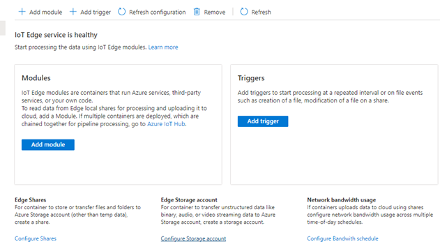

# Deploy IoT Edge on an Ubuntu VM on Azure Stack Edge

[!INCLUDE [applies-to-GPU-and-pro-r-and-mini-r-skus](../../includes/azure-stack-edge-applies-to-gpu-pro-r-mini-r-sku.md)]

This article describes how to deploy IoT Edge runtime on an Ubuntu VM running on your Azure Stack Edge device. 

> [!NOTE]
> IoT Edge solution on Kubernetes running on Azure Stack Edge will be deprecated soon. If you have deployed production workloads that use the native IoT Edge solution on Azure Stack Edge, we recommend that you plan to migrate those workloads to a [recent, supported version of IoT Edge runtime](../iot-edge/version-history.md?view=iotedge-2020-11&preserve-view=true). 

## About IoT Edge runtime on Ubuntu VM

Your Azure Stack Edge device can deploy and run IoT Edge modules. This native IoT Edge solution on Azure Stack Edge runs an IoT Edge runtime version 1.1.0 on a Kubernetes cluster. The version 1.1.0 has limited support and also has [Known issues](https://microsoft.github.io/iotedge-k8s-doc/knownissues.html). These known issues were addressed with the recent IoT Edge releases. 

Going forward, we recommend that you don't use the native version of IoT Edge solution, rather deploy a recent IoT Edge runtime version on an Ubuntu VM that is running on your Azure Stack Edge using the procedure described in this article.

## Prerequisites

Before you begin, make sure you have:

- An Azure Stack Edge device that you've activated. For detailed steps, see [Activate Azure Stack Edge Pro GPU](azure-stack-edge-gpu-deploy-activate.md).
- You have access to a VM image. This could be an image from Azure Marketplace or a custom image that you're bringing. 

    - For a non-GPU Ubuntu VM, see the [Supported versions of Ubuntu Operating System for Azure IoT Edge](../iot-edge/support.md#operating-systems).
    - For a GPU VM, see the [Supported versions of OS for your GPU VM on Azure Stack Edge device](azure-stack-edge-gpu-overview-gpu-virtual-machines.md#supported-os-for-gpu-extension-for-linux).

## Deploy IoT Edge runtime

Begin by deploying IoT Edge runtime. Follow these high-level steps to deploy IoT Edge runtime:

1. In the [Azure portal](https://portal.azure.com), go to Azure Marketplace. 
    1. Connect to the Azure Cloud Shell or a client with Azure CLI installed. 
    1. Search the Azure Marketplace and identify your preferred image. Make sure that the VM image is included in the list of [Azure IoT Edge supported systems](../iot-edge/support.md#linux-containers).
    1. Create a new managed disk from the Marketplace image.
    1. Export a VHD from the managed disk to Azure Storage account.

    For detailed steps, follow the instructions in [Use Azure marketplace image to create VM image for your Azure Stack Edge](azure-stack-edge-gpu-create-virtual-machine-marketplace-image.md).

1. Create an Ubuntu VM using the VM image created in the previous step. Depending on whether you're creating a GPU-enabled VM or a non-GPU VM, you would need to follow a different set of steps.

       
    |VM type  |Deployment procedure  |
    |---------|---------|
    |Non-GPU VM    | [Deploy via Azure portal (preview)](azure-stack-edge-gpu-deploy-virtual-machine-portal.md)        |
    |Non-GPU VM    | [Deploy via VM templates](azure-stack-edge-gpu-deploy-virtual-machine-templates.md)       |
    |GPU VM        | [Deploy via Azure portal](azure-stack-edge-gpu-deploy-gpu-virtual-machine.md?tabs=portal&preserve-view=true)       |
    |GPU VM        | [Deploy VM via VM templates](azure-stack-edge-gpu-deploy-gpu-virtual-machine.md?tabs=templates&preserve-view=true)        |

1. After the VM is running, choose one of the following options: 

    - You can register and manually provision a single Linux IoT Edge device, including installing IoT Edge runtime. For detailed instructions, see [Deploy IoT Edge runtime for a single device](../iot-edge/how-to-provision-single-device-linux-symmetric.md?view=iotedge-2020-11&tabs=azure-portal%2Cubuntu&preserve-view=true).
    - You can also use the Azure IoT Edge configuration command-line tool to install IoT Edge runtime version 1.2. You can then configure Azure IoT Edge on the VM using [IoT Hub with DPS or IoT Central](https://github.com/Azure/iot-edge-config).

## Update IoT Edge runtime

If a new version of IoT Edge is available and you need to update the VM that you created in the earlier step, follow the instructions in [Update IoT Edge](../iot-edge/how-to-update-iot-edge.md?view=iotedge-2020-11&tabs=linux&preserve-view=true). To find the latest version of Azure IoT Edge, see [Azure IoT Edge releases](../iot-edge/how-to-update-iot-edge.md?view=iotedge-2020-11&tabs=linux&preserve-view=true).
    
## Moving GPU modules to Ubuntu VM 

If you're migrating workloads from IoT Edge solution on Kubernetes to IoT Edge on Ubuntu VM, you'll need to move the GPU modules. Follow these steps to move the modules:

1. First review the considerations for GPU deployments in [GPU VMs and Kubernetes on Azure Stack Edge](azure-stack-edge-gpu-overview-gpu-virtual-machines.md#gpu-vms-and-kubernetes).
1. When you enable Kubernetes services on Azure Stack Edge, Kubernetes may take over the GPU resources and not allow the deployment of a GPU-enabled VM. To deploy the VM:

    1. Stop any running modules. These modules would include IoT Edge modules or any other modules.
    1. Remove the IoT Edge on Kubernetes deployment. For detailed instructions, see [Remove IoT Edge service](azure-stack-edge-gpu-manage-compute.md#remove-iot-edge-service).
    
        

    1. Deploy a GPU-enabled VM using the instructions in [Deploy GPU VMs on your Azure Stack Edge Pro GPU device](azure-stack-edge-gpu-deploy-gpu-virtual-machine.md?tabs=portal&preserve-view=true).
    1. Modify your modules to run on the Ubuntu VM. This may involve changing the container create options.

## Next steps

To deploy and run an IoT Edge module on your Ubuntu VM, see the steps in [Deploy IoT Edge modules](../iot-edge/how-to-deploy-modules-portal.md?view=iotedge-2020-11&preserve-view=true).
