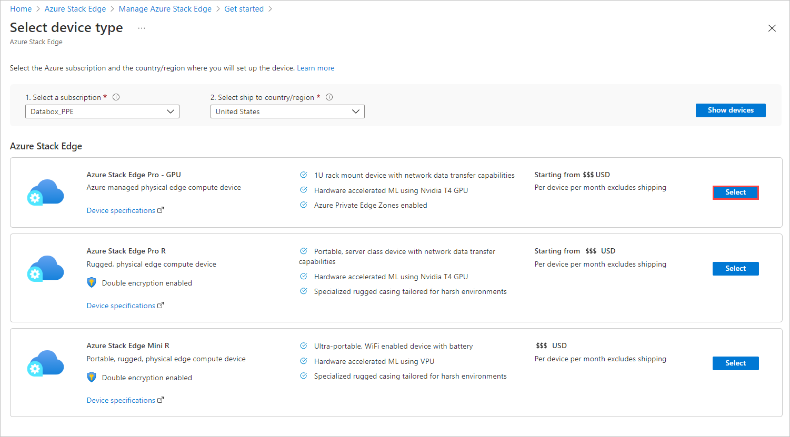
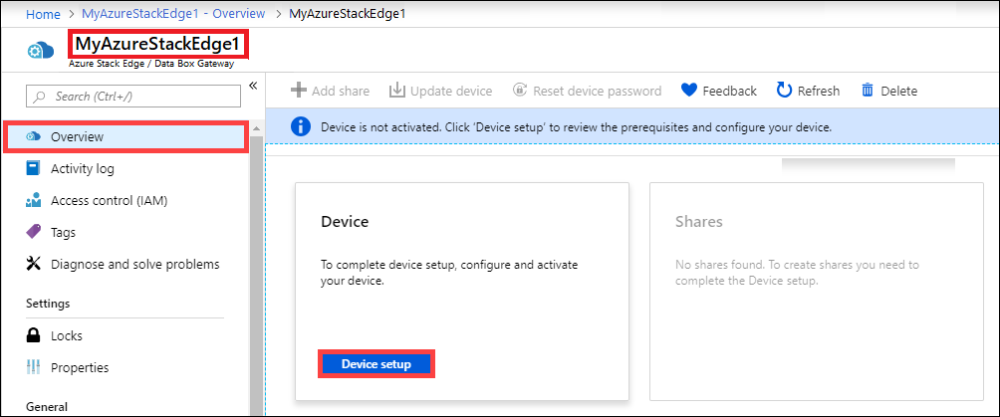

# Tutorial: Prepare to deploy Azure Stack Edge with GPU 

This is the first tutorial in the series of deployment tutorials that are required to completely deploy Azure Stack Edge with GPU. This tutorial describes how to prepare the Azure portal to deploy an Azure Stack Edge resource.

You need administrator privileges to complete the setup and configuration process. The portal preparation takes less than 10 minutes.

In this tutorial, you learn how to:

> [!div class="checklist"]
> * Create a new resource
> * Get the activation key

### Get started

For Azure Stack Edge deployment, you need to first prepare your environment. Once the environment is ready, follow the required steps and if needed, optional steps and procedures to fully deploy the device. The step-by-step deployment instructions indicate when you should perform each of these required and optional steps.

| Step | Description |
| --- | --- |
| **Preparation** |These steps must be completed in preparation for the upcoming deployment. |
| **[Deployment configuration checklist](#deployment-configuration-checklist)** |Use this checklist to gather and record information before and during the deployment. |
| **[Deployment prerequisites](#prerequisites)** |These validate the environment is ready for deployment. |
|  | |
|**Deployment tutorials** |These tutorials are required to deploy your Azure Stack Edge device in production. |
|**[1. Prepare the Azure portal for Azure Stack Edge](azure-stack-edge-gpu-deploy-prep.md)** |Create and configure your Azure Stack Edge resource before you install an Azure Stack Box Edge physical device. |
|**[2. Install Azure Stack Edge](azure-stack-edge-gpu-deploy-install.md)**|Unpack, rack, and cable the Azure Stack Edge physical device.  |
|**[3. Connect to Azure Stack Edge](azure-stack-edge-gpu-deploy-connect.md)** |Once the device is installed, connect to device local web UI.  |
|**[4. Configure network settings for Azure Stack Edge](azure-stack-edge-gpu-deploy-configure-network-compute-web-proxy.md)** |Configure network including the compute network and web proxy settings for your device.   |
|**[5. Configure device settings for Azure Stack Edge](azure-stack-edge-gpu-deploy-set-up-device-update-time.md)** |Assign a device name and DNS domain, configure update server and device time. |
|**[6. Configure security settings for Azure Stack Edge](azure-stack-edge-gpu-deploy-configure-certificates.md)** |Configure certificates for your device. Use device generated certificates or bring your own certificates.   |
|**[7. Activate Azure Stack Edge](azure-stack-edge-gpu-deploy-activate.md)** |Use the activation key from service to activate the device. The device is ready to set up SMB or NFS shares or connect via REST. |
|**[8. Configure compute](azure-stack-edge-gpu-deploy-configure-compute.md)** |Configure the compute role on your device. This will also create a Kubernetes cluster. |
|**[9A. Transfer data with Edge shares](azure-stack-edge-j-series-deploy-add-shares.md)** |Add shares and connect to shares via SMB or NFS. |
|**[9B. Transfer data with Edge storage accounts](azure-stack-edge-j-series-deploy-add-storage-accounts.md)** |Add storage accounts and connect to blob storage via REST APIs. |

You can now begin to gather information regarding the software configuration for your Azure Stack Edge device.

## Deployment configuration checklist

Before you deploy your device, you need to collect information to configure the software on your Azure Stack Edge device. Preparing some of this information ahead of time helps streamline the process of deploying the device in your environment. Use the [Azure Stack Edge deployment configuration checklist](azure-stack-edge-gpu-deploy-checklist.md) to note down the configuration details as you deploy your device.

## Prerequisites

Following are the configuration prerequisites for your Azure Stack Edge resource, your Azure Stack Edge device, and the datacenter network.

### For the Azure Stack Edge resource

Before you begin, make sure that:

- Your Microsoft Azure subscription is enabled for a Azure Stack Edge resource. Make sure that you used a supported subscription such as [Microsoft Enterprise Agreement (EA)](https://azure.microsoft.com/overview/sales-number/), [Cloud Solution Provider (CSP)](https://docs.microsoft.com/partner-center/azure-plan-lp), or [Microsoft Azure Sponsorship](https://azure.microsoft.com/offers/ms-azr-0036p/). Pay-as-you-go subscriptions are not supported.
- You have owner or contributor access at resource group level for the Azure Stack Edge/Data Box Gateway, IoT Hub, and Azure Storage resources.

    - To create any Azure Stack Edge / Data Box Gateway resource, you should have permissions as a contributor (or higher) scoped at resource group level. You also need to make sure that the `Microsoft.DataBoxEdge` provider is registered. For information on how to register, go to [Register resource provider](azure-stack-edge-manage-access-power-connectivity-mode.md#register-resource-providers).
    - To create any IoT Hub resource, make sure that Microsoft.Devices provider is registered. For information on how to register, go to [Register resource provider](azure-stack-edge-manage-access-power-connectivity-mode.md#register-resource-providers).
    - To create a Storage account resource, again you need contributor or higher access scoped at the resource group level. Azure Storage is by default a registered resource provider.
- You have admin or user access to Azure Active Directory Graph API. For more information, see [Azure Active Directory Graph API](https://docs.microsoft.com/previous-versions/azure/ad/graph/howto/azure-ad-graph-api-permission-scopes#default-access-for-administrators-users-and-guest-users-).
- You have your Microsoft Azure storage account with access credentials.

### For the Azure Stack Edge device

Before you deploy a physical device, make sure that:

- You've reviewed the safety information that was included in the shipment package.
- You have a 1U slot available in a standard 19" rack in your datacenter for rack mounting the device.
- You have access to a flat, stable, and level work surface where the device can rest safely.
- The site where you intend to set up the device has standard AC power from an independent source or a rack power distribution unit (PDU) with an uninterruptible power supply (UPS).
- You have access to a physical device.

### For the datacenter network

Before you begin, make sure that:

- The network in your datacenter is configured per the networking requirements for your Azure Stack Edge device. For more information, see [Azure Stack Edge System Requirements](azure-stack-edge-system-requirements.md).

- For normal operating conditions of your Azure Stack Edge, you have:

    - A minimum of 10-Mbps download bandwidth to ensure the device stays updated.
    - A minimum of 20-Mbps dedicated upload and download bandwidth to transfer files.

## Create a new resource

If you have an existing Azure Stack Edge resource to manage your physical device, skip this step and go to [Get the activation key](#get-the-activation-key).

To create an Azure Stack Edge resource, take the following steps in the Azure portal.

1. Use your Microsoft Azure credentials to sign in to the Azure portal at this URL: [https://portal.azure.com](https://portal.azure.com).

2. In the left-pane, select **+ Create a resource**. Search for and select **Azure Stack Edge / Data Box Gateway**. Select **Create**. If you see any issues, go to [Troubleshoot order issues](azure-stack-edge-troubleshoot-ordering.md).

3. Pick the subscription that you want to use for the Azure Stack Edge device. Select the country to where you want to ship this physical device. Select **Show devices**.

    

4. Select device type. Under **Azure Stack Edge Commercial**, choose **Azure Stack Edge with GPU** and select **Sign up**. 

    

5. A short form is displayed. Fill out the form and select **Submit**. Microsoft will enable your subscription.

    

5. After the subscription is enabled, you should be able to able to proceed with the resource creation. In the **Select device type** blade, choose **Select**.

    

6. On the **Basics** tab, enter or select the following **Project details**.
    
    |Setting  |Value  |
    |---------|---------|
    |Subscription    |This is automatically populated based on the earlier selection. Subscription is linked to your billing account. |
    |Resource group  |Select an existing group or create a new group. Learn more about [Azure Resource Groups](../azure-resource-manager/resource-group-overview.md).     |

4. Enter or select the following **Instance details**.

    |Setting  |Value  |
    |---------|---------|
    |Name   | A friendly name to identify the resource. The name has between 2 and 50 characters containing letter, numbers, and hyphens.  Name starts and ends with a letter or a number.        |
    |Region     |For a list of all the regions where the Azure Stack Edge resource is available, see [Azure products available by region](https://azure.microsoft.com/global-infrastructure/services/?products=databox&regions=all). If using Azure Government, all the government regions are available as shown in the [Azure regions](https://azure.microsoft.com/global-infrastructure/regions/).  Choose a location closest to the geographical region where you want to deploy your device.|

    

5. Select **Next: Shipping address**.

    - If you already have a device, select the combo box for **I have a Azure Stack Edge device**.

        

    - If this is the new device that you are ordering, enter the contact name, company, address to ship the device, and contact information.

        

6. Select **Next: Review + create**.

7. On the **Review + create** tab, review the **Pricing details**, **Terms of use**, and the details for your resource. Select the combo box for **I have reviewed the privacy terms**.

    

8. Select **Create**.

The resource creation takes a few minutes. After the resource is successfully created and deployed, you're notified. Select **Go to resource**.

After the order is placed, Microsoft reviews the order and reaches out to you (via email) with shipping details.

If you run into any issues during the order process, see [Troubleshoot order issues](azure-stack-edge-troubleshoot-ordering.md).

## Get the activation key

After the Azure Stack Edge resource is up and running, you'll need to get the activation key. This key is used to activate and connect your Azure Stack Edge device with the resource. You can get this key now while you are in the Azure portal.

1. Select the resource that you created. Select **Overview** and then select **Device setup**.

    

2. On the **Activate** tile, select **Generate key** to create an activation key. Select the copy icon to copy the key and save it for later use.

    

> [!IMPORTANT]
> - The activation key expires three days after it is generated.
> - If the key has expired, generate a new key. The older key is not valid.

## Next steps

In this tutorial, you learned about Azure Stack Edge topics such as:

> [!div class="checklist"]
> * Create a new resource
> * Get the activation key

Advance to the next tutorial to learn how to install Azure Stack Edge.

> [!div class="nextstepaction"]
> [Install Azure Stack Edge](./azure-stack-edge-gpu-deploy-install.md)

