# Deploy a GPU enabled IoT module from Azure Marketplace on Azure Stack Edge Pro GPU device

[!INCLUDE [applies-to-GPU-and-pro-r-skus](../../includes/azure-stack-edge-applies-to-gpu-pro-r-sku.md)]

> [!NOTE]
> We strongly recommend that you deploy the latest IoT Edge version in a Linux VM. The managed IoT Edge on Azure Stack Edge uses an older version of IoT Edge runtime that doesn’t have the latest features and patches. For instructions, see how to [Deploy an Ubuntu VM](azure-stack-edge-gpu-deploy-iot-edge-linux-vm.md). For more information on other supported Linux distributions that can run IoT Edge, see [Azure IoT Edge supported systems – Container engines](../iot-edge/support.md#linux-containers).

This article describes how to deploy a Graphics Processing Unit (GPU) enabled IoT Edge module from Azure Marketplace on your Azure Stack Edge Pro device. 

In this article, you learn how to:
  - Prepare Azure Stack Edge Pro to run a GPU module.
  - Download and deploy GPU enabled IoT module from Azure Marketplace.
  - Monitor the module output.

## About sample module

The GPU sample module in this article includes PyTorch and TensorFlow benchmarking sample code for CPU against GPU.

## Prerequisites

Before you begin, make sure you have:

- You've access to a GPU enabled 1-node Azure Stack Edge device. This device is activated with a resource in Azure. 
- You've configured compute on this device. Follow the steps in [Tutorial: Configure compute on your Azure Stack Edge device](azure-stack-edge-gpu-deploy-configure-compute.md).
- The following development resources on a Windows client:
    - [Visual Studio Code](https://code.visualstudio.com/)  
    - [Azure IoT Edge extension for Visual Studio Code](https://marketplace.visualstudio.com/items?itemName=vsciot-vscode.azure-iot-edge).   

## Get module from Azure Marketplace

1. Browse all [Apps in Azure Marketplace](https://azuremarketplace.microsoft.com/marketplace/apps).

    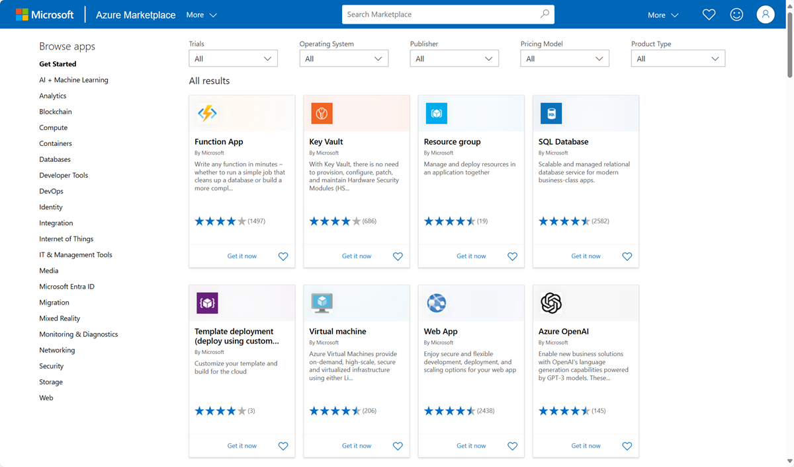

2. Search for **Getting started with GPUs**.

    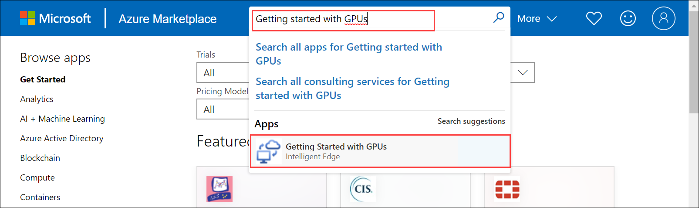

3. Select **Get it now**.

    

4. Select **Continue** to acknowledge the provider's terms of use and privacy policy. 

    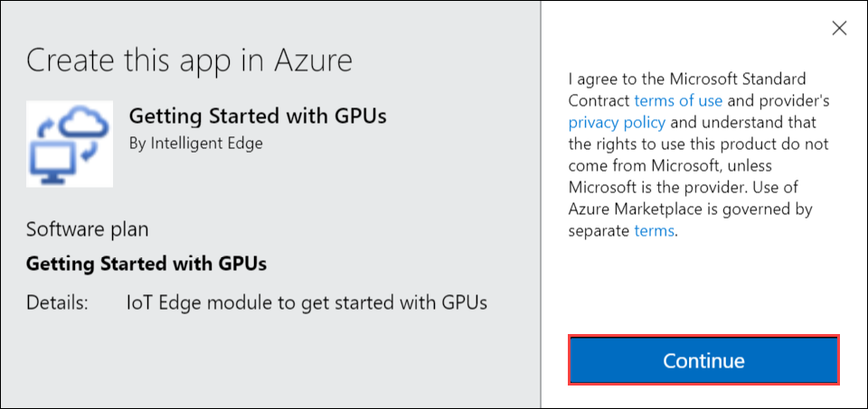

5. Choose the subscription that you used to deploy your Azure Stack Edge Pro device.

    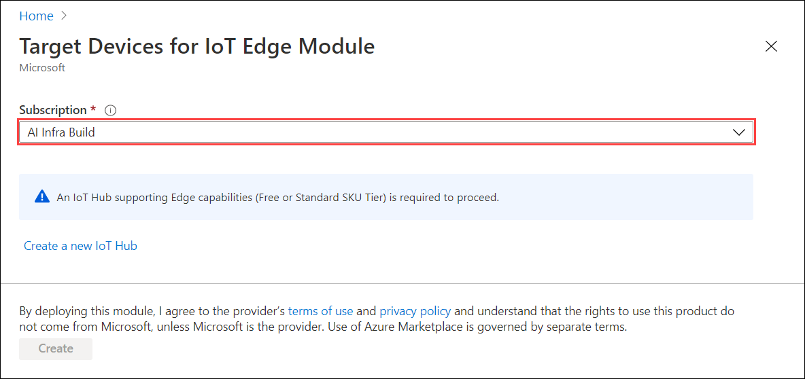

6. Enter the name of the IoT Hub service that you created when you configured your Azure Stack Edge Pro device. To find this IoT Hub service name, go to the Azure Stack Edge resource associated with your device in Azure portal. 

    1. In the left pane menu options, go to **Edge services > IoT Edge**. 

        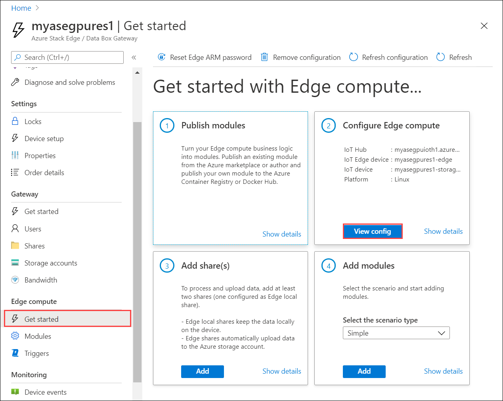

    1. Go to **Properties**. 

        1. Make a note of the IoT Hub service that was created when you configured compute on your Azure Stack Edge Pro device.
        2. Note the name of the IoT Edge device that was created when you configured compute. You will use this name in the subsequent step.

        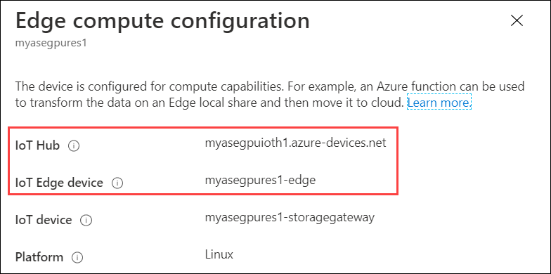

10. Choose **Deploy to a device**.

11. Enter the name of the IoT Edge device or select **Find Device** to browse among the devices registered with the hub.

    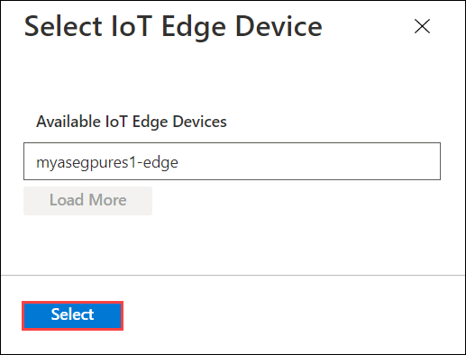

12. Select **Create** to continue the standard process of configuring a deployment manifest including adding other modules if desired. Details for the new module such as image URI, create options, and desired properties are predefined but can be changed.

    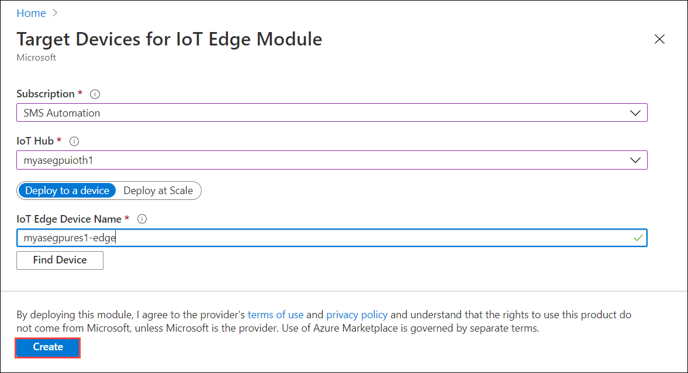

13. Verify that the module is deployed in your IoT Hub in the Azure portal. Select your device, select **Set Modules** and the module should be listed in the **IoT Edge Modules** section.

    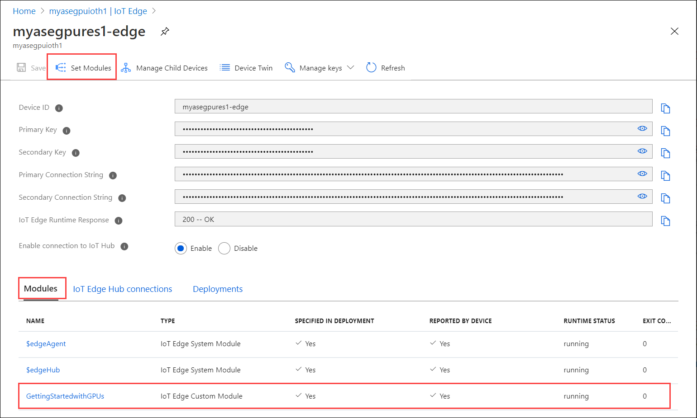

## Monitor the module  

1. In the VS Code command palette, run **Azure IoT Hub: Select IoT Hub**.

2. Choose the subscription and IoT hub that contain the IoT Edge device that you want to configure. In this case, select the subscription used to deploy the Azure Stack Edge Pro device, and select the IoT Edge device created for your Azure Stack Edge Pro device. This occurs when you configure compute via the Azure portal in the earlier steps.

3. In the VS Code explorer, expand the Azure IoT Hub section. Under **Devices**, you should see the IoT Edge device corresponding to your Azure Stack Edge Pro device. 

    1. Select that device, right-click and select **Start Monitoring Built-in Event Endpoint**.
  
        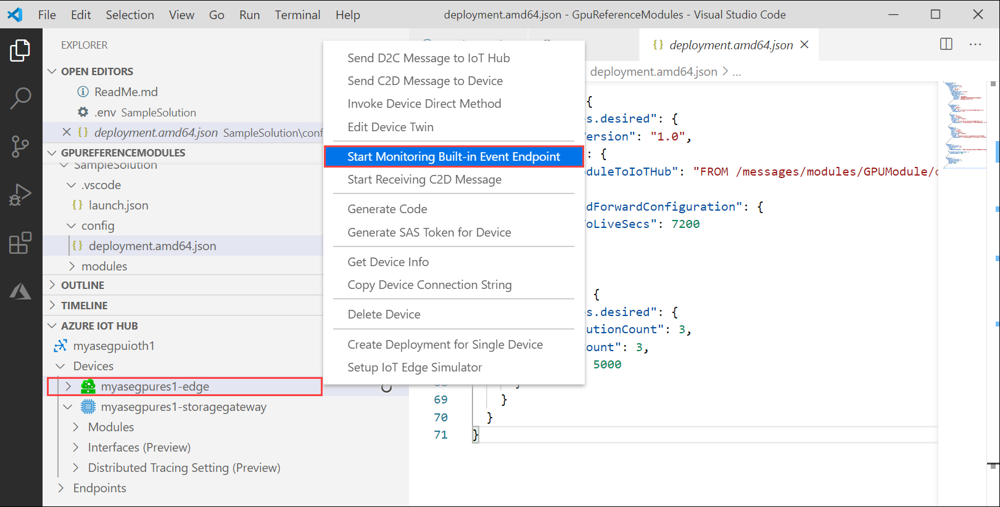  

    2. Go to **Devices > Modules** and you should see your **GPU module** running.

    3. The VS Code terminal should also show the IoT Hub events as the monitoring output for your Azure Stack Edge Pro device.

        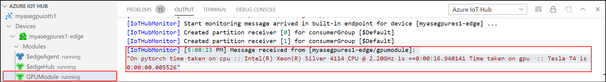 

        You can see that the time taken to execute the same set of operations (5000 iterations of shape transformation) by GPU is lot lesser than it is for CPU.

## Next Steps

- Learn more about how to [Configure GPU to use a module](./azure-stack-edge-gpu-configure-gpu-modules.md).