# Deploy a GPU enabled IoT module on Azure Stack Edge Pro GPU device

[!INCLUDE [applies-to-gpu-pro-pro2-and-pro-r-skus](../../includes/azure-stack-edge-applies-to-gpu-pro-pro-2-pro-r-sku.md)]

> [!NOTE]
> We strongly recommend that you deploy the latest IoT Edge version in a Linux VM. The managed IoT Edge on Azure Stack Edge uses an older version of IoT Edge runtime that doesn’t have the latest features and patches. For instructions, see how to [Deploy an Ubuntu VM](azure-stack-edge-gpu-deploy-iot-edge-linux-vm.md). For more information on other supported Linux distributions that can run IoT Edge, see [Azure IoT Edge supported systems – Container engines](../iot-edge/support.md#linux-containers).

This article describes how to deploy a GPU enabled IoT Edge module on your Azure Stack Edge Pro GPU device. 

In this article, you learn how to:
  - Prepare Azure Stack Edge Pro to run a GPU module.
  - Download and install sample code from a Git repository.
  - Build the solution and generate a deployment manifest.
  - Deploy the solution to Azure Stack Edge Pro device.
  - Monitor the module output.


## About sample module

The GPU sample module in this article includes PyTorch and TensorFlow benchmarking sample code for CPU against GPU.

## Prerequisites

Before you begin, make sure you have:

- You've access to a GPU enabled 1-node Azure Stack Edge Pro device. This device is activated with a resource in Azure. See [Activate the device](azure-stack-edge-gpu-deploy-activate.md).
- You've configured compute on this device. Follow the steps in [Tutorial: Configure compute on your Azure Stack Edge Pro device](azure-stack-edge-gpu-deploy-configure-compute.md).
- An Azure Container Registry (ACR). Go to the **Access keys** blade and make a note of the ACR login server, username, and password. For more information, go to [Quickstart: Create a private container registry using the Azure portal](../container-registry/container-registry-get-started-portal.md#create-a-container-registry).
- The following development resources on a Windows client:
    - [Azure CLI 2.0 or later](https://aka.ms/installazurecliwindows)
    - [Docker CE](https://store.docker.com/editions/community/docker-ce-desktop-windows). You may have to create an account to download and install the software.
    - [Visual Studio Code](https://code.visualstudio.com/)  
    - [Azure IoT Edge extension for Visual Studio Code](https://marketplace.visualstudio.com/items?itemName=vsciot-vscode.azure-iot-edge).    
    - [Python extension for Visual Studio Code](https://marketplace.visualstudio.com/items?itemName=ms-python.python)    
    - [Python 3](https://www.python.org/)    
    - Pip for installing Python packages (typically included with your Python installation)

## Get the sample code

1. Go to the [Azure Intelligent Edge Patterns in Azure samples](https://github.com/azure-samples/azure-intelligent-edge-patterns). Clone or download the zip file for code. 

    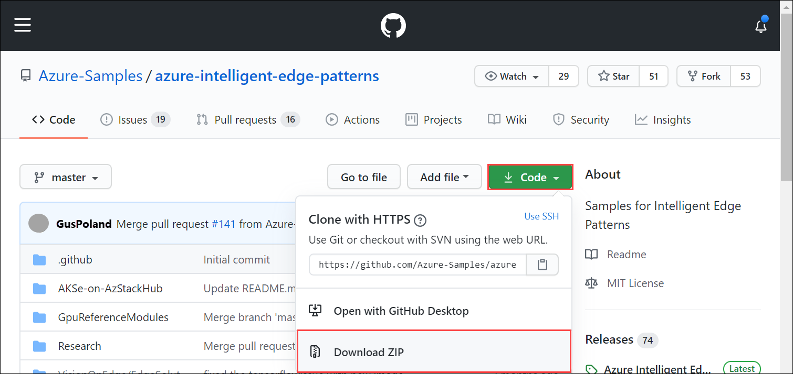

    Extract the files from the zip. You can also clone the samples.

    ```json
    git clone https://github.com/Azure-Samples/azure-intelligent-edge-patterns.git
    ```

## Build and deploy module

1. Open the **GpuReferenceModules** folder in Visual Studio Code.

    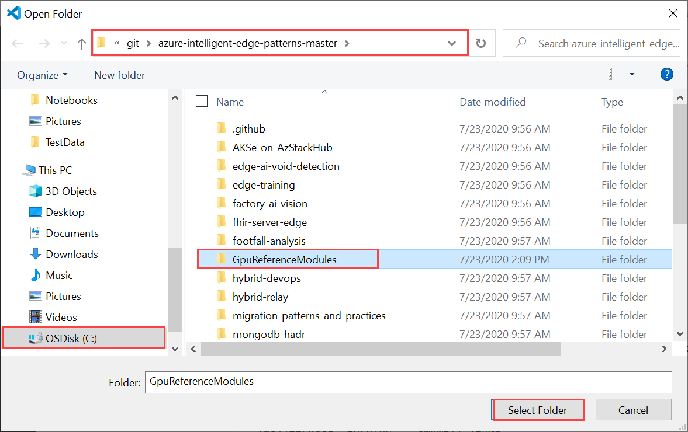

2. Open the *deployment.template.json* and identify the parameters it references for the container registry. In the following file, CONTAINER_REGISTRY_USERNAME, CONTAINER_REGISTRY_PASSWORD, and CONTAINER_REGISTRY_NAME are used.

    ```json
        {
      "$schema-template": "2.0.0",
      "modulesContent": {
        "$edgeAgent": {
          "properties.desired": {
            "schemaVersion": "1.0",
            "runtime": {
              "type": "docker",
              "settings": {
                "minDockerVersion": "v1.25",
                "loggingOptions": "",
                "registryCredentials": {
                  "${CONTAINER_REGISTRY_NAME}":{
                  "username": "$CONTAINER_REGISTRY_USERNAME",
                  "password": "$CONTAINER_REGISTRY_PASSWORD",
                  "address": "${CONTAINER_REGISTRY_NAME}.azurecr.io"
                  }
                }
              }
            },
    ```
3. Create a new file. Fill out the values for your container registry parameters (use the ones identified in the earlier step) as follows: 

    ```json
    CONTAINER_REGISTRY_NAME=<YourContainerRegistryName>
    CONTAINER_REGISTRY_USERNAME=<YourContainerRegistryUserName>
    CONTAINER_REGISTRY_PASSWORD=<YourContainerRegistryPassword>
    ```
    A sample *.env* file is shown below:
    
    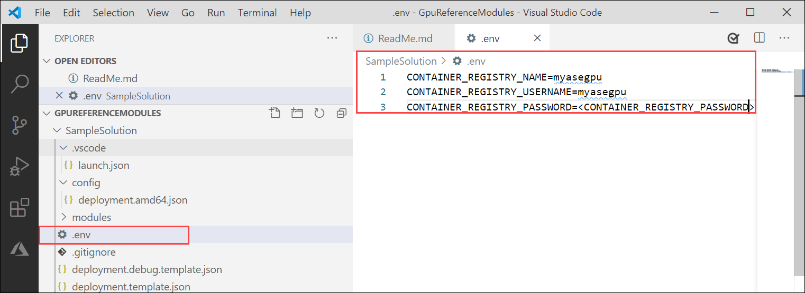

4. Save the file as *.env* in the **SampleSolution** folder.

5. To sign into Docker, enter the following command in the Visual Studio Code integrated terminal. 

    ```json
    docker login -u <CONTAINER_REGISTRY_USERNAME> -p <CONTAINER_REGISTRY_PASSWORD> <CONTAINER_REGISTRY_NAME>
    ```
    Go to the **Access keys** section of your container registry in the Azure portal. Copy and use the registry name, password, and login server.

    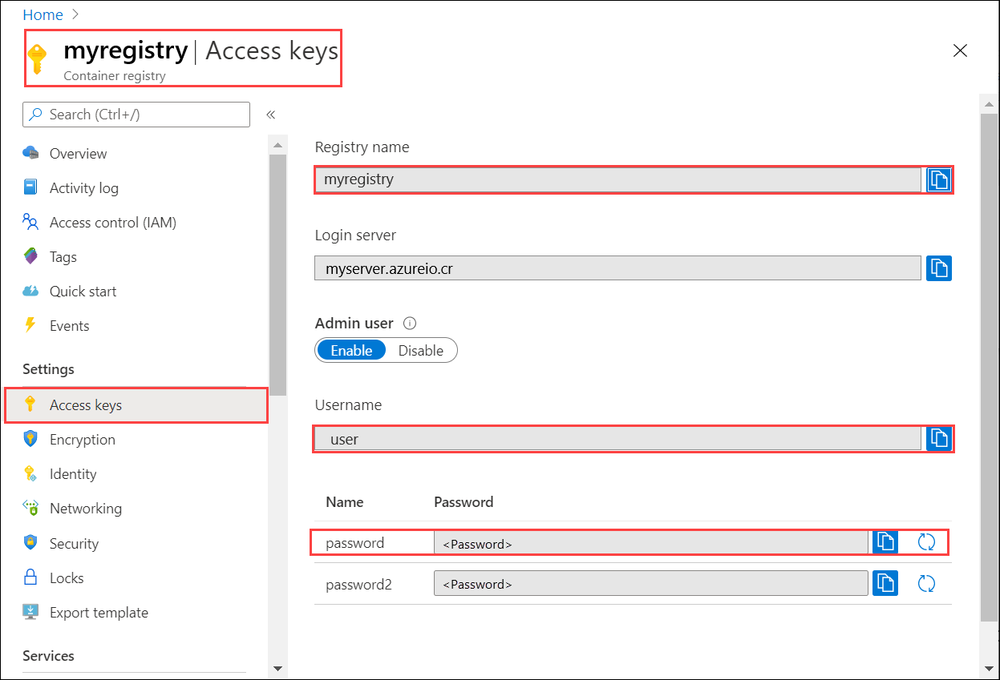

    After the credentials are supplied, the sign in succeeds.

    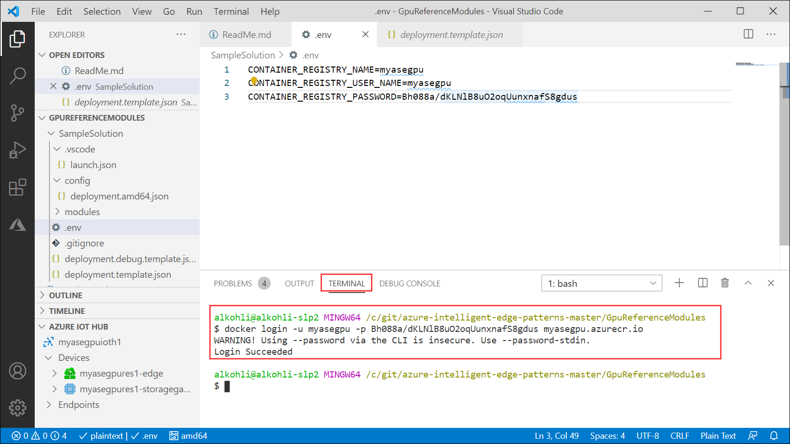

6. Push your image to your Azure container registry. In the VS Code Explorer, select and right-click the **deployment.template.json** file and then select **Build and Push IoT Edge solution**. 

    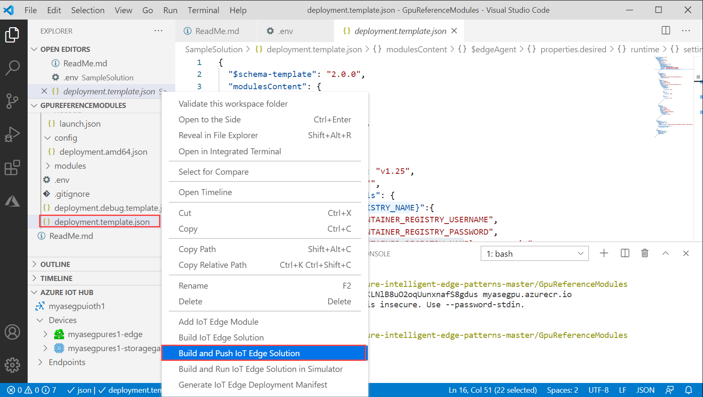   

    If Python and Python extension are not installed, these will be installed when you build and push the solution. However, this would result in longer build times. 

    Once this step is complete, you see the module in your container registry.

    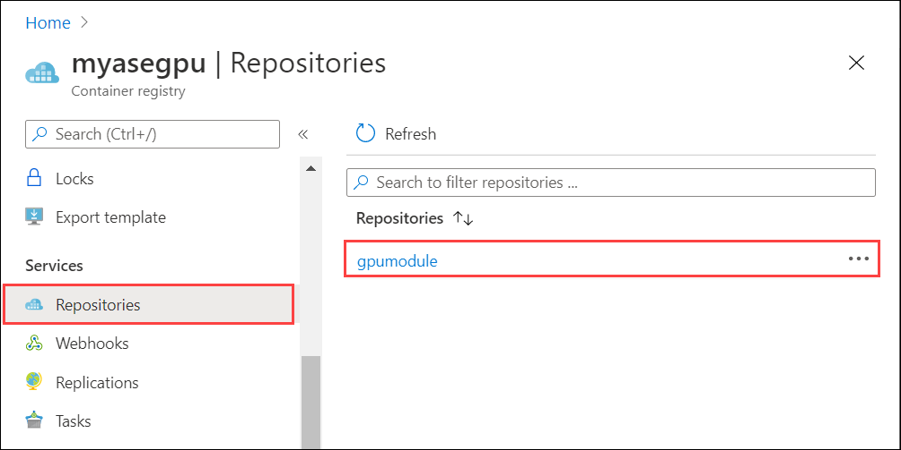    


7. To create a deployment manifest, right-click the **deployment.template.json** and then select **Generate IoT Edge Deployment Manifest**. 

    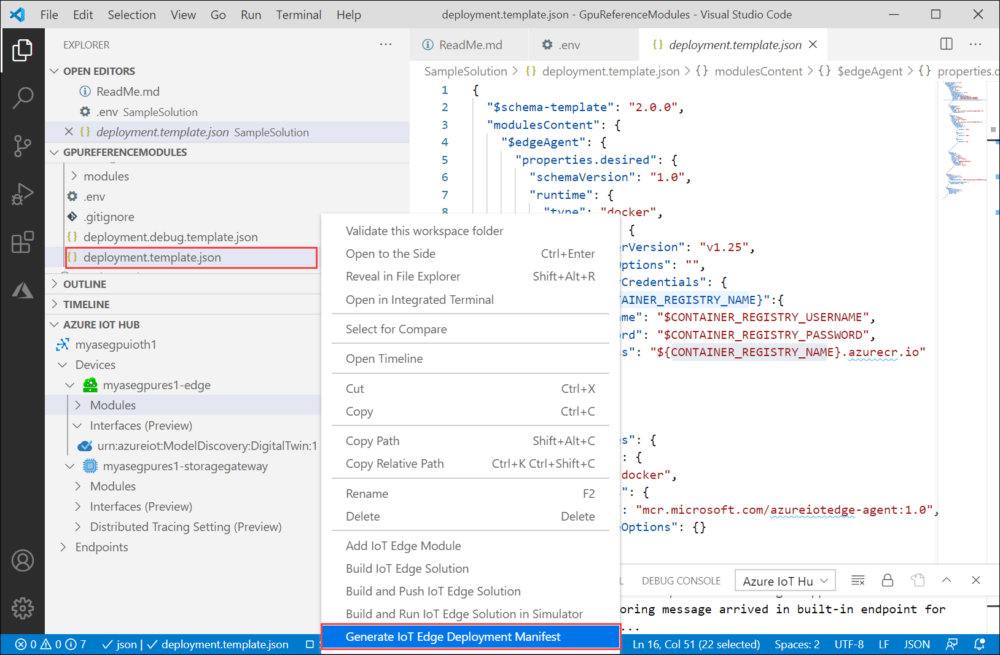  

    The notification informs you the path at which the deployment manifest was generated. The manifest is the `deployment.amd64.json` file generated in the **config** folder. 

8. Select the **deployment.amd64.json** file in **config** folder and then choose **Create Deployment for Single Device**. Do not use the **deployment.template.json** file. 

    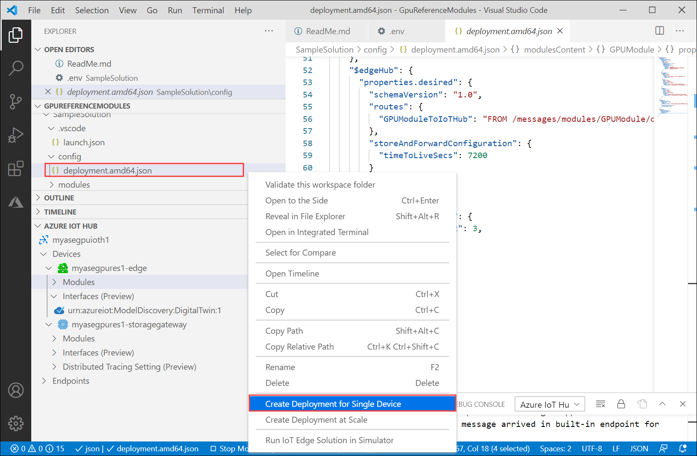  

    In the **Output** window, you should see a message that deployment succeeded.

    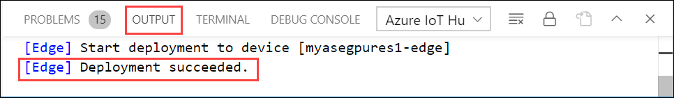 

## Monitor the module  

1. In the VS Code command palette, run **Azure IoT Hub: Select IoT Hub**.

2. Choose the subscription and IoT hub that contain the IoT Edge device that you want to configure. In this case, select the subscription used to deploy the Azure Stack Edge Pro device, and select the IoT Edge device created for your Azure Stack Edge Pro device. This occurs when you configure compute via the Azure portal in the earlier steps.

3. In the VS Code explorer, expand the Azure IoT Hub section. Under **Devices**, you should see the IoT Edge device corresponding to your Azure Stack Edge Pro device. 

    1. Select that device, right-click and select **Start Monitoring Built-in Event Endpoint**.
  
          

    2. Go to **Devices > Modules** and you should see your **GPU module** running.

        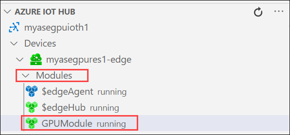  

    3. The VS Code terminal should also show the IoT Hub events as the monitoring output for your Azure Stack Edge Pro device.

         

        You can see that the time taken to execute the same set of operations (5000 iterations of shape transformation) by GPU is lot lesser than it is for CPU.

## Next Steps

- Learn more about how to [Configure GPU to use a module](./azure-stack-edge-gpu-configure-gpu-modules.md).