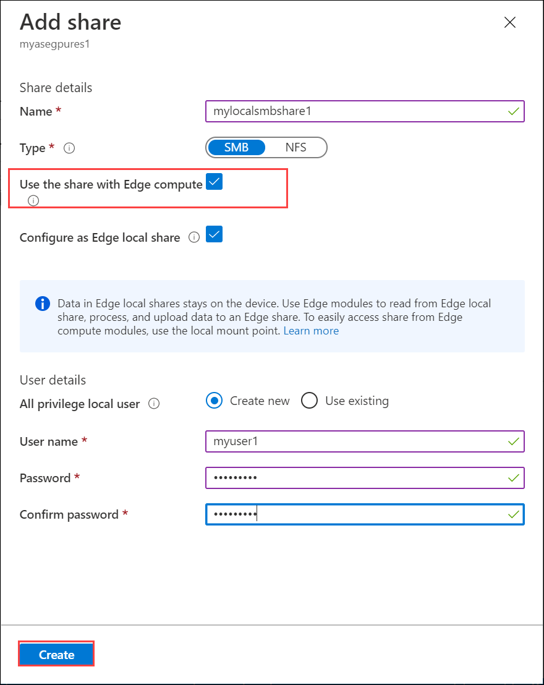
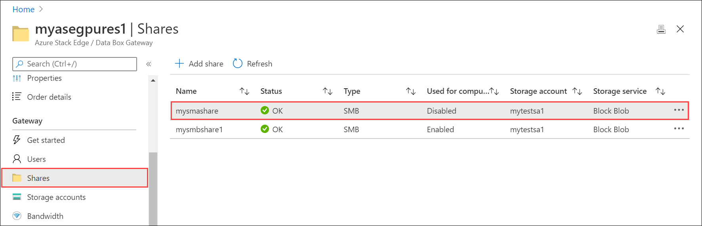
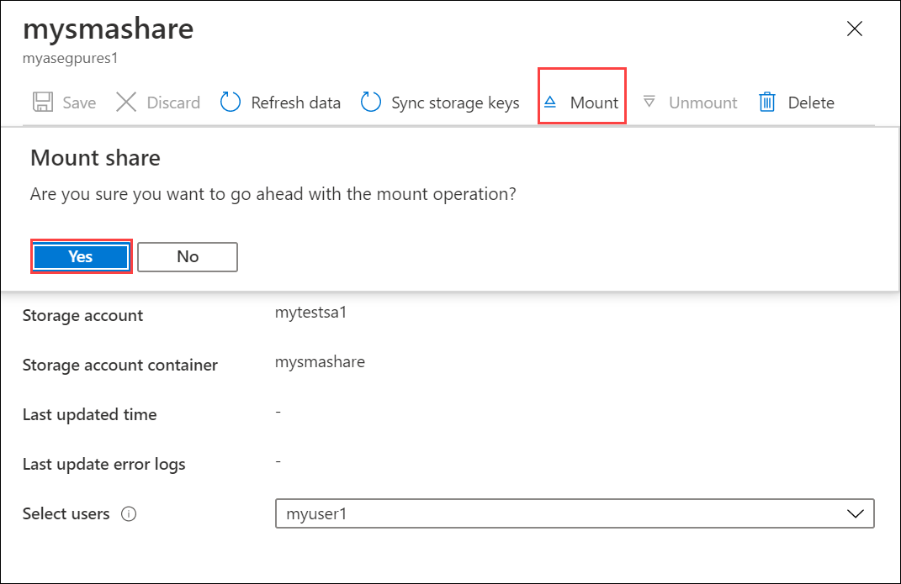
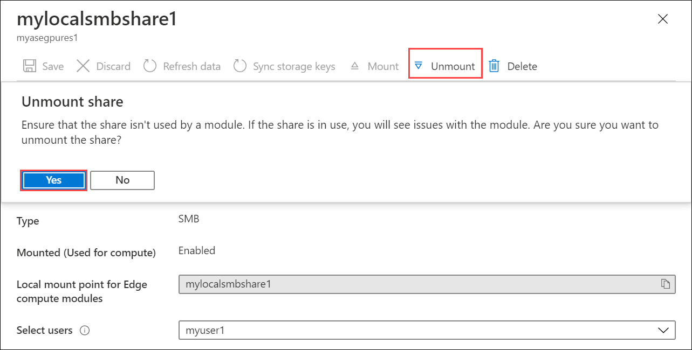
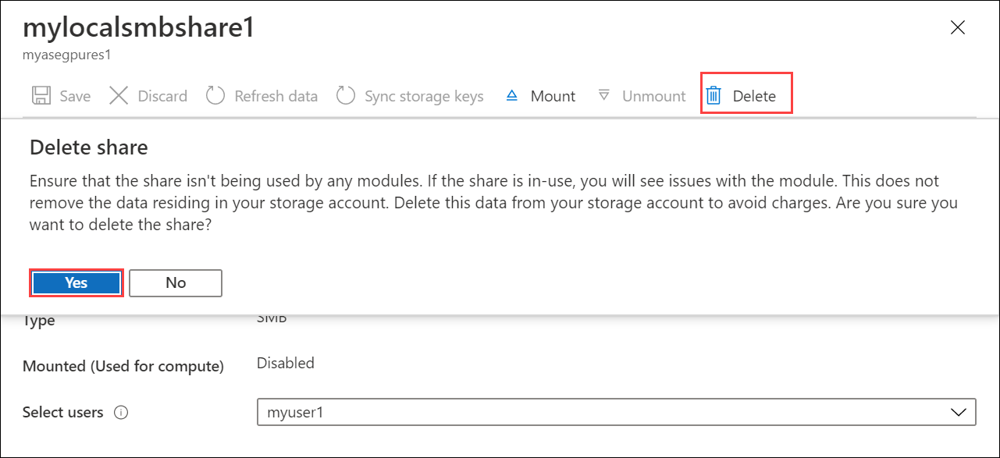

# Use kubectl to run a Kubernetes stateful application with a PersistentVolume on your Azure Stack Edge Pro device

[!INCLUDE [applies-to-GPU-and-pro-r-and-mini-r-skus](../../includes/azure-stack-edge-applies-to-gpu-pro-r-mini-r-sku.md)]

This article shows you how to deploy a single-instance stateful application in Kubernetes using a PersistentVolume (PV) and a deployment. The deployment uses `kubectl` commands on an existing Kubernetes cluster and deploys the MySQL application. 

This procedure is intended for those who have reviewed the [Kubernetes storage on Azure Stack Edge Pro device](azure-stack-edge-gpu-kubernetes-storage.md) and are familiar with the concepts of [Kubernetes storage](https://kubernetes.io/docs/concepts/storage/). 

Azure Stack Edge Pro also supports running Azure SQL Edge containers and these can be deployed in a similar way as detailed here for MySQL. For more information, see [Azure SQL Edge](../azure-sql-edge/overview.md).


## Prerequisites

Before you can deploy the stateful application, complete the following prerequisites on your device and the client that you will use to access the device:

### For device

- You have sign-in credentials to a 1-node Azure Stack Edge Pro device.
    - The device is activated. See [Activate the device](azure-stack-edge-gpu-deploy-activate.md).
    - The device has the compute role configured via Azure portal and has a Kubernetes cluster. See [Configure compute](azure-stack-edge-gpu-deploy-configure-compute.md).

### For client accessing the device

- You have a  Windows client system that will be used to access the Azure Stack Edge Pro device.
    - The client is running Windows PowerShell 5.0 or later. To download the latest version of Windows PowerShell, go to [Install Windows PowerShell](/powershell/scripting/install/installing-windows-powershell).
    
    - You can have any other client with a [Supported operating system](azure-stack-edge-gpu-system-requirements.md#supported-os-for-clients-connected-to-device) as well. This article describes the procedure when using a Windows client. 
    
    - You have completed the procedure described in [Access the Kubernetes cluster on Azure Stack Edge Pro device](azure-stack-edge-gpu-create-kubernetes-cluster.md). You have:
      - Created a `userns1` namespace via the `New-HcsKubernetesNamespace` command. 
      - Created a user `user1` via the `New-HcsKubernetesUser` command. 
      - Granted the `user1` access to `userns1` via the `Grant-HcsKubernetesNamespaceAccess` command.       
      - Installed `kubectl` on the client  and saved the `kubeconfig` file with the user configuration to C:\\Users\\&lt;username&gt;\\.kube. 
    
    - Make sure that the `kubectl` client version is skewed no more than one version from the Kubernetes master version running on your Azure Stack Edge Pro device. 
        - Use `kubectl version` to check the version of kubectl running on the client. Make a note of the full version.
        - In the local UI of your Azure Stack Edge Pro device, go to **Overview** and note the Kubernetes software number. 
        - Verify these two versions for compatibility from the mapping provided in the Supported Kubernetes version.<!-- insert link--> 


You are ready to deploy a stateful application on your Azure Stack Edge Pro device. 

## Provision a static PV

To statically provision a PV, you need to create a share on your device. Follow these steps to provision a PV against your SMB share. 

> [!NOTE]
> - The specific example used in this how-to article does not work with NFS shares. In general, NFS shares can be provisioned on your Azure Stack Edge device with non-database applications.
> - To deploy stateful applications that use storage volumes to provide persistent storage, we recommend that you use `StatefulSet`. This example uses `Deployment` with only one replica and is suitable for development and testing. 

1. Choose whether you want to create an Edge share or an Edge local share. Follow the instructions in [Add a share](azure-stack-edge-manage-shares.md#add-a-share) to create a share. Make sure to select the check box for **Use the share with Edge compute**.

    

    1. Instead of creating a new share, if you decide to use an existing share, you will need to mount the share.
    
        In the Azure portal for your Azure Stack Edge resource, go to **Shares**. From the existing list of shares, select and click a share that you want to use.

        

    1. Select **Mount** and confirm mounting when prompted.  

        

1. Make a note of the share name. When this share is created, a persistent volume object is automatically created in the Kubernetes cluster corresponding to the SMB share you created. 

## Deploy MySQL

You will now run a stateful application by creating a Kubernetes Deployment and connecting it to the PV you created in the earlier step using a PersistentVolumeClaim (PVC). 

All `kubectl` commands you use to create and manage stateful application deployments need to specify the namespace associated with the configuration. To specify the namespace in a kubectl command, use `kubectl <command> -n <your-namespace>`.

1. Get a list of the pods running on your Kubernetes cluster in your namespace. A pod is an application container, or process, running on your Kubernetes cluster.

   ```powershell
   kubectl get pods -n <your-namespace>
   ```
    
   Here's an example of command usage:
    
   ```powershell
    C:\Users\user>kubectl get pods -n "userns1"
    No resources found in userns1 namespace.    
    C:\Users\user>
   ```
    
   The output should state that no resources (pods) are found because there are no applications running on your cluster.

1. You will use the following YAML files. The `mysql-deployment.yml` file describes a deployment that runs MySQL and references the PVC. The file defines a volume mount for `/var/lib/mysql`, and then creates a PVC that looks for a 20-GB volume. 

    This claim is satisfied by any existing PV that was statically provisioned when you created the share in the earlier step. On your device, a large PV of 32 TB is created for each share. The PV meets the requirements set forth by PVC and the PVC should be bound to this PV.

    Copy and save the following `mysql-deployment.yml` file to a folder on the Windows client that you are using to access the Azure Stack Edge Pro device.
    
    ```yml
    apiVersion: v1
    kind: Service
    metadata:
      name: mysql
    spec:
      ports:
      - port: 3306
      selector:
        app: mysql
      clusterIP: None
    ---
    apiVersion: apps/v1 # for versions before 1.9.0 use apps/v1beta2
    kind: Deployment
    metadata:
      name: mysql
    spec:
      selector:
        matchLabels:
          app: mysql
      strategy:
        type: Recreate
      template:
        metadata:
          labels:
            app: mysql
        spec:
          containers:
          - image: mysql:5.6
            name: mysql
            env:
              # Use secret in real usage
            - name: MYSQL_ROOT_PASSWORD
              value: password
            ports:
            - containerPort: 3306
              name: mysql
            volumeMounts:
            - name: mysql-persistent-storage
              mountPath: /var/lib/mysql
          volumes:
          - name: mysql-persistent-storage
            persistentVolumeClaim:
              claimName: mysql-pv-claim
    ```
    
2. Copy and save as a `mysql-pv.yml` file to the same folder where you saved the `mysql-deployment.yml`. To use the SMB share that you earlier created with `kubectl`, set the `volumeName` field in the PVC object to the name of the share. 

    > [!NOTE] 
    > Make sure that the YAML files have correct indentation. You can check with [YAML lint](http://www.yamllint.com/) to validate and then save.
   
    ```yml
    apiVersion: v1
    kind: PersistentVolumeClaim
    metadata:
      name: mysql-pv-claim
    spec:
      volumeName: <smb-share-name-here>
      storageClassName: ""
      accessModes:
        - ReadWriteOnce
      resources:
        requests:
          storage: 20Gi
    ```

3. Deploy the `mysql-pv.yaml` file.

    `kubectl apply -f <URI path to the mysql-pv.yml file> -n <your-user-namespace>`
    
    Here's a sample output of the deployment.

    
    ```powershell
    C:\Users\user>kubectl apply -f "C:\stateful-application\mysql-pv.yml" -n userns1
    persistentvolumeclaim/mysql-pv-claim created
    
    C:\Users\user>
    ```
   Note the name of the PVC created. You will use it in a later step. 

4. Deploy the contents of the `mysql-deployment.yml` file.

    `kubectl apply -f <URI path to mysql-deployment.yml file> -n <your-user-namespace>`

    Here's a sample output of the deployment.
    
    ```powershell
    C:\Users\user>kubectl apply -f "C:\stateful-application\mysql-deployment.yml" -n userns1
        service/mysql created
        deployment.apps/mysql created
    ```
    
5. Display information about the deployment.

    `kubectl describe deployment <app-label> -n <your-user-namespace>`
    
    ```powershell
    C:\Users\user>kubectl describe deployment mysql -n userns1
    Name:               mysql
    Namespace:          userns1
    CreationTimestamp:  Tue, 18 Aug 2020 09:44:58 -0700
    Labels:             <none>
    Annotations:        deployment.kubernetes.io/revision: 1
                        kubectl.kubernetes.io/last-applied-configuration:
                          {"apiVersion":"apps/v1","kind":"Deployment","metadata":{"annotations":{},"name":"mysql","namespace":"userns1"},"spec":{"selector":{"matchL...
    Selector:           app=mysql
    Replicas:           1 desired | 1 updated | 1 total | 1 available | 0 unavailable
    StrategyType:       Recreate
    MinReadySeconds:    0
    Pod Template:
      Labels:  app=mysql
      Containers:
       mysql:
        Image:      mysql:5.6
        Port:       3306/TCP
        Host Port:  0/TCP
        Environment:
          MYSQL_ROOT_PASSWORD:  password
        Mounts:
          /var/lib/mysql from mysql-persistent-storage (rw)
      Volumes:
       mysql-persistent-storage:
        Type:       PersistentVolumeClaim (a reference to a PersistentVolumeClaim in the same namespace)
        ClaimName:  mysql-pv-claim
        ReadOnly:   false
    Conditions:
      Type           Status  Reason
      ----           ------  ------
      Progressing    True    NewReplicaSetAvailable
      Available      True    MinimumReplicasAvailable
    OldReplicaSets:  <none>
    NewReplicaSet:   mysql-c85f7f79c (1/1 replicas created)
    Events:
      Type    Reason             Age   From                   Message
      ----    ------             ----  ----                   -------
      Normal  ScalingReplicaSet  10m   deployment-controller  Scaled up replica set mysql-c85f7f79c to 1
    
    C:\Users\user>
    ```
    

6. List the pods created by the deployment.

    `kubectl get pods -l <app=label> -n <your-user-namespace>`

    Here's a sample output.

    
    ```powershell
    C:\Users\user>kubectl get pods -l app=mysql -n userns1
    NAME                    READY   STATUS    RESTARTS   AGE
    mysql-c85f7f79c-vzz7j   1/1     Running   1          14m
    
    C:\Users\user>
    ```
    
7. Inspect the PersistentVolumeClaim.

    `kubectl describe pvc <your-pvc-name>`

    Here's a sample output.

    
    ```powershell
    C:\Users\user>kubectl describe pvc mysql-pv-claim -n userns1
    Name:          mysql-pv-claim
    Namespace:     userns1
    StorageClass:
    Status:        Bound
    Volume:        mylocalsmbshare1
    Labels:        <none>
    Annotations:   kubectl.kubernetes.io/last-applied-configuration:
                     {"apiVersion":"v1","kind":"PersistentVolumeClaim","metadata":{"annotations":{},"name":"mysql-pv-claim","namespace":"userns1"},"spec":{"acc...
                   pv.kubernetes.io/bind-completed: yes
    Finalizers:    [kubernetes.io/pvc-protection]
    Capacity:      32Ti
    Access Modes:  RWO,RWX
    VolumeMode:    Filesystem
    Mounted By:    mysql-c85f7f79c-vzz7j
    Events:        <none>
    
    C:\Users\user>
    ```
    

## Verify MySQL is running


To run a command against a container in a pod that is running MySQL, type:

`kubectl exec <your-pod-with-the-app> -i -t -n <your-namespace> -- mysql`

Here's a sample output.

```powershell
C:\Users\user>kubectl exec mysql-c85f7f79c-vzz7j -i -t -n userns1 -- mysql
Welcome to the MySQL monitor.  Commands end with ; or \g.
Your MySQL connection id is 1
Server version: 5.6.49 MySQL Community Server (GPL)

Copyright (c) 2000, 2020, Oracle and/or its affiliates. All rights reserved.

Oracle is a registered trademark of Oracle Corporation and/or its
affiliates. Other names may be trademarks of their respective
owners.

Type 'help;' or '\h' for help. Type '\c' to clear the current input statement.

mysql>
```

## Delete a deployment

To delete the deployment, delete the deployed objects by name. These objects include deployment, service, and PVC.
 
```powershell
kubectl delete deployment <deployment-name>,svc <service-name> -n <your-namespace>
kubectl delete pvc <your-pvc-name> -n <your-namespace>
```

Here's sample output of when you delete the deployment and the service.

```powershell
C:\Users\user>kubectl delete deployment,svc mysql -n userns1
deployment.apps "mysql" deleted
service "mysql" deleted
C:\Users\user>
```
Here's sample output of when you delete the PVC.

```powershell
C:\Users\user>kubectl delete pvc mysql-pv-claim -n userns1
persistentvolumeclaim "mysql-pv-claim" deleted
C:\Users\user>
```

The PV is no longer bound to the PVC as the PVC was deleted. As the PV was provisioned when the share was created, you will need to delete the share. Follow these steps:

1. Unmount the share. In Azure portal, go to your **Azure Stack Edge resource > Shares** and select and click the share you want to unmount. Select **Unmount** and confirm the operation. Wait until the share is unmounted. The unmounting releases the share (and hence the associated PersistentVolume) from the Kubernetes cluster. 

    

1. You can now select **Delete** and confirm deletion to delete your share. This should also delete the share and the corresponding PV.

    


## Next steps

To understand how to dynamically provision storage, see 
[Deploy a stateful application via dynamic provisioning on an Azure Stack Edge Pro device](azure-stack-edge-gpu-deploy-stateful-application-dynamic-provision-kubernetes.md)
