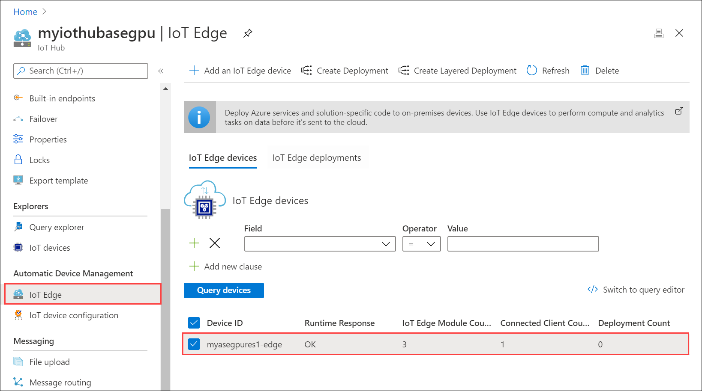
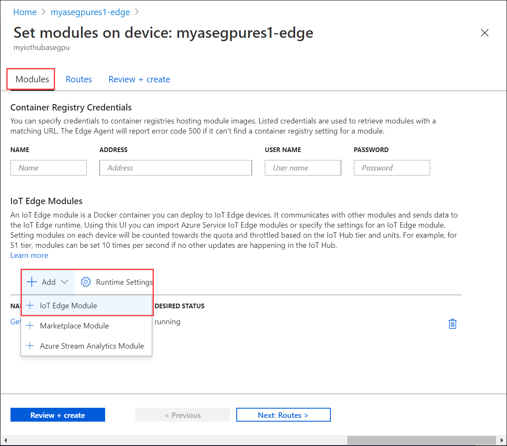
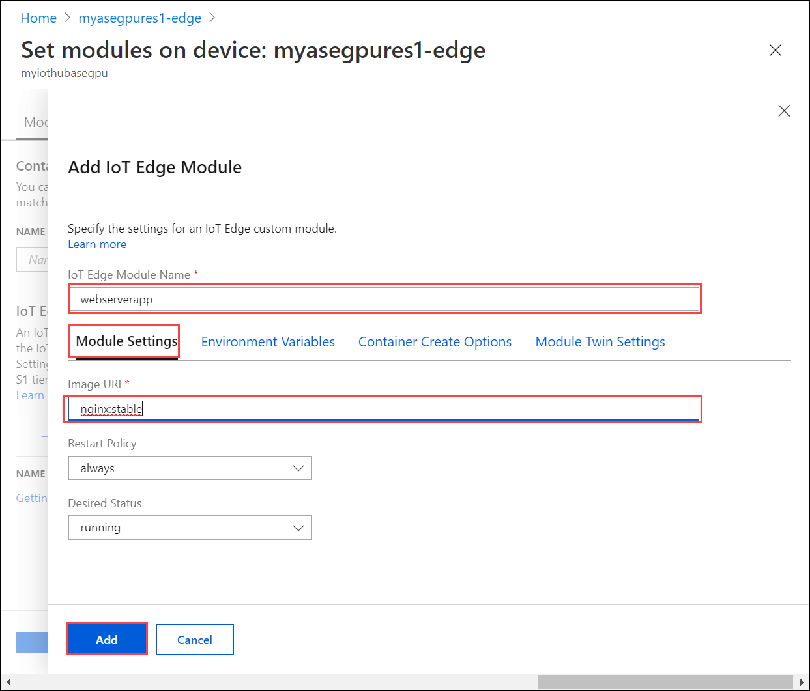
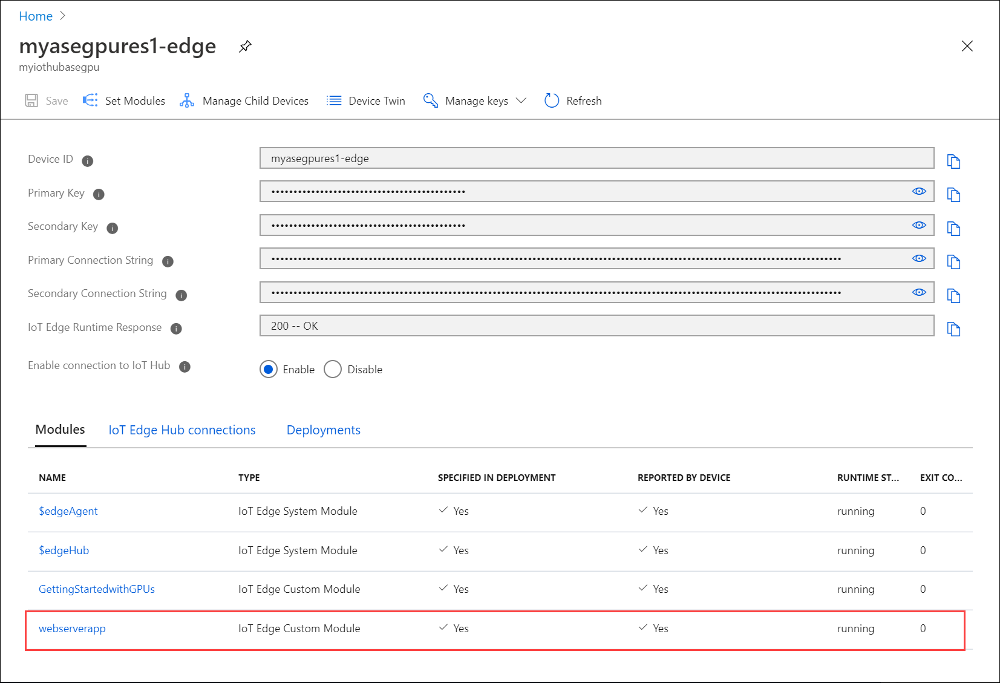
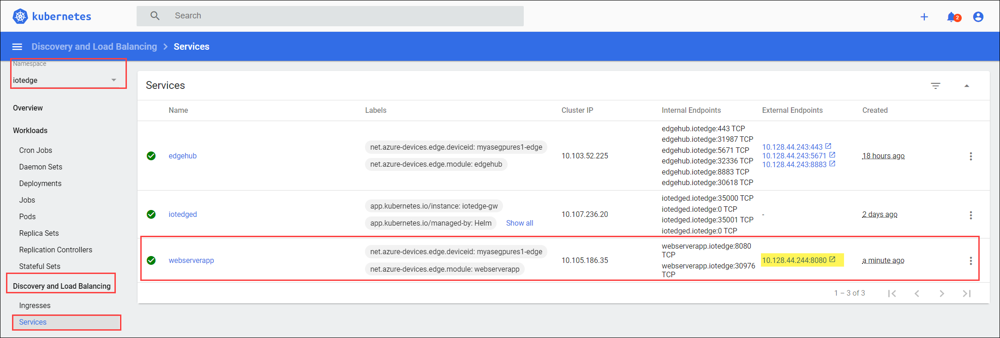
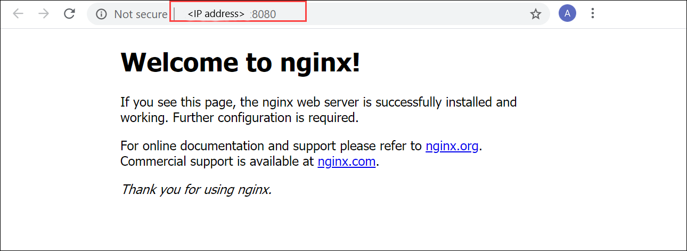

# Use IoT Edge module to run a Kubernetes stateless application on your Azure Stack Edge Pro GPU device

[!INCLUDE [applies-to-GPU-and-pro-r-and-mini-r-skus](../../includes/azure-stack-edge-applies-to-gpu-pro-r-mini-r-sku.md)]

This article describes how you can use an IoT Edge module to deploy a stateless application on your Azure Stack Edge Pro device.

To deploy the stateless application, you'll take the following steps:

- Ensure that prerequisites are completed before you deploy an IoT Edge module.
- Add an IoT Edge module to access compute network on your Azure Stack Edge Pro.
- Verify the module can access the enabled network interface.

In this how-to article, you'll use a webserver app module to demonstrate the scenario.

## Prerequisites

Before you begin, you'll need:

- An Azure Stack Edge Pro device. Make sure that:

    - Compute network settings are configured on the device.
    - Device is activated as per the steps in [Tutorial: Activate your device](azure-stack-edge-gpu-deploy-activate.md).
- You've completed **Configure compute** step as per the [Tutorial: Configure compute on your Azure Stack Edge Pro device](azure-stack-edge-gpu-deploy-configure-compute.md) on your device. Your device should have an associated IoT Hub resource, an IoT device, and an IoT Edge device.


## Add webserver app module

Take the following steps to add a webserver app module on your Azure Stack Edge Pro device.

1. In the IoT Hub resource associated with your device, go to **Automatic Device Management > IoT Edge**.
1. Select and click the IoT Edge device associated with your Azure Stack Edge Pro device. 

      

1. Select **Set modules**. On **Set modules on device**, select **+ Add** and then select **IoT Edge Module**.

    

1. In the **Add IoT Edge module**:

    1. Specify a **Name** for your webserver app module that you want to deploy.
    2. Under **Module settings** tab, provide an **Image URI** for your module image. A module matching the provided name and tags is retrieved. In this case, `mcr.microsoft.com/oss/nginx/nginx:1.15.5-alpine` will pull an nginx image (tagged as 1.15.5-alpine) from the public `mcr.microsoft.com` registry.

            

    3. In the **Container Create Options** tab, paste the following sample code:  

        ```
        {
            "HostConfig": {
                "PortBindings": {
                    "80/tcp": [
                        {
                            "HostPort": "8080"
                        }
                    ]
                }
            }
        }
        ```

        This configuration lets you access the module using the compute network IP over *http* on TCP port 8080 (with the default webserver port being 80). Select **Add**.

        

    4. Select **Review + create**. Review the module details and select **Create**.

## Verify module access

1. Verify the module is successfully deployed and is running. On the **Modules** tab, the runtime status of the module should be **running**.  

    

1. To get the external endpoint of the webserver app, [access the Kubernetes dashboard](azure-stack-edge-gpu-monitor-kubernetes-dashboard.md#access-dashboard). 
1. In the left-pane of the dashboard, filter by **iotedge** namespace. Go to **Discovery and Load balancing > Services**. Under the list of services listed, locate the external endpoint for the webserver app module. 

    

1. Select the external endpoint to open a new browser window.

    You should see that the webserver app is running.

    

## Next steps

- Learn how to Expose stateful application via an IoT Edge module<!--insert link-->.
