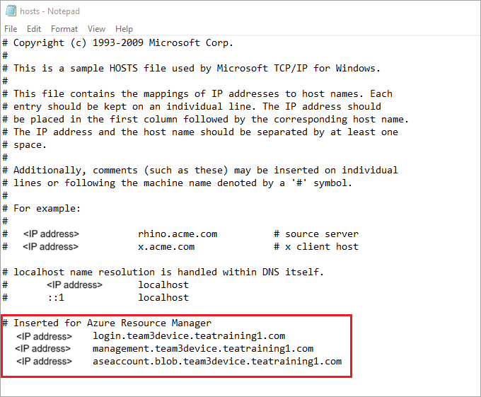

# Deploy VMs on your Azure Stack Edge Pro GPU device using Azure CLI and Python

[!INCLUDE [applies-to-GPU-and-pro-r-and-mini-r-skus](../../includes/azure-stack-edge-applies-to-gpu-pro-r-mini-r-sku.md)]

[!INCLUDE [azure-stack-edge-gateway-deploy-virtual-machine-overview](../../includes/azure-stack-edge-gateway-deploy-virtual-machine-overview.md)]

This tutorial describes how to create and manage a VM on your Azure Stack Edge Pro device using Python and the Azure API.

## VM deployment workflow

The deployment workflow is illustrated in the following diagram.


The high-level summary of the deployment workflow is as follows:

1. Connect to Azure Resource Manager
2. Create a resource group
3. Create a storage account
4. Add blob URI to hosts file
5. Install certificates
6. Upload a VHD
7. Create managed disks from the VHD
8. Create a VM image from the image managed disk
9. Create VM with previously created resources
10. Create a VNet
11. Create a VNIC using the VNet subnet ID

For a detailed explanation of the workflow diagram, see [Deploy VMs on your Azure Stack Edge Pro device using Azure PowerShell](azure-stack-edge-gpu-deploy-virtual-machine-powershell.md). For information on how to connect to Azure Resource Manager, see [Connect to Azure Resource Manager using Azure PowerShell](azure-stack-edge-gpu-connect-resource-manager.md).

## Prerequisites

Before you begin creating and managing a VM on your Azure Stack Edge Pro device using Azure CLI and Python, you need to make sure you have completed the prerequisites listed in the following steps:

1. You completed the network settings on your Azure Stack Edge Pro device as described in [Step 1: Configure Azure Stack Edge Pro device](azure-stack-edge-gpu-connect-resource-manager.md#step-1-configure-azure-stack-edge-device).

2. You enabled a network interface for compute. This network interface IP is used to create a virtual switch for the VM deployment. The following steps walk you through the process:

    1. Go to **Compute**. Select the network interface that you will use to create a virtual switch.

        > [!IMPORTANT] 
        > You can only configure one port for compute.

    2. Enable compute on the network interface. Azure Stack Edge Pro creates and manages a virtual switch corresponding to that network interface.

    <!--If you decide to use another network interface for compute, make sure that you:

    - Delete all the VMs that you have deployed using Azure Resource Manager.

    - Delete all virtual network interfaces and the virtual network associated with this network interface.

    - You can now enable another network interface for compute.-->

3. You created and installed all the certificates on your Azure Stack Edge Pro device and in the trusted store of your client. Follow the procedure described in [Step 2: Create and install certificates](azure-stack-edge-gpu-connect-resource-manager.md#step-2-create-and-install-certificates).

4. You created a Base-64 encoded *.cer* certificate (PEM format) for your Azure Stack Edge Pro device. That certificate is already uploaded as signing chain on the device and installed in the trusted root store on your client. This certificate is also required in *pem* format for Python to work on this client.

    Convert this certificate to `pem` format by using the [certutil](/previous-versions/windows/it-pro/windows-server-2012-r2-and-2012/cc732443(v=ws.11)) command. You must run this command in the directory that contains your certificate.

    ```powershell
    certutil.exe <SourceCertificateName.cer> <DestinationCertificateName.pem>
    ```
    The following shows sample command usage:

    ```output
    PS C:\Certificates> certutil.exe -encode aze-root.cer aze-root.pem
    Input Length = 2150
    Output Length = 3014
    CertUtil: -encode command completed successfully.
    PS C:\Certificates>
    ```    
    You will also add this `pem` to the Python store later.

5. You assigned the device IP in your **Network** page in the local web UI of device. Add this IP to:

    - The host file on the client, OR,
    - The DNS server configuration
    
    > [!IMPORTANT]
    > We recommend that you modify the DNS server configuration for endpoint name resolution.

    1. Start **Notepad** as an administrator (Administrator privileges is required to save the file), and then open the **hosts** file located at `C:\Windows\System32\Drivers\etc`.
    
        
    
    2. Add the following entries to your **hosts** file replacing with appropriate values for your device:
    
        ```
        <Device IP> login.<appliance name>.<DNS domain>
        <Device IP> management.<appliance name>.<DNS domain>
        <Device IP> <storage name>.blob.<appliance name>.<DNS domain>
        ```
    3. Use the following image for reference. Save the **hosts** file.

        

6. [Download the Python script](https://aka.ms/ase-vm-python) used in this procedure.

7. Prepare your environment for the Azure CLI:

   [!INCLUDE [azure-cli-prepare-your-environment-no-header.md](~/reusable-content/azure-cli/azure-cli-prepare-your-environment-no-header.md)]

## Step 1: Set up Azure CLI/Python on the client

### Verify profile and install Azure CLI

<!--1. Verify the API profile of the client and identify which version of the modules and libraries to include on your client. In this example, the client system will be running Azure Stack 1904 or later. For more information, see [Azure Resource Manager API profiles](/azure-stack/user/azure-stack-version-profiles?view=azs-1908&preserve-view=true#azure-resource-manager-api-profiles).-->

1. Install Azure CLI on your client. In this example, Azure CLI 2.0.80 was installed. To verify the version of Azure CLI, run the [az --version](/cli/azure/reference-index#az-version) command.

    The following is sample output from the above command:

    ```output
    PS C:\windows\system32> az --version
    azure-cli                         2.0.80
    
    command-modules-nspkg              2.0.3
    core                              2.0.80
    nspkg                              3.0.4
    telemetry                          1.0.4
    Extensions:
    azure-cli-iot-ext                  0.7.1
    
    Python location 'C:\Program Files (x86)\Microsoft SDKs\Azure\CLI2\python.exe'
    Extensions directory 'C:\.azure\cliextensions'
    
    Python (Windows) 3.6.6 (v3.6.6:4cf1f54eb7, Jun 27 2018, 02:47:15) [MSC v.1900 32 bit (Intel)]
    
    Legal docs and information: aka.ms/AzureCliLegal
    
    Your CLI is up-to-date.
    
    Please let us know how we are doing: https://aka.ms/clihats
    PS C:\windows\system32>
    ```

    If you do not have Azure CLI, download and [Install Azure CLI on Windows](/cli/azure/install-azure-cli-windows). You can run Azure CLI using Windows command prompt or through Windows PowerShell.

2. Make a note of the CLI's Python location. You need the Python location to determine the location of the trusted root certificate store for Azure CLI.

3. To run the sample script used in this article, you will need the following Python library versions:

    ```
    azure-common==1.1.23
    azure-mgmt-resource==2.1.0
    azure-mgmt-network==2.7.0
    azure-mgmt-compute==5.0.0
    azure-mgmt-storage==1.5.0
    azure-storage-blob==1.2.0rc1
    haikunator
    msrestazure==0.6.2
    ```

    To install the versions, run the following command:

    ```powershell
    .\python.exe -m pip install haikunator
    ```

    The following sample output shows the installation of Haikunator:

    ```output
    PS C:\Program Files (x86)\Microsoft SDKs\Azure\CLI2> .\python.exe -m pip install haikunator

    Collecting haikunator
      Downloading https://files.pythonhosted.org/packages/43/fa/130968f1a1bb1461c287b9ff35c630460801783243acda2cbf3a4c5964a5/haikunator-2.1.0-py2.py3-none-any.whl
    
    Installing collected packages: haikunator
    Successfully installed haikunator-2.1.0
    You are using pip version 10.0.1, however version 20.0.1 is available.
    You should consider upgrading using the 'python -m pip install --upgrade pip' command.
    
    PS C:\Program Files (x86)\Microsoft SDKs\Azure\CLI2> 
    ```

    The following sample output shows the installation of pip for `msrestazure`: 
    
    ```output
    PS C:\Program Files (x86)\Microsoft SDKs\Azure\CLI2> .\python.exe -m pip install msrestazure==0.6.2
    Requirement already satisfied: msrestazure==0.6.2 in c:\program files (x86)\microsoft sdks\azure\cli2\lib\site-packages (0.6.2)
    Requirement already satisfied: msrest<2.0.0,>=0.6.0 in c:\program files (x86)\microsoft sdks\azure\cli2\lib\site-packages (from msrestazure==0.6.2) (0.6.10)
    === CUT ===========================  CUT ==================================
    Requirement already satisfied: cffi!=1.11.3,>=1.8 in c:\program files (x86)\microsoft sdks\azure\cli2\lib\site-packages (from cryptography>=1.1.0->adal<2.0.0,>=0.6.0->msrestazure==0.6.2) (1.13.2)
    Requirement already satisfied: pycparser in c:\program files (x86)\microsoft sdks\azure\cli2\lib\site-packages (from cffi!=1.11.3,>=1.8->cryptography>=1.1.0->adal<2.0.0,>=0.6.0->msrestazure==0.6.2) (2.18)
    You are using pip version 10.0.1, however version 20.0.1 is available.
    You should consider upgrading using the 'python -m pip install --upgrade pip' command.
    PS C:\Program Files (x86)\Microsoft SDKs\Azure\CLI2>
    ```

### Trust the Azure Stack Edge Pro CA root certificate

1. Find the certificate location on your machine. The location may vary depending on where you installed `az cli`. Run Windows PowerShell as administrator. Switch to the path where `az cli` installed Python: `C:\Program Files (x86)\Microsoft SDKs\Azure\CLI2\python.exe`.

    To get the certificate location, type the following command:

    ```powershell
    .\python -c "import certifi; print(certifi.where())"
    ```
    
    The cmdlet returns the certificate location, as seen below:  
        
    ```output
    PS C:\Program Files (x86)\Microsoft SDKs\Azure\CLI2> .\python -c "import certifi; print(certifi.where())"
    C:\Program Files (x86)\Microsoft SDKs\Azure\CLI2\lib\site-packages\certifi\cacert.pem
    PS C:\Program Files (x86)\Microsoft SDKs\Azure\CLI2>
    ```
      
    Make a note of this location as you will use it later - `C:\Program Files (x86)\Microsoft SDKs\Azure\CLI2\lib\site-packages\certifi\cacert.pem`

2. Trust the Azure Stack Edge Pro CA root certificate by appending it to the existing Python certificate. You will provide the path to where you saved the PEM certificate earlier.

    ```powershell
    $pemFile = "<Path to the pem format certificate>"
    ```
    An example path would be "C:\VM-scripts\rootteam3device.pem"
    
    Then type the following series of commands into Windows PowerShell:

    ```powershell
    $root = New-Object System.Security.Cryptography.X509Certificates.X509Certificate2
        $root.Import($pemFile)
        
    Write-Host "Extracting required information from the cert file"
    $md5Hash    = (Get-FileHash -Path $pemFile -Algorithm MD5).Hash.ToLower()
    $sha1Hash   = (Get-FileHash -Path $pemFile -Algorithm SHA1).Hash.ToLower()
    $sha256Hash = (Get-FileHash -Path $pemFile -Algorithm SHA256).Hash.ToLower()

    $issuerEntry  = [string]::Format("# Issuer: {0}", $root.Issuer)
    $subjectEntry = [string]::Format("# Subject: {0}", $root.Subject)
    $labelEntry   = [string]::Format("# Label: {0}", $root.Subject.Split('=')[-1])
    $serialEntry  = [string]::Format("# Serial: {0}", $root.GetSerialNumberString().ToLower())
    $md5Entry = [string]::Format("# MD5 Fingerprint: {0}", $md5Hash)
    $sha1Entry= [string]::Format("# SHA1 Fingerprint: {0}", $sha1Hash)
    $sha256Entry  = [string]::Format("# SHA256 Fingerprint: {0}", $sha256Hash)
    $certText = (Get-Content -Path $pemFile -Raw).ToString().Replace("`r`n","`n")
    
    $rootCertEntry = "`n" + $issuerEntry + "`n" + $subjectEntry + "`n" + $labelEntry + "`n" + `
    $serialEntry + "`n" + $md5Entry + "`n" + $sha1Entry + "`n" + $sha256Entry + "`n" + $certText
    
    Write-Host "Adding the certificate content to Python Cert store"
    Add-Content "${env:ProgramFiles(x86)}\Microsoft SDKs\Azure\CLI2\Lib\site-packages\certifi\cacert.pem" $rootCertEntry
    
    Write-Host "Python Cert store was updated to allow the Azure Stack Edge Pro CA root certificate"
    ```
    
### Connect to Azure Stack Edge Pro

1. Register your Azure Stack Edge Pro environment by running the [az cloud register](/cli/azure/cloud#az-cloud-register) command.

    In some scenarios, direct outbound internet connectivity is routed through a proxy or firewall, which enforces SSL interception. In these cases, the `az cloud register` command can fail with an error such as \"Unable to get endpoints from the cloud.\" To work around this error, set the following environment variables in Windows PowerShell:

    ```powershell
    $ENV:AZURE_CLI_DISABLE_CONNECTION_VERIFICATION = 1 
    $ENV:ADAL_PYTHON_SSL_NO_VERIFY = 1
    ```

2. Set environment variables for the script for Azure Resource Manager endpoint, location where the resources are created and the path to where the source VHD is located. The location for the resources is fixed across all the Azure Stack Edge Pro devices and is set to `dbelocal`. You also need to specify the address prefixes and private IP address. All the following environment variables are values based on your values except for `AZURE_RESOURCE_LOCATION`, which should be hardcoded to `"dbelocal"`.

    ```powershell
    $ENV:ARM_ENDPOINT = "https://management.team3device.teatraining1.com"
    $ENV:AZURE_RESOURCE_LOCATION = "dbelocal"
    $ENV:VHD_FILE_PATH = "C:\Downloads\Ubuntu1604\Ubuntu13.vhd"
    $ENV:ADDRESS_PREFIXES = "5.5.0.0/16"
    $ENV:PRIVATE_IP_ADDRESS = "5.5.174.126"
    ```

3. Register your environment. Use the following parameters when running [az cloud register](/cli/azure/cloud#az-cloud-register):

    | Value | Description | Example |
    | --- | --- | --- |
    | Environment name | The name of the environment you are trying to connect to | Provide a name, for example, `aze-environ` |
    | Resource Manager endpoint | This URL is `https://Management.<appliancename><dnsdomain>`. <br> To get this URL, go to **Devices** page in the local web UI of your device. |For example, `https://management.team3device.teatraining1.com`.  |
    
    ```azurecli
    az cloud register -n <environmentname> --endpoint-resource-manager "https://management.<appliance name>.<DNS domain>"
    ```
    The following shows sample usage of the above command:
    
    ```azurecli
    PS C:\Program Files (x86)\Microsoft SDKs\Azure\CLI2> az cloud register -n az-new-env --endpoint-resource-manager "https://management.team3device.teatraining1.com"
    ```
    
    
4. Set the active environment by using the following command:

    ```azurecli
    az cloud set -n <EnvironmentName>
    ```
    The following shows sample usage of the above command:

    ```azurecli
    PS C:\Program Files (x86)\Microsoft SDKs\Azure\CLI2> az cloud set -n az-new-env
    Switched active cloud to 'az-new-env'.
    Use 'az login' to log in to this cloud.
    Use 'az account set' to set the active subscription.
    PS C:\Program Files (x86)\Microsoft SDKs\Azure\CLI2>
    ```

4. Sign in to your Azure Stack Edge Pro environment by using the [az login](/cli/azure/reference-index#az-login) command. You can sign in to the Azure Stack Edge Pro environment either as a user or as a [service principal](../active-directory/develop/app-objects-and-service-principals.md).

   Follow these steps to sign in as a *user*:

   You can either specify the username and password directly within the `az login` command, or authenticate by using a browser. You must do the latter if your account has multifactor authentication enabled.

   The following shows sample usage of `az login`:
    
    ```azurecli
    PS C:\Certificates> az login -u EdgeARMuser
    ```
   After using the login command, you are prompted for a password. Provide the Azure Resource Manager password.

   The following shows sample output for a successful sign-in after supplying the password:  
   
   ```output
   PS C:\Program Files (x86)\Microsoft SDKs\Azure\CLI2> az login -u EdgeARMuser
   Password:
   [
        {
            "cloudName": "az-new-env",
            "id": "A4257FDE-B946-4E01-ADE7-674760B8D1A3",
            "isDefault": true,
            "name": "Default Provider Subscription",
            "state": "Enabled",
            "tenantId": "c0257de7-538f-415c-993a-1b87a031879d",
            "user": {
                "name": "EdgeArmUser@localhost",
                "type": "user"
            }
        }
   ]
   PS C:\Program Files (x86)\Microsoft SDKs\Azure\CLI2>
   ```
   Make a note of the `id` and `tenantId` values as these values correspond to your Azure Resource Manager Subscription ID and Azure Resource Manager Tenant ID respectively and will be used in the later step.
       
   The following environment variables need to be set to work as *service principal*:

   ```
   $ENV:ARM_TENANT_ID = "c0257de7-538f-415c-993a-1b87a031879d"
   $ENV:ARM_CLIENT_ID = "cbd868c5-7207-431f-8d16-1cb144b50971"
   $ENV:ARM_CLIENT_SECRET - "<Your Azure Resource Manager password>"
   $ENV:ARM_SUBSCRIPTION_ID = "<Your subscription ID>"
   ```

   Your Azure Resource Manager Client ID is hard-coded. Your Azure Resource Manager Tenant ID and Azure Resource Manager Subscription ID are both present in the output of the `az login` command you ran earlier. The Azure Resource Manager Client secret is the Azure Resource Manager password that you set.

   For more information, see [Azure Resource Manager password](./azure-stack-edge-gpu-set-azure-resource-manager-password.md).

5. Change the profile to version 2019-03-01-hybrid. To change the profile version, run the following command:

    ```azurecli
    az cloud update --profile 2019-03-01-hybrid
    ```

    The following shows sample usage of `az cloud update`:

    ```output
    PS C:\Program Files (x86)\Microsoft SDKs\Azure\CLI2> az cloud update --profile 2019-03-01-hybrid
    PS C:\Program Files (x86)\Microsoft SDKs\Azure\CLI2>
    ```
<!--Sample is identical to the preceding sample, with window dressing.-->

## Step 2: Create a VM

A Python script is provided to you to create a VM. Depending on whether you are signed in as user or set as service principal, the script takes the input accordingly and creates a VM.

1. Run the Python script from the same directory where Python is installed.

```powershell
.\python.exe example_dbe_arguments_name_https.py cli
```
<!--Please verify: This is a PowerShell script? (For consistency, I converted the code-formatted setoff line to a code block.)-->

2. When the script runs, uploading the VHD takes 20-30 minutes. To view the progress of the upload operation, you can use Azure Storage Explorer or AzCopy.

    Here is a sample output of a successful run of the script. The script creates all the resources within a resource group, uses those resources to create a VM, and finally deletes the resource group including all the resources it created.

    
    ```output
    PS C:\Program Files (x86)\Microsoft SDKs\Azure\CLI2> .\python.exe example_dbe_arguments_name_https.py cli
    
    Create Resource Group
    Create a storage account
    Uploading to Azure Stack Storage as blob:
            ubuntu13.vhd
    
    Listing blobs...
            ubuntu13.vhd
    
    VM image resource id:
                /subscriptions/.../resourceGroups/azure-sample-group-virtual-machines118/providers/Microsoft.Compute/images/UbuntuImage
    
    Create Vnet
    Create Subnet
    Create NIC
    Creating Linux Virtual Machine
    Tag Virtual Machine
    Create (empty) managed Data Disk
    Get Virtual Machine by Name
    Attach Data Disk
    Detach Data Disk
    Deallocating the VM (to prepare for a disk resize)
    Update OS disk size
    Start VM
    Restart VM
    Stop VM
    
    List VMs in subscription
            VM: VmName118
    
    List VMs in resource group
            VM: VmName118
    
    Delete VM
    All example operations completed successfully!
    
    Delete Resource Group
    Deleted: azure-sample-group-virtual-machines118
    PS C:\Program Files (x86)\Microsoft SDKs\Azure\CLI2>
    ``` 


## Next steps

[Common Az CLI commands for Linux virtual machines](../virtual-machines/linux/cli-manage.md)
