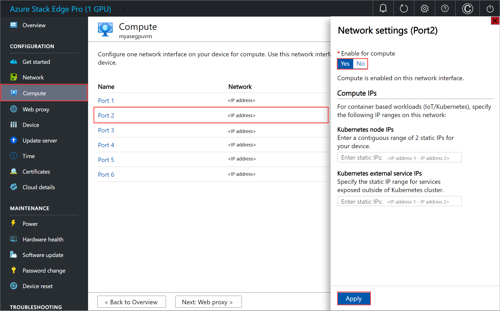

# Deploy Custom Script Extension on VMs running on your Azure Stack Edge Pro device

[!INCLUDE [applies-to-GPU-and-pro-r-and-mini-r-skus](../../includes/azure-stack-edge-applies-to-gpu-pro-r-mini-r-sku.md)]

The Custom Script Extension downloads and runs scripts or commands on virtual machines running on your Azure Stack Edge Pro devices. This article details how to install and run the Custom Script Extension by using an Azure Resource Manager template.

## About custom script extension

The Custom Script Extension is useful for post-deployment configuration, software installation, or any other configuration/management task. You can download scripts from Azure Storage or another accessible internet location, or you can provide scripts or commands to the extension runtime.

The Custom Script Extension integrates with Azure Resource Manager templates. You can also run it by using Azure CLI, PowerShell, or the Azure Virtual Machines REST API.

## OS for Custom Script Extension

#### Supported OS for Custom Script Extension on Windows

The Custom Script Extension for Windows will run on the following OSs. Other versions may work but haven't been tested in-house on VMs running on Azure Stack Edge Pro devices.

| Distribution | Version |
|---|---|
| Windows Server 2019 | Core |
| Windows Server 2016 | Core |

#### Supported OS for Custom Script Extension on Linux

The Custom Script Extension for Linux will run on the following OSs. Other versions may work but haven't been tested in-house on VMs running on Azure Stack Edge Pro devices.

| Distribution | Version |
|---|---|
| Linux: Ubuntu | 18.04 LTS |
| Linux: Red Hat Enterprise Linux | 7.4, 7.5, 7.7 |

<!--### Script location

Instead of the scripts, in this article, we pass a command to execute via the Custom Script Extension. 

### Internet Connectivity

To download a script externally such as from GitHub or Azure Storage, make sure that the port on which you enable compute network, is connected to the internet. 

If your script is on a local server, then you may still need additional firewall and Network Security Group ports need to be opened.

> [!NOTE]
> Before you install the Custom Script extension, make sure that the port enabled for compute network on your device is connected to Internet and has access. -->

## Prerequisites

1. [Download the VM templates and parameters files](https://aka.ms/ase-vm-templates) to your client machine. Unzip the download into a directory you’ll use as a working directory.

1. You should have a VM created and deployed on your device. To create VMs, follow all the steps in [Deploy VM on your Azure Stack Edge Pro using templates](azure-stack-edge-gpu-deploy-virtual-machine-templates.md).

    If you need to download a script such as from GitHub or Azure Storage externally, while configuring compute network, enable the port that is connected to the Internet for compute. This allows you to download the script.

    In the following example, Port 2 was connected to the internet and was used to enable the compute network. If you identified that Kubernetes isn't needed in the earlier step, you can skip the Kubernetes node IP and external service IP assignment.

    

## Install Custom Script Extension

Depending on the operating system for your VM, you could install Custom Script Extension for Windows or for Linux.
 

### Custom Script Extension for Windows

To deploy Custom Script Extension for Windows for a VM running on your device, edit the `addCSExtWindowsVM.parameters.json` parameters file and then deploy the template `addCSextensiontoVM.json`.

#### Edit parameters file

The file `addCSExtWindowsVM.parameters.json` takes the following parameters:

```json
{
    "$schema": "https://schema.management.azure.com/schemas/2019-04-01/deploymentParameters.json#",
    "contentVersion": "1.0.0.0",
    "parameters": {
        "vmName": {
            "value": "<Name of VM>" 
        },
        "extensionName": {
            "value": "<Name of extension>" 
        },
        "publisher": {
            "value": "Microsoft.Compute" 
        },
        "type": {
            "value": "CustomScriptExtension" 
        },
        "typeHandlerVersion": {
            "value": "1.10" 
        },
        "settings": {
            "value": {
                "commandToExecute" : "<Command to execute>"
            }
        }
    }
}
```
Provide your VM name, name for the extension and the command that you want to execute.

Here's the sample parameter file that was used in this article.

```powershell
{
    "$schema": "https://schema.management.azure.com/schemas/2019-04-01/deploymentParameters.json#",
    "contentVersion": "1.0.0.0",
    "parameters": {
        "vmName": {
            "value": "VM5" 
        },
        "extensionName": {
            "value": "CustomScriptExtension" 
        },
        "publisher": {
            "value": "Microsoft.Compute" 
        },
        "type": {
            "value": "CustomScriptExtension" 
        },
        "typeHandlerVersion": {
            "value": "1.10" 
        },
        "settings": {
            "value": {
                "commandToExecute" : "md C:\\Users\\Public\\Documents\\test"
            }
        }
    }
}
```
#### Deploy template

Deploy the template `addCSextensiontoVM.json`. This template deploys extension to an existing VM. Run the following command:

```powershell
$templateFile = "<Path to addCSExtensiontoVM.json file>"
$templateParameterFile = "<Path to addCSExtWindowsVM.parameters.json file>"
$RGName = "<Resource group name>"
New-AzureRmResourceGroupDeployment -ResourceGroupName $RGName -TemplateFile $templateFile -TemplateParameterFile $templateParameterFile -Name "<Deployment name>"
```
> [!NOTE]
> The extension deployment is a long running job and takes about 10 minutes to complete.

Here's a sample output:

```powershell
PS C:\WINDOWS\system32> $templateFile = "C:\12-09-2020\ExtensionTemplates\addCSExtensiontoVM.json"
PS C:\WINDOWS\system32> $templateParameterFile = "C:\12-09-2020\ExtensionTemplates\addCSExtWindowsVM.parameters.json"
PS C:\WINDOWS\system32> $RGName = "myasegpuvm1"
PS C:\WINDOWS\system32> New-AzureRmResourceGroupDeployment -ResourceGroupName $RGName -TemplateFile $templateFile -TemplateParameterFile $templateParameterFile -Name "deployment7"

DeploymentName          : deployment7
ResourceGroupName       : myasegpuvm1
ProvisioningState       : Succeeded
Timestamp               : 12/17/2020 10:07:44 PM
Mode                    : Incremental
TemplateLink            :
Parameters              :
                          Name             Type                       Value
                          ===============  =========================  ==========
                          vmName           String                     VM5
                          extensionName    String                     CustomScriptExtension
                          publisher        String                     Microsoft.Compute
                          type             String                     CustomScriptExtension
                          typeHandlerVersion  String                     1.10
                          settings         Object                     {
                            "commandToExecute": "md C:\\Users\\Public\\Documents\\test"
                          }

Outputs                 :
DeploymentDebugLogLevel :

PS C:\WINDOWS\system32>
```
#### Track deployment

To check the deployment state of extensions for a given VM, run the following command: 

```powershell
Get-AzureRmVMExtension -ResourceGroupName <Name of resource group> -VMName <Name of VM> -Name <Name of the extension>
```
Here's a sample output:

```powershell
PS C:\WINDOWS\system32> Get-AzureRmVMExtension -ResourceGroupName myasegpuvm1 -VMName VM5 -Name CustomScriptExtension

ResourceGroupName       : myasegpuvm1
VMName                  : VM5
Name                    : CustomScriptExtension
Location                : dbelocal
Etag                    : null
Publisher               : Microsoft.Compute
ExtensionType           : CustomScriptExtension
TypeHandlerVersion      : 1.10
Id                      : /subscriptions/947b3cfd-7a1b-4a90-7cc5-e52caf221332/resourceGroups/myasegpuvm1/providers/Microsoft.Compute/virtualMachines/VM5/extensions/CustomScriptExtension
PublicSettings          : {
                            "commandToExecute": "md C:\\Users\\Public\\Documents\\test"
                          }
ProtectedSettings       :
ProvisioningState       : Creating
Statuses                :
SubStatuses             :
AutoUpgradeMinorVersion : True
ForceUpdateTag          :

PS C:\WINDOWS\system32>
```

> [!NOTE]
> When the deployment is complete, the `ProvisioningState` changes to `Succeeded`.

Extension output is logged to files found under the following folder on the target virtual machine. 

```cmd
C:\WindowsAzure\Logs\Plugins\Microsoft.Compute.CustomScriptExtension
```

The specified files are downloaded into the following folder on the target virtual machine.

```cmd
C:\Packages\Plugins\Microsoft.Compute.CustomScriptExtension\1.*\Downloads\<n>
```
where *n* is a decimal integer, which may change between executions of the extension. The 1.* value matches the actual, current `typeHandlerVersion` value of the extension. For example, the actual directory in this instance was `C:\Packages\Plugins\Microsoft.Compute.CustomScriptExtension\1.10.9\Downloads\0`. 


In this instance, the command to execute for the custom extension was: `md C:\\Users\\Public\\Documents\\test`. When the extension is successfully installed, you can verify that the directory was created in the VM at the specified path in the command. 


### Custom Script Extension for Linux

To deploy Custom Script Extension for Windows for a VM running on your device, edit the `addCSExtLinuxVM.parameters.json` parameters file and then deploy the template `addCSExtensiontoVM.json`.

#### Edit parameters file

The file `addCSExtLinuxVM.parameters.json` takes the following parameters:

```powershell
{
    "$schema": "https://schema.management.azure.com/schemas/2019-04-01/deploymentParameters.json#",
    "contentVersion": "1.0.0.0",
    "parameters": {
        "vmName": {
            "value": "<Name of your VM>" 
        },
        "extensionName": {
            "value": "<Name of your extension>" 
        },
        "publisher": {
            "value": "Microsoft.Azure.Extensions" 
        },
        "type": {
            "value": "CustomScript" 
        },
        "typeHandlerVersion": {
            "value": "2.0" 
        },
        "settings": {
            "value": {
                "commandToExecute" : "<Command to execute>"
            }
        }
    }
}
```
Provide your VM name, name for the extension and the command that you want to execute.

Here's a sample parameter file that was used in this article:

```powershell
$templateFile = "<Path to addCSExtensionToVM.json file>"
$templateParameterFile = "<Path to addCSExtLinuxVM.parameters.json file>"
$RGName = "<Resource group name>"
New-AzureRmResourceGroupDeployment -ResourceGroupName $RGName -TemplateFile $templateFile -TemplateParameterFile $templateParameterFile -Name "<Deployment name>"
```	

> [!NOTE]
> The extension deployment is a long running job and takes about 10 minutes to complete.

Here's a sample output:

```powershell
PS C:\WINDOWS\system32> $templateFile = "C:\12-09-2020\ExtensionTemplates\addCSExtensionToVM.json"
PS C:\WINDOWS\system32> $templateParameterFile = "C:\12-09-2020\ExtensionTemplates\addCSExtLinuxVM.parameters.json"
PS C:\WINDOWS\system32> $RGName = "myasegpuvm1"
PS C:\WINDOWS\system32> New-AzureRmResourceGroupDeployment -ResourceGroupName $RGName -TemplateFile $templateFile -TemplateParameterFile $templateParameterFile -Name "deployment99"

DeploymentName          : deployment99
ResourceGroupName       : myasegpuvm1
ProvisioningState       : Succeeded
Timestamp               : 12/18/2020 1:55:23 AM
Mode                    : Incremental
TemplateLink            :
Parameters              :
                          Name             Type                       Value
                          ===============  =========================  ==========
                          vmName           String                     VM6
                          extensionName    String                     LinuxCustomScriptExtension
                          publisher        String                     Microsoft.Azure.Extensions
                          type             String                     CustomScript
                          typeHandlerVersion  String                     2.0
                          settings         Object                     {
                            "commandToExecute": "sudo echo 'some text' >> /home/Administrator/file2.txt"
                          }

Outputs                 :
DeploymentDebugLogLevel :

PS C:\WINDOWS\system32>
```

The `commandToExecute` was set to create a file `file2.txt` in the `/home/Administrator` directory and the contents of the file are `some text`. In this case, you can verify that the file was created in the specified path.

```powershell
Administrator@VM6:~$ dir
file2.txt
Administrator@VM6:~$ cat file2.txt
some text
Administrator@VM6:
```

#### Track deployment status	
	
Template deployment is a long running job. To check the deployment state of extensions for a given VM, open another PowerShell session (run as administrator). Run the following command: 

```powershell
Get-AzureRmVMExtension -ResourceGroupName myResourceGroup -VMName <VM Name> -Name <Extension Name>
```
Here's a sample output: 

```powershell
PS C:\WINDOWS\system32> Get-AzureRmVMExtension -ResourceGroupName myasegpuvm1 -VMName VM5 -Name CustomScriptExtension

ResourceGroupName       : myasegpuvm1
VMName                  : VM5
Name                    : CustomScriptExtension
Location                : dbelocal
Etag                    : null
Publisher               : Microsoft.Compute
ExtensionType           : CustomScriptExtension
TypeHandlerVersion      : 1.10
Id                      : /subscriptions/947b3cfd-7a1b-4a90-7cc5-e52caf221332/resourceGroups/myasegpuvm1/providers/Microsoft.Compute/virtualMachines/VM5/extensions/CustomScriptExtension
PublicSettings          : {
                            "commandToExecute": "md C:\\Users\\Public\\Documents\\test"
                          }
ProtectedSettings       :
ProvisioningState       : Creating
Statuses                :
SubStatuses             :
AutoUpgradeMinorVersion : True
ForceUpdateTag          :

PS C:\WINDOWS\system32>
```

> [!NOTE]
> When the deployment is complete, the `ProvisioningState` changes to `Succeeded`.

The extension execution output is logged to the following file: `/var/lib/waagent/custom-script/download/0/`.


## Remove Custom Script Extension

To remove the Custom Script Extension, use the following command:

`Remove-AzureRmVMExtension -ResourceGroupName <Resource group name> -VMName <VM name> -Name <Extension name>`

Here's a sample output:

```powershell
PS C:\WINDOWS\system32> Remove-AzureRmVMExtension -ResourceGroupName myasegpuvm1 -VMName VM6 -Name LinuxCustomScriptExtension
Virtual machine extension removal operation
This cmdlet will remove the specified virtual machine extension. Do you want to continue?
[Y] Yes  [N] No  [S] Suspend  [?] Help (default is "Y"): Yes
RequestId IsSuccessStatusCode StatusCode ReasonPhrase
--------- ------------------- ---------- ------------
                         True         OK OK
```


## Next steps

[Azure Resource Manager cmdlets](/powershell/module/azurerm.resources/?view=azurermps-6.13.0&preserve-view=true)
