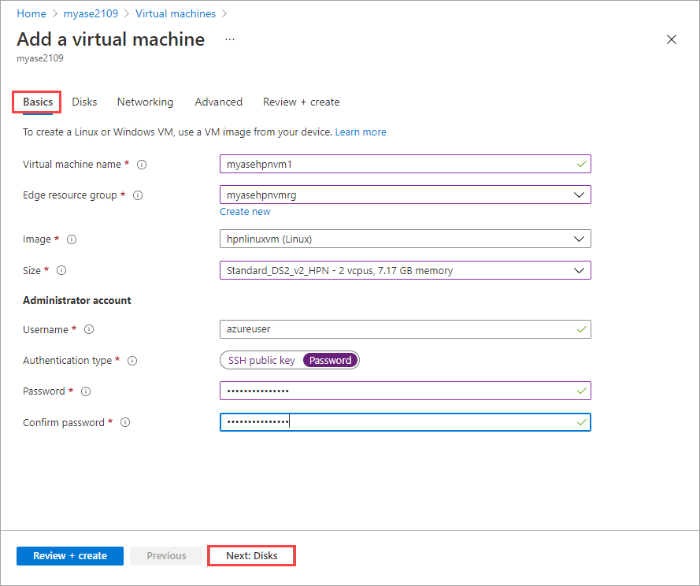
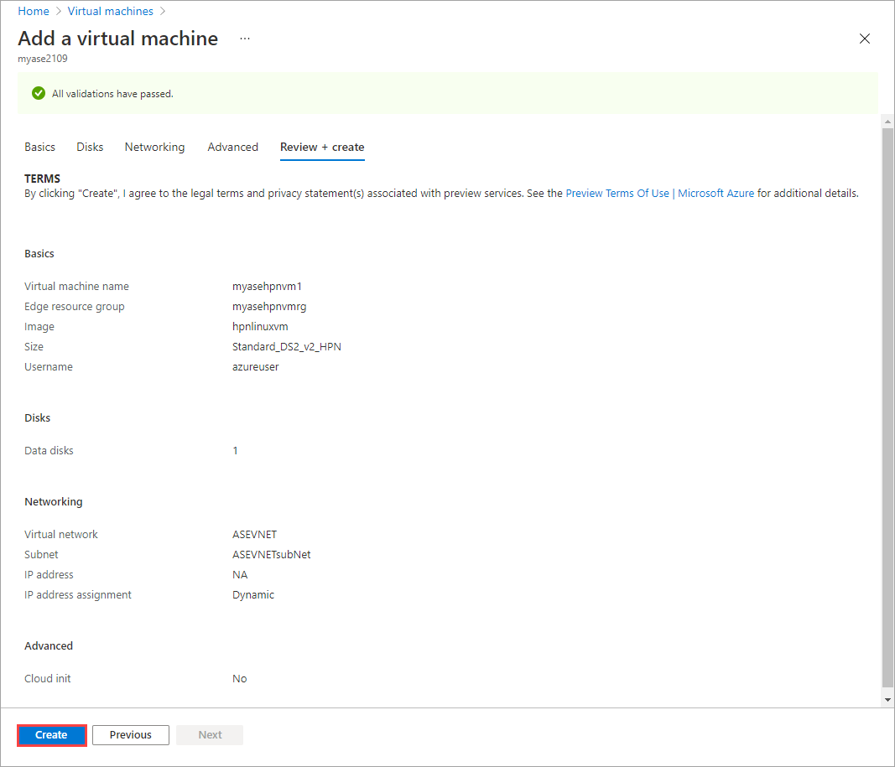
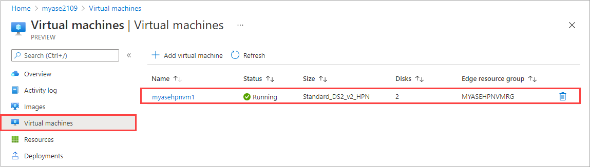
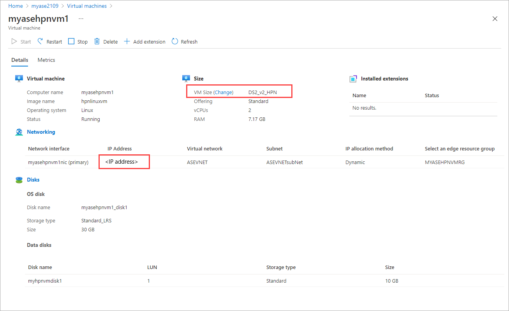

# Deploy high performance network VMs on your Azure Stack Edge Pro GPU device

[!INCLUDE [applies-to-GPU-and-pro-r-and-mini-r-skus](../../includes/azure-stack-edge-applies-to-gpu-pro-r-mini-r-sku.md)]

You can create and manage virtual machines (VMs) on an Azure Stack Edge Pro GPU device by using the Azure portal, templates, and Azure PowerShell cmdlets, and via the Azure CLI or Python scripts. This article describes how to create and manage a high performance network (HPN) VM on your Azure Stack Edge Pro GPU device. 

## About HPN VMs

HPN VMs are specifically designed for 5G and Multi-access Edge Computing (MEC) network functions that require high packet processing rates, low latency, and low jitter.

HPN VMs rely on a non-uniform memory access (NUMA) architecture to increase processing speeds. In a NUMA system, CPUs are arranged in smaller systems called nodes. Each node has a dedicated set of logical processors and memory. An HPN VM can use CPU from only one NUMA node.

On your Azure Stack Edge device, logical processors are distributed on NUMA nodes and high speed network interfaces can be attached to these nodes.

To maximize performance, processing, and transmitting on the same NUMA node, processors are allocated memory that they're closest to in order to reduce physical distance. For more information, see [NUMA Support](/windows/win32/procthread/numa-support).

### vCPU reservations for Azure Stack Edge

To deploy HPN VMs on Azure Stack Edge, you must reserve vCPUs on NUMA nodes. The number of vCPUs reserved determines the available vCPUs that can be assigned to the HPN VMs. 

For the number of cores that each HPN VM size uses, see [Supported HPN VM sizes](azure-stack-edge-gpu-virtual-machine-sizes.md#supported-vm-sizes).

In version 2210, vCPUs are automatically reserved with the maximum number of vCPUs supported on each NUMA node. If vCPUs were already reserved for HPN VMs in an earlier version, the existing reservation is carried forth to the 2210 version. If vCPUs weren't reserved for HPN VMs in an earlier version, upgrading to 2210 will still carry forth the existing configuration.

For versions 2209 and earlier, you must reserve vCPUs on NUMA nodes before you deploy HPN VMs on your device. We recommend NUMA node 0 for vCPU reservations because NUMA node 0 has Mellanox high speed network interfaces.

## HPN VM deployment workflow

The high-level summary of the HPN deployment workflow is as follows:

1. While configuring the network settings on your device, make sure that there's a virtual switch associated with a network interface on your device that can be used for VM resources and VMs. We'll use the default virtual network created with the vswitch for this article. You have the option of creating and using a different virtual network, if desired. 

2. Enable cloud management of VMs from the Azure portal. Download a VHD onto your device, and create a VM image from the VHD.

3. Reserve vCPUs on the device for HPN VMs with versions 2209 and earlier. For version 2210, the vCPUs are automatically reserved.

4. Use the resources created in the previous steps:

   1. The VM image that you created.
   2. The default virtual network associated with the virtual switch. The default virtual network name is the same as the name of the virtual switch.
   3. The default subnet for the default virtual network.

1. And create or specify the following resources: 

   1. Specify a VM name and a supported HPN VM size, and specify sign-in credentials for the VM.
   1. Create new data disks or attach existing data disks. 
   1. Configure a static or dynamic IP for the VM. If you're providing a static IP, specify a free IP in the subnet range of the default virtual network. 

1. Use the preceding resources to create an HPN VM.

## Prerequisites

Before you create and manage VMs on your device via the Azure portal, make sure that:

### [2210](#tab/2210)

- You've configured and activated your Azure Stack Edge Pro GPU device as described in [Tutorial: Activate Azure Stack Edge Pro with GPU](azure-stack-edge-gpu-deploy-activate.md).

  Make sure that you've created a virtual switch. The VMs and the resources for VMs will be using this virtual switch and the associated virtual network. For more information, see [Configure a virtual switch on Azure Stack Edge Pro GPU](azure-stack-edge-gpu-deploy-configure-network-compute-web-proxy.md#configure-virtual-switches).

- You have access to a VM image for the VM you intend to create. To create a VM image, you can [Get an image from Azure Marketplace](azure-stack-edge-gpu-create-virtual-machine-marketplace-image.md).

- In addition to the above prerequisites for VM creation, you'll also need to check the vCPU reservation of HPN VMs.

  - The default vCPU reservation uses the SkuPolicy, which reserves all vCPUs that are available for HPN VMs.  

  - If the vCPUs were already reserved for HPN VMs in an earlier version - for example, in version 2209 or earlier, then the existing reservation is carried forth to the 2210 version. 

  - For most use cases, we recommend that you use the default configuration. If needed, you can also customize the NUMA configuration for HPN VMs. To customize the configuration, use the steps provided for 2209.  

- Use the following steps to get information about the SkuPolicy settings on your device:

   1. [Connect to the PowerShell interface of the device](azure-stack-edge-gpu-connect-powershell-interface.md#connect-to-the-powershell-interface).

  1. Run the following command to see the available NUMA policies on your device:

     ```powershell
     Get-HcsNumaPolicy
     ```
  
     Here's an example output:

     ```powershell
     [DBE-BNVGF33.microsoftdatabox.com]: PS>Get-HcsNumaPolicy

     Get-HcsNumaPolicy
     PolicyType: AllRoot
     HpnLpMapping:
        CPUs: []

     PolicyType: SkuPolicy
     HpnLpMapping:
        CPUs: [4, 5, 6, 7, 8, 9, 10, 11, 12, 13, 14, 15, 16, 17, 18, 19, 20, 21, 22, 23, 28, 29, 30, 31, 32, 33, 34, 35, 36, 37, 38, 39, 40, 41, 42, 43, 44, 45, 46, 47]

     [DBE-BNVGF33.microsoftdatabox.com]: PS>
     ```

  1. Run the following command to get the vCPU reservation information on your device:

     This cmdlet will output:
     1. HpnLpMapping: The NUMA logical processor indexes that are reserved on the machine.
     1. HpnCapableLpMapping: The NUMA logical processor indexes that are capable for reservation.
     1. HpnLpAvailable: The NUMA logical processor indexes that are available for new HPN VM deployments.

       ```powershell
       Get-HcsNumaLpMapping
       ```

       Here's an example output when SkuPolicy is in effect:

       ```powershell
       [DBE-BNVGF33.microsoftdatabox.com]: PS>Get-HcsNumaLpMapping
       Hardware:
        { Numa Node #0 : CPUs [0, 1, 2, 3, 4, 5, 6, 7, 8, 9, 10, 11, 12, 13, 14, 15, 16, 17, 18, 19, 20, 21, 22, 23] }
        { Numa Node #1 : CPUs [24, 25, 26, 27, 28, 29, 30, 31, 32, 33, 34, 35, 36, 37, 38, 39, 40, 41, 42, 43, 44, 45, 46, 47] }

       HpnCapableLpMapping:
        { Numa Node #0 : CPUs [4, 5, 6, 7, 8, 9, 10, 11, 12, 13, 14, 15, 16, 17, 18, 19, 20, 21, 22, 23] }
        { Numa Node #1 : CPUs [28, 29, 30, 31, 32, 33, 34, 35, 36, 37, 38, 39, 40, 41, 42, 43, 44, 45, 46, 47] }

       BNVGF33:
       HpnLpMapping:
        { Numa Node #0 : CPUs [4, 5, 6, 7, 8, 9, 10, 11, 12, 13, 14, 15, 16, 17, 18, 19, 20, 21, 22, 23] }
        { Numa Node #1 : CPUs [28, 29, 30, 31, 32, 33, 34, 35, 36, 37, 38, 39, 40, 41, 42, 43, 44, 45, 46, 47] }

       HpnLpAvailable:
        { Numa Node #0 : CPUs [4, 5, 6, 7, 8, 9, 10, 11, 12, 13, 14, 15, 16, 17, 18, 19, 20, 21, 22, 23] }
        { Numa Node #1 : CPUs [28, 29, 30, 31, 32, 33, 34, 35, 36, 37, 38, 39, 40, 41, 42, 43, 44, 45, 46, 47] }
        ```
     Proceed to the following steps only if you want to change the current reservation, or to create a new reservation.

  1. Run the following command to set a NUMA logical processor mapping on your device. You can use the `-Custom` parameter if you want to specify a custom logical processor set. See the **2209 and earlier** tab in this article for rules when specifying a custom set. 
  
     Running this command stops running VMs, triggers a reboot, and then restarts the VMs.

     ```powershell
     Set-HcsNumaLpMapping -UseSkuPolicy
     ```

     Here's an example output:

     ```powershell
     [DBE-BNVGF33.microsoftdatabox.com]: Set-HcsNumaLpMapping -UseSkuPolicy
     Requested Config already exists. No action needed.

     [DBE-BNVGF33.microsoftdatabox.com]: PS> Set-HcsNumaLpMapping -UseAllRoot
     Requested Configuration requires a reboot...
     Machine will reboot in some time. Please be patient.
     [DBE-BNVGF33.microsoftdatabox.com]: PS>
     ```

  1. Run the following command to validate the vCPU reservation and verify that the VMs have restarted. 

      ```powershell
      Get-HcsNumaLpMapping
      ```
   
### [2209 and earlier](#tab/2209)

- You've completed the network settings on your Azure Stack Edge Pro GPU device as described in [Step 1: Configure an Azure Stack Edge Pro GPU device](./azure-stack-edge-gpu-connect-resource-manager.md#step-1-configure-azure-stack-edge-device).

    1. You've enabled a network interface for compute. This network interface IP is used to create a virtual switch for the VM deployment. In the local UI of your device, go to **Compute**. Select the network interface that you'll use to create a virtual switch.

        > [!IMPORTANT] 
        > You can configure only one port for compute.

    1. Enable compute on the network interface. Azure Stack Edge Pro GPU creates and manages a virtual switch corresponding to that network interface.

-  You have access to a Windows or Linux VHD that you'll use to create the VM image for the VM you intend to create.

In addition to the above prerequisites that are used for VM creation, configure the following prerequisite specifically for the HPN VMs:

- Reserve vCPUs for HPN VMs on the Mellanox interface. Follow these steps:

    1. [Connect to the PowerShell interface of the device](azure-stack-edge-gpu-connect-powershell-interface.md#connect-to-the-powershell-interface).
    1. Identify all the VMs running on your device, including Kubernetes VMs and any VM workloads that you may have deployed.

        ```powershell
        get-vm
        ```
    1. Stop all the running VMs.
    
        ```powershell
        stop-vm -force
        ``` 

    1. Get the `hostname` for your device. This should return a string corresponding to the device hostname.
        ```powershell
        hostname
        ```
    1. Get the logical processor indexes to reserve for HPN VMs. 
    
        ```powershell
        Get-HcsNumaLpMapping -MapType HighPerformanceCapable -NodeName <Output of hostname command> 
        ```
    
       Here's an example output:

       ```powershell
       [dbe-1csphq2.microsoftdatabox.com]: PS>hostname 1CSPHQ2
       [dbe-1csphq2.microsoftdatabox.com]: P> Get-HcsNumaLpMapping -MapType HighPerformanceCapable -NodeName 1CSPHQ2
        { Numa Node #0 : CPUs [4, 5, 6, 7, 8, 9, 10, 11, 12, 13, 14, 15, 16, 17, 18, 19] }
        { Numa Node #1 : CPUs [24, 25, 26, 27, 28, 29, 30, 31, 32, 33, 34, 35, 36, 37, 38, 39] }

       [dbe-1csphq2.microsoftdatabox.com]: PS>
       ```

    1. Reserve vCPUs for HPN VMs. The number of vCPUs reserved here determines the available vCPUs that can be assigned to the HPN VMs. For the number of cores used by each HPN VM size, see [Supported HPN VM sizes](azure-stack-edge-gpu-virtual-machine-sizes.md#supported-vm-sizes). On your device, Mellanox ports 5 and 6 are on NUMA node 0.
           
       ```powershell
       Set-HcsNumaLpMapping -CpusForHighPerfVmsCommaSeperated <Logical indexes from the Get-HcsNumaLpMapping cmdlet> -AssignAllCpusToRoot $false
       ```
       
       Here's an example output: 

       ```powershell
       [dbe-1csphq2.microsoftdatabox.com]: PS>Set-HcsNumaLpMapping -CpusForHighPerfVmsCommaSeperated "4,5,6,7,8,9,10,11,12,13,14,15,16,17,18,19,24,25,26,27,28,29,30,31,32,33,34,35,36,37,38,39" -AssignAllCpusToRoot $false 

       Requested Configuration requires a reboot...

       Machine will reboot in some time. Please be patient.

       [dbe-1csphq2.microsoftdatabox.com]: PS>
       ```

       > [!Note]
       > - You can choose to reserve all the logical indexes from both NUMA nodes shown in the example, or a subset of the indexes. If you choose to reserve a subset of indexes, pick the indexes from the device node that has a Mellanox network interface attached to it, for best performance. For Azure Stack Edge Pro GPU, the NUMA node with Mellanox network interface is #0. 
       > - The list of logical indexes must contain a paired sequence of an odd number and an even number. For example, ((4,5)(6,7)(10,11)). Attempting to set a list of numbers such as `5,6,7` or pairs such as `4,6` will not work. 
       > - Using two `Set-HcsNuma` commands consecutively to assign vCPUs will reset the configuration. Also, do not free the CPUs using the Set-HcsNuma cmdlet if you have deployed an HPN VM.

       > [!NOTE] 
       > Devices that are updated to 2210 from earlier versions will keep their minroot configuration from before upgrade.
        
    8. Wait for the device to finish rebooting. Once the device is running again, open a new PowerShell session. [Connect to the PowerShell interface of the device](azure-stack-edge-gpu-connect-powershell-interface.md#connect-to-the-powershell-interface).
    
   1. Validate the vCPU reservation and verify that the VMs have restarted. 

      ```powershell
      Get-HcsNumaLpMapping
      ```

      The output shouldn't show the indexes you set. If you see the indexes you set in output, the `Set` command didn't complete successfully. In this case, retry the command and, if the problem persists, contact Microsoft Support. 

      Here's an example output. 

      ```powershell
      dbe-1csphq2.microsoftdatabox.com]: PS> Get-HcsNumaLpMapping -MapType MinRootAware -NodeName 1CSPHQ2 

      { Numa Node #0 : CPUs [0, 1, 2, 3] } 

      { Numa Node #1 : CPUs [20, 21, 22, 23] } 

      [dbe-1csphq2.microsoftdatabox.com]: 

      PS> 
      ```

   1. Restart the VMs that you had stopped in the earlier step. 

      ```powershell
      start-vm
      ```
---

## Deploy a VM

Follow these steps to create an HPN VM on your device.

> [!NOTE]
> Azure Stack Edge Pro 1 devices have two NUMA nodes, so you must provision HPN VMs before you provision non-HPN VMs.

1. In the Azure portal of your Azure Stack Edge resource, [Add a VM image](azure-stack-edge-gpu-deploy-virtual-machine-portal.md#add-a-vm-image). You'll use this VM image to create a VM in the next step. You can choose either Gen1 or Gen2 for the VM.

1. Follow all the steps in [Add a VM](azure-stack-edge-gpu-deploy-virtual-machine-portal.md#add-a-vm) with this configuration requirement. 

    On the Basics tab, select a VM size from [DSv2 or F-series supported for HPN](azure-stack-edge-gpu-virtual-machine-sizes.md#supported-vm-sizes).

    

1. Finish the remaining steps in the VM creation. The VM will take approximately 30 minutes to be created. 

    

1. After the VM is successfully created, you'll see your new VM on the **Overview** pane. Select the newly created VM to go to **Virtual machines**.

    

    Select the VM to see the details.

    

    You'll use the IP address for the network interface to connect to the VM.

   > [!NOTE]
   > If the vCPUs are not reserved for HPN VMs prior to the deployment, the deployment will fail with a *FabricVmPlacementErrorInsufficientNumaNodeCapacity* error.

## Next steps

- [Troubleshoot VM deployment](azure-stack-edge-gpu-troubleshoot-virtual-machine-provisioning.md)
- [Monitor VM activity on your device](azure-stack-edge-gpu-monitor-virtual-machine-activity.md)
- [Monitor CPU and memory on a VM](azure-stack-edge-gpu-monitor-virtual-machine-metrics.md)
