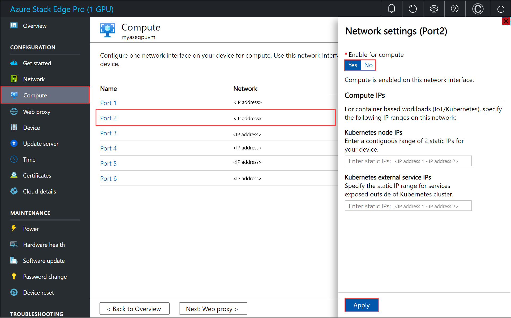

# Install GPU extension on VMs for your Azure Stack Edge Pro GPU device


> [!CAUTION]
> This article references CentOS, a Linux distribution that is nearing End Of Life (EOL) status. Please consider your use and planning accordingly. For more information, see the [CentOS End Of Life guidance](~/articles/virtual-machines/workloads/centos/centos-end-of-life.md).

[!INCLUDE [applies-to-gpu-pro-pro2-and-pro-r-skus](../../includes/azure-stack-edge-applies-to-gpu-pro-pro-2-pro-r-sku.md)]

This article describes how to install GPU driver extension to install appropriate Nvidia drivers on the GPU VMs running on your Azure Stack Edge device. The article covers installation steps for installing a GPU extension using Azure Resource Manager templates on both Windows and Linux VMs.

> [!NOTE]
> - In the Azure portal, you can install a GPU extension during VM creation or after the VM is deployed. For steps and requirements, see [Deploy GPU virtual machines](azure-stack-edge-gpu-deploy-gpu-virtual-machine.md).
> - If you're running a Windows 2016 VHD, you must enable TLS 1.2 inside the VM before you install the GPU extension on 2205 and higher. For detailed steps, see [Troubleshoot GPU extension issues for GPU VMs on Azure Stack Edge Pro GPU](azure-stack-edge-gpu-troubleshoot-virtual-machine-gpu-extension-installation.md#failure-to-install-gpu-extension-on-a-windows-2016-vhd).

## Prerequisites

Before you install GPU extension on the GPU VMs running on your device, make sure that:

1. You have access to an Azure Stack Edge device on which you've deployed one or more GPU VMs. See how to [Deploy a GPU VM on your device](azure-stack-edge-gpu-deploy-gpu-virtual-machine.md).

    - Make sure that the port enabled for compute network on your device is connected to Internet and has access. The GPU drivers are downloaded through the internet access.

        Here's an example where Port 2 was connected to the internet and was used to enable the compute network. If Kubernetes isn't deployed on your environment, you can skip the Kubernetes node IP and external service IP assignment.

        
1. [Download the GPU extension templates and parameters files](https://aka.ms/ase-vm-templates) to your client machine. Unzip it into a directory you’ll use as a working directory.
1. Verify that the client you'll use to access your device is still connected to the Azure Resource Manager over Azure PowerShell. The connection to Azure Resource Manager expires every 1.5 hours or if your Azure Stack Edge device restarts. If this happens, any cmdlets that you execute will return error messages to the effect that you aren't connected to Azure anymore. You'll need to sign in again. For detailed instructions, see [Connect to Azure Resource Manager on your Azure Stack Edge device](azure-stack-edge-gpu-connect-resource-manager.md).

## Edit parameters file

Depending on the operating system for your VM, you could install GPU extension for Windows or for Linux.

### [Windows](#tab/windows)

To deploy Nvidia GPU drivers for an existing VM, edit the `addGPUExtWindowsVM.parameters.json` parameters file and then deploy the template `addGPUextensiontoVM.json`.

#### Version 2205 and higher

The file `addGPUExtWindowsVM.parameters.json` takes the following parameters:

```json
"parameters": {
	"vmName": {
	"value": "<name of the VM>"
	},
	"extensionName": {
	"value": "<name for the extension. Example: windowsGpu>"
	},
	"publisher": {
	"value": "Microsoft.HpcCompute"
	},
	"type": {
	"value": "NvidiaGpuDriverWindows"
	},
	"typeHandlerVersion": {
	"value": "1.5"
	},
	"settings": {
	"value": {
	"DriverURL" : "http://us.download.nvidia.com/tesla/511.65/511.65-data-center-tesla-desktop-winserver-2016-2019-2022-dch-international.exe",
	"DriverCertificateUrl" : "https://go.microsoft.com/fwlink/?linkid=871664",
	"DriverType":"CUDA"
	}
	}
	}
```

#### Versions lower than 2205

The file `addGPUExtWindowsVM.parameters.json` takes the following parameters:

```json
"parameters": {
	"vmName": {
	"value": "<name of the VM>"
	},
	"extensionName": {
	"value": "<name for the extension. Example: windowsGpu>"
	},
	"publisher": {
	"value": "Microsoft.HpcCompute"
	},
	"type": {
	"value": "NvidiaGpuDriverWindows"
	},
	"typeHandlerVersion": {
	"value": "1.3"
	},
	"settings": {
	"value": {
	"DriverURL" : "http://us.download.nvidia.com/tesla/442.50/442.50-tesla-desktop-winserver-2019-2016-international.exe",
	"DriverCertificateUrl" : "https://go.microsoft.com/fwlink/?linkid=871664",
	"DriverType":"CUDA"
	}
	}
	}
```

### [Linux](#tab/linux)

To deploy Nvidia GPU drivers for an existing Linux VM, edit the `addGPUExtWindowsVM.parameters.json` parameters file and then deploy the template `addGPUextensiontoVM.json`.

#### Version 2205 and higher

If using Ubuntu or Red Hat Enterprise Linux (RHEL), the `addGPUExtLinuxVM.parameters.json` file takes the following parameters:

```powershell
"parameters": {
	"vmName": {
	"value": "<name of the VM>"
	},
	"extensionName": {
	"value": "<name for the extension. Example: linuxGpu>"
	},
	"publisher": {
	"value": "Microsoft.HpcCompute"
	},
	"type": {
	"value": "NvidiaGpuDriverLinux"
	},
	"typeHandlerVersion": {
	"value": "1.8"
	},
	"settings": {
	}
	}
	}
```

#### Versions lower than 2205

If using Ubuntu or Red Hat Enterprise Linux (RHEL), the `addGPUExtLinuxVM.parameters.json` file takes the following parameters:

```powershell
"parameters": {
	"vmName": {
	"value": "<name of the VM>"
	},
	"extensionName": {
	"value": "<name for the extension. Example: linuxGpu>"
	},
	"publisher": {
	"value": "Microsoft.HpcCompute"
	},
	"type": {
	"value": "NvidiaGpuDriverLinux"
	},
	"typeHandlerVersion": {
	"value": "1.3"
	},
	"settings": {
	}
	}
	}
```

Here's a sample Ubuntu parameter file that was used in this article:

```powershell
{
    "$schema": "https://schema.management.azure.com/schemas/2019-04-01/deploymentParameters.json#",
    "contentVersion": "1.0.0.0",
    "parameters": {
        "vmName": {
            "value": "VM1"
        },
        "extensionName": {
            "value": "gpuLinux"
        },
        "publisher": {
            "value": "Microsoft.HpcCompute"
        },
        "type": {
            "value": "NvidiaGpuDriverLinux"
        },
        "typeHandlerVersion": {
            "value": "1.3"
        },
        "settings": {
        }
    }
}
```

### GPU VMs from RHEL BYOS images

If you created your VM using a Red Hat Enterprise Linux Bring Your Own Subscription image (RHEL BYOS), make sure that:

- You've followed the steps in [using RHEL BYOS image](azure-stack-edge-gpu-create-virtual-machine-image.md).
- After you created the GPU VM, register and subscribe the VM with the Red Hat Customer portal. If your VM isn't properly registered, installation doesn't proceed as the VM isn't entitled. See [Register and automatically subscribe in one step using the Red Hat Subscription Manager](https://access.redhat.com/solutions/253273). This step allows the installation script to download relevant packages for the GPU driver.
- You either manually install the `vulkan-filesystem` package or add CentOS7 repo to your yum repo list. When you install the GPU extension, the installation script looks for a `vulkan-filesystem` package that is on CentOS7 repo (for RHEL7).

---

## Deploy template

### [Windows](#tab/windows)

Deploy the template `addGPUextensiontoVM.json` to install the extension on an existing VM.

Run the following command:

```powershell
$templateFile = "<Path to addGPUextensiontoVM.json>"
$templateParameterFile = "<Path to addGPUExtWindowsVM.parameters.json>"
RGName = "<Name of your resource group>"
New-AzureRmResourceGroupDeployment -ResourceGroupName $RGName -TemplateFile $templateFile -TemplateParameterFile $templateParameterFile -Name "<Name for your deployment>"
```

> [!NOTE]
> The extension deployment is a long running job and takes about 10 minutes to complete.

Here's a sample output:

   ```powershell
   PS C:\WINDOWS\system32> "C:\12-09-2020\ExtensionTemplates\addGPUextensiontoVM.json"
   C:\12-09-2020\ExtensionTemplates\addGPUextensiontoVM.json
   PS C:\WINDOWS\system32> $templateFile = "C:\12-09-2020\ExtensionTemplates\addGPUextensiontoVM.json"
   PS C:\WINDOWS\system32> $templateParameterFile = "C:\12-09-2020\ExtensionTemplates\addGPUExtWindowsVM.parameters.json"
   PS C:\WINDOWS\system32> $RGName = "myasegpuvm1"
   PS C:\WINDOWS\system32> New-AzureRmResourceGroupDeployment -ResourceGroupName $RGName -TemplateFile $templateFile -TemplateParameterFile $templateParameterFile -Name "deployment3"

   DeploymentName          : deployment3
   ResourceGroupName       : myasegpuvm1
   ProvisioningState       : Succeeded
   Timestamp               : 12/16/2020 12:18:50 AM
   Mode                    : Incremental
   TemplateLink            :
   Parameters              :
                          Name             Type                       Value
                          ===============  =========================  ==========
                          vmName           String                     VM2
                          extensionName    String                     windowsgpuext
                          publisher        String                     Microsoft.HpcCompute
                          type             String                     NvidiaGpuDriverWindows
                          typeHandlerVersion  String                     1.3
                          settings         Object                     {
                            "DriverURL": "http://us.download.nvidia.com/tesla/442.50/442.50-tesla-desktop-winserver-2019-2016-international.exe",
                            "DriverCertificateUrl": "https://go.microsoft.com/fwlink/?linkid=871664",
                            "DriverType": "CUDA"
                          }

   Outputs                 :
   DeploymentDebugLogLevel :
   PS C:\WINDOWS\system32>
   ```

### [Linux](#tab/linux)

Deploy the template `addGPUextensiontoVM.json` to install the extension to an existing VM.

Run the following command:

```powershell
$templateFile = "Path to addGPUextensiontoVM.json"
$templateParameterFile = "Path to addGPUExtLinuxVM.parameters.json"
$RGName = "<Name of your resource group>"
New-AzureRmResourceGroupDeployment -ResourceGroupName $RGName -TemplateFile $templateFile -TemplateParameterFile $templateParameterFile -Name "<Name for your deployment>"
```

> [!NOTE]
> The extension deployment is a long running job and takes about 10 minutes to complete.

Here's a sample output:

```powershell
Copyright (C) Microsoft Corporation. All rights reserved.
Try the new cross-platform PowerShell https://aka.ms/pscore6

PS C:\WINDOWS\system32> $templateFile = "C:\12-09-2020\ExtensionTemplates\addGPUextensiontoVM.json"
PS C:\WINDOWS\system32> $templateParameterFile = "C:\12-09-2020\ExtensionTemplates\addGPUExtLinuxVM.parameters.json"
PS C:\WINDOWS\system32> $RGName = "rg2"
PS C:\WINDOWS\system32> New-AzureRmResourceGroupDeployment -ResourceGroupName $RGName -TemplateFile $templateFile -TemplateParameterFile $templateParameterFile -Name "delpoyment7"

DeploymentName          : delpoyment7
ResourceGroupName       : rg2
ProvisioningState       : Succeeded
Timestamp               : 12/10/2020 10:43:23 PM
Mode                    : Incremental
TemplateLink            :
Parameters              :
                          Name             Type                       Value
                          ===============  =========================  ==========
                          vmName           String                     VM1
                          extensionName    String                     gpuLinux
                          publisher        String                     Microsoft.HpcCompute
                          type             String                     NvidiaGpuDriverLinux
                          typeHandlerVersion  String                     1.3
                          settings         Object                     {
                            "DRIVER_URL": "https://go.microsoft.com/fwlink/?linkid=874271",
                            "PUBKEY_URL":
                          "http://download.microsoft.com/download/F/F/A/FFAC979D-AD9C-4684-A6CE-C92BB9372A3B/7fa2af80.pub",
                            "CUDA_ver": "10.0.130",
                            "InstallCUDA": "true"
                          }

Outputs                 :
DeploymentDebugLogLevel :
PS C:\WINDOWS\system32>
```

---

## Track deployment

### [Windows](#tab/windows)

To check the deployment state of extensions for a given VM, open another PowerShell session (run as administrator), and then run the following command:

```powershell
Get-AzureRmVMExtension -ResourceGroupName <Name of resource group> -VMName <Name of VM> -Name <Name of the extension>
```

Here's a sample output:

```powershell
PS C:\WINDOWS\system32> Get-AzureRmVMExtension -ResourceGroupName myasegpuvm1 -VMName VM2 -Name windowsgpuext

ResourceGroupName       : myasegpuvm1
VMName                  : VM2
Name                    : windowsgpuext
Location                : dbelocal
Etag                    : null
Publisher               : Microsoft.HpcCompute
ExtensionType           : NvidiaGpuDriverWindows
TypeHandlerVersion      : 1.3
Id                      : /subscriptions/947b3cfd-7a1b-4a90-7cc5-e52caf221332/resourceGroups/myasegpuvm1/providers/Microsoft.Compute/virtualMachines/VM2/extensions/windowsgpuext
PublicSettings          : {
                            "DriverURL": "http://us.download.nvidia.com/tesla/442.50/442.50-tesla-desktop-winserver-2019-2016-international.exe",
                            "DriverCertificateUrl": "https://go.microsoft.com/fwlink/?linkid=871664",
                            "DriverType": "CUDA"
                          }
ProtectedSettings       :
ProvisioningState       : Creating
Statuses                :
SubStatuses             :
AutoUpgradeMinorVersion : True
ForceUpdateTag          :

PS C:\WINDOWS\system32>
```

Extension execution output is logged to the following file. Refer to this file `C:\Packages\Plugins\Microsoft.HpcCompute.NvidiaGpuDriverWindows\1.3.0.0\Status` to track the status of installation.


A successful install is indicated by a `message` as `Enable Extension` and `status` as `success`.

```powershell
"status":  {
                       "formattedMessage":  {
                                                "message":  "Enable Extension",
                                                "lang":  "en"
                                            },
                       "name":  "NvidiaGpuDriverWindows",
                       "status":  "success",
```

### [Linux](#tab/linux)

To check the deployment state of extensions for a given VM, open another PowerShell session (run as administrator), and then run the following command:

```powershell
Get-AzureRmVMExtension -ResourceGroupName myResourceGroup -VMName <VM Name> -Name <Extension Name>
```

Here's a sample output:

```powershell
Copyright (C) Microsoft Corporation. All rights reserved.
Try the new cross-platform PowerShell https://aka.ms/pscore6

PS C:\WINDOWS\system32> Get-AzureRmVMExtension -ResourceGroupName rg2 -VMName VM1 -Name gpulinux

ResourceGroupName       : rg2
VMName                  : VM1
Name                    : gpuLinux
Location                : dbelocal
Etag                    : null
Publisher               : Microsoft.HpcCompute
ExtensionType           : NvidiaGpuDriverLinux
TypeHandlerVersion      : 1.3
Id                      : /subscriptions/947b3cfd-7a1b-4a90-7cc5-e52caf221332/resourceGroups/rg2/providers/Microsoft.Compute/virtualMachines/VM1/extensions/gpuLinux
PublicSettings          : {
                            "DRIVER_URL": "https://go.microsoft.com/fwlink/?linkid=874271",
                            "PUBKEY_URL": "http://download.microsoft.com/download/F/F/A/FFAC979D-AD9C-4684-A6CE-C92BB9372A3B/7fa2af80.pub",
                            "CUDA_ver": "10.0.130",
                            "InstallCUDA": "true"
                          }
ProtectedSettings       :
ProvisioningState       : Creating
Statuses                :
SubStatuses             :
AutoUpgradeMinorVersion : True
ForceUpdateTag          :

PS C:\WINDOWS\system32>
```

> [!NOTE]
> When the deployment is complete, the `ProvisioningState` changes to `Succeeded`.

The extension execution output is logged to the following file: `/var/log/azure/nvidia-vmext-status`.

---

## Verify driver installation

### [Windows](#tab/windows)

Sign in to the VM and run the nvidia-smi command-line utility installed with the driver.

#### Version 2205 and higher

The `nvidia-smi.exe` is located at  `C:\Windows\System32\nvidia-smi.exe`. If you don't see the file, it's possible that the driver installation is still running in the background. Wait for 10 minutes and check again.

#### Versions lower than 2205

The `nvidia-smi.exe` is located at  `C:\Program Files\NVIDIA Corporation\NVSMI\nvidia-smi.exe`. If you don't see the file, it's possible that the driver installation is still running in the background. Wait for 10 minutes and check again.

If the driver is installed, you see an output similar to the following sample:

```powershell
PS C:\Users\Administrator> cd "C:\Program Files\NVIDIA Corporation\NVSMI"
PS C:\Program Files\NVIDIA Corporation\NVSMI> ls

    Directory: C:\Program Files\NVIDIA Corporation\NVSMI

Mode                LastWriteTime         Length Name
----                -------------         ------ ----
-a----        2/26/2020  12:00 PM         849640 MCU.exe
-a----        2/26/2020  12:00 PM         443104 nvdebugdump.exe
-a----        2/25/2020   2:06 AM          81823 nvidia-smi.1.pdf
-a----        2/26/2020  12:01 PM         566880 nvidia-smi.exe
-a----        2/26/2020  12:01 PM         991344 nvml.dll

PS C:\Program Files\NVIDIA Corporation\NVSMI> .\nvidia-smi.exe
Wed Dec 16 00:35:51 2020
+-----------------------------------------------------------------------------+
| NVIDIA-SMI 442.50       Driver Version: 442.50       CUDA Version: 10.2     |
|-------------------------------+----------------------+----------------------+
| GPU  Name            TCC/WDDM | Bus-Id        Disp.A | Volatile Uncorr. ECC |
| Fan  Temp  Perf  Pwr:Usage/Cap|         Memory-Usage | GPU-Util  Compute M. |
|===============================+======================+======================|
|   0  Tesla T4            TCC  | 0000503C:00:00.0 Off |                    0 |
| N/A   35C    P8    11W /  70W |      8MiB / 15205MiB |      0%      Default |
+-------------------------------+----------------------+----------------------+

+-----------------------------------------------------------------------------+
| Processes:                                                       GPU Memory |
|  GPU       PID   Type   Process name                             Usage      |
|=============================================================================|
|  No running processes found                                                 |
+-----------------------------------------------------------------------------+
PS C:\Program Files\NVIDIA Corporation\NVSMI>
```

For more information, see [Nvidia GPU driver extension for Windows](../virtual-machines/extensions/hpccompute-gpu-windows.md).

> [!NOTE]
> After you finish installing the GPU driver and GPU extension, you no longer need to use a port with Internet access for compute.

### [Linux](#tab/linux)

Follow these steps to verify the driver installation:

1. Connect to the GPU VM. Follow the instructions in [Connect to a Linux VM](azure-stack-edge-gpu-deploy-virtual-machine-powershell.md#connect-to-a-linux-vm).

    Here's a sample output:

    ```powershell
    PS C:\WINDOWS\system32> ssh -l Administrator 10.57.50.60
    Administrator@10.57.50.60's password:
    Welcome to Ubuntu 18.04.4 LTS (GNU/Linux 5.0.0-1031-azure x86_64)
     * Documentation:  https://help.ubuntu.com
     * Management:     https://landscape.canonical.com
     * Support:        https://ubuntu.com/advantage
      System information as of Thu Dec 10 22:57:01 UTC 2020

      System load:  0.0                Processes:           133
      Usage of /:   24.8% of 28.90GB   Users logged in:     0
      Memory usage: 2%                 IP address for eth0: 10.57.50.60
      Swap usage:   0%

    249 packages can be updated.
    140 updates are security updates.

    Welcome to Ubuntu 18.04.4 LTS (GNU/Linux 5.0.0-1031-azure x86_64)
     * Documentation:  https://help.ubuntu.com
     * Management:     https://landscape.canonical.com
     * Support:        https://ubuntu.com/advantage
      System information as of Thu Dec 10 22:57:01 UTC 2020
      System load:  0.0                Processes:           133
      Usage of /:   24.8% of 28.90GB   Users logged in:     0
      Memory usage: 2%                 IP address for eth0: 10.57.50.60
      Swap usage:   0%

    249 packages can be updated.
    140 updates are security updates.

    New release '20.04.1 LTS' available.
    Run 'do-release-upgrade' to upgrade to it.

    *** System restart required ***
    Last login: Thu Dec 10 21:49:29 2020 from 10.90.24.23
    To run a command as administrator (user "root"), use "sudo <command>".
    See "man sudo_root" for details.

    Administrator@VM1:~$
    ```

2. Run the nvidia-smi command-line utility installed with the driver. If the driver is successfully installed, you'll be able to run the utility and see the following output:

    ```powershell
    Administrator@VM1:~$ nvidia-smi
    Thu Dec 10 22:58:46 2020
    +-----------------------------------------------------------------------------+
    | NVIDIA-SMI 455.45.01    Driver Version: 455.45.01    CUDA Version: 11.1     |
    |-------------------------------+----------------------+----------------------+
    | GPU  Name        Persistence-M| Bus-Id        Disp.A | Volatile Uncorr. ECC |
    | Fan  Temp  Perf  Pwr:Usage/Cap|         Memory-Usage | GPU-Util  Compute M. |
    |                               |                      |               MIG M. |
    |===============================+======================+======================|
    |   0  Tesla T4            Off  | 0000941F:00:00.0 Off |                    0 |
    | N/A   48C    P0    27W /  70W |      0MiB / 15109MiB |      5%      Default |
    |                               |                      |                  N/A |
    +-------------------------------+----------------------+----------------------+

    +-----------------------------------------------------------------------------+
    | Processes:                                                                  |
    |  GPU   GI   CI        PID   Type   Process name                  GPU Memory |
    |        ID   ID                                                   Usage      |
    |=============================================================================|
    |  No running processes found                                                 |
    +-----------------------------------------------------------------------------+
    Administrator@VM1:~$
    ```

For more information, see [Nvidia GPU driver extension for Linux](../virtual-machines/extensions/hpccompute-gpu-linux.md).

> [!NOTE]
> After you finish installing the GPU driver and GPU extension, you no longer need to use a port with Internet access for compute.

---

## Remove GPU extension

To remove the GPU extension, use the following command:

`Remove-AzureRmVMExtension -ResourceGroupName <Resource group name> -VMName <VM name> -Name <Extension name>`

Here's a sample output:

```powershell
PS C:\azure-stack-edge-deploy-vms> Remove-AzureRmVMExtension -ResourceGroupName rgl -VMName WindowsVM -Name windowsgpuext
Virtual machine extension removal operation
This cmdlet will remove the specified virtual machine extension. Do you want to continue? [Y] Yes [N] No [S] Suspend [?] Help (default is "Y"): y
Requestld IsSuccessStatusCode StatusCode ReasonPhrase
--------- ------------------- ---------- ------------
          True                OK         OK
```

## Next steps

Learn how to:

- [Troubleshoot GPU extension issues](azure-stack-edge-gpu-troubleshoot-virtual-machine-gpu-extension-installation.md).
- [Monitor VM activity on your device](azure-stack-edge-gpu-monitor-virtual-machine-activity.md).
- [Manage VM disks](azure-stack-edge-gpu-manage-virtual-machine-disks-portal.md).
- [Manage VM network interfaces](azure-stack-edge-gpu-manage-virtual-machine-network-interfaces-portal.md).
- [Manage VM sizes](azure-stack-edge-gpu-manage-virtual-machine-resize-portal.md).
