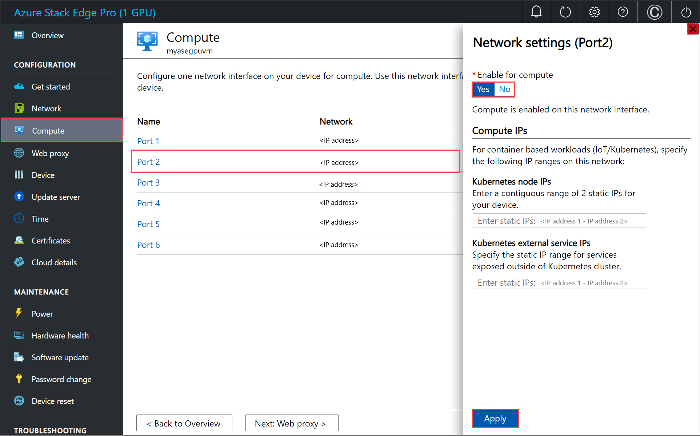

# Install the password reset extension on VMs for your Azure Stack Edge Pro GPU device

[!INCLUDE [applies-to-GPU-and-pro-2-skus](../../includes/azure-stack-edge-applies-to-gpu-pro-2-sku.md)]

This article describes how to install the password reset extension on a VM that is running on your Azure Stack Edge device. The article covers steps to install the password reset extension using Azure Resource Manager templates on both Windows and Linux VMs. The article also details how to deploy, verify, and then remove the extension.

## Prerequisites

Before you install the password reset extension on the VMs running on your device:

1. Make sure to have access to an Azure Stack Edge device on which you've deployed one or more VMs. For more information, see [Deploy VMs on your Azure Stack Edge Pro GPU device via the Azure portal](azure-stack-edge-gpu-deploy-gpu-virtual-machine-portal.md).

    Here is an example where Port 2 was used to enable the compute network. If Kubernetes is not deployed on your environment, you can skip the Kubernetes node IP and external service IP assignment.

    

1. [Download the templates](https://aka.ms/ase-vm-templates) to your client machine. Unzip the files into a directory you’ll use as a working directory.
1. Verify that the client you'll use to access your device is connected to the local Azure Resource Manager over Azure PowerShell. For detailed instructions, see [Connect to Azure Resource Manager on your Azure Stack Edge device](azure-stack-edge-gpu-connect-resource-manager.md).

    The connection to Azure Resource Manager expires every 1.5 hours or if your Azure Stack Edge device restarts. If this happens, any cmdlets that you execute will return error messages to the effect that you are not connected to Azure. In this case, sign in again.

## Edit parameters file

Depending on the operating system for your VM, you can install the extension for Windows or for Linux.


### [Windows](#tab/windows)

To change the password for an existing VM, edit the `addPasswordResetExtensionTemplate.parameters.json` parameters file and then deploy the template `addPasswordResetExtensionTemplate.json`.

The file `addPasswordResetExtensionTemplate.parameters.json` takes the following parameters:

```json
{ 
  "$schema": "https://schema.management.azure.com/schemas/2015-01-01/deploymentParameters.json#", 
  "contentVersion": "1.0.0.0", 
  "parameters": { 
      "vmName": { 
          "value": "<Name of the VM>" 
      }, 
      "extensionType": { 
          "value": "<OS type of the VM, for example, Linux or Windows>" 
      }, 
      "username": { 
          "value": "<Existing username for connecting to your VM>" 
      }, 
      "Password": { 
          "value": "<New password for the user>" 
      } 
  } 
} 
```

### [Linux](#tab/linux)

To change the password for an existing VM, edit the `addPasswordResetExtensionTemplate.parameters.json` parameters file and then deploy the template `addPasswordResetExtensionTemplate.json`.

The file `addPasswordResetExtensionTemplate.parameters.json` takes the following parameters:

```json
{ 
  "$schema": "https://schema.management.azure.com/schemas/2015-01-01/deploymentParameters.json#", 
  "contentVersion": "1.0.0.0", 
  "parameters": { 
      "vmName": { 
          "value": "<Name of the VM>" 
      }, 
      "extensionType": { 
          "value": "<OS type of the VM, for example, Linux or Windows>" 
      }, 
      "username": { 
          "value": "<Existing username for connecting to your VM>" 
      }, 
      "Password": { 
          "value": "<New password for the user>" 
      } 
  } 
}
```

## Deploy template

### [Windows](#tab/windows)

Deploy the the template `addPasswordResetExtensionTemplate.json`. This template deploys the extension to an existing VM. Run the following command:

```powershell
PS C:\WINDOWS\system32> $templateFile = "C:\PasswordResetVmExtensionTemplates\addPasswordResetExtensionTemplate.json" 
PS C:\WINDOWS\system32> $templateParameterFile = "C:\PasswordResetVmExtensionTemplates\addPasswordResetExtensionTemplate.parameters.json" 
PS C:\WINDOWS\system32> $RGName = "myasepro2rg" 
PS C:\WINDOWS\system32> New-AzResourceGroupDeployment -ResourceGroupName $RGName -TemplateFile $templateFile -TemplateParameterFile $templateParameterFile -Name "windowsvmdeploy" -AsJob
```

Here is sample output:
```powershell
  
Id     Name            PSJobTypeName   State         HasMoreData     Location             Command 
--     ----            -------------   -----         -----------     --------             ------- 
9      Long Running... AzureLongRun... Running       True            localhost            New-AzResourceGro... 

PS C:\WINDOWS\system32>
```

### [Linux](#tab/linux)

Deploy the template `addPasswordResetExtensionTemplate.json`. This template deploys extension to an existing VM. Run the following command:

```powershell
PS C:\WINDOWS\system32> $templateFile = "C:\PasswordResetVmExtensionTemplates\addPasswordResetExtensionTemplate.json" 
PS C:\WINDOWS\system32> $templateParameterFile = "C:\PasswordResetVmExtensionTemplates\addPasswordResetExtensionTemplate.parameters.json" 
PS C:\WINDOWS\system32> $RGName = "myasepro2rg" 
PS C:\WINDOWS\system32> New-AzResourceGroupDeployment -ResourceGroupName $RGName -TemplateFile $templateFile -TemplateParameterFile $templateParameterFile -Name "myvmdeployext" -AsJob
```
 
Here is sample output:
```powershell
Id     Name            PSJobTypeName   State         HasMoreData     Location             Command 
--     ----            -------------   -----         -----------     --------             ------- 
4      Long Running... AzureLongRun... Running       True            localhost            New-AzResourceGroupDep... 
```

## Track deployment

### [Windows](#tab/windows)

To check the deployment status of extensions for a given VM, run the following command:

```powershell
PS C:\WINDOWS\system32> Get-AzVMExtension -ResourceGroupName myasepro2rg -VMName mywindowsvm -Name windowsVMAccessExt 

ResourceGroupName       : myasepro2rg 
VMName                  : mywindowsvm 
Name                    : windowsVMAccessExt 
Location                : dbelocal 
Etag                    : null 
Publisher               : Microsoft.Compute 
ExtensionType           : VMAccessAgent 
TypeHandlerVersion      : 2.4 
Id                      : /subscriptions/04a485ed-7a09-44ab-6671-66db7f111122/resourceGroups/myasepro2rg/provi 
                          ders/Microsoft.Compute/virtualMachines/mywindowsvm/extensions/windowsVMAccessExt 
PublicSettings          : { 
                            "username": "azureuser" 
                          } 
ProtectedSettings       : 
ProvisioningState       : Creating 
Statuses                : 
SubStatuses             : 
AutoUpgradeMinorVersion : True 
ForceUpdateTag          : 
  
PS C:\WINDOWS\system32> 
  
PS C:\WINDOWS\system32> Get-AzVMExtension -ResourceGroupName myasepro2rg -VMName mywindowsvm -Name windowsVMAccessExt 
 
ResourceGroupName       : myasepro2rg 
VMName                  : mywindowsvm 
Name                    : windowsVMAccessExt 
Location                : dbelocal 
Etag                    : null 
Publisher               : Microsoft.Compute 
ExtensionType           : VMAccessAgent 
TypeHandlerVersion      : 2.4 
Id                      : /subscriptions/04a485ed-7a09-44ab-6671-66db7f111122/resourceGroups/myasepro2rg/provi 
                          ders/Microsoft.Compute/virtualMachines/mywindowsvm/extensions/windowsVMAccessExt 
PublicSettings          : { 
                            "username": "azureuser" 
                          } 
ProtectedSettings       : 
ProvisioningState       : Succeeded 
Statuses                : 
SubStatuses             : 
AutoUpgradeMinorVersion : True 
ForceUpdateTag          : 
  
PS C:\WINDOWS\system32>
```

### [Linux](#tab/linux)

To check the deployment status of extensions for a given VM, run the following command:

```powershell
PS C:\WINDOWS\system32> Get-AzVMExtension -ResourceGroupName myasepro2rg -VMName mylinuxvm5 -Name linuxVMAccessExt 

ResourceGroupName       : myasepro2rg 
VMName                  : mylinuxvm5 
Name                    : linuxVMAccessExt 
Location                : dbelocal 
Etag                    : null 
Publisher               : Microsoft.OSTCExtensions 
ExtensionType           : VMAccessForLinux 
TypeHandlerVersion      : 1.5 
Id                      : /subscriptions/04a485ed-7a09-44ab-6671-66db7f111122/resourceGroups 
                          /myasepro2rg/providers/Microsoft.Compute/virtualMachines/mylinuxvm 
                          5/extensions/linuxVMAccessExt 
PublicSettings          : {} 
ProtectedSettings       : 
ProvisioningState       : Creating 
Statuses                : 
SubStatuses             : 
AutoUpgradeMinorVersion : True 
ForceUpdateTag          : 
  
PS C:\WINDOWS\system32> Get-AzVMExtension -ResourceGroupName myasepro2rg -VMName mylinuxvm5 -Name linuxVMAccessExt 

ResourceGroupName       : myasepro2rg 
VMName                  : mylinuxvm5 
Name                    : linuxVMAccessExt 
Location                : dbelocal 
Etag                    : null 
Publisher               : Microsoft.OSTCExtensions 
ExtensionType           : VMAccessForLinux 
TypeHandlerVersion      : 1.5 
Id                      : /subscriptions/04a485ed-7a09-44ab-6671-66db7f111122/resourceGroups 
                          /myasepro2rg/providers/Microsoft.Compute/virtualMachines/mylinuxvm 
                          5/extensions/linuxVMAccessExt 
PublicSettings          : {} 
ProtectedSettings       : 
ProvisioningState       : Succeeded 
Statuses                : 
SubStatuses             : 
AutoUpgradeMinorVersion : True 
ForceUpdateTag          : 

  
PS C:\WINDOWS\system32> 
```

## Verify the updated VM password

### [Windows](#tab/windows)

To verify the VM password update, connect to the VM using the new password.

If authentication fails...

### [Linux](#tab/linux)

To verify the VM password update, connect to the VM using the new password.

You should be able to connect to the VM with the new password. Open a cmd window and connect to the Linux VM. Here is sample output:

```powershell
  
Microsoft Windows [Version 10.0.22000.556] 
(c) Microsoft Corporation. All rights reserved. 
  
C:\WINDOWS\system32>ssh -l azureuser 10.57.51.13 
azureuser@10.57.51.13's password: 
Welcome to Ubuntu 18.04.3 LTS (GNU/Linux 5.0.0-1027-azure x86_64) 
  
* Documentation:  https://help.ubuntu.com 
* Management:     https://landscape.canonical.com 
* Support:        https://ubuntu.com/advantage 
  
  System information as of Wed Mar 30 21:22:24 UTC 2022 
  
  System load:  1.06              Processes:           113 
  Usage of /:   5.4% of 28.90GB   Users logged in:     0 
  Memory usage: 14%               IP address for eth0: 10.57.51.13 
  Swap usage:   0% 
  
* Super-optimized for small spaces - read how we shrank the memory 
   footprint of MicroK8s to make it the smallest full K8s around. 
  
   https://ubuntu.com/blog/microk8s-memory-optimisation 
  
230 packages can be updated. 
160 updates are security updates. 
  
New release '20.04.4 LTS' available. 
Run 'do-release-upgrade' to upgrade to it. 
  
*** System restart required *** 
Last login: Wed Mar 30 21:16:52 2022 from 10.191.227.85 
To run a command as administrator (user "root"), use "sudo <command>". 
See "man sudo_root" for details. 
  
azureuser@mylinuxvm5:~$ 

```

If authentication fails...

## Remove the extension

### [Windows](#tab/windows)

To remove the password reset extension, use the following command:

```powershell
PS C:\WINDOWS\system32> Remove-AzVMExtension -ResourceGroupName <ResourceGroupName> -VMName <VMName> -Name windowsVMAccessExt 
  
Virtual machine extension removal operation 
This cmdlet will remove the specified virtual machine extension. Do you want to continue? 
[Y] Yes  [N] No  [S] Suspend  [?] Help (default is "Y"): Y 
  
RequestId IsSuccessStatusCode StatusCode ReasonPhrase 
--------- ------------------- ---------- ------------ 
                         True         OK OK 
  
  
PS C:\WINDOWS\system32> 
```

### [Linux](#tab/linux)

To remove the password reset extension, use the following command:

```powershell  
Remove-AzVMExtension -ResourceGroupName <Resource group name> -VMName <VM name> -Name <Extension name> 
  
  
PS C:\WINDOWS\system32> Remove-AzVMExtension -ResourceGroupName myasepro2rg -VMName mylinuxvm5 -Name linuxVMAccessExt 
  
Virtual machine extension removal operation 
This cmdlet will remove the specified virtual machine extension. Do you want to continue? 
[Y] Yes  [N] No  [S] Suspend  [?] Help (default is "Y"): Yes 
  
RequestId IsSuccessStatusCode StatusCode ReasonPhrase 
--------- ------------------- ---------- ------------ 
                         True         OK OK 
  
PS C:\WINDOWS\system32>
```

## Next steps

Learn how to:

- [Troubleshoot GPU extension issues](azure-stack-edge-gpu-troubleshoot-virtual-machine-gpu-extension-installation.md)
- [Monitor VM activity on your device](azure-stack-edge-gpu-monitor-virtual-machine-activity.md)
- [Manage VM disks](azure-stack-edge-gpu-manage-virtual-machine-disks-portal.md)
- [Manage VM network interfaces](azure-stack-edge-gpu-manage-virtual-machine-network-interfaces-portal.md)
- [Manage VM sizes](azure-stack-edge-gpu-manage-virtual-machine-resize-portal.md)