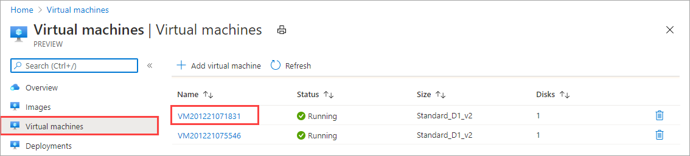
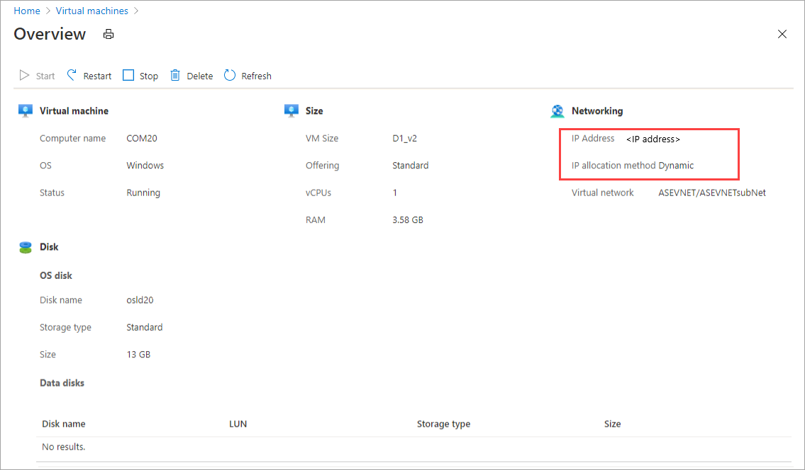

# Deploy VMs on your Azure Stack Edge Pro GPU device via Azure PowerShell script

[!INCLUDE [applies-to-GPU-and-pro-r-and-mini-r-skus](../../includes/azure-stack-edge-applies-to-gpu-pro-r-mini-r-sku.md)]

This tutorial describes how to create and manage a VM on your Azure Stack Edge Pro device using an Azure PowerShell script.

## Prerequisites

Before you begin creating and managing a VM on your Azure Stack Edge Pro device using this script, you need to make sure you have completed the prerequisites listed in the following steps:

### For Azure Stack Edge Pro device via the local web UI

[!INCLUDE [azure-stack-edge-gateway-deploy-vm-prerequisites](../../includes/azure-stack-edge-gateway-deploy-virtual-machine-prerequisites.md)]

### For your Windows client

1. Make sure that you have modified: 

    - The host file on the client, OR,
    - The DNS server configuration
    
    > [!IMPORTANT]
    > We recommend that you modify the DNS server configuration for endpoint name resolution.

    1. Start **Notepad** as an administrator (Administrator privileges is required to save the file), and then open the **hosts** file located at `C:\Windows\System32\Drivers\etc`.
    
        
    
    2. Add the following entries to your **hosts** file replacing with appropriate values for your device:
    
        ```
        <device IP> login.<appliance name>.<DNS domain>
        <device IP> management.<appliance name>.<DNS domain>
        <device IP> <storage name>.blob.<appliance name>.<DNS domain>
        ```
        For the storage account, you can provide a name that you want the script to use later to create a new storage account. The script does not check if that storage account is existing.

    3. Use the following image for reference. Save the **hosts** file.

        

2. [Download the PowerShell script](https://aka.ms/ase-vm-powershell) used in this procedure.

3. Make sure that your Windows client is running PowerShell 5.0 or later.

4. Make sure that the `Azure.Storage Module version 4.5.0` is installed on your system. You can get this module from the [PowerShell Gallery](https://www.powershellgallery.com/packages/Azure.Storage/4.5.0). To install this module, type:

    `Install-Module -Name Azure.Storage -RequiredVersion 4.5.0`

    To verify the version of the installed module, type:

    `Get-InstalledModule -name Azure.Storage`

    To uninstall any other version modules, type:

    `Uninstall-Module -Name Azure.Storage`

5. [Download AzCopy 10](../storage/common/storage-use-azcopy-v10.md#download-azcopy) to your Windows client. Make a note of this location as you will pass it as a parameter while running the script.

6. Make sure that your Windows client is running TLS 1.2 or later.


## Create a VM

1. Run PowerShell as an administrator.
1. Go to the folder where you downloaded the script on your client.
1. Before you run the script, make sure you are still connected to the local Azure Resource Manager of the device and the connection has not expired.

    ```powershell
    PS C:\windows\system32> login-AzureRMAccount -EnvironmentName aztest1 -TenantId c0257de7-538f-415c-993a-1b87a031879d

    Account               SubscriptionName              TenantId                             Environment
    -------               ----------------              --------                             -----------
    EdgeArmUser@localhost Default Provider Subscription c0257de7-538f-415c-993a-1b87a031879d aztest1

    PS C:\windows\system32> cd C:\Users\v2
    PS C:\Users\v2>
    ```  
1. Use the following command to run the script:
 
    `.\ArmPowershellClient.ps1 -NicPrivateIp <Private IP> -VHDPath <Path> -VHDFile <VHD File, with extension> -StorageAccountName <Name> -OS <Windows/Linux> -VMSize <Supported VM Size> -VMUserName <Username to be used to sign in to VM> -VMPassword <Password for the VM> --AzCopy10Path <Absolute Path>`

    If you want the IP to be dynamically allocated to the VM, omit the `-NicPrivateIp` parameter.

    Here are the examples when the script is run to create a Windows VM and a Linux VM.

    **For a Windows VM:**

    Here is a sample output for a Windows VM that was created.

    ```powershell
    PS C:\Users\v2> .\ArmPowershellClient.ps1 -VHDPath \\asefs\Logs\vmvhd -VHDFile WindowsServer2016Datacenter.vhd -StorageAccountName myasesatest -OS Windows -VMSize Standard_D1_v2 -VMUserName Administrator -VMPassword Password1 -AzCopy10Path C:\Users\AzCopy10\AzCopy.exe
    New-AzureRmResourceGroup -Name rg201221071831 -Location DBELocal -Force
    Successfully created Resource Group:rg201221071831
    Successfully created Resource Group:StorAccRG
    Get-AzureRmStorageAccount -Name myasesatest -ResourceGroupName StorAccRG -ErrorAction SilentlyContinue
    New-AzureRmStorageAccount -Name myasesatest  -ResourceGroupName StorAccRG -SkuName Standard_LRS -Location DBELocal
    
    Created New Storage Account
    Get-AzureRmStorageAccount -name myasesatest -resourcegroupname
    StorageAccountName ResourceGroupName Location SkuName     Kind    AccessTier CreationTime          ProvisioningState EnableHttpsTrafficOnly
    ------------------ ----------------- -------- -------     ----    ---------- ------------          ----------------- ----------------------
    myasesatest        StorAccRG         DBELocal StandardLRS Storage            12/22/2020 3:18:38 AM Succeeded         False
    myasesatest        StorAccRG         DBELocal StandardLRS Storage            12/22/2020 3:18:38 AM Succeeded         False
    
     Uploading Vhd to Storage Account
    
    New-AzureStorageContext -StorageAccountName myasesatest -StorageAccountKey hyibjhbVlOROgTlU1nQJIlxrg94eGDhF+RIQ71Z7UVZIxoOPMlHP274NUhZtA1hMxGBcpk2BVApiFasFPEhY/A== -Endpoint https://myasesatest.blob.myasegpuvm.wdshcsso.com/
    
    New-AzureStorageAccountSASToken -Service Blob,File,Queue,Table -ResourceType Container,Service,Object -Permission
    
    SAS Token : ?sv=2017-07-29&sig=TXaGbjum9tFFaJnu3SFmDuslJuqNiNQwvuHfpPJMYN0%3D&spr=https&se=2020-12-22T04%3A18%3A43Z&srt=sco&ss=bfqt&sp=racwdl
    
     C:\Users\AzCopy10\AzCopy.exe make https://myasesatest.blob.myasegpuvm.wdshcsso.com/vmimages?sv=2017-07-29&sig=TXaGbjum9tFFaJnu3SFmDuslJuqNiNQwvuHfpPJMYN0%3D&spr=https&se=2020-12-22T04%3A18%3A43Z&srt=sco&ss=bfqt&sp=racwdl
    
    Successfully created the resource.
    
     AzCopy cp \\asefs\Logs\vmvhd\WindowsServer2016Datacenter.vhd https://myasesatest.blob.myasegpuvm.wdshcsso.com/vmimages?sv=2017-07-29&sig=TXaGbjum9tFFaJnu3SFmDuslJuqNiNQwvuHfpPJMYN0%3D&spr=https&se=2020-12-22T04%3A18%3A43Z&srt=sco&ss=bfqt&sp=racwdl
    
    INFO: Scanning...
    
    Job b6f54665-93c4-2f47-4770-5f3b7b0de2dc has started
    Log file is located at: C:\Users\Administrator\.azcopy\b6f54665-93c4-2f47-4770-5f3b7b0de2dc.log
    
    INFO: AzCopy.exe: A newer version 10.8.0 is available to download
    
    99.9 %, 0 Done, 0 Failed, 1 Pending, 0 Skipped, 1 Total,  (Disk may be limiting speed)
    
    Job b6f54665-93c4-2f47-4770-5f3b7b0de2dc summary
    Elapsed Time (Minutes): 12.7717
    Total Number Of Transfers: 1
    Number of Transfers Completed: 1
    Number of Transfers Failed: 0
    Number of Transfers Skipped: 0
    TotalBytesTransferred: 13958644224
    Final Job Status: Completed
    
    VHD Upload Done
    
     Creating a new managed disk
    
      = New-AzureRmDiskConfig -Location DBELocal -CreateOption Import -SourceUri
    
     Microsoft.Azure.Commands.Compute.Automation.Models.PSDisk
    
     New-AzureRmDisk -ResourceGroupName rg201221071831 -DiskName ld201221071831 -Disk
    
    ResourceGroupName  : rg201221071831
    ManagedBy          :
    Sku                : Microsoft.Azure.Management.Compute.Models.DiskSku
    Zones              :
    TimeCreated        : 12/21/2020 7:31:35 PM
    OsType             :
    CreationData       : Microsoft.Azure.Management.Compute.Models.CreationData
    DiskSizeGB         : 13
    EncryptionSettings :
    ProvisioningState  : Succeeded
    Id                 : /subscriptions/947b3cfd-7a1b-4a90-7cc5-e52caf221332/resourceGroups/rg201221071831/providers/Microsoft.Compute/disks/ld201221071831
    Name               : ld201221071831
    Type               : Microsoft.Compute/disks
    Location           : DBELocal
    Tags               : {}
    
     Created a new managed disk
    
     Creating a new Image out of managed disk
    
    ResourceGroupName    :
    SourceVirtualMachine :
    StorageProfile       : Microsoft.Azure.Management.Compute.Models.ImageStorageProfile
    ProvisioningState    :
    Id                   :
    Name                 :
    Type                 :
    Location             : DBELocal
    Tags                 :
    
     New-AzureRmImage -Image Microsoft.Azure.Commands.Compute.Automation.Models.PSImage -ImageName ig201221071831  -ResourceGroupName rg201221071831 -HyperVGeneration V1
    
    ResourceGroupName    : rg201221071831
    SourceVirtualMachine :
    StorageProfile       : Microsoft.Azure.Management.Compute.Models.ImageStorageProfile
    ProvisioningState    : Succeeded
    Id                   : /subscriptions/947b3cfd-7a1b-4a90-7cc5-e52caf221332/resourceGroups/rg201221071831/providers/Microsoft.Compute/images/ig201221071831
    Name                 : ig201221071831
    Type                 : Microsoft.Compute/images
    Location             : dbelocal
    Tags                 : {}
    
     Created a new Image
    
     Using Vnet /subscriptions/947b3cfd-7a1b-4a90-7cc5-e52caf221332/resourceGroups/ASERG/providers/Microsoft.Network/virtualNetworks/ASEVNET
    
     Creating a new Newtork Interface
    WARNING: The output object type of this cmdlet will be modified in a future release.
    
    VirtualMachine              :
    IpConfigurations            : {ip201221071831}
    DnsSettings                 : Microsoft.Azure.Commands.Network.Models.PSNetworkInterfaceDnsSettings
    MacAddress                  : 001DD87D7216
    Primary                     :
    EnableAcceleratedNetworking : False
    EnableIPForwarding          : False
    NetworkSecurityGroup        :
    ProvisioningState           : Succeeded
    VirtualMachineText          : null
    IpConfigurationsText        : [
                                    {
                                      "Name": "ip201221071831",
                                      "Etag": "W/\"27785dd5-d12a-4d73-9495-ffad7847261a\"",
                                      "Id": "/subscriptions/947b3cfd-7a1b-4a90-7cc5-e52caf221332/resourceGroups/rg201221071831/providers/Microsoft.Network/networkInterfaces/nic201221071831/ipConfigurations/ip201221071831",
                                      "PrivateIpAddress": "10.57.51.61",
                                      "PrivateIpAllocationMethod": "Dynamic",
                                      "Subnet": {
                                        "Id": "/subscriptions/947b3cfd-7a1b-4a90-7cc5-e52caf221332/resourceGroups/ASERG/providers/Microsoft.Network/virtualNetworks/ASEVNET/subnets/ASEVNETsubNet",
                                        "ResourceNavigationLinks": [],
                                        "ServiceEndpoints": []
                                      },
                                      "ProvisioningState": "Succeeded",
                                      "PrivateIpAddressVersion": "IPv4",
                                      "LoadBalancerBackendAddressPools": [],
                                      "LoadBalancerInboundNatRules": [],
                                      "Primary": true,
                                      "ApplicationGatewayBackendAddressPools": [],
                                      "ApplicationSecurityGroups": []
                                    }
                                  ]
    DnsSettingsText             : {
                                    "DnsServers": [],
                                    "AppliedDnsServers": [],
                                    "InternalDomainNameSuffix": "qgotb4hjdh4efnhn0vz5adtb3f.a--x.internal.cloudapp.net"
                                  }
    NetworkSecurityGroupText    : null
    ResourceGroupName           : rg201221071831
    Location                    : dbelocal
    ResourceGuid                : e6327ab9-0855-4f04-9b36-17bbf31b5bd8
    Type                        : Microsoft.Network/networkInterfaces
    Tag                         :
    TagsTable                   :
    Name                        : nic201221071831
    Etag                        : W/"27785dd5-d12a-4d73-9495-ffad7847261a"
    Id                          : /subscriptions/947b3cfd-7a1b-4a90-7cc5-e52caf221332/resourceGroups/rg201221071831/providers/Microsoft.Network/networkInterfaces/nic201221071831
    
     Created Network Interface
    
     Creating a new VM
    
     New-AzureRmVMConfig -VMName VM201221071831 -VMSize Standard_D1_v2
    
     Set-AzureRmVMOperatingSystem -VM Microsoft.Azure.Commands.Compute.Models.PSVirtualMachine -Windows -ComputerName COM201221071831 -Credential System.Management.Automation.PSCredential
    
     Microsoft.Azure.Commands.Compute.Models.PSVirtualMachine = Set-AzureRmVMOSDisk -VM Microsoft.Azure.Commands.Compute.Models.PSVirtualMachine -Name osld201221071831 -Caching ReadWrite -CreateOption FromImage -Windows -StorageAccountType StandardLRS
    
     Add-AzureRmVMNetworkInterface -VM Microsoft.Azure.Commands.Compute.Models.PSVirtualMachine -Id /subscriptions/947b3cfd-7a1b-4a90-7cc5-e52caf221332/resourceGroups/rg201221071831/providers/Microsoft.Network/networkInterfaces/nic201221071831.Id
    
     Set-AzureRmVMSourceImage -VM Microsoft.Azure.Commands.Compute.Models.PSVirtualMachine -Id /subscriptions/947b3cfd-7a1b-4a90-7cc5-e52caf221332/resourceGroups/rg201221071831/providers/Microsoft.Compute/images/ig201221071831
    
     New-AzureRmVM -ResourceGroupName rg201221071831 -Location DBELocal -VM Microsoft.Azure.Commands.Compute.Models.PSVirtualMachine -Verbose
    WARNING: Since the VM is created using premium storage or managed disk, existing standard storage account, myasesa1, is used for boot
    diagnostics.
    VERBOSE: Performing the operation "New" on target "VM201221071831".
    
    Ticks             : 1533424841
    Days              : 0
    Hours             : 0
    Milliseconds      : 342
    Minutes           : 2
    Seconds           : 33
    TotalDays         : 0.00177479726967593
    TotalHours        : 0.0425951344722222
    TotalMilliseconds : 153342.4841
    TotalMinutes      : 2.55570806833333
    TotalSeconds      : 153.3424841
    
    RequestId           :
    IsSuccessStatusCode : True
    StatusCode          : OK
    ReasonPhrase        : OK

    PS C:\Users\v2>
    ```

    **For a Linux VM:**

    Here is the sample of the command that was used to create a Linux VM.

    ```powershell
    .\ArmPowershellClient.ps1 -VHDPath \\asefs\Logs\vmvhd -VHDFile ubuntu13.vhd -StorageAccountName myasesatest -OS Linux -VMSize Standard_D1_v2 -VMUserName Administrator -VMPassword Password1 -AzCopy10Path C:\Users\AzCopy10\AzCopy.exe
    New-AzureRmResourceGroup -Name rg201221075546 -Location DBELocal -Force    
    ```

  
1. Once you have successfully created the VMs, these VMs should show up in the list of virtual machines in the Azure portal. To view the VMs, in the Azure Stack Edge resource for your device in Azure portal, go to **Edge services > Virtual machines**. 

    

    To view the details of a VM, select the VM name. Note the dynamic allocation of IP for this VM.

    

1. To clean up the resources that the script created, use the following commands:
    
    ```powershell
    Get-AzureRmVM | Remove-AzureRmVM -Force
    Get-AzureRmNetworkInterface | Remove-AzureRmNetworkInterface -Force
    Get-AzureRmImage | Remove-AzureRmImage -Force
    Get-AzureRmDisk | Remove-AzureRmDisk -Force
    Get-AzureRmStorageAccount | Remove-AzureRmStorageAccount -Force
    ```


## Next steps

[Deploy VMs using Azure PowerShell cmdlets](azure-stack-edge-gpu-deploy-virtual-machine-powershell.md)
