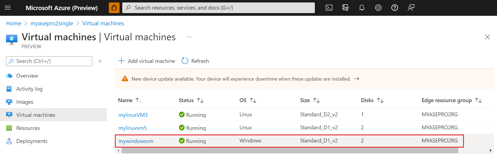
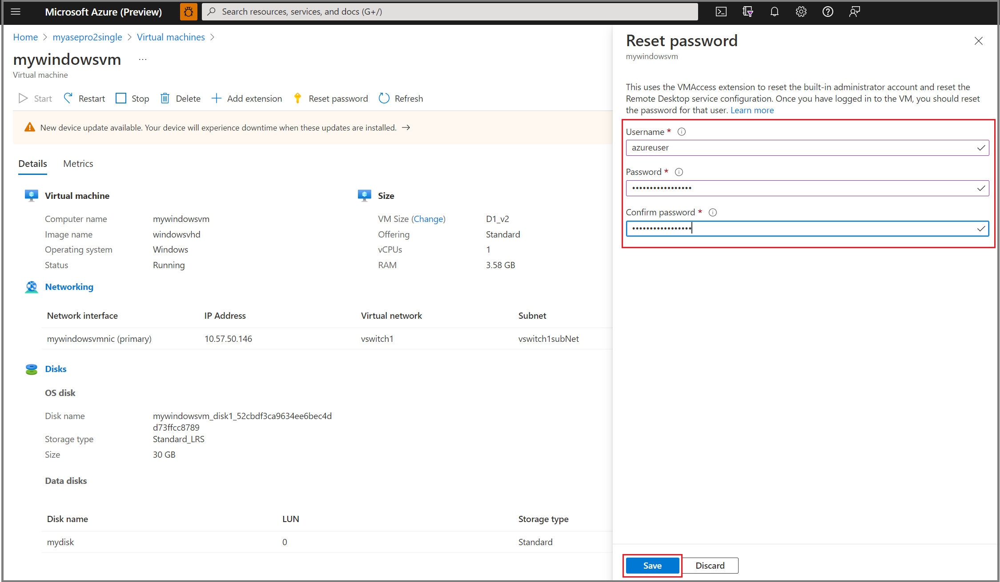
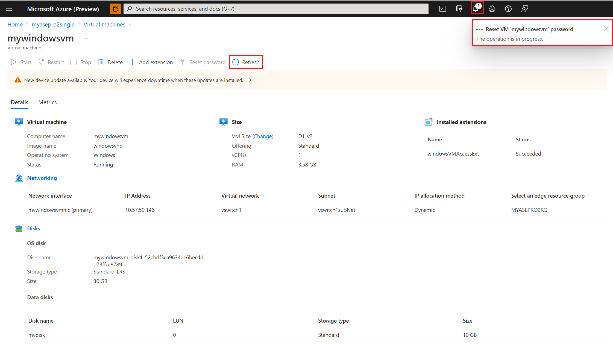
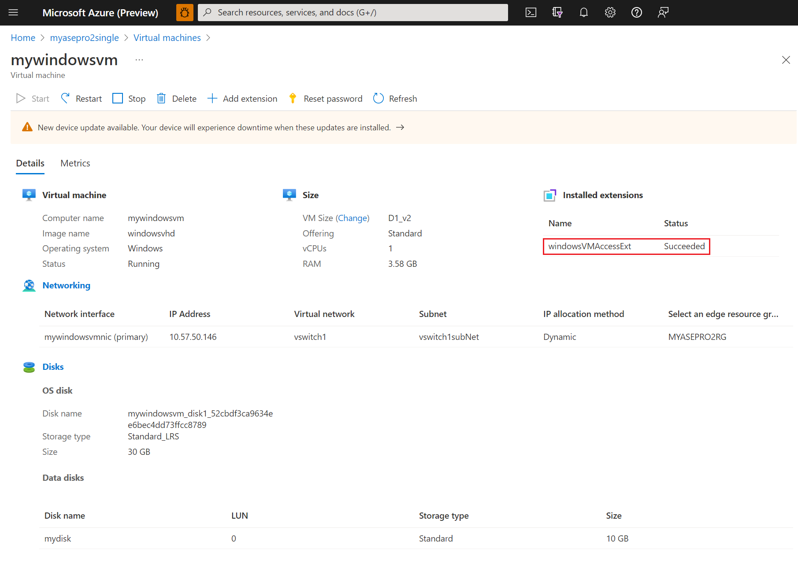
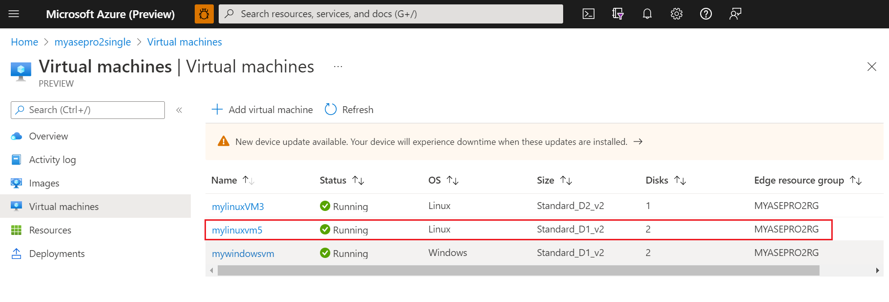

# Reset VM password for your Azure Stack Edge Pro GPU device via Azure portal

[!INCLUDE [applies-to-GPU-and-pro-r-and-mini-r-skus](../../includes/azure-stack-edge-applies-to-gpu-pro-r-mini-r-sku.md)]

This article covers steps to reset the password on both Windows and Linux VMs using Azure portal.

## Reset Windows VM password for your Azure Stack Edge Pro GPU device via Azure portal

Use the following steps to reset the VM password for your Azure Stack Edge Pro GPU device:

1. From Azure portal VM list view, click the VM name.

    

1. Click **Reset password**.

    

1. Click the **Password** radio button, and then specify the username and the new password. Confirm the new password, and then click **Save**.

    

1. While the operation is in progress, you can see the notification in the ribbon.

    

    You can also click **Refresh** to update status of the operation.

1. When the operation is complete, you can see the *windowsVMAccessExt* extension installed for the VM.

    

 
1. At this point you can connect to the VM with the new password.

## Reset Linux VM password for your Azure Stack Edge Pro GPU device via Azure portal

Use the following steps to reset the VM password for your Azure Stack Edge Pro GPU device:

1. From Azure portal VM list view, click the VM name.

    

## Next steps
