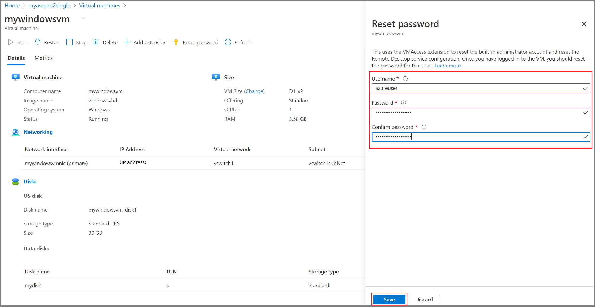
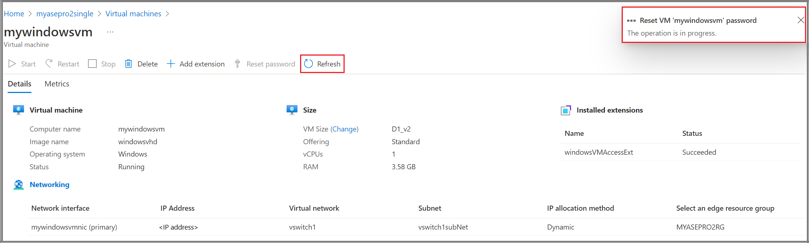
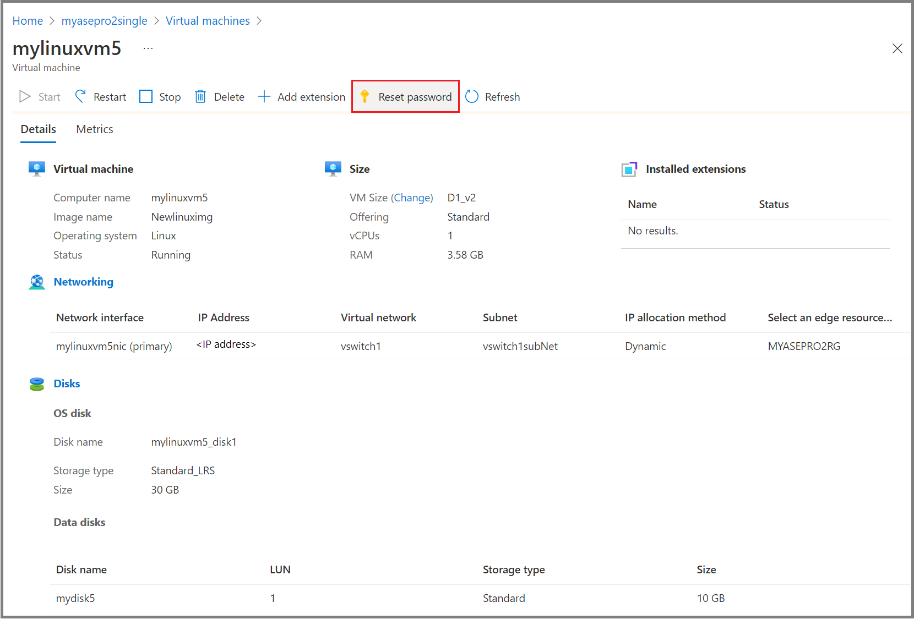
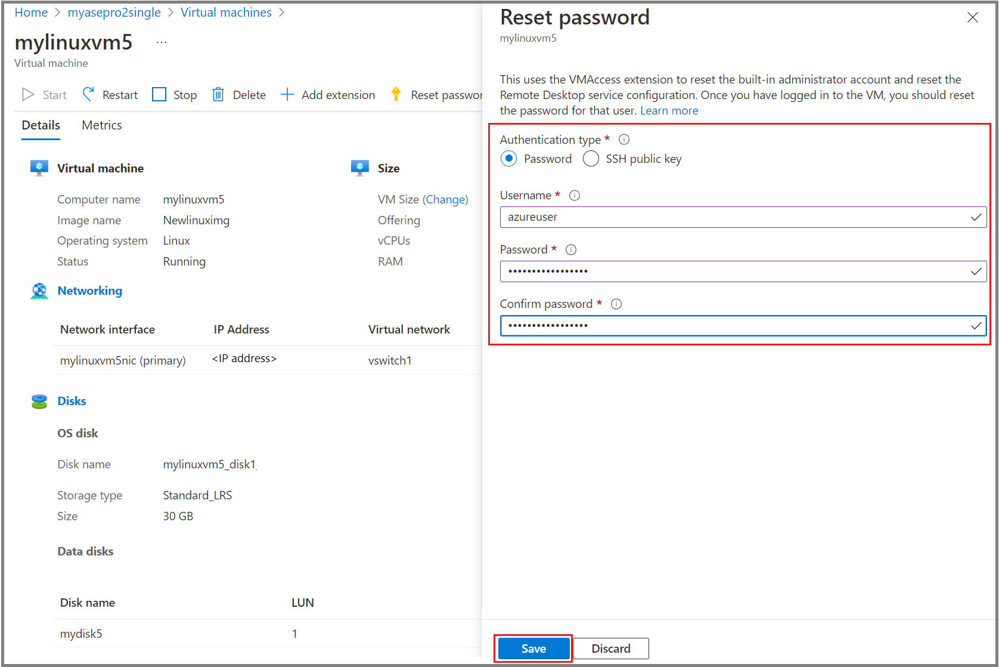
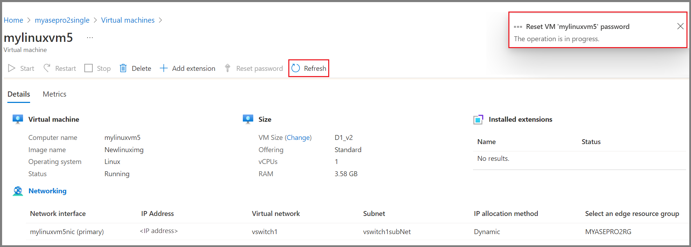

# Reset VM password for your Azure Stack Edge Pro GPU device via the Azure portal

[!INCLUDE [applies-to-GPU-and-pro-r-and-mini-r-skus](../../includes/azure-stack-edge-applies-to-gpu-pro-r-mini-r-sku.md)]

This article covers steps to reset the password on both Windows and Linux VMs using the Azure portal. To reset a password using PowerShell and local Azure Resource Manager templates, see [Install the VM password reset extension](azure-stack-edge-gpu-deploy-virtual-machine-install-password-reset-extension.md).

## Reset Windows VM password

Use the following steps to reset the VM password for your Azure Stack Edge Pro GPU device:

1. In the Azure portal, go to the Azure Stack Edge resource for your device, then go to **Edge services** > **Virtual machines**.

    

1. From the Azure portal VM list view, select the VM name with the password you would like to reset.

    

1. Select **Reset password**.

    

1. Specify the username and the new password. Confirm the new password, and then select **Save**.

    For more information about Windows VM password requirements, see [Password requirements for a Windows VM](/azure/virtual-machines/windows/faq#what-are-the-password-requirements-when-creating-a-vm-).

    

1. While the operation is in progress, you can view the notification that shows the status of the operation. Select **Refresh** to update status of the operation.

    

1. When the operation is complete, you can see that the *windowsVMAccessExt* extension is installed for the VM.

    

1. Connect to the VM with the new password.

## Reset Linux VM password

Use the following steps to reset the VM password for your Azure Stack Edge Pro GPU device:

1. In the Azure portal, go to the Azure Stack Edge resource for your device, then go to **Edge services** > **Virtual machines**.

    

1. From the Azure portal VM list view, select the VM name with the password you would like to reset.

    

1. Select **Reset password**.

    

1. Specify the username and the new password. Confirm the new password, and then select **Save**.

    For more information about Linux VM password requirements, see [Password requirements for a Linux VM](/azure/virtual-machines/linux/faq#what-are-the-password-requirements-when-creating-a-vm-).

    

1. While the operation is in progress, you can view the notification that shows the status of the operation. Select **Refresh** to update status of the operation.

    

1. When the operation is complete, you can see that the *windowsVMAccessExt* extension is installed for the VM.

    

1. Connect to the VM with the new password.

## Next steps

[Deploy VMs on your Azure Stack Edge Pro GPU device via the Azure portal](azure-stack-edge-gpu-deploy-virtual-machine-portal.md)

[Install the password reset extension on VMs for your Azure Stack Edge Pro GPU device](azure-stack-edge-gpu-deploy-virtual-machine-install-password-reset-extension.md)
