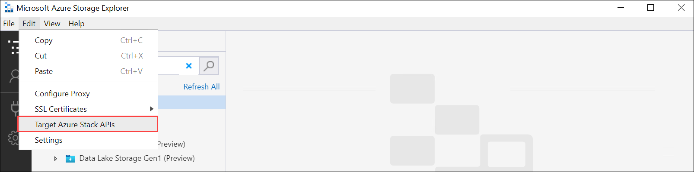
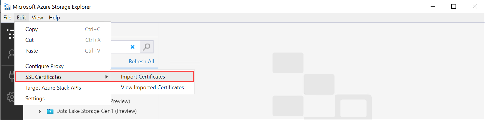
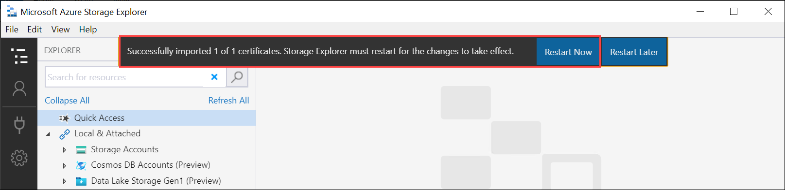
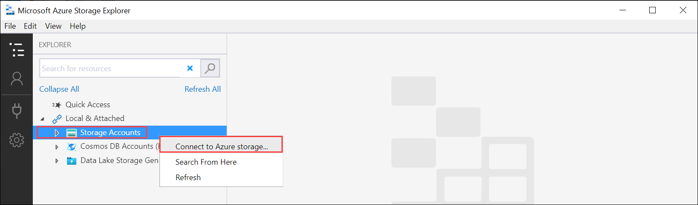
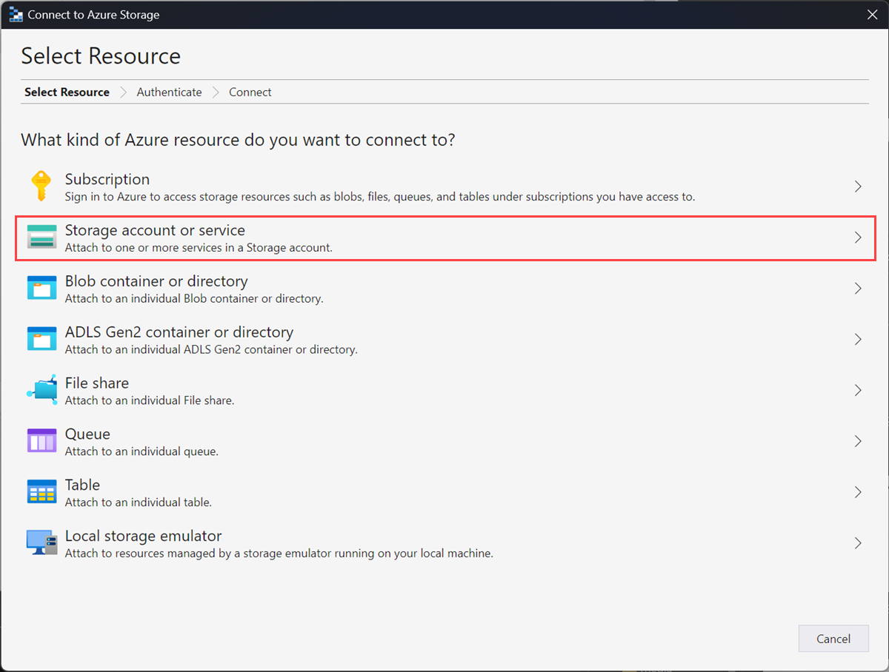
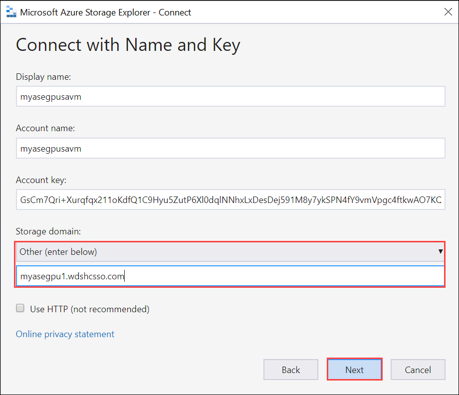
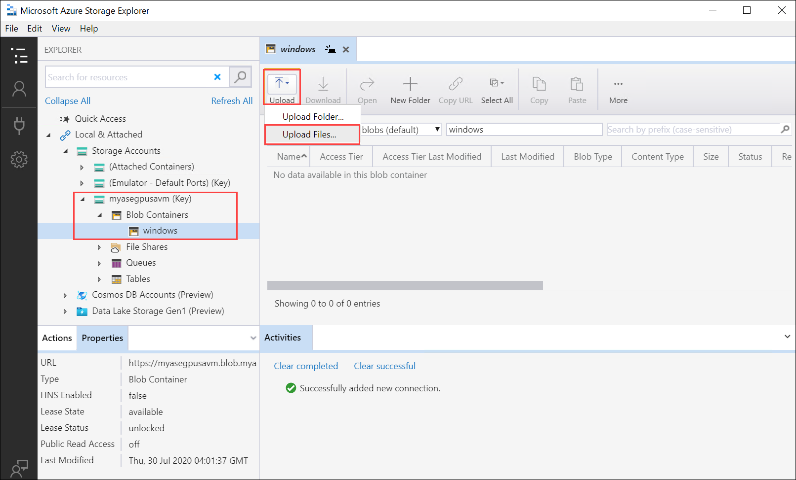
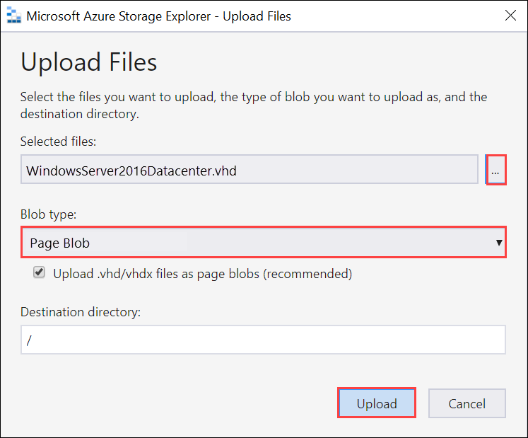
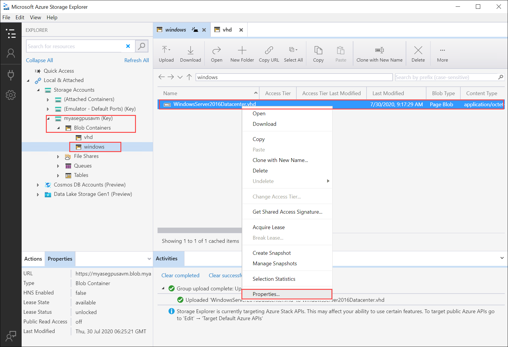
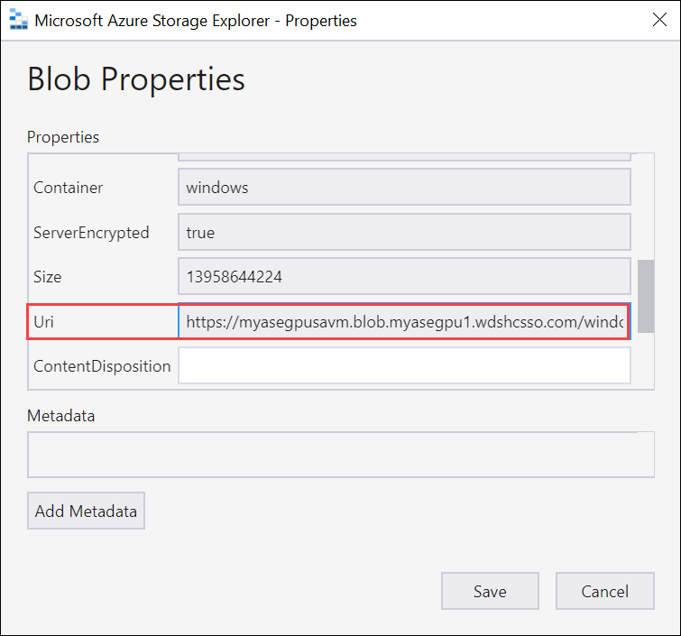

# Deploy VMs on your Azure Stack Edge Pro GPU device via templates 

[!INCLUDE [applies-to-GPU-and-pro-r-and-mini-r-skus](../../includes/azure-stack-edge-applies-to-gpu-pro-r-mini-r-sku.md)]

This tutorial describes how to create and manage a VM on your Azure Stack Edge Pro device using templates. These templates are JavaScript Object Notation (JSON) files that define the infrastructure and configuration for your VM. In these templates, you specify the resources to deploy and the properties for those resources.

Templates are flexible in different environments as they can take parameters as input at runtime from a file. The standard naming structure is `TemplateName.json` for the template and `TemplateName.parameters.json` for the parameters file. For more information on ARM templates, go to [What are Azure Resource Manager templates?](../azure-resource-manager/templates/overview.md).

In this tutorial, we’ll use pre-written sample templates for creating resources. You won’t need to edit the template file and you can modify just the `.parameters.json` files to customize the deployment to your machine. 

## VM deployment workflow

To deploy Azure Stack Edge Pro VMs across many devices, you can use a single sysprepped VHD for your full fleet, the same template for deployment, and just make minor changes to the parameters to that template for each deployment location (these changes could be by hand as we’re doing here, or programmatic.) 

The high level summary of the deployment workflow using templates is as follows:

1. **Configure prerequisites** - There are three types of prerequisites: device, client, and for the VM.

    1. **Device prerequisites**

        1. [Connect to Azure Resource Manager](azure-stack-edge-gpu-connect-resource-manager.md) on device.
        2. Enable compute via the local UI.

    2. **Client prerequisites**

        1. Download the VM templates and associated files on client.
        1. Optionally configure TLS 1.2 on client.
        1. [Download and install Microsoft Azure Storage Explorer](https://go.microsoft.com/fwlink/?LinkId=708343&clcid=0x409) on your client.

    3. **VM prerequisites**

        1. Create a resource group in the device location that will contain all the VM resources.
        1. Create a storage account to upload the VHD used to create VM image.
        1. Add local storage account URI to DNS or hosts file on the client accessing your device.
        1. Install the blob storage certificate on the device and on the local client accessing your device. Optionally install the blob storage certificate on the Storage Explorer.
        1. Create and upload a VHD to the storage account created earlier.

2. **Create VM from templates**

    1. Create a VM image using `CreateImage.parameters.json` parameters file and `CreateImage.json` deployment template.
    1. Create a VM with previously created resources using `CreateVM.parameters.json` parameters file and  `CreateVM.json` deployment template.

## Device prerequisites

Configure these prerequisites on your Azure Stack Edge Pro device.

[!INCLUDE [azure-stack-edge-gateway-deploy-virtual-machine-prerequisites](../../includes/azure-stack-edge-gateway-deploy-virtual-machine-prerequisites.md)]

## Client prerequisites

Configure these prerequisites on your client that will be used to access the Azure Stack Edge Pro device.

1. [Download Storage Explorer](https://azure.microsoft.com/features/storage-explorer/) if you're using it to upload a VHD. Alternatively, you can download AzCopy to upload a VHD. You may need to configure TLS 1.2 on your client machine if running older versions of AzCopy. 
1. [Download the VM templates and parameters files](https://aka.ms/ase-vm-templates) to your client machine. Unzip it into a directory you’ll use as a working directory.


## VM prerequisites

Configure these prerequisites to create the resources needed for VM creation. 

    
### Create a resource group

### [Az](#tab/az)

Create an Azure resource group with [New-AzResourceGroup](/powershell/module/az.resources/new-azresourcegroup). A resource group is a logical container into which the Azure resources such as storage account, disk, managed disk are deployed and managed.

> [!IMPORTANT]
> All the resources are created in the same location as that of the device and the location is set to **DBELocal**.

```powershell
New-AzResourceGroup -Name <Resource group name> -Location DBELocal
```

Here's a sample output:

```powershell
PS C:\WINDOWS\system32> New-AzResourceGroup -Name myaserg1 -Location DBELocal

ResourceGroupName : myaserg1
Location          : dbelocal
ProvisioningState : Succeeded
Tags              :
ResourceId        : /subscriptions/04a485ed-7a09-44ab-6671-66db7f111122/resourceGroups/myaserg1

PS C:\WINDOWS\system32> 
```

### [AzureRM](#tab/azure-rm)

Create an Azure resource group with [New-AzureRmResourceGroup](/powershell/module/az.resources/new-azresourcegroup). A resource group is a logical container into which the Azure resources such as storage account, disk, managed disk are deployed and managed.

> [!IMPORTANT]
> All the resources are created in the same location as that of the device and the location is set to **DBELocal**.

```powershell
New-AzureRmResourceGroup -Name <Resource group name> -Location DBELocal
```

A sample output is shown below.

```powershell
PS C:\windows\system32> New-AzureRmResourceGroup -Name myasegpurgvm -Location DBELocal

ResourceGroupName : myasegpurgvm
Location          : dbelocal
ProvisioningState : Succeeded
Tags              :
ResourceId        : /subscriptions/DDF9FC44-E990-42F8-9A91-5A6A5CC472DB/resourceGroups/myasegpurgvm

PS C:\windows\system32>
```

---

### Create a storage account

### [Az](#tab/az)

Create a new storage account using the resource group created in the previous step. This account is a **local storage account** that will be used to upload the virtual disk image for the VM.

```powershell
New-AzStorageAccount -Name <Storage account name> -ResourceGroupName <Resource group name> -Location DBELocal -SkuName Standard_LRS
```

> [!NOTE]
> Only the local storage accounts such as Locally redundant storage (Standard_LRS or Premium_LRS) can be created via Azure Resource Manager. To create tiered storage accounts, see the steps in [Add, connect to storage accounts on your Azure Stack Edge Pro](./azure-stack-edge-gpu-deploy-add-storage-accounts.md).

Here's a sample output:

```powershell
PS C:\WINDOWS\system32>New-AzStorageAccount -Name myasesa1 -ResourceGroupName myaserg1 -Location DBELocal -SkuName Standard_LRS

StorageAccountName ResourceGroupName PrimaryLocation SkuName Kind AccessTier CreationTime ProvisioningState EnableHttpsTrafficOnly
------------------ ----------------- --------------- ------- ---- ---------- ------------ ----------------- ------
myasesa1        myaserg1 DBELocal Standard_LRS Storage 4/18/2022 8:35:09 PM Succeeded False

PS C:\WINDOWS\system32>
```

To get the storage account key, run the `Get-AzStorageAccountKey` command. Here's a sample output:

```powershell
PS C:\WINDOWS\system32> Get-AzStorageAccountKey

cmdlet Get-AzStorageAccountKey at command pipeline position 1
Supply values for the following parameters:
(Type !? for Help.)
ResourceGroupName: myaserg1
Name: myasesa1

KeyName Value                                                                                    Permissions
------- -----                                                                                    -----------
key1    7a707uIh43qADXvuhwqtw39mwq3M97r1BflhoF2yZ6W9FNkGOCblxb7nDSiYVGQprpkKk0Au2AjmgUXUT6yCog== Full
key2    2v1VQ6qH1CJ9bOjB15p4jg9Ejn7iazU95Qe8hAGE22MTL21Ac5skA6kZnE3nbe+rdiXiORBeVh9OpJcMOfoaZg== Full

PS C:\WINDOWS\system32>
```

### [AzureRM](#tab/azure-rm)

Create a new storage account using the resource group created in the previous step. This account is a **local storage account** that will be used to upload the virtual disk image for the VM.

```powershell
New-AzureRmStorageAccount -Name <Storage account name> -ResourceGroupName <Resource group name> -Location DBELocal -SkuName Standard_LRS
```

> [!NOTE]
> Only the local storage accounts such as Locally redundant storage (Standard_LRS or Premium_LRS) can be created via Azure Resource Manager. To create tiered storage accounts, see the steps in [Add, connect to storage accounts on your Azure Stack Edge Pro](./azure-stack-edge-gpu-deploy-add-storage-accounts.md).

Here's a sample output:

```powershell
PS C:\windows\system32> New-AzureRmStorageAccount -Name myasegpusavm -ResourceGroupName myasegpurgvm -Location DBELocal -SkuName Standard_LRS

StorageAccountName ResourceGroupName Location SkuName     Kind    AccessTier CreationTime
------------------ ----------------- -------- -------     ----    ---------- ------------
myasegpusavm       myasegpurgvm      DBELocal StandardLRS Storage            7/29/2020 10:11:16 PM

PS C:\windows\system32>
```

To get the storage account key, run the `Get-AzureRmStorageAccountKey` command. A sample output of this command is shown here.

```powershell
PS C:\windows\system32> Get-AzureRmStorageAccountKey

cmdlet Get-AzureRmStorageAccountKey at command pipeline position 1
Supply values for the following parameters:
(Type !? for Help.)
ResourceGroupName: myasegpurgvm
Name: myasegpusavm

KeyName    Value                                                                   Permissions   
-------    -----                                                                 -----------
key1 GsCm7QriXurqfqx211oKdfQ1C9Hyu5ZutP6Xl0dqlNNhxLxDesDej591M8y7ykSPN4fY9vmVpgc4ftkwAO7KQ== 11 
key2 7vnVMJUwJXlxkXXOyVO4NfqbW5e/5hZ+VOs+C/h/ReeoszeV+qoyuBitgnWjiDPNdH4+lSm1/ZjvoBWsQ1klqQ== ll
```

---

### Add blob URI to hosts file

Make sure that you've already added the blob URI in hosts file for the client that you're using to connect to Blob storage. **Run Notepad as administrator** and add the following entry for the blob URI in the `C:\windows\system32\drivers\etc\hosts`:

`<Device IP> <storage account name>.blob.<Device name>.<DNS domain>`

In a typical environment, you would have your DNS configured so that all storage accounts would point to the Azure Stack Edge Pro device with a `*.blob.devicename.domainname.com` entry.

### (Optional) Install certificates

Skip this step if you'll connect via Storage Explorer using *http*. If you're using *https*, then you need to install appropriate certificates in Storage Explorer. In this case, install the blob endpoint certificate. For more information, see how to create and upload certificates in [Manage certificates](azure-stack-edge-gpu-manage-certificates.md). 

### Create and upload a VHD

Make sure that you have a virtual disk image that you can use to upload in the later step. Follow the steps in [Create a VM image](azure-stack-edge-gpu-create-virtual-machine-image.md). 

Copy any disk images to be used into page blobs in the local storage account that you created in the earlier steps. You can use a tool such as [Storage Explorer](https://azure.microsoft.com/features/storage-explorer/) or [AzCopy to upload the VHD to the storage account](azure-stack-edge-gpu-deploy-virtual-machine-powershell.md#upload-a-vhd) that you created in earlier steps. 

### Use Storage Explorer for upload

1. Open Storage Explorer. Go to **Edit** and make sure that the application is set to **Target Azure Stack APIs**.

    

2. Install the client certificate in PEM format. Go to **Edit > SSL Certificates > Import certificates**. Point to the client certificate.

    

    - If you're using device generated certificates, download and convert the blob storage endpoint `.cer` certificate to a `.pem` format. Run the following command. 
    
        ```powershell
        PS C:\windows\system32> Certutil -encode 'C:\myasegpu1_Blob storage (1).cer' .\blobstoragecert.pem
        Input Length = 1380
        Output Length = 1954
        CertUtil: -encode command completed successfully.
        ```
    - If you're bringing your own certificate, use the signing chain root certificate in `.pem` format.

3. After you've imported the certificate, restart Storage Explorer for the changes to take effect.

    

4. In the left pane, right-click **Storage accounts** and select **Connect to Azure Storage**. 

    

5. Select **Use a storage account name and key**. Select **Next**.

    

6. In the **Connect with Name and Key**, provide the **Display name**, **Storage account name**, Azure Storage **Account key**. Select **Other** Storage domain and then provide the `<device name>.<DNS domain>` connection string. If you didn’t install a certificate in Storage Explorer, check the **Use HTTP** option. Select **Next**.

    

7. Review the **Connection summary** and select **Connect**.

8. The storage account appears in the left-pane. Select and expand the storage account. Select **Blob containers**, right-click, and select **Create Blob Container**. Provide a name for your blob container.

9. Select the container you just created, and then in the right-pane, select **Upload > Upload files**. 

    

10. Browse and point to the VHD that you want to upload in the **Selected files**. Select **Blob type** as **Page blob** and select **Upload**.

    

11. Once the VHD is loaded to the blob container, select the VHD, right-click, and then select **Properties**. 

    

12. Copy and save the **Uri**, which you'll use in later steps.

    


## Create image for your VM

To create image for your VM, edit the `CreateImage.parameters.json` parameters file and then deploy the template `CreateImage.json` that uses this parameter file.

### Edit parameters file

The file `CreateImage.parameters.json` takes the following parameters: 

```json
"parameters": {
    "osType": {
        "value": "<Operating system corresponding to the VHD you upload can be Windows or Linux>"
    },
    "imageName": {
        "value": "<Name for the VM image>"
    },
    "imageUri": {
        "value": "<Path to the VHD that you uploaded in the Storage account>"
    },
    "hyperVGeneration": { 
        "type": "string", 
        "value": "<Generation of the VM, V1 or V2>"
    }, 
}
```

Edit the file `CreateImage.parameters.json` to include the following values for your Azure Stack Edge Pro device:

1. Provide the OS type and Hyper V Generation corresponding to the VHD you'll upload. The OS type can be Windows or Linux and the VM Generation can be V1 or V2.

    ```json
    "parameters": {
            "osType": {
              "value": "Windows"
            }, 
            "hyperVGeneration": { 
              "value": "V2" 
        },
    }
    ```

2. Change the image URI to the URI of the image you uploaded in the earlier step:

   ```json
   "imageUri": {
       "value": "https://myasegpusavm.blob.myasegpu1.wdshcsso.com/windows/WindowsServer2016Datacenter.vhd"
       },
   ```

   If you’re using *http* with Storage Explorer, change the URI to an *http* URI.

3. Provide a unique image name. This image is used to create VM in the later steps. 

   Here's a sample json that is used in this article.

    ```json
    {
        "$schema": "https://schema.management.azure.com/schemas/2015-01-01/deploymentParameters.json#",
        "contentVersion": "1.0.0.0",
      "parameters": {
        "osType": {
          "value": "Linux"
        },
        "hyperVGeneration": {
         "value": "V1"
        },
        "imageName": {
          "value": "myaselinuximg"
        },
        "imageUri": {
          "value": "https://sa2.blob.myasegpuvm.wdshcsso.com/con1/ubuntu18.04waagent.vhd"
        }        
      }
    }
    ```

5. Save the parameters file.

### Deploy template

### [Az](#tab/az)

Deploy the template `CreateImage.json`. This template deploys the image resources that will be used to create VMs in the later step.

> [!NOTE]
> When you deploy the template if you get an authentication error, your Azure credentials for this session may have expired. Rerun the `login-Az` command to connect to Azure Resource Manager on your Azure Stack Edge Pro device again.

1. Run the following command:

    ```powershell
    $templateFile = "Path to CreateImage.json"
    $templateParameterFile = "Path to CreateImage.parameters.json"
    $RGName = "<Name of your resource group>"
    New-AzResourceGroupDeployment `
        -ResourceGroupName $RGName `
        -TemplateFile $templateFile `
        -TemplateParameterFile $templateParameterFile `
        -Name "<Name for your deployment>"
    ```

    This command deploys an image resource. 

1. To query the resource, run the following command:

    ```powershell
    Get-AzImage -ResourceGroupName <Resource Group Name> -name <Image Name>
    ```

    Here's a sample output:

    ```powershell
    PS C:\WINDOWS\system32> $templateFile = "C:\12-09-2020\CreateImage\CreateImage.json"
    PS C:\WINDOWS\system32> $templateParameterFile = "C:\12-09-2020\CreateImage\CreateImage.parameters.json"
    PS C:\WINDOWS\system32> $RGName = "myaserg1"
    PS C:\WINDOWS\system32> New-AzResourceGroupDeployment -ResourceGroupName $RGName -TemplateFile $templateFile -TemplateParameterFile $templateParameterFile -Name "deployment1"

    DeploymentName          : deployment1
    ResourceGroupName       : myaserg1
    ProvisioningState       : Succeeded
    Timestamp               : 4/18/2022 9:24:26 PM
    Mode                    : Incremental
    TemplateLink            :
    Parameters              :
                          Name             Type                       Value
                          ===============  =========================  ==========
                          osType           String                     Linux
                          imageName        String                     myaselinuximg1
                          imageUri         String
                          https://myasepro2stor.blob.dm1176047910p.wdshcsso.com/myasepro2cont1/ubuntu13.vhd

    Outputs                 :
    DeploymentDebugLogLevel :

    PS C:\WINDOWS\system32>
    ```

### [AzureRM](#tab/azure-rm)

Deploy the template `CreateImage.json`. This template deploys the image resources that will be used to create VMs in the later step.

> [!NOTE]
> When you deploy the template if you get an authentication error, your Azure credentials for this session may have expired. Rerun the `login-AzureRM` command to connect to Azure Resource Manager on your Azure Stack Edge Pro device again.

1. Run the following command: 
    
    ```powershell
    $templateFile = "Path to CreateImage.json"
    $templateParameterFile = "Path to CreateImage.parameters.json"
    $RGName = "<Name of your resource group>"
    New-AzureRmResourceGroupDeployment `
        -ResourceGroupName $RGName ` 
        -TemplateFile $templateFile `
        -TemplateParameterFile $templateParameterFile `
        -Name "<Name for your deployment>"
    ```
    This command deploys an image resource. 

1. To query the resource, run the following command:

    ```powershell
    Get-AzureRmImage -ResourceGroupName <Resource Group Name> -name <Image Name>
    ``` 
    Here's a sample output of a successfully created image.
    
    ```powershell
    PS C:\WINDOWS\system32> login-AzureRMAccount -EnvironmentName aztest -TenantId c0257de7-538f-415c-993a-1b87a031879d
    
    Account               SubscriptionName              TenantId                             Environment
    -------               ----------------              --------                             -----------
    EdgeArmUser@localhost Default Provider Subscription c0257de7-538f-415c-993a-1b87a031879d aztest
    
   PS C:\WINDOWS\system32> $templateFile = "C:\12-09-2020\CreateImage\CreateImage.json"
    PS C:\WINDOWS\system32> $templateParameterFile = "C:\12-09-2020\CreateImage\CreateImage.parameters.json"
    PS C:\WINDOWS\system32> $RGName = "rg2"
    PS C:\WINDOWS\system32> New-AzureRmResourceGroupDeployment -ResourceGroupName $RGName -TemplateFile $templateFile -TemplateParameterFile $templateParameterFile -Name "deployment4"
        
    DeploymentName          : deployment4
    ResourceGroupName       : rg2
    ProvisioningState       : Succeeded
    Timestamp               : 12/10/2020 7:06:57 PM
    Mode                    : Incremental
    TemplateLink            :
    Parameters              :
                              Name             Type                       Value
                              ===============  =========================  ==========
                              osType           String                     Linux
                              imageName        String                     myaselinuximg
                              imageUri         String
                              https://sa2.blob.myasegpuvm.wdshcsso.com/con1/ubuntu18.04waagent.vhd
    
    Outputs                 :
    DeploymentDebugLogLevel :    
    PS C:\WINDOWS\system32>
    ```
---
    
## Create VM

### Edit parameters file to create VM

### [Az](#tab/az)
 
To create a VM, use the `CreateVM.parameters.json` parameter file. It takes the following parameters.
   
```json
"vmName": {
            "value": "<Name for your VM>"
        },
        "adminUsername": {
            "value": "<Username to log into the VM>"
        },
        "Password": {
            "value": "<Password to log into the VM>"
        },
        "imageName": {
            "value": "<Name for your image>"
        },
        "vmSize": {
            "value": "<A supported size for your VM>"
        },
        "vnetName": {
            "value": "<Name for the virtual network, use ASEVNET>"
        },
        "subnetName": {
            "value": "<Name for the subnet, use ASEVNETsubNet>"
        },
        "vnetRG": {
            "value": "<Resource group for Vnet, use ASERG>"
        },
        "nicName": {
            "value": "<Name for the network interface>"
        },
        "privateIPAddress": {
            "value": "<Private IP address, enter a static IP in the subnet created earlier or leave empty to assign DHCP>"
        },
        "IPConfigName": {
            "value": "<Name for the ipconfig associated with the network interface>"
        }
```    

Assign appropriate parameters in `CreateVM.parameters.json` for your Azure Stack Edge Pro device.

1. Provide a unique name, network interface name, and ipconfig name. 
1. Enter a username, password, and a supported VM size.
1. When you enabled the network interface for compute, a virtual switch and a virtual network were automatically created on that network interface. You can query the existing virtual network to get the Vnet name, Subnet name, and Vnet resource group name.

    Run the following command:

    ```powershell
    Get-AzVirtualNetwork
    ```
    Here's the sample output:
    
    ```powershell
    
    PS C:\WINDOWS\system32> Get-AzVirtualNetwork
    
    Name                   : ASEVNET
    ResourceGroupName      : ASERG
    Location               : dbelocal
    Id                     : /subscriptions/947b3cfd-7a1b-4a90-7cc5-e52caf221332/resourceGroups/ASERG/providers/Microsoft
                             .Network/virtualNetworks/ASEVNET
    Etag                   : W/"990b306d-18b6-41ea-a456-b275efe21105"
    ResourceGuid           : f8309d81-19e9-42fc-b4ed-d573f00e61ed
    ProvisioningState      : Succeeded
    Tags                   :
    AddressSpace           : {
                               "AddressPrefixes": [
                                 "10.57.48.0/21"
                               ]
                             }
    DhcpOptions            : null
    Subnets                : [
                               {
                                 "Name": "ASEVNETsubNet",
                                 "Etag": "W/\"990b306d-18b6-41ea-a456-b275efe21105\"",
                                 "Id": "/subscriptions/947b3cfd-7a1b-4a90-7cc5-e52caf221332/resourceGroups/ASERG/provider
                             s/Microsoft.Network/virtualNetworks/ASEVNET/subnets/ASEVNETsubNet",
                                 "AddressPrefix": "10.57.48.0/21",
                                 "IpConfigurations": [],
                                 "ResourceNavigationLinks": [],
                                 "ServiceEndpoints": [],
                                 "ProvisioningState": "Succeeded"
                               }
                             ]
    VirtualNetworkPeerings : []
    EnableDDoSProtection   : false
    EnableVmProtection     : false
    
    PS C:\WINDOWS\system32>
    ```

    Use ASEVNET for Vnet name, ASEVNETsubNet for Subnet name, and ASERG for Vnet resource group name.
    
1. Now you’ll need a static IP address to assign to the VM that is in the subnet network defined above. Replace **PrivateIPAddress** with this address in the parameter file. To have the VM get an IP address from your local DCHP server, leave the `privateIPAddress` value blank.  
    
    ```json
    "privateIPAddress": {
                "value": "5.5.153.200"
            },
    ```

1. Save the parameters file.

    Here is a sample json used in this article.

    ```json
    {
      "$schema": "https://schema.management.azure.com/schemas/2015-01-01/deploymentParameters.json#",
      "contentVersion": "1.0.0.0",
      "parameters": {
          "vmName": {
              "value": "vm1"
          },
          "adminUsername": {
              "value": "Administrator"
          },
          "Password": {
              "value": "Password1"
          },
        "imageName": {
          "value": "myaselinuximg1"
        },
        "vmSize": {
          "value": "Standard_NC4as_T4_v3"
        },
        "vnetName": {
          "value": "vswitch1"
        },
        "subnetName": {
          "value": "vswitch1subNet"
        },
        "vnetRG": {
          "value": "myaserg1"
        },
        "nicName": {
          "value": "nic1"
        },
        "privateIPAddress": {
          "value": ""
        },
        "IPConfigName": {
          "value": "ipconfig1"
        }
      }
    }       
    ```

### [AzureRM](#tab/azure-rm)

To create a VM, use the `CreateVM.parameters.json` parameter file. It takes the following parameters.
    
```json
"vmName": {
            "value": "<Name for your VM>"
        },
        "adminUsername": {
            "value": "<Username to log into the VM>"
        },
        "Password": {
            "value": "<Password to log into the VM>"
        },
        "imageName": {
            "value": "<Name for your image>"
        },
        "vmSize": {
            "value": "<A supported size for your VM>"
        },
        "vnetName": {
            "value": "<Name for the virtual network, use ASEVNET>"
        },
        "subnetName": {
            "value": "<Name for the subnet, use ASEVNETsubNet>"
        },
        "vnetRG": {
            "value": "<Resource group for Vnet, use ASERG>"
        },
        "nicName": {
            "value": "<Name for the network interface>"
        },
        "privateIPAddress": {
            "value": "<Private IP address, enter a static IP in the subnet created earlier or leave empty to assign DHCP>"
        },
        "IPConfigName": {
            "value": "<Name for the ipconfig associated with the network interface>"
        }
```    

Assign appropriate parameters in `CreateVM.parameters.json` for your Azure Stack Edge Pro device.

1. Provide a unique name, network interface name, and ipconfig name. 
1. Enter a username, password, and a supported VM size.
1. When you enabled the network interface for compute, a virtual switch and a virtual network were automatically created on that network interface. You can query the existing virtual network to get the Vnet name, Subnet name, and Vnet resource group name.

    Run the following command:

    ```powershell
    Get-AzureRmVirtualNetwork
    ```
    Here's the sample output:
    
    ```powershell
    
    PS C:\WINDOWS\system32> Get-AzureRmVirtualNetwork
    
    Name                   : ASEVNET
    ResourceGroupName      : ASERG
    Location               : dbelocal
    Id                     : /subscriptions/947b3cfd-7a1b-4a90-7cc5-e52caf221332/resourceGroups/ASERG/providers/Microsoft
                             .Network/virtualNetworks/ASEVNET
    Etag                   : W/"990b306d-18b6-41ea-a456-b275efe21105"
    ResourceGuid           : f8309d81-19e9-42fc-b4ed-d573f00e61ed
    ProvisioningState      : Succeeded
    Tags                   :
    AddressSpace           : {
                               "AddressPrefixes": [
                                 "10.57.48.0/21"
                               ]
                             }
    DhcpOptions            : null
    Subnets                : [
                               {
                                 "Name": "ASEVNETsubNet",
                                 "Etag": "W/\"990b306d-18b6-41ea-a456-b275efe21105\"",
                                 "Id": "/subscriptions/947b3cfd-7a1b-4a90-7cc5-e52caf221332/resourceGroups/ASERG/provider
                             s/Microsoft.Network/virtualNetworks/ASEVNET/subnets/ASEVNETsubNet",
                                 "AddressPrefix": "10.57.48.0/21",
                                 "IpConfigurations": [],
                                 "ResourceNavigationLinks": [],
                                 "ServiceEndpoints": [],
                                 "ProvisioningState": "Succeeded"
                               }
                             ]
    VirtualNetworkPeerings : []
    EnableDDoSProtection   : false
    EnableVmProtection     : false
    
    PS C:\WINDOWS\system32>
    ```

    Use ASEVNET for Vnet name, ASEVNETsubNet for Subnet name, and ASERG for Vnet resource group name.
    
1. Now you’ll need a static IP address to assign to the VM that is in the subnet network defined above. Replace **PrivateIPAddress** with this address in the parameter file. To have the VM get an IP address from your local DCHP server, leave the `privateIPAddress` value blank.  
    
    ```json
    "privateIPAddress": {
                "value": "5.5.153.200"
            },
    ```
    
1. Save the parameters file.

    Here's a sample json that is used in this article.
    
    ```json
    {
      "$schema": "https://schema.management.azure.com/schemas/2015-01-01/deploymentParameters.json#",
      "contentVersion": "1.0.0.0",
      "parameters": {
          "vmName": {
              "value": "VM1"
          },
          "adminUsername": {
              "value": "Administrator"
          },
          "Password": {
              "value": "Password1"
          },
        "imageName": {
          "value": "myaselinuximg"
        },
        "vmSize": {
          "value": "Standard_NC4as_T4_v3"
        },
        "vnetName": {
          "value": "ASEVNET"
        },
        "subnetName": {
          "value": "ASEVNETsubNet"
        },
        "vnetRG": {
          "value": "aserg"
        },
        "nicName": {
          "value": "nic5"
        },
        "privateIPAddress": {
          "value": ""
        },
        "IPConfigName": {
          "value": "ipconfig5"
        }
      }
    }
    ```
---

### Deploy template to create VM

Deploy the VM creation template `CreateVM.json`. This template creates a network interface from the existing VNet and creates VM from the deployed image.

### [Az](#tab/az)

1. Run the following command:

    ```powershell
    Command:

        $templateFile = "<Path to CreateVM.json>"
        $templateParameterFile = "<Path to CreateVM.parameters.json>"
        $RGName = "<Resource group name>"

        New-AzResourceGroupDeployment `
            -ResourceGroupName $RGName `
            -TemplateFile $templateFile `
            -TemplateParameterFile $templateParameterFile `
            -Name "<DeploymentName>"
    ```
    The VM creation will take 15-20 minutes. Here's a sample output of a successfully created VM:

    ```powershell
    PS C:\WINDOWS\system32> $templateFile = "C:\12-09-2020\CreateVM\CreateVM.json"
    PS C:\WINDOWS\system32> $templateParameterFile = "C:\12-09-2020\CreateVM\CreateVM.parameters.json"
    PS C:\WINDOWS\system32> $RGName = "myaserg1"
    PS C:\WINDOWS\system32> New-AzureRmResourceGroupDeployment -ResourceGroupName $RGName -TemplateFile $templateFile -TemplateParameterFile $templateParameterFile -Name "Deployment2"

    DeploymentName          : Deployment2
    ResourceGroupName       : myaserg1
    ProvisioningState       : Succeeded
    Timestamp               : 04/18/2022 1:51:28 PM
    Mode                    : Incremental
    TemplateLink            :
    Parameters              :
                          Name             Type                       Value
                          ===============  =========================  ==========
                          vmName           String                     vm1
                          adminUsername    String                     Administrator
                          password         String                     Password1
                          imageName        String                     myaselinuximg
                          vmSize           String                     Standard_NC4as_T4_v3
                          vnetName         String                     vswitch1
                          vnetRG           String                     myaserg1
                          subnetName       String                     vswitch1subNet
                          nicName          String                     nic1
                          ipConfigName     String                     ipconfig1
                          privateIPAddress  String

    Outputs                 :
    DeploymentDebugLogLevel :

    PS C:\WINDOWS\system32
    ```

    You can also run the `New-AzResourceGroupDeployment` command asynchronously with `–AsJob` parameter. Here's a sample output when the cmdlet runs in the background. You can then query the status of job that is created using the `Get-Job` cmdlet.

    ```powershell
    PS C:\WINDOWS\system32> New-AzResourceGroupDeployment `
     >>     -ResourceGroupName $RGName `
     >>     -TemplateFile $templateFile `
     >>     -TemplateParameterFile $templateParameterFile `
     >>     -Name "Deployment4" `
     >>     -AsJob

     Id     Name            PSJobTypeName   State         HasMoreData     Location             Command
     --     ----            -------------   -----         -----------     --------             -------
     4      Long Running... AzureLongRun... Running       True            localhost            New-AzureRmResourceGro...

     PS C:\WINDOWS\system32> Get-Job -Id 4

     Id     Name            PSJobTypeName   State         HasMoreData     Location             Command
     --     ----            -------------   -----         -----------     --------             -------
    ```

1. Check if the VM is successfully provisioned. Run the following command:

    `Get-AzVm`

### [AzureRM](#tab/azure-rm)

1. Run the following command: 
    
    ```powershell
    Command:
        
        $templateFile = "<Path to CreateVM.json>"
        $templateParameterFile = "<Path to CreateVM.parameters.json>"
        $RGName = "<Resource group name>"
             
        New-AzureRmResourceGroupDeployment `
            -ResourceGroupName $RGName `
            -TemplateFile $templateFile `
            -TemplateParameterFile $templateParameterFile `
            -Name "<DeploymentName>"
    ```   

    The VM creation will take 15-20 minutes. Here's a sample output of a successfully created VM.
    
    ```powershell
    PS C:\WINDOWS\system32> $templateFile = "C:\12-09-2020\CreateVM\CreateVM.json"
    PS C:\WINDOWS\system32> $templateParameterFile = "C:\12-09-2020\CreateVM\CreateVM.parameters.json"
    PS C:\WINDOWS\system32> $RGName = "rg2"
    PS C:\WINDOWS\system32> New-AzureRmResourceGroupDeployment -ResourceGroupName $RGName -TemplateFile $templateFile -TemplateParameterFile $templateParameterFile -Name "Deployment6"
       
    DeploymentName          : Deployment6
    ResourceGroupName       : rg2
    ProvisioningState       : Succeeded
    Timestamp               : 12/10/2020 7:51:28 PM
    Mode                    : Incremental
    TemplateLink            :
    Parameters              :
                              Name             Type                       Value
                              ===============  =========================  ==========
                              vmName           String                     VM1
                              adminUsername    String                     Administrator
                              password         String                     Password1
                              imageName        String                     myaselinuximg
                              vmSize           String                     Standard_NC4as_T4_v3
                              vnetName         String                     ASEVNET
                              vnetRG           String                     aserg
                              subnetName       String                     ASEVNETsubNet
                              nicName          String                     nic5
                              ipConfigName     String                     ipconfig5
                              privateIPAddress  String
    
    Outputs                 :
    DeploymentDebugLogLevel :
    
    PS C:\WINDOWS\system32
    ```   

    You can also run the `New-AzureRmResourceGroupDeployment` command asynchronously with `–AsJob` parameter. Here's a sample output when the cmdlet runs in the background. You can then query the status of job that is created using the `Get-Job` cmdlet.

    ```powershell
    PS C:\WINDOWS\system32> New-AzureRmResourceGroupDeployment `
    >>     -ResourceGroupName $RGName `
    >>     -TemplateFile $templateFile `
    >>     -TemplateParameterFile $templateParameterFile `
    >>     -Name "Deployment2" `
    >>     -AsJob
     
    Id     Name            PSJobTypeName   State         HasMoreData     Location             Command
    --     ----            -------------   -----         -----------     --------             -------
    2      Long Running... AzureLongRun... Running       True            localhost            New-AzureRmResourceGro...
     
    PS C:\WINDOWS\system32> Get-Job -Id 2
     
    Id     Name            PSJobTypeName   State         HasMoreData     Location             Command
    --     ----            -------------   -----         -----------     --------             -------
    ```

1. Check if the VM is successfully provisioned. Run the following command:

    `Get-AzureRmVm`

---

## Connect to a VM

Depending on whether you created a Windows or a Linux VM, the steps to connect can be different.

### Connect to Windows VM

Follow these steps to connect to a Windows VM.

[!INCLUDE [azure-stack-edge-gateway-connect-vm](../../includes/azure-stack-edge-gateway-connect-virtual-machine-windows.md)]

### Connect to Linux VM

Follow these steps to connect to a Linux VM.

[!INCLUDE [azure-stack-edge-gateway-connect-vm](../../includes/azure-stack-edge-gateway-connect-virtual-machine-linux.md)]


## Next steps

[Azure Resource Manager cmdlets](/powershell/module/azurerm.resources/?view=azurermps-6.13.0&preserve-view=true)
