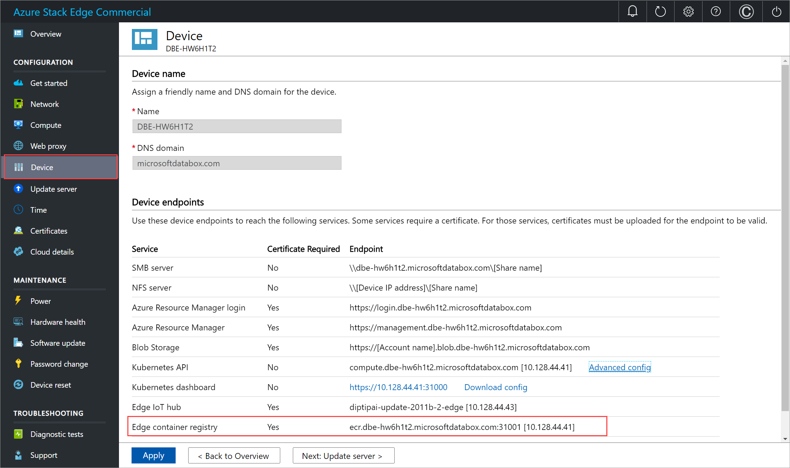
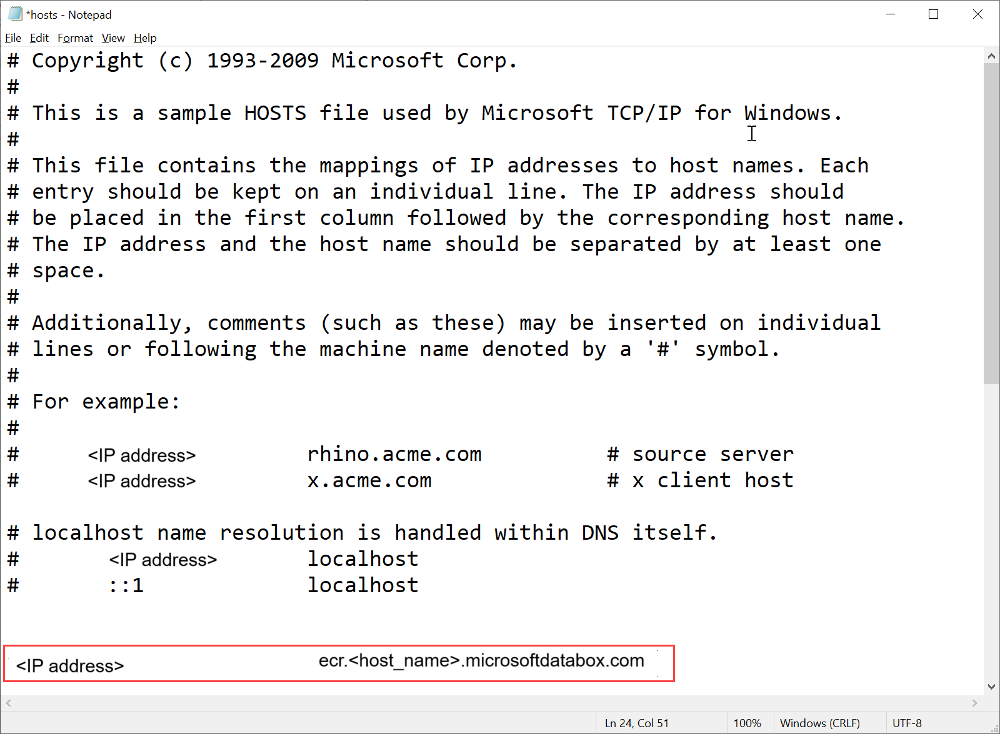
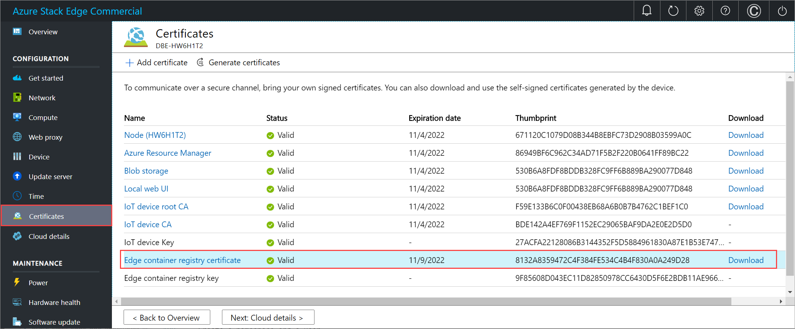
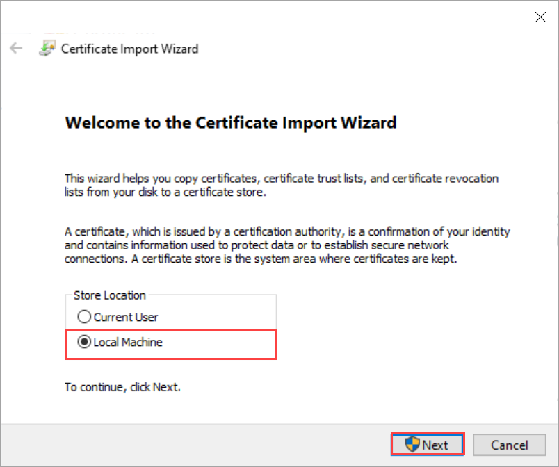
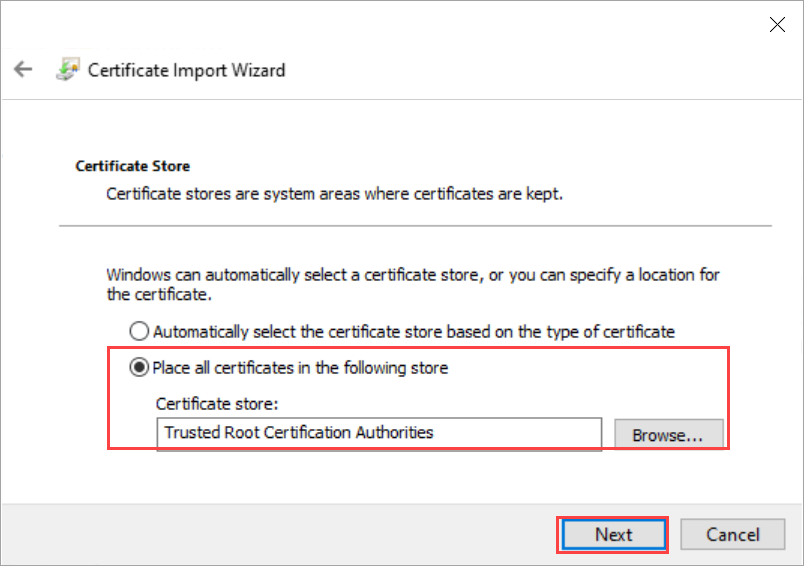
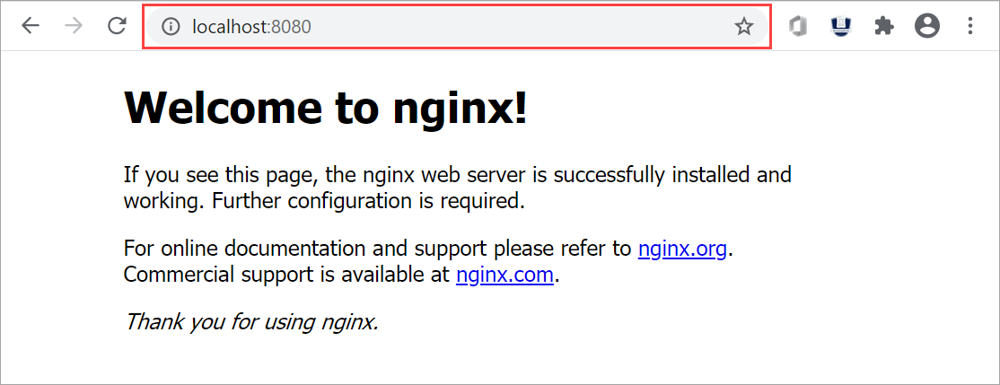

# Enable Edge container registry on your Azure Stack Edge Pro GPU device

[!INCLUDE [applies-to-GPU-and-pro-r-and-mini-r-skus](../../includes/azure-stack-edge-applies-to-gpu-pro-r-mini-r-sku.md)]

This article describes how to enable the Edge container registry and use it from within the Kubernetes cluster on your Azure Stack Edge Pro device. The example used in the article details how to push an image from a source registry, in this case, Microsoft Container registry, to the registry on the Azure Stack Edge device, the Edge container registry.

### About Edge container registry

Containerized compute applications run on container images and these images are stored in registries. Registries can be public such as Docker Hub, private, or cloud provider managed such as Azure Container Registry. For more information, see [About registries, repositories, and images](../container-registry/container-registry-concepts.md).

An Edge container registry provides a repository at the Edge, on your Azure Stack Edge Pro device. You can use this registry to store and manage your private container images.

In a multi-node environment, container images can be downloaded and pushed to the Edge container registry once. All Edge applications can use the Edge container registry for subsequent deployments.


## Prerequisites

Before you begin, make sure that:

1. You've access to an Azure Stack Edge Pro device.

1. You've activated your Azure Stack Edge Pro device as described in [Activate Azure Stack Edge Pro](azure-stack-edge-gpu-deploy-activate.md).

1. You've enabled compute role on the device. A Kubernetes cluster was also created on the device when you configured compute on the device as per the instructions in [Configure compute on your Azure Stack Edge Pro device](azure-stack-edge-gpu-deploy-configure-compute.md).

1. You have the Kubernetes API endpoint from the **Device** page of your local web UI. For more information, see the instructions in [Get Kubernetes API endpoint](azure-stack-edge-gpu-deploy-configure-compute.md#get-kubernetes-endpoints).

1. You've access to a client system with a [Supported operating system](azure-stack-edge-gpu-system-requirements.md#supported-os-for-clients-connected-to-device). If using a Windows client, the system should run PowerShell 5.0 or later to access the device.

    1. If you want to pull and push your own container images, make sure that the system has Docker client installed. If using a Windows client, [Install Docker Desktop on Windows](https://docs.docker.com/docker-for-windows/install/).  


## Enable container registry as add-on

The first step is to enable the Edge container registry as an add-on.

1. [Connect to the PowerShell interface of the device](azure-stack-edge-gpu-connect-powershell-interface.md#connect-to-the-powershell-interface). 

1. To enable the container registry as an add-on, type: 

    `Set-HcsKubernetesContainerRegistry`
    
    This operation may take several minutes to complete.

    Here is the sample output of this command:    
            
    ```powershell
    [10.128.44.40]: PS>Set-HcsKubernetesContainerRegistry
    Operation completed successfully. Use Get-HcsKubernetesContainerRegistryInfo for credentials    
    ```
            
1. To get the container registry details, type:

    `Get-HcsKubernetesContainerRegistryInfo`

    Here is the sample out of this command:  
    
    ```powershell
    [10.128.44.40]: PS> Get-HcsKubernetesContainerRegistryInfo
                
    Endpoint                                   IPAddress    Username     Password
    --------                                   ---------    --------     --------
    ecr.dbe-hw6h1t2.microsoftdatabox.com:31001 10.128.44.41 ase-ecr-user i3eTsU4zGYyIgxV
    ```    

1. Make a note of the username and the password from the output of `Get-HcsKubernetesContainerRegistryInfo`. These credentials are used to sign in to the Edge container registry while pushing images.            


## Manage container registry images

You may want to access the container registry from outside of your Azure Stack Edge device. You may also want to push or pull images in the registry.

Follow these steps to access Edge container registry:

1. Get the endpoint details for the Edge container registry.
    1. In the local UI of the device, go to **Device**.
    1. Locate the **Edge container registry endpoint**.
         
    1. Copy this endpoint and create a corresponding DNS entry into the `C:\Windows\System32\Drivers\etc\hosts` file of your client to connect to the Edge container registry endpoint. 

        \<IP address of the Kubernetes main node\>    \<Edge container registry endpoint\> 
        
            

1. Download the Edge container registry certificate from Local UI. 
    1. In the local UI of the device, go to **Certificates**.
    1. Locate the entry for **Edge container registry certificate**. To the right of this entry, select the **Download** to download the Edge container registry certificate on your client system that you'll use to access your device. 

          

1. Install the downloaded certificate on the client. If using a Windows client, follow these steps: 
    1. Select the certificate and in the **Certificate Import Wizard**, select store location as **Local machine**. 

         
    
    1. Install the certificate on your Local machine in the trusted root store. 

         

1. After the certificate is installed, restart the Docker client on your system.

1. Sign into the Edge container registry. Type:

    `docker login <Edge container registry endpoint> -u <username> -p <password>`

    Provide the Edge container registry endpoint from the **Devices** page, and the username and password that you got from the output of `Get-HcsKubernetesContainerRegistryInfo`. 

1. Use docker push or pull commands to push or pull container images from the container registry.
 
    1. Pull an image from the Microsoft Container Registry image. Type:
        
        `docker pull <Full path to the container image in the Microsoft Container Registry>`
       
    1. Create an alias of the image you pulled with the fully qualified path to your registry.

        `docker tag <Path to the image in the Microsoft container registry> <Path to the image in the Edge container registry/Image name with tag>`

    1. Push the image to your registry.
    
        `docker push <Path to the image in the Edge container registry/Image name with tag>`

    1. Run the image you pushed into your registry.
    
        `docker run -it --rm -p 8080:80 <Path to the image in the Edge container registry/Image name with tag>`

        Here is a sample output of the pull and push commands:

        ```powershell
        PS C:\WINDOWS\system32> docker login ecr.dbe-hw6h1t2.microsoftdatabox.com:31001 -u ase-ecr-user -p 3bbo2sOtDe8FouD
        WARNING! Using --password via the CLI is insecure. Use --password-stdin.
        Login Succeeded
        PS C:\WINDOWS\system32> docker pull mcr.microsoft.com/oss/nginx/nginx:1.17.5-alpine
        1.17.5-alpine: Pulling from oss/nginx/nginx
        Digest: sha256:5466bbc0a989bd1cd283c0ba86d9c2fc133491ccfaea63160089f47b32ae973b
        Status: Image is up to date for mcr.microsoft.com/oss/nginx/nginx:1.17.5-alpine
        mcr.microsoft.com/oss/nginx/nginx:1.17.5-alpine
        PS C:\WINDOWS\system32> docker tag mcr.microsoft.com/oss/nginx/nginx:1.17.5-alpine ecr.dbe-hw6h1t2.microsoftdatabox.com:31001/nginx:2.0
        PS C:\WINDOWS\system32> docker push ecr.dbe-hw6h1t2.microsoftdatabox.com:31001/nginx:2.0
        The push refers to repository [ecr.dbe-hw6h1t2.microsoftdatabox.com:31001/nginx]
        bba7d2385bc1: Pushed
        77cae8ab23bf: Pushed
        2.0: digest: sha256:b4c0378c841cd76f0b75bc63454bfc6fe194a5220d4eab0d75963bccdbc327ff size: 739
        PS C:\WINDOWS\system32> docker run -it --rm -p 8080:80 ecr.dbe-hw6h1t2.microsoftdatabox.com:31001/nginx:2.0
        2020/11/10 00:00:49 [error] 6#6: *1 open() "/usr/share/nginx/html/favicon.ico" failed (2: No such file or directory), client: 172.17.0.1, server: localhost, request: "GET /favicon.ico HTTP/1.1", host: "localhost:8080", referrer: "http://localhost:8080/"
        172.17.0.1 - - [10/Nov/2020:00:00:49 +0000] "GET /favicon.ico HTTP/1.1" 404 555 "http://localhost:8080/" "Mozilla/5.0 (Windows NT 10.0; Win64; x64) AppleWebKit/537.36 (KHTML, like Gecko) Chrome/86.0.4240.183 Safari/537.36" "-"
        ^C
        PS C:\WINDOWS\system32>    
        ```
    
1. Browse to `http://localhost:8080` to view the running container. In this case, you will see the nginx webserver running.

    

    To stop and remove the container, press `Control+C`.

 

## Use Edge container registry images via Kubernetes pods

You can now deploy the image that you pushed in your Edge container registry from within the Kubernetes pods.

1. To deploy the image, you need to configure cluster access via *kubectl*. Create a namespace, a user, grant user access to the namespace, and get a *config* file. Make sure that you can connect to the Kubernetes pods. 
    
    Follow all the steps in [Connect to and manage a Kubernetes cluster via kubectl on your Azure Stack Edge Pro GPU device](azure-stack-edge-gpu-create-kubernetes-cluster.md). 

    Here is a sample output for a namespace on your device from where the user can access the Kubernetes cluster.

    ```powershell
    [10.128.44.40]: PS>New-HcsKubernetesNamespace -Namespace myecr
    [10.128.44.40]: PS>New-HcsKubernetesUser -UserName ecruser
    apiVersion: v1
    clusters:
    - cluster:
        certificate-authority-data: LS0tLS1CRUdJTiBDRVJUSUZJQ0FURS0tLS0tCk1JSUN5RENDQWJDZ0F3SUJBZ0lCQURBTkJna3Foa2lHOXcwQkFRc0ZBREFWTVJNd0VRWURWUVFERXdwcmRXSmwKY201bGRHVnpNQjRYRFRJd01URXdOVEF6TkRJek1Gb1hEVE13TVRFd016QXpOREl6TUZvd0ZURVRNQkVnNjOVRLWndCQ042cm1XQms2eXFwcXI1MUx6bApTaXMyTy91UEJ2YXNSSUUzdzgrbmEwdG1aTERZZ2F6MkQwMm42Q29mUmtyUTR2d1lLTnR1MlpzR3pUdz0KLS0tLS1FTkQgQ0VSVElGSUNBVEUtLS0tLQo=
        server: https://compute.dbe-hw6h1t2.microsoftdatabox.com:6443
        name: kubernetes
        ===================CUT=========================================CUT==============
        client-certificate-data: LS0tLS1CRUdJTiBDRVJUSUZJQ0FURS0tLS0tCk1JSUMwRENDQWJpZ0F3SUJBZ0lJYmVWRGJSTzZ3ell3RFFZSktvWklodmNOQVFFTEJRQXdGVEVUTUJFR0ExVUUKQXhNS2EzVmlaWEp1WlhSbGN6QWVGdzB5TURFeE1EVXdNelF5TXpCYUZ3MHlNVEV4TURreU16UTRNal
        ===================CUT=========================================CUT==============
        DMVUvN3lFOG5UU3k3b2VPWitUeHdzCjF1UDByMjhDZ1lCdHdRY0ZpcFh1blN5ak16dTNIYjhveFI2V3VWWmZldFFKNElKWEFXOStVWGhKTFhyQ2x4bUcKWHRtbCt4UU5UTzFjQVNKRVZWVDd6Tjg2ay9kSU43S3JIVkdUdUxlUDd4eGVjV2VRcWJrZEVScUsxN0liTXpiVApmbnNxc0dobEdmLzdmM21kTGtyOENrcWs5TU5aM3MvUVIwRlFCdk94ZVpuUlpTeDVGbUR5S1E9PQotLS0tLUVORCBSU0EgUFJJVkFURSBLRVktLS0tLQo=

    [10.128.44.40]: PS>Grant-HcsKubernetesNamespaceAccess -Namespace myecr -UserName ecruser
    [10.128.44.40]: PS>kubectl get pods -n "myecr"
    No resources found.
    PS C:\WINDOWS\system32>
    ```  

2. The image pull secrets are already set in all the Kubernetes namespaces on your device. You can get secrets by using the `get secrets` command. Here is a sample output:

    ```powershell
    PS C:\WINDOWS\system32> .\kubectl.exe get secrets -n myecr
    NAME                  TYPE                                  DATA   AGE
    ase-ecr-credentials   kubernetes.io/dockerconfigjson        1      99m
    default-token-c7kww   kubernetes.io/service-account-token   3      107m
    sec-smbcredentials    microsoft.com/smb                     2      99m
    PS C:\WINDOWS\system32>   
    ```    

3. Deploy a pod to your namespace using kubectl. Use the following `yaml`. 

    Replace the image: `<image-name>` with the image pushed to the container registry. Refer to the secrets in your namespaces using imagePullSecrets with a name: `ase-ecr-credentials`.
    
    ```yml
    apiVersion: v1
    kind: Pod
    metadata:
      name: nginx
    spec:
      containers:
      - name: nginx
        image: ecr.dbe-hw6h1t2.microsoftdatabox.com:31001/nginx:2.0
        imagePullPolicy: Always
      imagePullSecrets:
      - name: ase-ecr-credentials
    ```

4. Apply the deployment in the namespace you created using the apply command. Verify that the container is running. Here is a sample output:
   
    ```yml
    PS C:\Windows\System32> .\kubectl.exe apply -f .\deployment.yml -n myecr
    pod/nginx configured
    PS C:\Windows\System32> .\kubectl.exe get pods -n myecr
    NAME    READY   STATUS    RESTARTS   AGE
    nginx   1/1     Running   0          27m
    PS C:\Windows\System32>
    ```

## Delete container registry images

Edge Container Registry storage is hosted on a local share within your Azure Stack Edge Pro device which is limited by the available storage on the device. It is your responsibility to delete unused docker images from the container registry using Docker HTTP v2 API (https://docs.docker.com/registry/spec/api/).  

To remove one or more container images, follow these steps:

1. Set the image name to the image you want to delete.

    ```powershell
    PS C:\WINDOWS\system32> $imageName="nginx"    
    ```

1. Set the username and password of the container registry as a PS credential

    ```powershell
    PS C:\WINDOWS\system32> $username="ase-ecr-user"
    PS C:\WINDOWS\system32> $password="3bbo2sOtDe8FouD"
    PS C:\WINDOWS\system32> $securePassword = ConvertTo-SecureString $password -AsPlainText -Force
    PS C:\WINDOWS\system32> $credential = New-Object System.Management.Automation.PSCredential ($username, $securePassword)    
    ```

1. List the tags associated with the image

    ```powershell
    PS C:\WINDOWS\system32> $tags = Invoke-RestMethod -Credential $credential -Uri "https://ecr.dbe-hw6h1t2.microsoftdatabox.com:31001/v2/nginx/tags/list" | Select-Object -ExpandProperty tags
    PS C:\WINDOWS\system32> $tags
    2.0
    PS C:\WINDOWS\system32> $tags = Invoke-RestMethod -Credential $credential -Uri "https://ecr.dbe-hw6h1t2.microsoftdatabox.com:31001/v2/$imageName/tags/list" | Select-Object -ExpandProperty tags
    PS C:\WINDOWS\system32> $tags
    2.0
    PS C:\WINDOWS\system32>    
    ```
  
1. List the digest associated with the tag you would like to delete. This uses $tags from the output of above command. If you have multiple tags, select one of them and use in the next command.

    ```powershell
    PS C:\WINDOWS\system32> $response = Invoke-WebRequest -Method Head -Credential $credential -Uri "https://ecr.dbe-hw6h1t2.microsoftdatabox.com:31001/v2/$imageName/manifests/$tags" -Headers @{ 'Accept' = 'application/vnd.docker.distribution.manifest.v2+json' }
    PS C:\WINDOWS\system32> $digest = $response.Headers['Docker-Content-Digest']
    PS C:\WINDOWS\system32> $digest
    sha256:b4c0378c841cd76f0b75bc63454bfc6fe194a5220d4eab0d75963bccdbc327ff
    PS C:\WINDOWS\system32>    
    ```
1. Delete the image using the digest of the image:tag

    ```powershell
    PS C:\WINDOWS\system32> Invoke-WebRequest -Method Delete -Credential $credential -Uri "https://ecr.dbe-hw6h1t2.microsoftdatabox.com:31001/v2/$imageName/manifests/$digest" | Select-Object -ExpandProperty StatusDescription    
    ```

After you delete the unused images, the space associated with the unreferenced images is automatically reclaimed by a process that runs nightly. 

## Next steps

- [Deploy a stateless application on your Azure Stack Edge Pro](./azure-stack-edge-gpu-deploy-stateless-application-kubernetes.md).