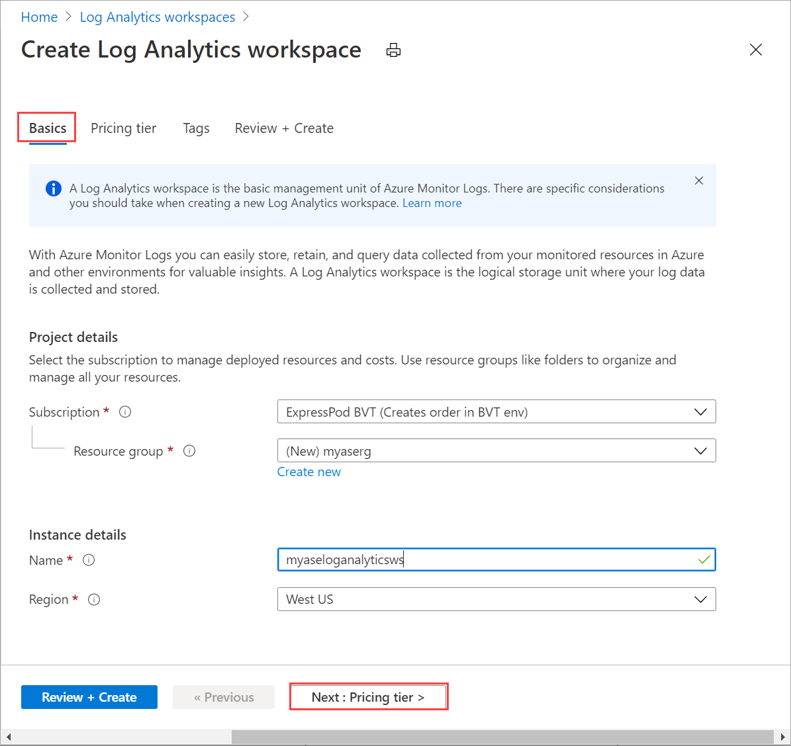
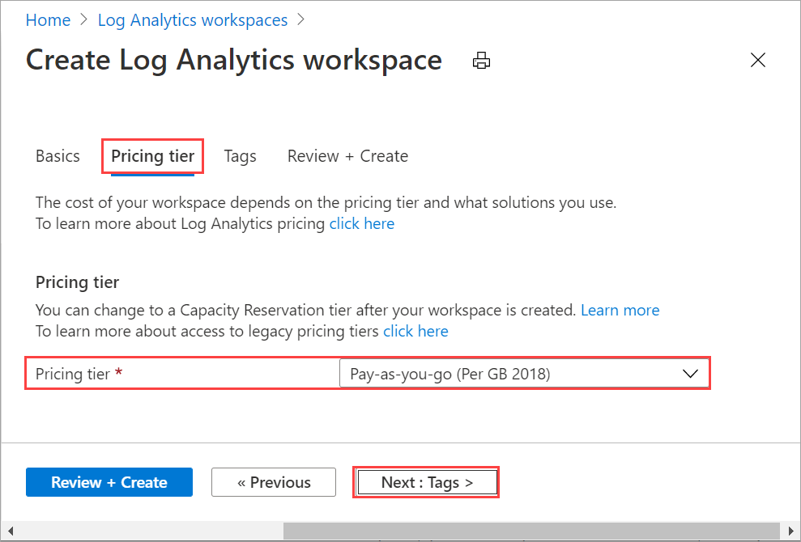
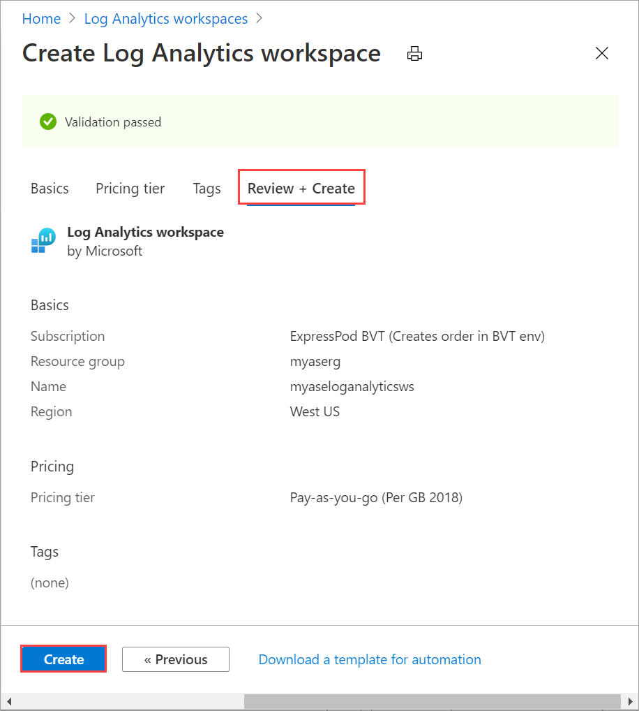
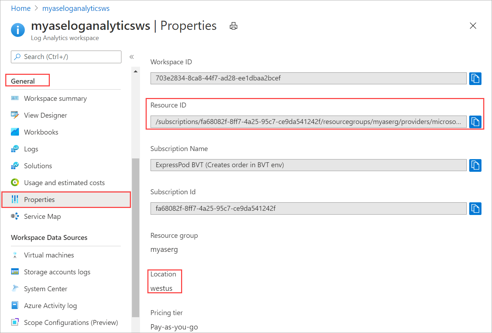
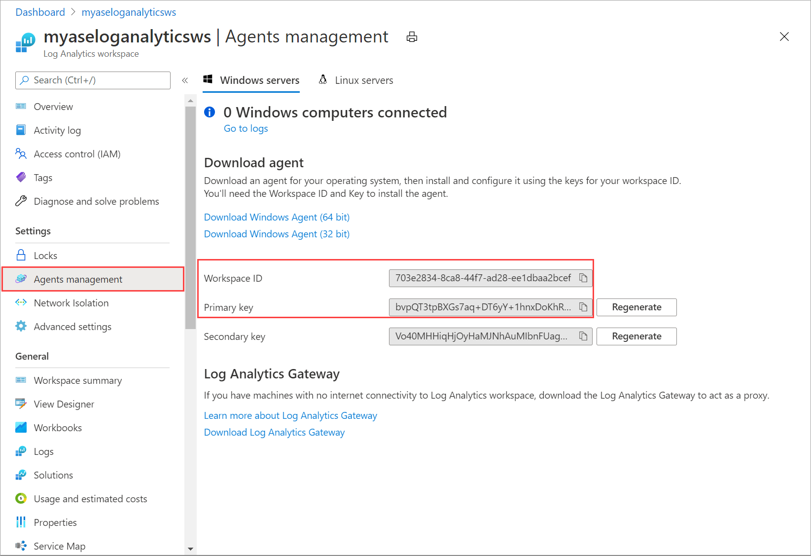
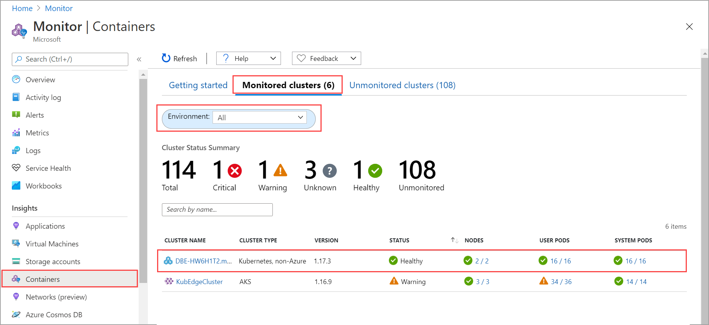

# Enable Azure Monitor on your Azure Stack Edge Pro GPU device

[!INCLUDE [applies-to-GPU-and-pro-r-and-mini-r-skus](../../includes/azure-stack-edge-applies-to-gpu-pro-r-mini-r-sku.md)]

Monitoring containers on your Azure Stack Edge Pro GPU device is critical, specially when you are running multiple compute applications. Azure Monitor lets you collect container logs and memory and processor metrics from the Kubernetes cluster running on your device.

This article describes the steps required to enable Azure Monitor on your device and gather container logs in Log Analytics workspace. The Azure Monitor metrics store is currently not supported with your Azure Stack Edge Pro GPU device. 

> [!NOTE]
> If Azure Arc is enabled on the Kubernetes cluster on your device, follow the steps in [Azure Monitor Container Insights for Azure Arc-enabled Kubernetes clusters](../azure-monitor/containers/container-insights-enable-arc-enabled-clusters.md?toc=%2fazure%2fazure-arc%2fkubernetes%2ftoc.json) to set up container monitoring.


## Prerequisites

Before you begin, you'll need:

- An Azure Stack Edge Pro device. Make sure that the device is activated as per the steps in [Tutorial: Activate your device](azure-stack-edge-gpu-deploy-activate.md).
- You've completed **Configure compute** step as per the [Tutorial: Configure compute on your Azure Stack Edge Pro device](azure-stack-edge-gpu-deploy-configure-compute.md) on your device. Your device should have an associated IoT Hub resource, an IoT device, and an IoT Edge device.


## Create Log Analytics workspace

Take the following steps to create a log analytics workspace. A log analytics workspace is a logical storage unit where the log data is collected and stored.

1. In the Azure portal, select **+ Create a resource** and search for **Log Analytics Workspace** and then select **Create**. 
1. In the **Create Log Analytics workspace**, configure the following settings. Accept the remainder as default.

    1. On the **Basics** tab, provide the subscription, resource group, name, and region for the workspace. 

          

    1. On the **Pricing tier** tab, accept the default **Pay-as-you-go plan**.

         

    1. On the **Review + Create** tab, review the information for your workspace and select **Create**.

        

For more information, see the detailed steps in [Create a Log Analytics workspace via Azure portal](../azure-monitor/logs/quick-create-workspace.md).


## Enable container insights

Take the following steps to enable Container Insights on your workspace. 

1. Follow the detailed steps in [Add the Azure Monitor Containers solution](../azure-monitor/containers/container-insights-hybrid-setup.md#add-the-azure-monitor-containers-solution). Use the following template file `containerSolution.json`:

    ```yml
    {
    "$schema": "https://schema.management.azure.com/schemas/2015-01-01/deploymentTemplate.json#",
    "contentVersion": "1.0.0.0",
    "parameters": {
        "workspaceResourceId": {
            "type": "string",
            "metadata": {
                "description": "Azure Monitor Log Analytics Workspace Resource ID"
            }
        },
        "workspaceRegion": {
            "type": "string",
            "metadata": {
                "description": "Azure Monitor Log Analytics Workspace region"
            }
        }
    },
    "resources": [
        {
            "type": "Microsoft.Resources/deployments",
            "name": "[Concat('ContainerInsights', '-',  uniqueString(parameters('workspaceResourceId')))]",
            "apiVersion": "2017-05-10",
            "subscriptionId": "[split(parameters('workspaceResourceId'),'/')[2]]",
            "resourceGroup": "[split(parameters('workspaceResourceId'),'/')[4]]",
            "properties": {
                "mode": "Incremental",
                "template": {
                    "$schema": "https://schema.management.azure.com/schemas/2015-01-01/deploymentTemplate.json#",
                    "contentVersion": "1.0.0.0",
                    "parameters": {},
                    "variables": {},
                    "resources": [
                        {
                            "apiVersion": "2015-11-01-preview",
                            "type": "Microsoft.OperationsManagement/solutions",
                            "location": "[parameters('workspaceRegion')]",
                            "name": "[Concat('ContainerInsights', '(', split(parameters('workspaceResourceId'),'/')[8], ')')]",
                            "properties": {
                                "workspaceResourceId": "[parameters('workspaceResourceId')]"
                            },
                            "plan": {
                                "name": "[Concat('ContainerInsights', '(', split(parameters('workspaceResourceId'),'/')[8], ')')]",
                                "product": "[Concat('OMSGallery/', 'ContainerInsights')]",
                                "promotionCode": "",
                                "publisher": "Microsoft"
                            }
                        }
                    ]
                },
                "parameters": {}
            }
            }
        ]
    }
    ```

1. Get the resource ID and location. Go to `Your Log Analytics workspace > General > Properties`. Copy the following information:

    - **resource ID**, which is the fully qualified Azure resource ID of the Azure Log Analytics workspace. 
    - **location**, which is the Azure region.

     

1. Use the following parameters file `containerSolutionParams.json`. Replace `workspaceResourceId` with the resource ID and `workspaceRegion` with the location copied in the earlier step.

    ```yaml
    {
        "$schema": "https://schema.management.azure.com/schemas/2015-01-01/deploymentParameters.json#",
        "contentVersion": "1.0.0.0",
        "parameters": {
        "workspaceResourceId": {
            "value": "/subscriptions/fa68082f-8ff7-4a25-95c7-ce9da541242f/resourcegroups/myaserg/providers/microsoft.operationalinsights/workspaces/myaseloganalyticsws"
        },
        "workspaceRegion": {
        "value": "westus"
        }
        }
    }
    ```
    
    Here is a sample output of a Log Analytics workspace with Container Insights enabled:
    
    ```output
    Requesting a Cloud Shell.Succeeded.
    Connecting terminal...
    MOTD: Switch to Bash from PowerShell: bash
    VERBOSE: Authenticating to Azure ...
    VERBOSE: Building your Azure drive ...
    
    PS /home/myaccount> az account set -s fa68082f-8ff7-4a25-95c7-ce9da541242f
    PS /home/myaccount> ls
    clouddrive  containerSolution.json
    PS /home/myaccount> ls
    clouddrive  containerSolution.json  containerSolutionParams.json
    PS /home/myaccount> az deployment group create --resource-group myaserg --name Testdeployment1 --template-file containerSolution.json --parameters containerSolutionParams.json
    {- Finished ..
        "id": "/subscriptions/fa68082f-8ff7-4a25-95c7-ce9da541242f/resourceGroups/myaserg/providers/Microsoft.Resources/deployments/Testdeployment1",
        "location": null,
        "name": "Testdeployment1",
        "properties": {
        "correlationId": "3a9045fe-2de0-428c-b17b-057508a8c575",
        "debugSetting": null,
        "dependencies": [],
        "duration": "PT11.1588316S",
        "error": null,
        "mode": "Incremental",
        "onErrorDeployment": null,
        "outputResources": [
            {
            "id": "/subscriptions/fa68082f-8ff7-4a25-95c7-ce9da541242f/resourceGroups/myaserg/providers/Microsoft.OperationsManagement/solutions/ContainerInsights(myaseloganalyticsws)",
            "resourceGroup": "myaserg"
            }
        ],
        "outputs": null,
        "parameters": {
            "workspaceRegion": {
            "type": "String",
            "value": "westus"
            },
            "workspaceResourceId": {
            "type": "String",
            "value": "/subscriptions/fa68082f-8ff7-4a25-95c7-ce9da541242f/resourcegroups/myaserg/providers/microsoft.operationalinsights/workspaces/myaseloganalyticsws"
            }
        },
        "parametersLink": null,
        "providers": [
            {
            "id": null,
            "namespace": "Microsoft.Resources",
            "registrationPolicy": null,
            "registrationState": null,
            "resourceTypes": [
                {
                "aliases": null,
                "apiProfiles": null,
                "apiVersions": null,
                "capabilities": null,
                "defaultApiVersion": null,
                "locations": [
                    null
                ],
                "properties": null,
                "resourceType": "deployments"
                }
            ]
            }
        ],
        "provisioningState": "Succeeded",
        "templateHash": "10500027184662969395",
        "templateLink": null,
        "timestamp": "2020-11-06T22:09:56.908983+00:00",
        "validatedResources": null
        },
        "resourceGroup": "myaserg",
        "tags": null,
        "type": "Microsoft.Resources/deployments"
    }
    PS /home/myaccount>
    ```

## Configure Azure Monitor on your device

1. Go to the newly created Log Analytics Resource and copy the **Workspace ID** and **Primary key** (workspace key).

    

    Save this information as you will use it in a later step.

1. [Connect to the PowerShell interface of the device](azure-stack-edge-gpu-connect-powershell-interface.md#connect-to-the-powershell-interface). 
    
1. Use the log analytics Workspace ID and Workspace key with the following cmdlet:

    `Set-HcsKubernetesAzureMonitorConfiguration -WorkspaceId <> -WorkspaceKey <>`

    > [!NOTE]
    > By default, this cmdlet configures the Azure public cloud. To configure a government cloud or non-public cloud, use the parameter `AzureCloudDomainName`. 

1. After the Azure Monitor is enabled, you should see logs in the Log Analytics workspace. To view the status of the Kubernetes cluster deployed on your device, go to **Azure Monitor > Insights > Containers**. For the environment option, select **All**. 

    

## Next steps

- Learn how to [Monitor Kubernetes workloads via the Kubernetes Dashboard](azure-stack-edge-gpu-monitor-kubernetes-dashboard.md).
- Learn how to [Manage device event alert notifications](azure-stack-edge-gpu-manage-device-event-alert-notifications.md).
