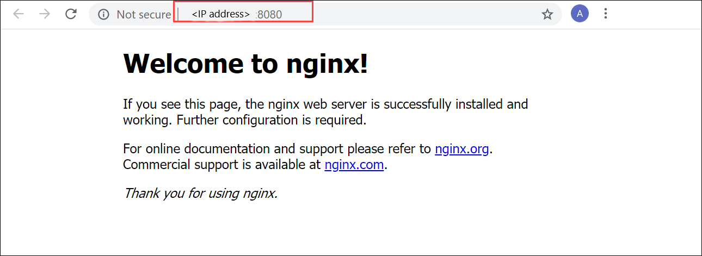

# Enable Azure Monitor on your Azure Stack Edge Pro GPU device

This article describes how you can use an IoT Edge module to deploy a stateless application on your Azure Stack Edge Pro device.

To deploy the stateless application, you'll take the following steps:

- Ensure that prerequisites are completed before you deploy an IoT Edge module.
- Add an IoT Edge module to access compute network on your Azure Stack Edge Pro.
- Verify the module can access the enabled network interface.

This how-to article is applicable for the 2009, 2010, and 2011 releases. 

This will provide logs in Log Analytics workspace. This does not yet support Azure Custom Metrics store (Azure Monitor metrics store)


## Prerequisites

Before you begin, you'll need:

- An Azure Stack Edge Pro device. Make sure that the device is activated as per the steps in [Tutorial: Activate your device](azure-stack-edge-gpu-deploy-activate.md).
- You've completed **Configure compute** step as per the [Tutorial: Configure compute on your Azure Stack Edge Pro device](azure-stack-edge-gpu-deploy-configure-compute.md) on your device. Your device should have an associated IoT Hub resource, an IoT device, and an IoT Edge device.


## Create Log Analytics workspace.

Take the following steps to create a log analytics workspace. A log analytics workspace is a logical storage unit where the log data is collected and stored.

1. In the Azure portal, select **+ Create a resource** and search for **Log Analytics Workspace** and then select **Create**. 
1. In the **Create Log Analytics workspace**, on the **Basics** tab, provide the subscription, resource group, name, and region for the workspace. 
1. On the **Pricing tier** tab, accept the default **Pay-as-you-go plan**.
1. On the **Review + Create** tab, review the information for your workspace and select **Create**.

For more information, see the detailed steps in [Create a Log Analytics workspace via Azure portal](../azure-monitor/learn/quick-create-workspace.md).


## Enable container insights

Take the following steps to enable Container Insights on your workspace. 

1. Follow the detailed steps in [How to add the Azure Monitor Containers solution](../azure-monitor/insights/container-insights-hybrid-setup.md#how-to-add-the-azure-monitor-containers-solution).

1. Here is a sample output of a Log Analytics workspace with Container Insights enabled:

3.	Go to the newly created Log Analytics Resource and copy the workspace Id and Workspace Key


1. In the IoT Hub resource associated with your device, go to **Automatic Device Management > IoT Edge**.
1. Select and click the IoT Edge device associated with your Azure Stack Edge Pro device. 

      

1. Select **Set modules**. On **Set modules on device**, select **+ Add** and then select **IoT Edge Module**.

    

1. In the **Add IoT Edge module**:

    1. Specify a **Name** for your webserver app module that you want to deploy.
    2. Under **Module settings** tab, provide an **Image URI** for your module image. A module matching the provided name and tags is retrieved. In this case, `nginx:stable` will pull a stable nginx image (tagged as stable) from the public [Docker repository](https://hub.docker.com/_/nginx/).

            

    3. In the **Container Create Options** tab, paste the following sample code:  

        ```
        {
            "HostConfig": {
                "PortBindings": {
                    "80/tcp": [
                        {
                            "HostPort": "8080"
                        }
                    ]
                }
            }
        }
        ```

        This configuration lets you access the module using the compute network IP over *http* on TCP port 8080 (with the default webserver port being 80). Select **Add**.

        

    4. Select **Review + create**. Review the module details and select **Create**.

## Verify module access

1. Verify the module is successfully deployed and is running. On the **Modules** tab, the runtime status of the module should be **running**.  

    

1. To get the external endpoint of the webserver app, [access the Kubernetes dashboard](azure-stack-edge-gpu-monitor-kubernetes-dashboard.md#access-dashboard). 
1. In the left-pane of the dashboard, filter by **iotedge** namespace. Go to **Discovery and Load balancing > Services**. Under the list of services listed, locate the external endpoint for the webserver app module. 

    

1. Select the external endpoint to open a new browser window.

    You should see that the webserver app is running.

    

## Next steps

- Learn how to Expose stateful application via an IoT Edge module<!--insert link-->.
