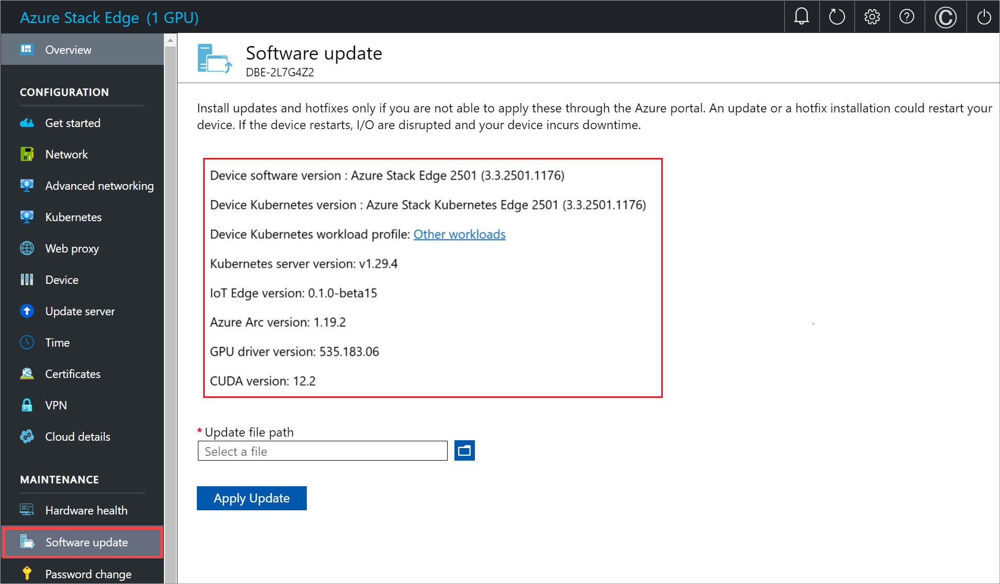

# Update your Azure Stack Edge Pro GPU 

[!INCLUDE [applies-to-GPU-and-pro-r-and-mini-r-skus](../../includes/azure-stack-edge-applies-to-gpu-pro-r-mini-r-sku.md)]

This article describes the steps required to install update on your Azure Stack Edge Pro with GPU via the local web UI and via the Azure portal. You apply the software updates or hotfixes to keep your Azure Stack Edge Pro device and the associated Kubernetes cluster on the device up-to-date.

> [!NOTE]
> The procedure described in this article was performed using a different version of software, but the process remains the same for the current software version. 

## About latest updates

The current update is Update 2309. This update installs two updates, the device update followed by Kubernetes updates. 

The associated versions for this update are:

- Device software version: Azure Stack Edge 2309 (3.2.2380.1632)
- Device Kubernetes version: Azure Stack Kubernetes Edge 2309 (3.2.2380.1632)
- Kubernetes server version: v1.25.5
- IoT Edge version: 0.1.0-beta15
- Azure Arc version: 1.11.7
- GPU driver version for Kubernetes for Azure Stack Edge: 530.30.02
- GPU driver version for Azure Kubernetes Service (AKS): 525.85.12
- CUDA version for Kubernetes for Azure Stack Edge: 12.1
- CUDA version for Azure Kubernetes Service (AKS): 12.0

For information on what's new in this update, go to [Release notes](azure-stack-edge-gpu-2309-release-notes.md).

**To apply the 2309 update, your device must be running version 2203 or later.**

- If you are not running the minimum required version, you'll see this error:
 
  *Update package cannot be installed as its dependencies are not met.*

- You can update to 2303 from 2207 or later, and then install 2309.

Supported update paths:

| Current version of Azure Stack Edge software and Kubernetes | Upgrade to Azure Stack Edge software and Kubernetes | Desired update to 2309 |
|-------|----------|------------ |
| 2207  | 2303  | 2309  |
| 2209  | 2303  | 2309  |
| 2210  | 2303  | 2309  |
| 2301  | 2303  | 2309  |
| 2303  | Directly to | 2309  |

### Update Azure Kubernetes service on Azure Stack Edge

> [!IMPORTANT]
> Use the following procedure only if you are an SAP or a PMEC customer.

If you have Azure Kubernetes service deployed and your Azure Stack Edge device and Kubernetes versions are either 2207 or 2209, you must update in multiple steps to apply 2309.

Use the following steps to update your Azure Stack Edge version and Kubernetes version to 2309:

1. Update your device version to 2303.
1. Update your Kubernetes version to 2210.
1. Update your Kubernetes version to 2303.
1. Update both device software and Kubernetes to 2309.

If you are running 2210 or 2301, you can update both your device version and Kubernetes version directly to 2303 and then to 2309.

If you are running 2303, you can update both your device version and Kubernetes version directly to
2309.

In Azure portal, the process will require two clicks, the first update gets your device version to 2303 and your Kubernetes version to 2210, and the second update gets your Kubernetes version upgraded to 2309.

From the local UI, you will have to run each update separately: update the device version to 2303, update Kubernetes version to 2210, update Kubernetes version to 2303, and then the third update gets both the device version and Kubernetes version to 2309.

Each time you change the Kubernetes profile, you are prompted for the Kubernetes update. Go ahead and apply the update.

### Updates for a single-node vs two-node

The procedure to update an Azure Stack Edge is the same whether it is a single-node device or a two-node cluster. This applies both to the Azure portal or the local UI procedure. 

- **Single node** - For a single node device, installing an update or hotfix is disruptive and will restart your device. Your device will experience a downtime for the entire duration of the update.

- **Two-node** - For a two-node cluster, this is an optimized update. The two-node cluster might experience short, intermittent disruptions while the update is in progress. We recommend that you shouldn't perform any operations on the device node when update is in progress. 

    The Kubernetes worker VMs will go down when a node goes down. The Kubernetes master VM will fail over to the other node. Workloads will continue to run. For more information, see [Kubernetes failover scenarios for Azure Stack Edge](azure-stack-edge-gpu-kubernetes-failover-scenarios.md).

Provisioning actions such as creating shares or virtual machines are not supported during update. The update takes approximately 60 to 75 minutes per node to complete. 

To install updates on your device, you need to follow these steps:

1. Configure the location of the update server. 
1. Apply the updates via the Azure portal UI or the local web UI.

Each of these steps is described in the following sections.

## Configure update server

1. In the local web UI, go to **Configuration** > **Update server**.
   
    <!---->

2. In **Select update server type**, from the dropdown list, choose from Microsoft Update server (default) or Windows Server Update Services.  
   
    If updating from the Windows Server Update Services, specify the server URI. The server at that URI will deploy the updates on all the devices connected to this server.

    <!---->
    
    The WSUS server is used to manage and distribute updates through a management console. A WSUS server can also be the update source for other WSUS servers within the organization. The WSUS server that acts as an update source is called an upstream server. In a WSUS implementation, at least one WSUS server on your network must be able to connect to Microsoft Update to get available update information. As an administrator, you can determine - based on network security and configuration - how many other WSUS servers connect directly to Microsoft Update.
    
    For more information, go to [Windows Server Update Services (WSUS)](/windows-server/administration/windows-server-update-services/get-started/windows-server-update-services-wsus)

## Use the Azure portal

We recommend that you install updates through the Azure portal. The device automatically scans for updates once a day. Once the updates are available, you see a notification in the portal. You can then download and install the updates.

> [!NOTE]
> - Make sure that the device is healthy and status shows as **Your device is running fine!** before you proceed to install the updates.

Depending on the software version that you are running, install process might differ slightly. 

- If you are updating from 2106 to 2110 or later, you will have a one-click install. See the **version 2106 and later** tab for instructions.
- If you are updating to versions prior to 2110, you will have a two-click install. See **version 2105 and earlier** tab for instructions.

### [version 2106 and later](#tab/version-2106-and-later)

[!INCLUDE [azure-stack-edge-install-2110-updates](../../includes/azure-stack-edge-install-2110-updates.md)]

### [version 2105 and earlier](#tab/version-2105-and-earlier)

1. When the updates are available for your device, you see a notification in the **Overview** page of your Azure Stack Edge resource. Select the notification or from the top command bar, **Update device**. This will allow you to apply device software updates.

    

2. In the **Device updates** blade, check that you have reviewed the license terms associated with new features in the release notes.

    You can choose to **Download and install** the updates or just **Download** the updates. You can then choose to install these updates later.

        

    If you want to download and install the updates, check the option that updates install automatically after the download completes.

    

3. The download of updates starts. You see a notification that the download is in progress.

    

    A notification banner is also displayed in the Azure portal. This indicates the download progress.

    

    You can select this notification or select **Update device** to see the detailed status of the update.

    

4. After the download is complete, the notification banner updates to indicate the completion. If you chose to download and install the updates, the installation will begin automatically.

    If you chose to download updates only, then select the notification to open the **Device updates** blade. Select **Install**.
  
5. You see a notification that the install is in progress. The portal also displays an informational alert to indicate that the install is in progress. The device goes offline and is in maintenance mode.
   
    

6. For a 1-node device, the device restarts after the updates are installed. The critical alert during the restart indicates that the device heartbeat is lost.

    

    Select the alert to see the corresponding device event.
    
    

7. After the restart, the device software will finish updating. After the update is complete, you can verify from the local web UI that the device software is updated. The Kubernetes software version has not been updated.

    

8. You will see a notification banner indicating that device updates are available. Select this banner to start updating the Kubernetes software on your device. 

     

     

    If you select the **Update device** from the top command bar, you can see the progress of the updates.  

     

8. The device status updates to **Your device is running fine** after the updates are installed. 

    

    Go to the local web UI and then go to **Software update** page. Verify that the Kubernetes update has successfully installed and the software version reflects that.

    

Once the device software and Kubernetes updates are successfully installed, the banner notification disappears. 

---

Your device now has the latest version of device software and Kubernetes.

## Use the local web UI

There are two steps when using the local web UI:

* Download the update or the hotfix
* Install the update or the hotfix

Each of these steps is described in detail in the following sections.

### Download the update or the hotfix

Perform the following steps to download the update. You can download the update from the Microsoft-supplied location or from the Microsoft Update Catalog.

Do the following steps to download the update from the Microsoft Update Catalog.

1. Start the browser and navigate to [https://catalog.update.microsoft.com](https://catalog.update.microsoft.com).

    

1. In the search box of the Microsoft Update Catalog, enter the Knowledge Base (KB) number of the hotfix or terms for the update you want to download. For example, enter **Azure Stack Edge**, and then click **Search**.
   
    The update listing appears as **Azure Stack Edge Update 2309**.

    > [!NOTE]
    > Make sure to verify which workload you are running on your device [via the local UI](./azure-stack-edge-gpu-deploy-configure-network-compute-web-proxy.md#configure-compute-ips-1) or [via the PowerShell](./azure-stack-edge-connect-powershell-interface.md) interface of the device. Depending on the workload that you are running, the update package will differ.

	Specify the update package for your environment. Use the following table as a reference:

    | Kubernetes       | Local UI Kubernetes workload profile     | Update package name   | Example Update File |
    |------------------|--------------|---------------------------|-----------------------------------|
    | Azure Kubernetes Service   | Azure Private MEC Solution in your environment  SAP Digital Manufacturing for Edge Computing or another Microsoft Partner Solution in your Environment | Azure Stack Edge Update 2309 Kubernetes Package for Private MEC/SAP Workloads  | release~ase-2307d.3.2.2380.1632-42623-79365624-release_host_MsKubernetes_Package   |
    | Kubernetes for Azure Stack Edge |Other workloads in your environment  | Azure Stack Edge Update 2309 Kubernetes Package for Non Private MEC/Non SAP Workloads | \release~ase-2307d.3.2.2380.1632-42623-79365624-release_host_AseKubernetes_Package |

1. Select **Download**. There are two packages to download for the update. The first package will have two files for the device software updates (*SoftwareUpdatePackage.0.exe*, *SoftwareUpdatePackage.1.exe*) and the second package has two files for the Kubernetes updates (*Kubernetes_Package.0.exe* and *Kubernetes_Package.1.exe*), respectively. Download the packages to a folder on the local system. You can also copy the folder to a network share that is reachable from the device. 

### Install the update or the hotfix

Prior to the update or hotfix installation, make sure that:

 - You have the update or the hotfix downloaded either locally on your host or accessible via a network share.
 - Your device status is healthy as shown in the **Overview** page of the local web UI.

   

This procedure takes around 20 minutes to complete. Perform the following steps to install the update or hotfix.

1. In the local web UI, go to **Maintenance** > **Software update**. Make a note of the software version that you are running. 
   

2. Provide the path to the update file. You can also browse to the update installation file if placed on a network share. Select the two software files (with *SoftwareUpdatePackage.0.exe* and *SoftwareUpdatePackage.1.exe* suffix) together.

   <!---->

3. Select **Apply update**.

   <!---->

4. When prompted for confirmation, select **Yes** to proceed. Given the device is a single node device, after the update is applied, the device restarts and there is downtime. 
   
   

5. The update starts. After the device is successfully updated, it restarts. The local UI is not accessible in this duration.
   
6. After the restart is complete, you are taken to the **Sign in** page. To verify that the device software has been updated, in the local web UI, go to **Maintenance** > **Software update**. For the current release, the displayed software version should be **Azure Stack Edge 2309**. 

7. You will now update the Kubernetes software version. Select the remaining two Kubernetes files together (file with the *Kubernetes_Package.0.exe* and *Kubernetes_Package.1.exe* suffix) and repeat the above steps to apply update.   

   <!---->

8. Select **Apply Update**.

   <!---->

9. When prompted for confirmation, select **Yes** to proceed.

10. After the Kubernetes update is successfully installed, there is no change to the displayed software in **Maintenance** > **Software update**.

    

## Next steps

Learn more about [administering your Azure Stack Edge Pro](azure-stack-edge-manage-access-power-connectivity-mode.md).
