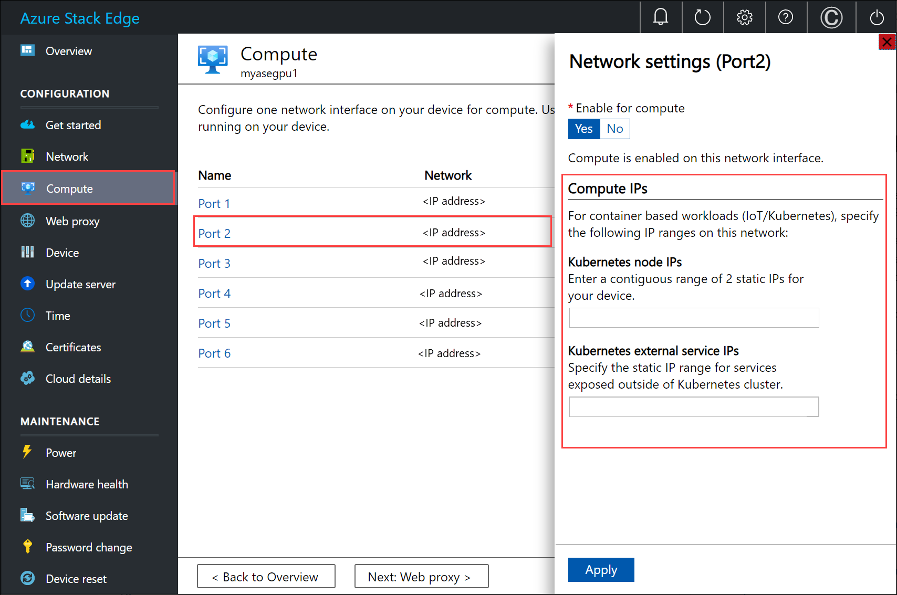

# Kubernetes networking on Azure Stack Edge Pro GPU device

[!INCLUDE [applies-to-GPU-and-pro-r-and-mini-r-skus](../../includes/azure-stack-edge-applies-to-gpu-pro-r-mini-r-sku.md)]

On your Azure Stack Edge Pro GPU device, a Kubernetes cluster is created when you configure compute role. Once the Kubernetes cluster is created, then containerized applications can be deployed on the Kubernetes cluster in Pods. There are distinct ways that networking is used for the Pods in your Kubernetes cluster. 

This article describes the networking in a Kubernetes cluster in general and specifically in the context of your Azure Stack Edge Pro GPU device. 

## Networking requirements

Here is an example of a typical two-tier app that is deployed to the Kubernetes cluster.

- The app has a web server front end and a database application in the backend. 
- Every pod is assigned an IP but these IPs can change on restart and failover of the pod. 
- Each app is made up of multiple pods and there should be load balancing of the traffic across all the pod replicas. 


The above scenario results in the following networking requirements:

 - There is a need for the external facing application to be accessed by an application user outside of the Kubernetes cluster via a name or an IP address. 
 - The applications within the Kubernetes cluster, for example, front end and the backend pods here should be able to talk to each other.

To solve both the above needs, we introduce a Kubernetes service. 


## Networking services

There are two types of Kubernetes services: 

- **Cluster IP service** - think of this service as providing a constant endpoint for the application pods. Any pod associated with these services cannot be accessed from outside of the Kubernetes cluster. The IP address used with these services comes from the address space in the private network. 
    
    To expose the pods within the Kubernetes cluster for access as other pods and not as an externally exposed load balancer service, see how to [Expose Kubernetes service as cluster IP service for internal communication]().

- **Load balancer IP** - like the cluster IP service but the associated IP comes from the external network and can be accessed from outside of the Kubernetes cluster.


<!--## Networking example for an app


Each of these applications pods has a label associated with it. For example, the web server application pods have a label `app = WS` and the service has a label selector which the same as `app = WS`. Whenever a service of type load balancer or cluster IP is created, there is a control loop that runs in the master and publishes an endpoint corresponding to this service. This service uses a combination of labels and label selectors to discover the pods associated with this service. As a pod gets created, the new endpoint for the pod is added to the endpoint mapping. Whenever a pod is deleted, it gets deleted from the endpoint mapping. Using this endpoint controller, the service has a most up-to-date view of the pods that make up this application.

For discovery of applications within the cluster, Kubernetes cluster has an inbuilt DNS server pod. This is a cluster DNS that resolves service names to cluster IP. Anytime a cluster IP service is created, a DNS record is added to the DNS server that maps the name of the service to the cluster internal IP. That is how the applications within the cluster can discover each other. For load balancing, there is also the `kube-proxy`. This runs on every node and captures the traffic that comes in through the cluster IP and then distributes the traffic across the pods. 

When an application or the end user would first use the IP address associated with the service of type load balancer to discover the service. Then it would use the label select `app = WS` to discover the pods associated with the application. The `kube-proxy` component would then distribute the traffic and ensure that it hits one of the web server application pods. If the web server app wanted to talk to the database app, then it would simply use the name of the service and using the name and the DNS server pod, resolve the name to an IP address. Again using labels and label selector, it would discover the pods associated with the database application. The `kube-proxy` would then distribute the traffic across each of the database app nodes.-->

## Kubernetes network configuration

The IP addresses used for Kubernetes nodes and the external services are provided via the **Compute** page in the local UI of the device.



The IP assignment is for:

- **Kubernetes node IPs**: This IP range is used for Kubernetes master and worker nodes. These IPs are used when Kubernetes nodes communicate with each other.
- **Kubernetes external service IPs**: This IP range is used for external services (also known as the Load Balancer services) that are exposed outside of the Kubernetes cluster.

## Kubernetes networking components

Calico, Metallb, and Core DNS are all the components that are installed for networking on your Azure Stack Edge Pro GPU. 

- **Calico** assigns an IP address from a private IP range to every pod and configures networking for these pods so that pod on one node can communicate with the pod on another node. 
- **Metallb** runs on an in-cluster pod and assigns IP address to services of type `load balancer`. Load balancer IP addresses are chosen from the service IP range provided via the local UI. 
- **Core DNS** - This add-on configures DNS records mapping service name to cluster IP address.

When you connect to the PowerShell interface of your device, you can see the above networking components running on your Kubernetes cluster.

## Network interfaces, switches 

Your device is available as a 1-node configuration that constitutes the infrastructure cluster. The Kubernetes cluster is separate from the infrastructure cluster and is deployed on top of the infrastructure cluster. The Kubernetes cluster has a master node and a worker node. Both the Kubernetes nodes are virtual machines that run your applications and cloud workflows.

The master and worker VMs each have two network interfaces, one that connects to the internal virtual switch and another that connects to the external virtual switch. 

- **External virtual switch**: This switch is created when we enable a device port for compute via the **Compute** page in the local UI. This is the switch that you use for your compute infrastructure, for example, this switch is used for the virtual machines that you deploy on your device. 
- **Internal virtual switch**: This switch is created as a part of the factory default settings on your device. The internal virtual switch uses Network Address Translation (NAT) to route the traffic through the port that is configured with a default gateway. For example, this switch routes all the IoT runtime requests from VMs to the Azure portal. 

   <!---->

## Network routes 

For the Kubernetes VMs on your device, you can route the traffic by adding a new route configuration. A route configuration is a routing table entry that includes the following fields:

| Parameter     | Description                                                                              |
|---------------|------------------------------------------------------------------------------------------|
| Destination   | Either an IP address or an IP address prefix.                                            |
| Prefix length | The prefix length corresponding to the address or range of addresses in the destination. |
| Next hop      | The IP address to which the packet is forwarded.                                         |
| Interface     | The network interface that forwards the IP packet.                                       |
| Metric        | Routing metric determines the preferred network interface used to reach the destination. |


## Change routing on compute network

Use the `Add-HcsNetRoute` cmdlet to modify the routing on the Kubernetes worker and master VMs. Consider the layout in the diagram below. 


- Port 2 is connected to the internet and is your desired path for outbound traffic. 
- You've enabled compute on Port 3 and this has created an external virtual switch on this network interface. 
- Port 3 is connected to a private network that has cameras and other sensors that are feeding raw data to the Azure Stack Edge device for processing. 


If a gateway is configured in your environment in the private network, consider setting custom routes for the Kubernetes master and worker VMs so that they can communicate with your gateway for only the relevant traffic. This lets you be in control of the traffic that flows on the compute network versus the other ports that you might have configured on your Azure Stack Edge device. For example, you may want all other internet-facing traffic to flow over the other physical ports on your device. In this case, internet-facing traffic can go through Port 2. 

You should also factor these other considerations:

- If you have a flat subnet, then you don't need to add these routes to the private network. You can (optionally) add these routes when there are multiple subnets on your private network.
- You can add these routes only to the Kubernetes master and worker VMs and not to the device (Windows host).
- The Kubernetes compute need not be configured before you add this route. You can also add or update routes after the Kubernetes compute is configured. 
- You can only add a new route configuration via the PowerShell interface of the device and not through the local UI.
- Make sure that the network interface that you'll use has a static configuration.

## Add a route configuration

To add a new custom route to the private network, use the cmdlet as follows:

```powershell
Add-HcsNetRoute -InterfaceAlias <Port number> -DestinationPrefix <Destination IP address or IP address prefix> -NextHop <IP address of next hop> -RouteMetric <Route metric number> 
```
Here is an example output.

```output
Add-HcsNetRoute -InterfaceAlias "Port3" -DestinationPrefix "192.168.20.0/24" -NextHop "192.168.20.1" -RouteMetric 100 
```

The above command will create an entry in the routing table that defines a destination subnet 192.168.20.0/24, specifies the next hop as 192.168.20.1, and assigns this routing entry a routing metric of 100. Lower the routing metric, higher the priority assigned to the route.

## Check route configuration

Use this cmdlet to check for all the custom route configurations that you added on your device. These routes do not include all the system routes or default routes that already exist on the device.

```powershell
Get-HcsNetRoute -InterfaceAlias <Port number>
```

## Remove a route configuration

Use this cmdlet to remove a route configuration that you added on your device.

```powershell
Remove-HcsNetRoute -InterfaceAlias <Port number> -DestinationPrefix <Destination IP or IP prefix>
```

## Routing with multiple network interfaces

If multiple device ports are connected, then standard NIC teaming or Switch Embedded Teaming (SET) that lets you group several physical network adapters into a single virtual network adapter in a Hyper-V environment, is not supported.


## Next steps

To configure Kubernetes networking on your Azure Stack Edge Pro GPU see:

- [Expose a stateless application externally on your Azure Stack Edge Pro GPU via IoT Edge](azure-stack-edge-gpu-deploy-stateless-application-iot-edge-module.md).

- [Expose a stateless application externally on your Azure Stack Edge Pro GPU via kuebctl](./azure-stack-edge-gpu-deploy-stateless-application-kubernetes.md).
