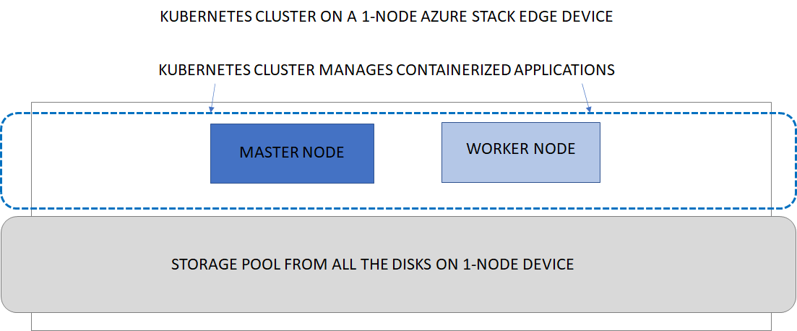

# Kubernetes on your Azure Stack Edge Pro GPU device

[!INCLUDE [applies-to-GPU-and-pro-r-and-mini-r-skus](../../includes/azure-stack-edge-applies-to-gpu-pro-r-mini-r-sku.md)]

Kubernetes is a popular open-source platform to orchestrate containerized applications. This article provides an overview of Kubernetes and then describes how Kubernetes works on your Azure Stack Edge device. 

## About Kubernetes 

Kubernetes provides an  easy and reliable platform to manage container-based applications and their associated networking and storage components. You can rapidly build, deliver, and scale containerized apps with Kubernetes.

As an open platform, you can use Kubernetes to build applications with your preferred programming language, OS libraries, or messaging bus. To schedule and deploy releases, Kubernetes can integrate with existing continuous integration and continuous delivery tools.

For more information, see [How Kubernetes works](https://www.youtube.com/watch?v=q1PcAawa4Bg&list=PLLasX02E8BPCrIhFrc_ZiINhbRkYMKdPT&index=2&t=0s).

## Kubernetes on Azure Stack Edge 

On your Azure Stack Edge device, you can create a Kubernetes cluster by configuring the compute. When the compute role is configured, the Kubernetes cluster including the master and worker nodes are all deployed and configured for you. This cluster is then used for workload deployment via `kubectl`, IoT Edge, or Azure Arc.

The Azure Stack Edge device is available as a 1-node configuration or a 2-node configuration (for Pro GPU model only) that constitutes the infrastructure cluster. The Kubernetes cluster is separate from the infrastructure cluster and is deployed on top of the infrastructure cluster. The infrastructure cluster provides the persistent storage for your Azure Stack Edge device while the Kubernetes cluster is responsible solely for application orchestration. 

The Kubernetes cluster has master node and worker nodes. The Kubernetes nodes in a cluster are virtual machines that run your applications and cloud workflows. 

The Kubernetes master node is responsible for maintaining the desired state for your cluster. The master node also controls the worker node which in turn runs the containerized applications.

### Kubernetes cluster on single node device 

The following diagram illustrates the implementation of Kubernetes on a 1-node Azure Stack Edge device. The 1-node device has one master node and one worker node. The 1-node device is not highly available and if the single node fails, the device goes down. The Kubernetes cluster also goes down.

### Kubernetes cluster on two-node device

<!--The following diagram illustrates the implementation of Kubernetes on a 2-node Azure Stack Edge device.--> The 2-node Azure Stack Edge device has one master node and two worker nodes. The 2-node device is highly available and if one of the node fails, the master node fails over to the other node. Both the device and the Kubernetes cluster keep running. 

<!---->

For more information on the Kubernetes cluster architecture, go to [Kubernetes core concepts](https://kubernetes.io/docs/concepts/architecture/).

### Kubernetes compute requirements

The Kubernetes master and the worker nodes are virtual machines that consume CPU and memory. When deploying Kubernetes workloads, it is important to understand the compute requirements for the master and worker VMs.

|Kubernetes VM type|CPU and memory requirement|
|---------|---------|
|Master VM|CPU: 4 cores, RAM: 4-GB|
|Worker VM|CPU: 30% of available physical cores, RAM: 25% of device specification|

<!--The Kubernetes cluster control plane components make global decisions about the cluster. The control plane has:

- *kubeapiserver* that is the front end of the Kubernetes API and exposes the API.
- *etcd* that is a highly available key value store that backs up all the Kubernetes cluster data.
- *kube-scheduler* that makes scheduling decisions.
- *kube-controller-manager* that runs controller processes such as those for node controllers, replications controllers, endpoint controllers, and service account and token controllers. -->

## Storage volume provisioning

To support application workloads, you can mount storage volumes for persistent data on your Azure Stack Edge device shares. Both static and dynamic volumes can be used. 

For more information, see storage provisioning options for applications in [Kubernetes storage for your Azure Stack Edge device](azure-stack-edge-gpu-kubernetes-storage.md).

## Networking

Kubernetes networking enables you to configure communication within your Kubernetes network including container-to-container networking, pod-to-pod networking, pod-to-service networking, and Internet-to-service networking. For more information, see the networking model in [Kubernetes networking for your Azure Stack Edge device](azure-stack-edge-gpu-kubernetes-networking.md).

## Updates

As new Kubernetes versions become available, your cluster can be upgraded using the standard updates available for your Azure Stack Edge device. For steps on how to upgrade, see [Apply updates for your Azure Stack Edge](azure-stack-edge-gpu-install-update.md).

## Access, monitoring

The Kubernetes cluster on your Azure Stack Edge device  allows Kubernetes role-based access control (Kubernetes RBAC). For more information, see [Kubernetes role-based access control on your Azure Stack Edge Pro GPU device](azure-stack-edge-gpu-kubernetes-rbac.md).

You can also monitor the health of your cluster and resources via the Kubernetes dashboard. Container logs are also available. For more information, see [Use the Kubernetes dashboard to monitor the Kubernetes cluster health on your Azure Stack Edge device](azure-stack-edge-gpu-monitor-kubernetes-dashboard.md).

Azure Monitor is also available as an add-on to collect health data from containers, nodes, and controllers. For more information, see [Azure Monitor overview](../azure-monitor/overview.md)

## Edge container registry

Kubernetes on Azure Stack Edge device allows for the private storage of your images by providing a local container registry. For more information, see [Enable Edge container registry on your Azure Stack Edge Pro GPU device](azure-stack-edge-gpu-edge-container-registry.md).

## Application management

After a Kubernetes cluster is created on your Azure Stack Edge device, you can manage the applications deployed on this cluster via any of the following methods:

- Native access via `kubectl`
- IoT Edge 
- Azure Arc

These methods are explained in the following sections.

### Kubernetes and kubectl

Once the Kubernetes cluster is deployed, then you can manage the applications deployed on the cluster locally from a client machine. You use a native tool such as *kubectl* via the command line to interact with the applications. 

For more information on deploying Kubernetes cluster, go to [Deploy a Kubernetes cluster on your Azure Stack Edge device](azure-stack-edge-gpu-create-kubernetes-cluster.md). For information on management, go to [Use kubectl to manage Kubernetes cluster on your Azure Stack Edge device](azure-stack-edge-gpu-create-kubernetes-cluster.md).

### Kubernetes and IoT Edge

This feature has been deprecated. Support will end soon.

All new deployments of IoT Edge on Azure Stack Edge must be on a Linux VM. For detailed steps, see [Deploy IoT runtime on Ubuntu VM on Azure Stack Edge](azure-stack-edge-gpu-deploy-iot-edge-linux-vm.md).

### Kubernetes and Azure Arc

Azure Arc is a hybrid management tool that will allow you to deploy applications on your Kubernetes clusters. Azure Arc also allows you to use Azure Monitor for containers to view and monitor your clusters. For more information, go to [What is Azure Arc-enabled Kubernetes?](../azure-arc/kubernetes/overview.md). For information on Azure Arc pricing, go to [Azure Arc pricing](https://azure.microsoft.com/services/azure-arc/#pricing).

<!-- confirm with Anoob/Rohan if this needs to be updated as Azure Arc is now GA-->

Beginning March 2021, Azure Arc-enabled Kubernetes will be generally available to the users and standard usage charges apply. As a valued preview customer, the Azure Arc-enabled Kubernetes will be available to you at no charge for Azure Stack Edge device(s). To avail the preview offer, create a [Support request](https://portal.azure.com/#blade/Microsoft_Azure_Support/HelpAndSupportBlade/newsupportrequest):

1. Under **Issue type**, select **Billing**.
2. Under **Subscription**, select your subscription.
3. Under **Service**, select **My services**, then select **Azure Stack Edge**.
4. Under **Resource**, select your resource.
5. Under **Summary**, type a description of your issue.
6. Under **Problem type**, select **Unexpected Charges**.
7. Under **Problem subtype**, select **Help me understand charges on my free trial**.

## Next steps

- Learn more about Kubernetes storage on [Azure Stack Edge device](azure-stack-edge-gpu-kubernetes-storage.md).
- Understand the Kubernetes networking model on [Azure Stack Edge device](azure-stack-edge-gpu-kubernetes-networking.md).
- Deploy [Azure Stack Edge](azure-stack-edge-gpu-deploy-prep.md) in Azure portal.
