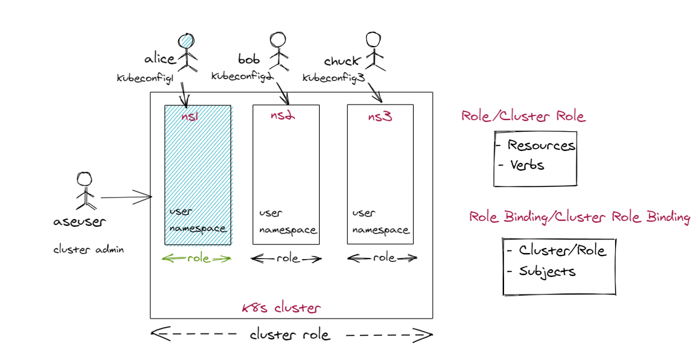

# Kubernetes role-based access control on your Azure Stack Edge Pro GPU device

[!INCLUDE [applies-to-GPU-and-pro-r-and-mini-r-skus](../../includes/azure-stack-edge-applies-to-gpu-pro-r-mini-r-sku.md)]

On your Azure Stack Edge Pro device, when you configure compute role, a Kubernetes cluster is created. You can use Kubernetes role-based access control (Kubernetes RBAC) to limit access to the cluster resources on your device.

This articles provides an overview for the Kubernetes RBAC system provided by Kubernetes, and how is Kubernetes RBAC implemented on your Azure Stack Edge Pro device. 

## Kubernetes RBAC

Kubernetes RBAC lets you assign users, or groups of users, permission to do things like create or modify resources, or view logs from running application workloads. These permissions can be scoped to a single namespace, or granted across the entire cluster. 

When you set up the Kubernetes cluster, a single user is created corresponding to this cluster and is called the cluster admin user.  A `kubeconfig` file is associated with the cluster admin user. The `kubeconfig` file is a text file that contains all the configuration information required to connect to the cluster to authenticate the user.

## Namespaces types

Kubernetes resources, such as pods and deployments, are logically grouped into a namespace. These groupings provide a way to logically divide a Kubernetes cluster and restrict access to create, view, or manage resources. Users can only interact with resources within their assigned namespaces.

Namespaces are intended for use in environments with many users spread across multiple teams, or projects. For more information, see [Kubernetes namespaces](https://kubernetes.io/docs/concepts/overview/working-with-objects/namespaces/).

Your Azure Stack Edge Pro device has the following namespaces:

- **System namespace** - This namespace is where core resources exist, such as network features like DNS and proxy, or the Kubernetes dashboard. You typically don't deploy your own applications into this namespace. Use this namespace to debug any Kubernetes cluster issues. 

    There are multiple system namespaces on your device and the names corresponding to these system namespaces are reserved. Here is a list of the reserved system namespaces: 
	- kube-system
	- metallb-system
	- dbe-namespace
	- default
	- kubernetes-dashboard
	- kube-node-lease
	- kube-public

    Make sure to not use any reserved names for user namespaces that you create. 
<!--- **default namespace** - This namespace is where pods and deployments are created by default when none is provided and you have admin access to this namespace. When you interact with the Kubernetes API, such as with `kubectl get pods`, the default namespace is used when none is specified.-->

- **User namespace** - These are the namespaces that you can create via **kubectl** or via the PowerShell interface of the device to locally deploy applications.
 
- **IoT Edge namespace** - You connect to this `iotedge` namespace to manage applications deployed via IoT Edge.

- **Azure Arc namespace** - You connect to this `azure-arc` namespace to manage applications deployed via Azure Arc. With Azure Arc, you can also deploy applications in other user namespaces. 

## Namespaces and users

In the real world, it is important to divide the cluster into multiple namespaces. 

- **Multiple users**: If you have multiple users, then multiple namespaces will allow those users to each deploy their applications and services in their specific namespaces in isolation from one another. 
- **Single user**: Even if there is a single user, multiple namespaces would allow that user to run multiple versions of the applications in the same Kubernetes cluster.

### Roles and RoleBindings

Kubernetes has the concept of role and role binding that lets you give permissions to user or resources at a namespace level and at a cluster level. 

- **Roles**: You can define permissions to users as a **Role** and then use **Roles** to grant permissions within a namespace. 
- **RoleBindings**: Once you have defined the roles, you can use **RoleBindings** to assign roles for a given namespace. 

This approach lets you logically segregate a single Kubernetes cluster, with users only able to access the application resources in their assigned namespace. 

## Kubernetes RBAC on Azure Stack Edge Pro

In the current implementation of Kubernetes RBAC, Azure Stack Edge Pro allows you to take the following actions from a restricted PowerShell runspace:

- Create namespaces.  
- Create additional users.
- Grant you admin access to the namespaces that you created. Keep in mind that you won't have access to cluster admin role or a view of the cluster-wide resources.
- Get `kubeconfig` file with information to access the Kubernetes cluster.

The Azure Stack Edge Pro device has multiple system namespaces and you can create user namespaces with `kubeconfig` files to access those namespaces. The users have full control over these namespaces and can create or modify users, or grant users access. Only the cluster admin has full access to system namespaces and cluster-wide resources. An `aseuser` has read-only access to system namespaces.

Here is a diagram that depicts the implementation of Kubernetes RBAC on Azure Stack Edge Pro device.

In this diagram, Alice, Bob, and Chuck have access to assigned user namespaces only, which in this case are `ns1`, `ns2`, and `ns3` respectively. Within these namespaces, they have admin access. The cluster admin on the other hand has admin access to system namespaces and cluster-wide resources.

As a user, you can create namespaces and users, assign users to namespaces, or download `kubeconfig` files. For detailed step-by-step instructions, go to [Access Kubernetes cluster via kuebctl on your Azure Stack Edge Pro](azure-stack-edge-gpu-create-kubernetes-cluster.md).

When working with namespaces and users on your Azure Stack Edge Pro devices, the following caveats apply:

- You are not allowed to perform any operations such as create users, grant or revoke namespace access to user, for any of the system namespaces. Examples of system namespaces include `kube-system`, `metallb-system`, `kubernetes-dashboard`, `default`, `kube-node-lease`, `kube-public`. System namespaces also include the namespaces reserved for deployment types such as `iotedge` (IoT Edge namespace) and `azure-arc` (Azure Arc namespace).
- You can create user namespaces and within those namespaces create additional users and grant or revoke namespace access to those users.
- You are not allowed to create any namespaces with names that are identical to those for any system namespace. The names for system namespaces are reserved.  
- You are not allowed to create any user namespaces with names that are already in use by other user namespaces. For example, if you have a `test-ns` that you created, you cannot create another `test-ns` namespace.
- You are not allowed to create users with names that are already reserved. For example, `aseuser` is a reserved user and cannot be used.

## Next steps

To understand how you can create a user, create a namespace, and grant user access to the namespace, see [Access a Kubernetes cluster via kubectl](azure-stack-edge-gpu-create-kubernetes-cluster.md).

