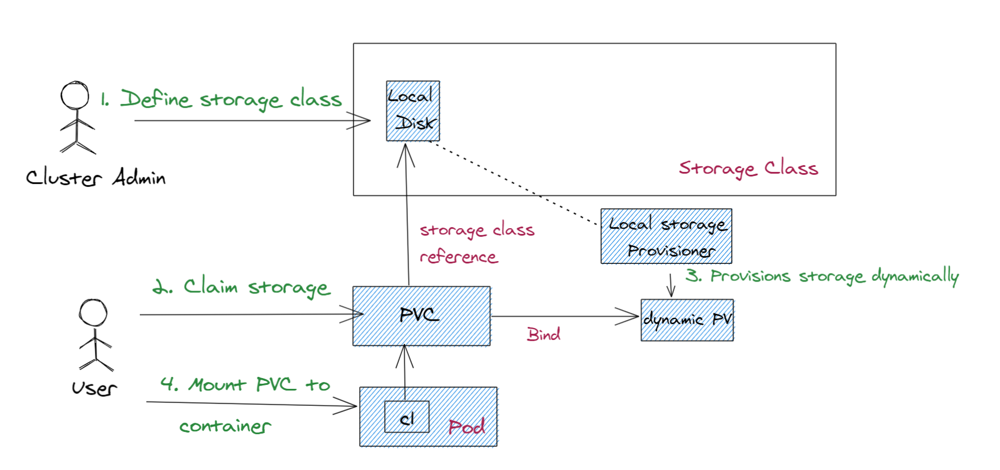
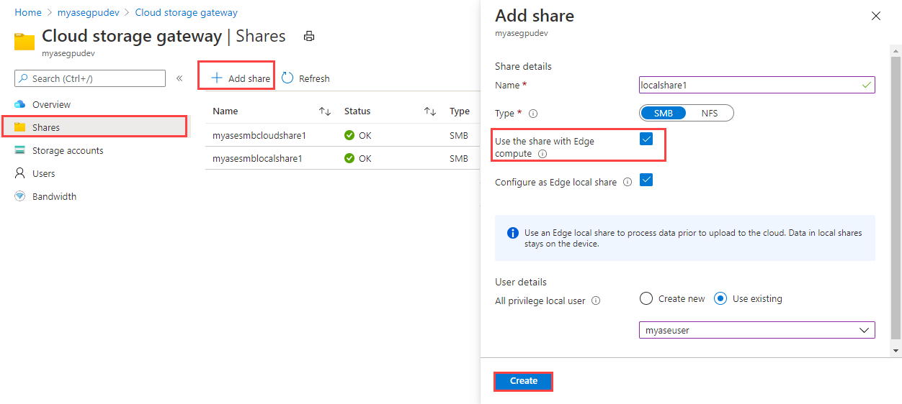
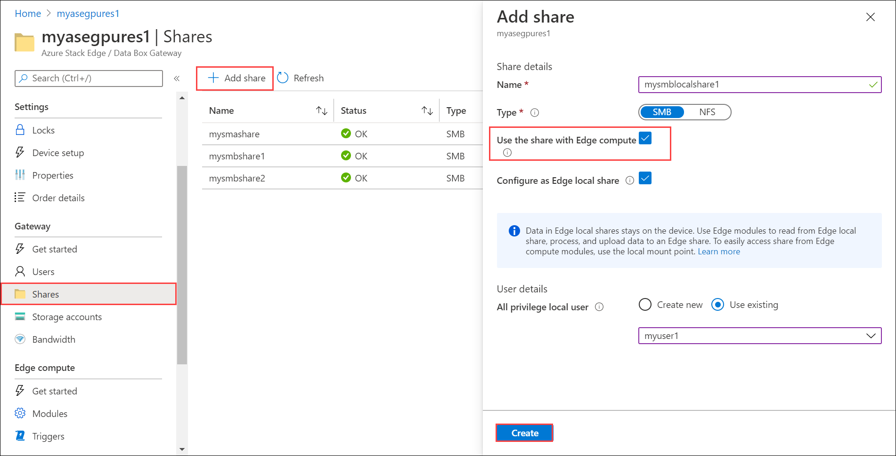
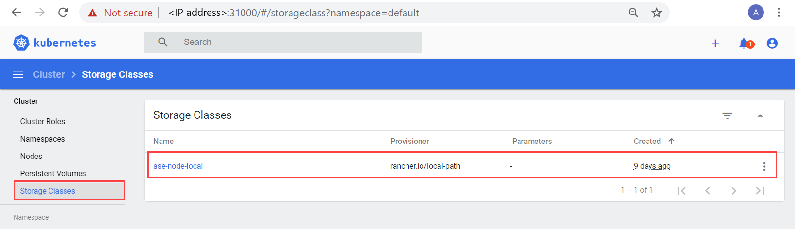

# Kubernetes storage management on your Azure Stack Edge Pro GPU device

[!INCLUDE [applies-to-GPU-and-pro-r-and-mini-r-skus](../../includes/azure-stack-edge-applies-to-gpu-pro-r-mini-r-sku.md)]

On your Azure Stack Edge Pro device, a Kubernetes cluster is created when you configure compute role. Once the Kubernetes cluster is created, then containerized applications can be deployed on the Kubernetes cluster in pods. There are distinct ways to provide storage to pods in your Kubernetes cluster. 

This article describes the methods to provision storage on a Kubernetes cluster in general and specifically in the context of your Azure Stack Edge Pro device. 

## Storage requirements for Kubernetes pods

Kubernetes pods are stateless but the applications they run are usually stateful. Because pods can be short-lived, and they restart, fail over, or move between Kubernetes nodes, the following requirements must be met for storage associated with the pod. 

The storage must:

- Live outside of the pod.
- Be independent of pod lifecycle.
- Be accessible from all the Kubernetes nodes.

To understand how storage is managed for Kubernetes, one needs to understand two API resources: 

- **PersistentVolume (PV)**: This is a piece of storage in the Kubernetes cluster. Kubernetes storage can be statically provisioned as `PersistentVolume`. It can also be dynamically provisioned as  `StorageClass`.

- **PersistentVolumeClaim (PVC)**: This is a request for storage by a user. PVCs consume PV resources. PVCs can request specific size and access modes. 

    Because users need `PersistentVolumes` with varying properties for different problems, hence cluster admins need to be able to offer a variety of `PersistentVolumes` that differ in more ways than just size and access modes. For these needs, you need the `StorageClass` resource.

Storage provisioning can be static or dynamic. Each of the provisioning types is discussed in the following sections.

## Static provisioning

Kubernetes cluster admins can statically provision the storage. To do so, they can use storage backend based on SMB/NFS filesystems or use iSCSI disks that attach locally over the network in an on-premises environment, or even use Azure Files or Azure Disks in the cloud. This type of storage is not provisioned by default and cluster admins have to plan and manage this provisioning. 
 
Here is a diagram that depicts how statically provisioned storage is consumed in Kubernetes: 


The following steps occur: 

1. **Provision storage**: The cluster admin provisions the storage. In this example, the cluster admin creates one or more SMB shares that automatically create persistent volume objects in the Kubernetes cluster corresponding to these shares. 

1. **Claim storage**: You submit a PVC deployment that requests the storage. This claim for storage is the PersistentVolumeClaim (PVC). If the size and the access mode of the PV match that of the PVC, then the PVC is bound to the PV. The PVC and PV map one-to-one.

1. **Mount PVC to the container**: Once the PVC is bound to the PV, you can mount this PVC onto a path in your container. When the application logic in the container reads/writes from/into this path, the data is written into the SMB storage.
 

## Dynamic provisioning

Here is a diagram that depicts how statically provisioned storage is consumed in Kubernetes: 



The following steps occur: 

1. **Define storage class**: Cluster admin defines a storage class depending on the operating environment for your Kubernetes cluster. The cluster admin also deploys a provisioner, which is yet another pod or application deployed on the Kubernetes cluster. The provisioner has all the details to provision the shares dynamically.  

1. **Claim storage**: You submit an application that would claim the storage. Once a PVC is created with this storage class reference, the provisioner is invoked. 

1. **Provision storage dynamically**: The provisioner dynamically creates the share associated with the local disk storage. Once the share is created, it also creates a PV object automatically corresponding to this share.

1. **Mount PVC to container**: Once the PVC is bound to the PV, you can mount the PVC on to the container onto a path in the same way as static provisioning and read from or write into the share.


## Storage provisioning on Azure Stack Edge Pro

On the Azure Stack Edge Pro device, statically provisioned `PersistentVolumes` are created using the device' storage capabilities. When you provision a share and **Use the share with Edge compute** option is enabled, this action creates a PV resource automatically in the Kubernetes cluster.



To use cloud tiering, you can create an Edge cloud share with the Use the share with Edge compute option enabled. A PV is again created automatically for this share. Any application data that you write to the Edge share is tiered to the cloud. 



You can create both SMB and NFS shares to statically provision PVs on Azure Stack Edge Pro device. Once the PV is provisioned, you will submit a PVC to claim this storage. Here is an example of a PVC deployment `yaml` that claims the storage and uses the shares you provisioned.


```yml
kind: PersistentVolumeClaim 
apiVersion: v1 
metadata: 
  name: pvc-smb-flexvol 
spec: 
  accessModes: 
  - ReadWriteMany 
  resources: 
    requests: 
      storage: 10Gi 
  volumeName: <nfs-or-smb-share-name-here> 
  storageClassName: ""
```

To get the value of the `volumeName` field, select the Local mount point for Edge compute modules when you select the SMB or NFS share after creation. This is the same as the share name. 

For more information, see [Deploy a stateful application via static provisioning on your Azure Stack Edge Pro via kubectl](azure-stack-edge-gpu-deploy-stateful-application-static-provision-kubernetes.md).

To access the same statically provisioned storage, the corresponding volume mount options for storage bindings for IoT are as follows. The `/home/input` is the path at which the volume is accessible within the container.

```
{
"HostConfig": {
"Mounts": [
{
"Target": "/home/input",
"Source": "<nfs-or-smb-share-name-here>",
"Type": "volume"
},
{
"Target": "/home/output",
"Source": "<nfs-or-smb-share-name-here>",
"Type": "volume"
}]
}
}
```

Azure Stack Edge Pro also has a builtin `StorageClass` called `ase-node-local` that uses a data disk storage attached to the Kubernetes node. This `StorageClass` supports dynamic provisioning. You can make a `StorageClass` reference in the pod applications and a PV is automatically created for you. For more information, see the [Kubernetes dashboard](azure-stack-edge-gpu-monitor-kubernetes-dashboard.md) to query for `ase-node-local StorageClass`.



For more information, see [Deploy a stateful application via dynamic provisioning on your Azure Stack Edge Pro via kuebctl](azure-stack-edge-gpu-deploy-stateful-application-dynamic-provision-kubernetes.md).

## Choose storage type

You may need to choose your storage type depending on the workload you are deploying. 

- If you want `ReadWriteMany` access mode for your `PersistentVolumes` where the volumes are mounted as read-write by many nodes deploying, use static provisioning for the SMB/NFS shares.

- If the applications you are deploying have a POSIX compliance requirement, for example, applications such as MongoDB, PostgreSQL, MySQL or Prometheus, use the built-in StorageClass. The access modes are `ReadWriteOnce` or the volume is mounted as read-write by a single node. 


For more information on access modes, see [Kubernetes volumes access mode](https://kubernetes.io/docs/concepts/storage/persistent-volumes/#access-modes).


## Next steps

To understand how you can statically provision a `PersistentVolume`, see:

- [Deploy a stateful application via static provisioning on your Azure Stack Edge Pro via kubectl](azure-stack-edge-gpu-deploy-stateful-application-static-provision-kubernetes.md).

To learn how  you can dynamically provision a `StorageClass`, see:

- [Deploy a stateful application via dynamic provisioning on your Azure Stack Edge Pro via kuebctl](azure-stack-edge-gpu-deploy-stateful-application-dynamic-provision-kubernetes.md).
