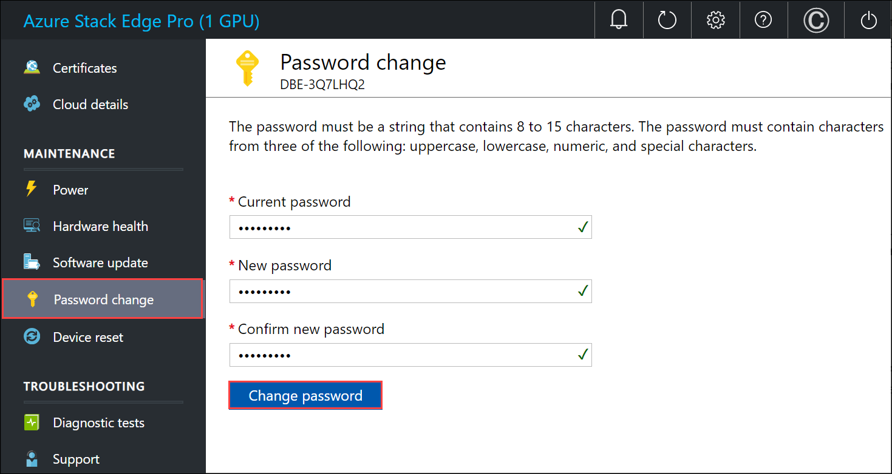
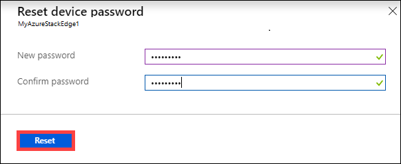
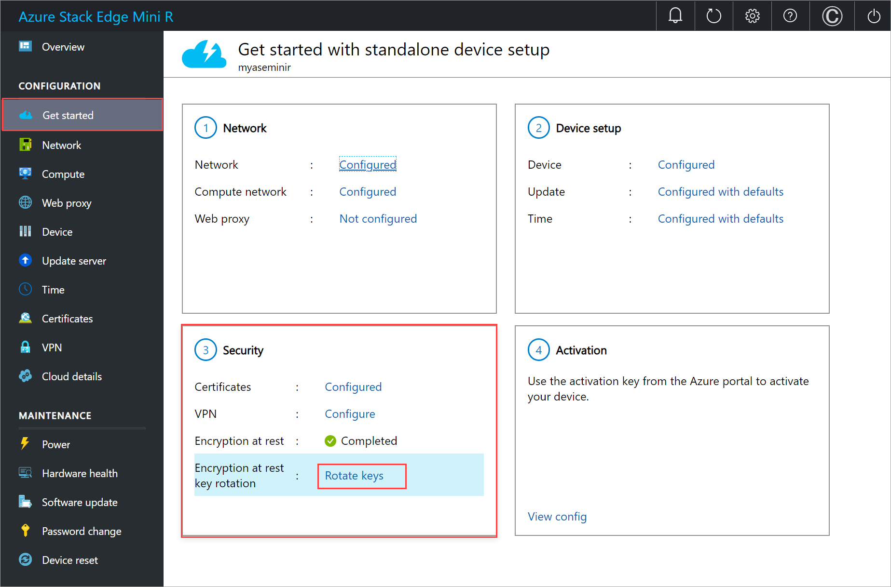
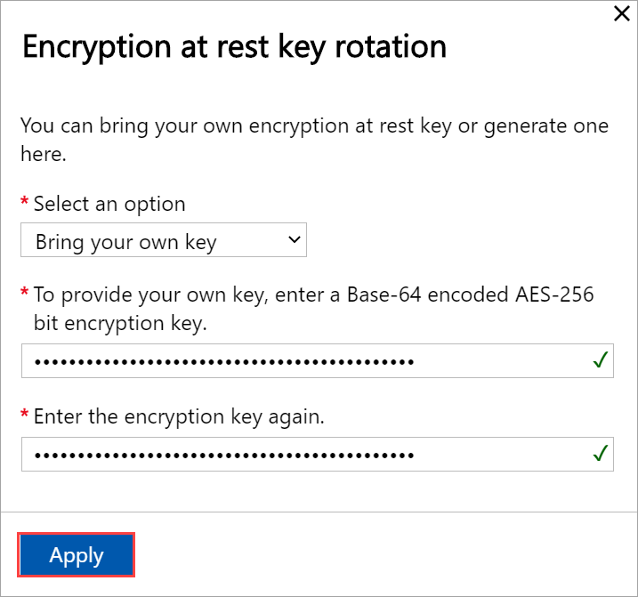
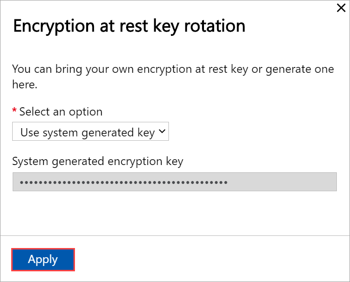
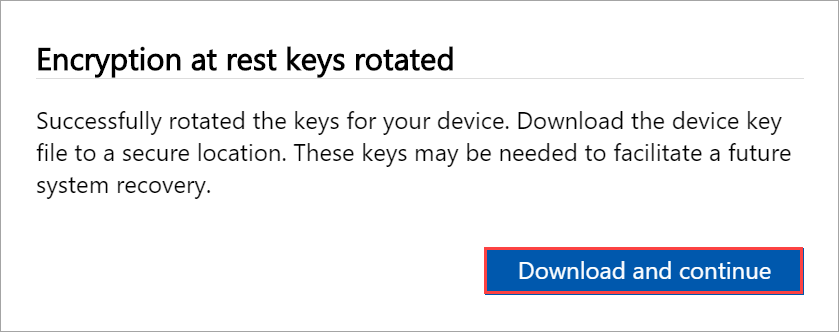
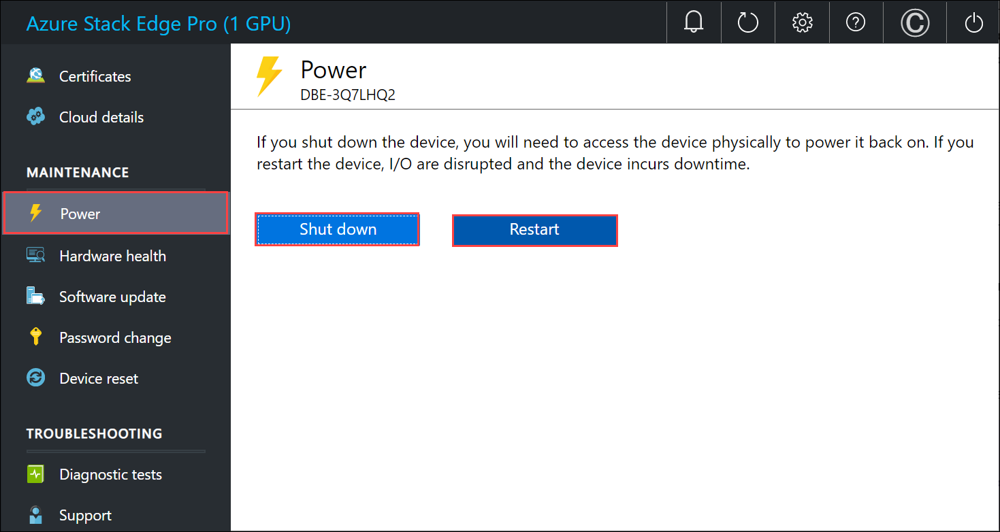

# Manage access, power, and connectivity mode for your Azure Stack Edge Pro GPU

This article describes how to manage the access, power, and connectivity mode for your Azure Stack Edge Pro with GPU device. These operations are performed via the local web UI or the Azure portal.

This article applies to Azure Stack Edge Pro GPU, Azure Stack Edge Pro R, and Azure Stack Edge Mini R devices.


In this article, you learn how to:

> [!div class="checklist"]
> * Manage device access
> * Manage resource access
> * Manage connectivity mode
> * Manage power


## Manage device access

The access to your Azure Stack Edge Pro device is controlled by the use of a device password. You can change the password via the local web UI. You can also reset the device password in the Azure portal.

The access to data on the device disks is also controlled by encryption-at-rest keys.

### Change device password

Follow these steps in the local UI to change the device password.

1. In the local web UI, go to **Maintenance > Password**.
2. Enter the current password and then the new password. The supplied password must be between 8 and 16 characters. The password must have 3 of the following characters: uppercase, lowercase, numeric, and special characters. Confirm the new password.

    

3. Select **Change password**.
 
### Reset device password

The reset workflow does not require the user to recall the old password and is useful when the password is lost. This workflow is performed in the Azure portal.

1. In the Azure portal, go to **Overview > Reset admin password**.

    


2. Enter the new password and then confirm it. The supplied password must be between 8 and 16 characters. The password must have 3 of the following characters: uppercase, lowercase, numeric, and special characters. Select **Reset**.

    

### Manage access to device data

For the Azure Stack Edge Pro R and Azure Stack Edge Mini R devices, the access to device data is controlled by using encryption-at-rest keys for the device drives. After you have successfully configured the device for encryption-at-rest, the rotate encryption-at-rest keys option becomes available in the local UI of the device. 

This operation lets you change the keys for BitLocker volumes `HcsData` and `HcsInternal` and all the self-encrypting drives on your device.

Follow these steps to rotate the encryption-at-rest keys.

1. In the local UI of the device, go to the **Get started** page. On the **Security** tile, select **Encryption-at-rest: Rotate keys** option. This option is only available after you have successfully configured the encryption-at-rest keys.

    

1. You can use your own BitLocker key protectors or use system-generate key protectors. The key protectors are used for the self-encrypting drives. 

    To provide your own key, enter a 32 character long Base-64 encoded string. The input is similar to what you would provide when you configure the encryption-at-rest for the first time.

    

    You can also choose to use a system generated key.

    

1. Select **Apply**. The key protectors are rotated.

    

1. When prompted to download and save the key file, select **Download and continue**. 

    

    Save the `.json` key file in a secure location. This file is used to facilitate a potential future recovery of the device.


## Manage resource access

To create your Azure Stack Edge / Data Box Gateway, IoT Hub, and Azure Storage resource, you need permissions as a contributor or higher at a resource group level. You also need the corresponding resource providers to be registered. For any operations that involve activation key and credentials, permissions to the Microsoft Graph API are also required. These are described in the following sections. 

### Manage Microsoft Graph API permissions

When generating the activation key for the Azure Stack Edge Pro device, or performing any operations that require credentials, you need permissions to Azure Active Directory Graph API. The operations that need credentials could be:

-  Creating a share with an associated storage account.
-  Creating a user who can access the shares on the device.

You should have a `User` access on Active Directory tenant as you need to be able to `Read all directory objects`. You can't be a Guest user as they don't have permissions to `Read all directory objects`. If you're a guest, then the operations such as generation of an activation key, creation of a share on your Azure Stack Edge Pro device, creation of a user, configuration of Edge compute role, reset device password will all fail.

For more information on how to provide access to users to Microsoft Graph API, see [Microsoft Graph permissions reference](https://docs.microsoft.com/graph/permissions-reference).

### Register resource providers

To provision a resource in Azure (in the Azure Resource Manager model), you need a resource provider that supports the creation of that resource. For example, to provision a virtual machine, you should have a 'Microsoft.Compute' resource provider available in the subscription.
 
Resource providers are registered on the level of the subscription. By default, any new Azure subscription is pre-registered with a list of commonly used resource providers. The resource provider for 'Microsoft.DataBoxEdge' is not included in this list.

You don't need to grant access permissions to the subscription level for users to be able to create resources like 'Microsoft.DataBoxEdge' within their resource groups that they have owner rights on, as long as the resource providers for these resources is already registered.

Before you attempt to create any resource, make sure that the resource provider is registered in the subscription. If the resource provider is not registered, you'll need to make sure that the user creating the new resource has enough rights to register the required resource provider on the subscription level. If you haven't done this as well, then you'll see the following error:

*The subscription \<Subscription name> doesn't have permissions to register the resource provider(s): Microsoft.DataBoxEdge.*


To get a list of registered resource providers in the current subscription, run the following command:

```PowerShell
Get-AzResourceProvider -ListAvailable |where {$_.Registrationstate -eq "Registered"}
```

For Azure Stack Edge Pro device, `Microsoft.DataBoxEdge` should be registered. To register `Microsoft.DataBoxEdge`, subscription admin should run the following command:

```PowerShell
Register-AzResourceProvider -ProviderNamespace Microsoft.DataBoxEdge
```

For more information on how to register a resource provider, see [Resolve errors for resource provider registration](../azure-resource-manager/templates/error-register-resource-provider.md).

## Manage connectivity mode

Apart from the default fully connected mode, your device can also run in partially connected, or fully disconnected mode. Each of these modes is described as below:

- **Fully connected** - This is the normal default mode in which the device operates. Both the cloud upload and download of data is enabled in this mode. You can use the Azure portal or the local web UI to manage the device.

- **Partially disconnected** – In this mode, the device cannot upload or download any share data however can be managed via the Azure portal.

    This mode is typically used when on a metered satellite network and the goal is to minimize network bandwidth consumption. Minimal network consumption may still occur for device monitoring operations.

- **Disconnected** – In this mode, the device is fully disconnected from the cloud and both the cloud uploads and downloads are disabled. The device can only be managed via the local web UI.

    This mode is typically used when you want to take your device offline.

To change device mode, follow these steps:

1. In the local web UI of your device, go to **Configuration > Cloud**.
2. From the dropdown list, select the mode that you want to operate the device in. You can select from **Fully connected**, **Partially connected**, and **Fully disconnected**. To run the device in partially disconnected mode, enable **Azure portal management**.

 
## Manage power

You can shut down or restart your physical device using the local web UI. We recommend that before you restart, take the shares offline on the data server and then the device. This action minimizes any possibility of data corruption.

1. In the local web UI, go to **Maintenance > Power**.
2. Select **Shutdown** or **Restart** depending on what you intend to do.

    

3. When prompted for confirmation, select **Yes** to proceed.

> [!NOTE]
> If you shut down the physical device, you will need to push the power button on the device to turn it on.

## Next steps

- Learn how to [Manage shares](azure-stack-edge-manage-shares.md).
