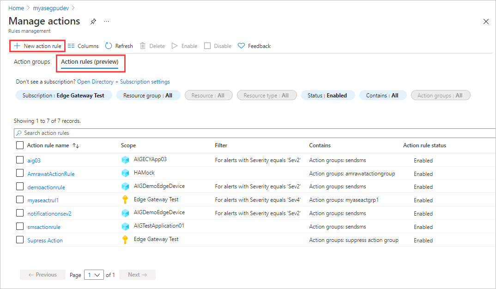
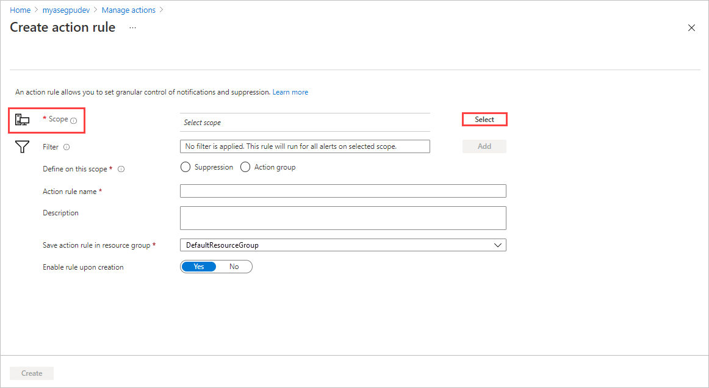
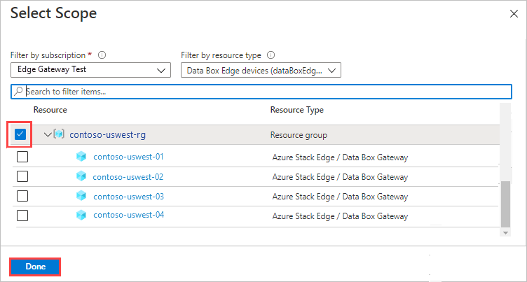
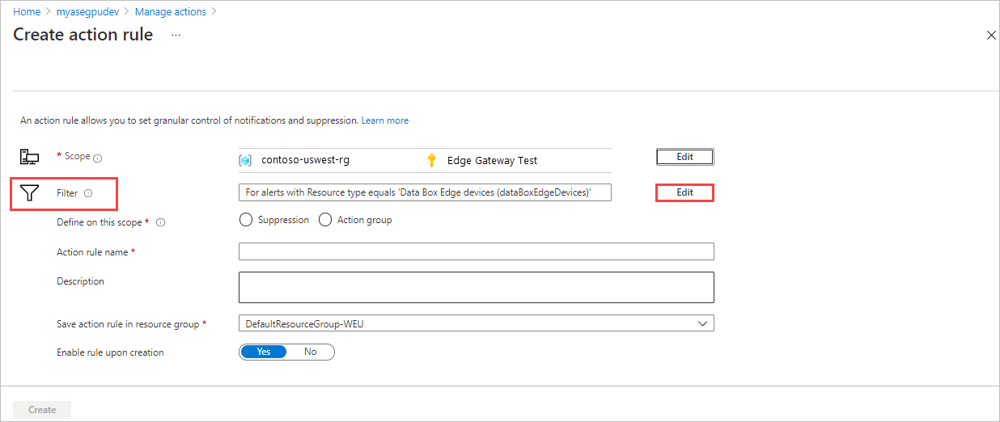
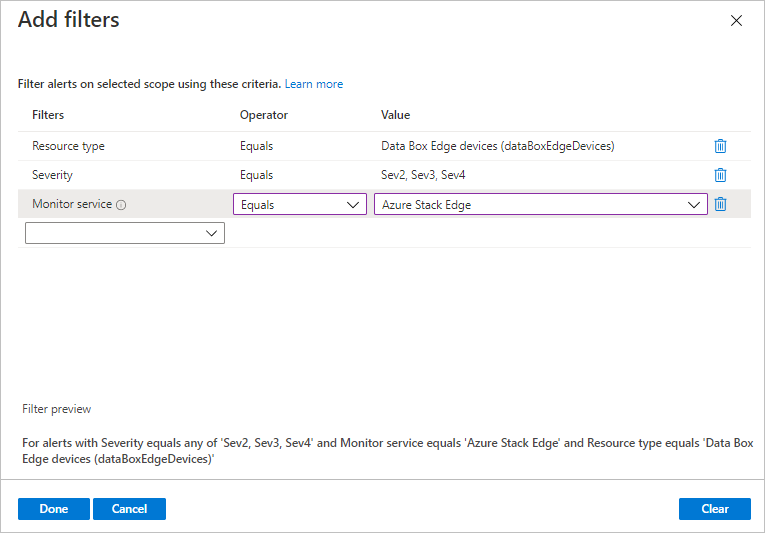

# Manage alert notifications for Azure Stack Edge Pro resources

This article describes how to create action rules in the Azure portal to trigger or suppress alert notifications for events that occur within a resource group, an Azure subscription, or an individual Azure Stack Edge resource.

An action rule can trigger or suppress alerts. This article describes steps to create an action rule that sends notifications. For guidance on creating an action rule to suppress notifications, see [Configuring an action rule](/azure/azure-monitor/platform/alerts-action-rules?tabs=portal#configuring-an-action-rule).

An action rule sends notifications to an *action group* - a set of notification preferences that notify users when alerts are triggered in differnt contexts for a resource or set of resources.<!--Wording needs work.--> For more information, see [Create and manage action groups in the Azure portal](/blob/master/articles/azure-monitor/platform/action-groups).

> [!NOTE]
> The action rules feature is in preview. Some screens and steps might change as the process is refined.

## Create an action rule

Take the following steps in the Azure portal to create an action rule for your Azure Stack Edge device.

> [!NOTE]
> These steps create an action rule that sends notifications to an action group. For details about creating an action rule to suppress notifications, see [Configuring an action rule](/azure/azure-monitor/platform/alerts-action-rules?tabs=portal#configuring-an-action-rule).

1. In the Azure portal, go to **Monitor > Alerts**, and select **Manage actions**.

   

2. Select **Action rules (preview)**.

   

3. Select **+ New action rule**.

   

   This displays the page for creating a new action rule.

4. Use **Scope** to select an Azure subscription, resource group, or target resource. The action rule will act on all alerts generated within that scope.

   1. Choose **Select**, by **Scope**.

      

   2. Select the **Subscription** for the action rule and the **Resource** type. To filter to your Azure Stack Edge resources, select **DataBoxEdge**.

      The **Resource** area lists the available resources based on your selections.

      

   3. Select the check box by each resource you want to apply the action rule to. For example, select the subscription, a resource group, or a resource. Then select **Done**.

      

      The **Create action rule** screen shows the selected scope.

5. Use **Filter** to narrow the application of the rule to subset of alerts within the selected scope.

   1. Select **Add**. The **Add filters** pane opens.

      <!--Verify command name.-->

   2. Under filters, add each filter you want to apply by selecting the filter type, **Operator**, and **Value**. The sample filter below applies to all alerts at Severity level 2, 3, or 4.
   
      For a list of filter options, see [Filter criteria](/azure/azure-monitor/platform/alerts-action-rules?tabs=portal#filter-criteria)

      

   3. When you finish defining filters, select **Done**.  

6. On the **Create action rule** screen, select **Action group** to define a rule that sends notifications.

   

   > [!NOTE]
   > To create a rule that suppresses notifications, you would choose **Suppression**. For more information, see [Configuring an action rule](/azure/azure-monitor/platform/alerts-action-rules?tabs=portal#configuring-an-action-rule).

7. Select an action group by DOING WHAT?. Your new action rule will be added to the notification preferences of the selected action group.

   If you need to create a new action group, select WHAT? and follow the steps in [Create an action group by using the Azure portal](/azure/azure-monitor/platform/action-groups#create-an-action-group-by-using-the-azure-portal).

8. Give the new action rule a **Name** and **Description**, and assign the rule to a resource group.

9. The new rule is enabled by default. If you don't want to start using the rule immediately, select **No** for **Enable rule update creation**.

10. When you finish your settings, select **Create**.

   

   The **Action rules (Preview)** screen opens, but you might not see your new action rule immediately. The focus in **All** resource groups.

   

11. To see your new action rule, select the resource group for the rule.

   

## View notifications for an action rule

Notifications go out when a new event triggers an alert for a resource that's within the scope of an action rule.

The action group for a rule sets who receives a notification and the type of notification that's sent - email, a Short Message Service (SMS) message, or both.

It might take a few minutes to receive notifications after an alert is triggered.

An email notification has the format of the following sample email.

## Next steps

- See [Create and manage action groups in the Azure portal](/blob/master/articles/azure-monitor/platform/action-groups) for guidance on creating a new action group.
- See [Configure an action rule](/azure/azure-monitor/platform/alerts-action-rules?tabs=portal#configuring-an-action-rule) for more info about creating action rules that send or suppress alert notifications.
- See [Create, view, and manage metric alerts using Azure Monitor Link target](/../azure-monitor/platform/alerts-metric.md) for info about managing individual alerts.
