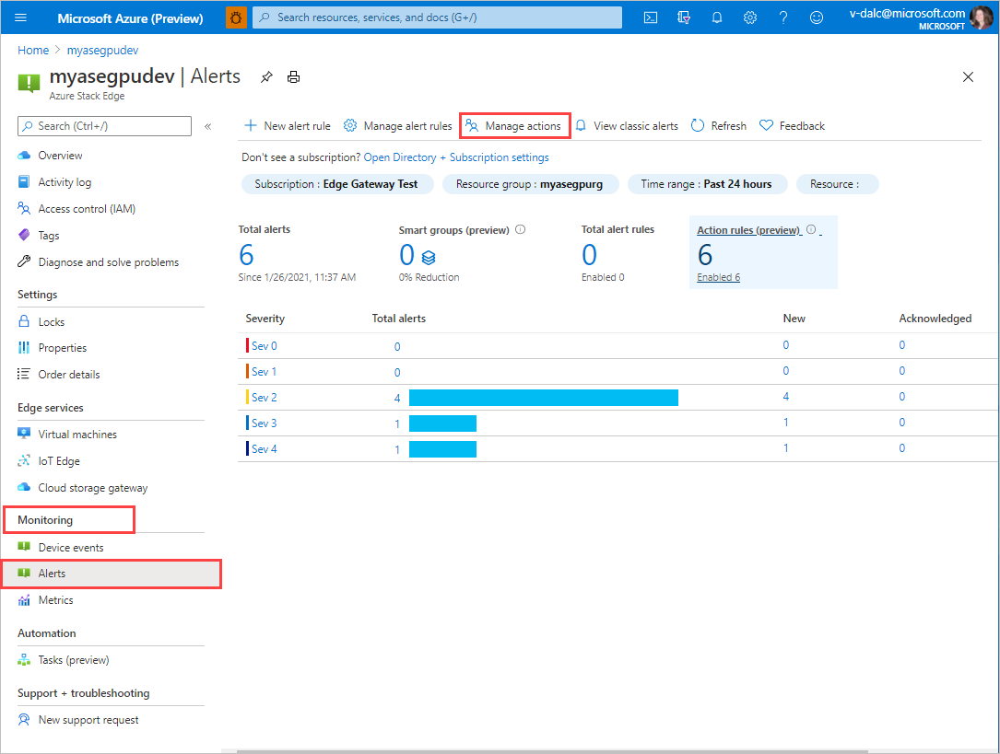
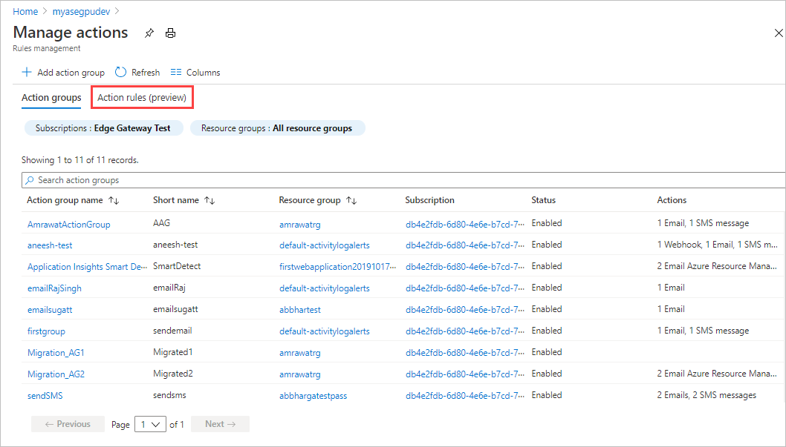

# Manage alerts in Azure Stack Edge Pro

This article describes how to manage alerts for Azure Stack Edge Pro in the Azure portal. You can define action rules that determine how to trigger alerts for a resource group, subscription, or individual resource.

In this article, you learn how to:

> [!div class="checklist"]
>
> * Create action rules
> * View alerts

## Create action rules

Configure action rules to trigger or suppress alerts for events that occur within a resource group, an Azure subscription, or an individual Azure Stack Edge resource. TK: Action groups.

TK: Configure alerts example, suppress alerts example.

NOTE NEEDED? Link to info about configuring notifications for individual alerts (the old way?). <!--Current target: [Create, view, and manage metric alerts using Azure Monitor Link target](/../azure-monitor/platform/alerts-metric.md)-->

### Configure alerts

Take the following steps in the Azure Portal to configure alerts for a resource group, subscription, or resource.

1. Open your Azure Stack Edge Device in the Azure portal.

1. Go to **Monitor > Alerts**, and select **Manage actions**.

   

1. In **Manage actions**, select **Action rules (preview)**.

   

1. On the **Action rules (preview)** screen, select **+ New action rule**.

   

1. STOPPING HERE.

### Suppress alerts

Take the following steps in the Azure portal to suppress alerts for a resource group, subscription, or resource.

## View alerts

Take the following steps in the Azure portal to view and manage individual alerts.

1. Open your Azure Stack Edge device in the Azure portal.
2. Go to **Monitor > Alerts**.

## Next steps

Learn how to [Monitor your Azure Stack Edge Pro](azure-stack-edge-monitor.md).
Learn how to [Monitor Kubernetes workloads via the Kubernetes Dashboard](azure-stack-edge-gpu-monitor-kubernetes-dashboard.md)
