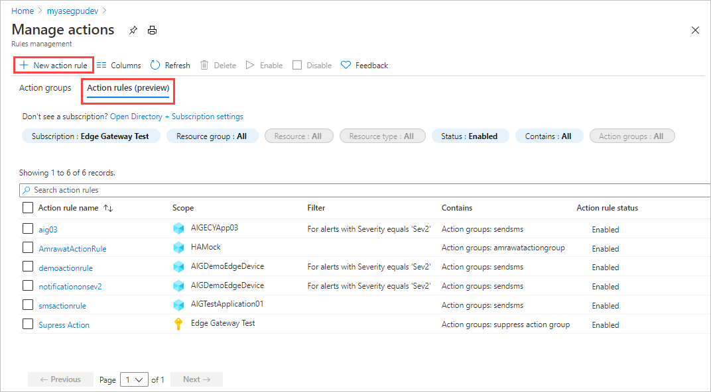
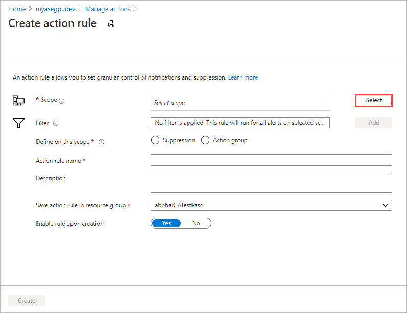
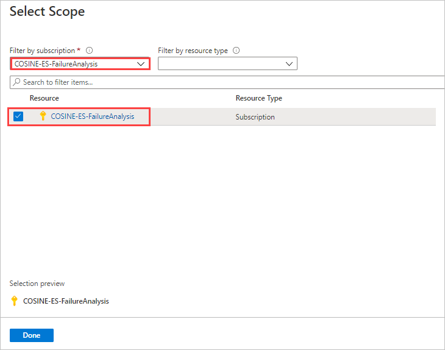
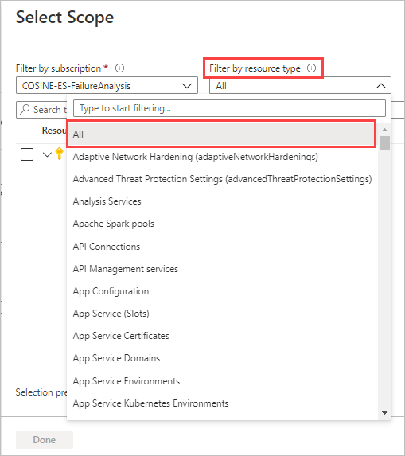
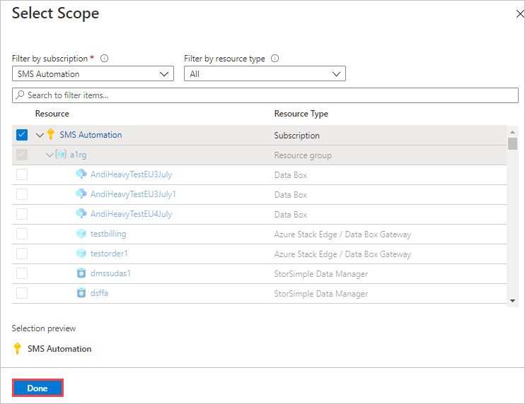
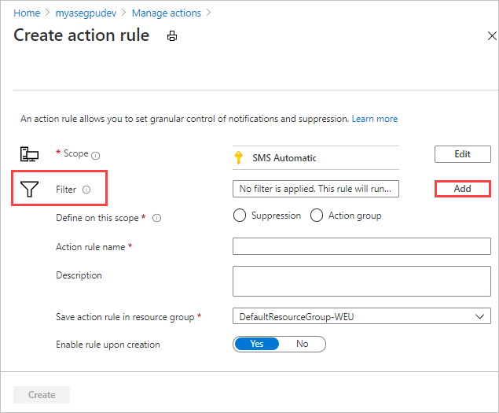

# Manage alerts in Azure Stack Edge Pro

This article describes how to manage alerts for Azure Stack Edge Pro in the Azure portal. You can define action rules that determine how to trigger alerts for a resource group, subscription, or individual resource.

In this article, you learn how to:

> [!div class="checklist"]
>
> * Create action rules
> * View alerts

## Create action rules

Configure action rules to trigger or suppress alerts for events that occur within a resource group, an Azure subscription, or an individual Azure Stack Edge resource. TK: Action groups.

TK: Configure alerts example, suppress alerts example.

NOTE NEEDED? Link to info about configuring notifications for individual alerts (the old way?). <!--Current target: [Create, view, and manage metric alerts using Azure Monitor Link target](/../azure-monitor/platform/alerts-metric.md)-->

## Create alerts with action rules

Take the following steps in the Azure Portal to configure alerts for a resource group, subscription, or resource.

1. Open your Azure Stack Edge Device in the Azure portal.

2. Go to **Monitor > Alerts**, and select **Manage actions**.

   

3. In **Manage actions**, select **Action rules (preview)**.

   

4. On the **Action rules (preview)** screen, select **+ New action rule**.

   

5. Use **Scope** to select specific resources, resource groups, or a subscription as the scope. The action rule will act on all alerts generated within the selected scope.

   1. To get started, choose **Select** by **Scope**.

      

      You will select individual resources, resource groups, or a subscription from the **Resource** list.

      At first, the **Resource** list shows the subscription for this device. Selecting the subscription will apply the action rule to all resources associated with the subscription

      <!--Would this be limited to Azure Stack Edge resources or include all Azure resources associated with the subscription? Resource groups are assigned indirectly to a subscription: storage accounts are added to the subscription, and resource groups are defined for the storage account? Hierarchy seems wrong.-->

      

   1. If you want to set the scope to a different set of resources you can:
      - Use **Filter by subscription** to select a different subscription.
      - Use **Filter by resource type** to select all resource types or one resource type for the subscription.

      

      The **Resource** list now shows the filtered resource list. The resources are listed hierarchically with 

   1. Select the check box by each resource type you want to apply the rule to. You can select the subscription, one or more resource groups, or individual resources.

<!--Many questions about selecting resources:
- I can select resource groups but not individual resources within a resource group.
- When I select a resource group, I would expect for all resources within the resource group to be selected automatically. There's no indication that the resources are selected.
- I can't seem to select individual resources under a resource group. Can't select sets such as storage accounts either.
- Storage accounts are listed under resource groups. Isn't it the other way around?-->

      **Selection preview** at the bottom of the pane tracks the total selected resource types.

      

   1. When you finish selecting resources, select **Done** to save the scope.

      

   The **Create action rule** screen shows the selected scope.

6. Use the **Filter** option to add filters that narrow the application of the rule to subset of alerts within the selected scope.

  1. Select **Add**.

     

   1. In **Filters**, select the type of filter to apply. You can filter by AVAILABLE FILTERS or filter by text in the Description or payload for the alert. 

      

   1. Select an **Operator** and then a **Value** to define the filter. For example, for a *Severity** filter, you might select **Equals** and **Sev 1** to apply the action rulte to all Severity 1 alerts.
   1. When you finish, select **Done**.  

      

STOPPED HERE.

## Suppress alerts with action rules

Take the following steps in the Azure portal to suppress alerts for a resource group, subscription, or resource.

## View alerts

Take the following steps in the Azure portal to view and manage individual alerts.

1. Open your Azure Stack Edge device in the Azure portal.
2. Go to **Monitor > Alerts**.

## Next steps

Learn how to [Monitor your Azure Stack Edge Pro](azure-stack-edge-monitor.md).
Learn how to [Monitor Kubernetes workloads via the Kubernetes Dashboard](azure-stack-edge-gpu-monitor-kubernetes-dashboard.md)
