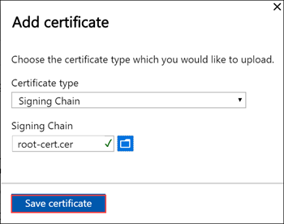
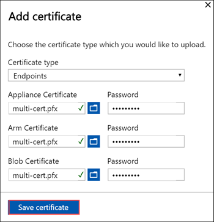
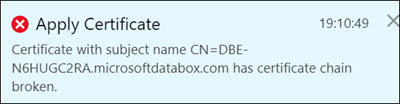
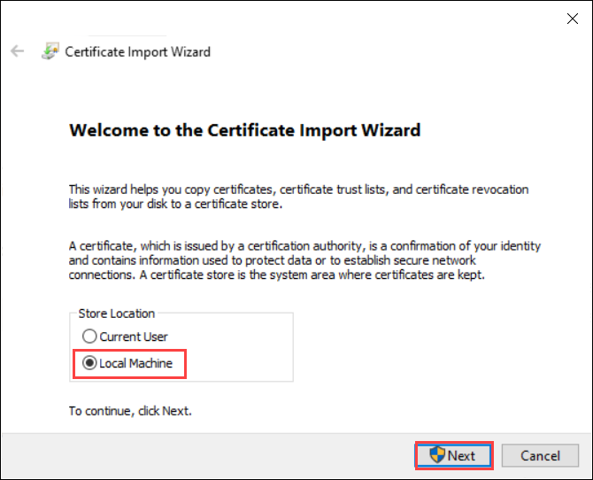

# Upload, import, and export certificates on Azure Stack Edge Pro GPU

[!INCLUDE [applies-to-GPU-and-pro-r-and-mini-r-skus](../../includes/azure-stack-edge-applies-to-gpu-pro-r-mini-r-sku.md)]

To ensure secure and trusted communication between your Azure Stack Edge device and the clients connecting to it, you can use self-signed certificates or bring your own certificates. This article describes how to manage these certificates including how to upload, import, export these certificates or view their expiration date.

To know more about how to create these certificates, see [Create certificates using Azure PowerShell](azure-stack-edge-gpu-create-certificates-powershell.md).

## Upload certificates on your device

If you bring your own certificates, then the certificates that you created for your device by default reside in the **Personal store** on your client. These certificates need to be exported on your client into appropriate format files that can then be uploaded to your device.

### Prerequisites

Before you upload your root certificates and endpoint certificates on to the device, make sure the certificates are exported in appropriate format.

- The root certificate must be exported as DER format with `.cer` extension. For detailed steps, see [Export certificates as DER format](azure-stack-edge-gpu-prepare-certificates-device-upload.md#export-certificates-as-der-format).
- The endpoint certificates must be exported as *.pfx* files with private keys. For detailed steps, see [Export certificates as *.pfx* file with private keys](azure-stack-edge-gpu-prepare-certificates-device-upload.md#export-certificates-as-pfx-format-with-private-key). 

### Upload certificates 

To upload the root and endpoint certificates on the device, use the **+ Add certificate** option on the **Certificates** page in the local web UI. Follow these steps:

1. Upload the root certificates first. In the local web UI, go to **Certificates > + Add certificate**.

    

2. Next upload the endpoint certificates. 

    

    Choose the certificate files in *.pfx* format and enter the password you supplied when you exported the certificate. The Azure Resource Manager certificate may take a few minutes to apply.

    If the signing chain is not updated first, and you try to upload the endpoint certificates, then you will get an error.

    

    Go back and upload the signing chain certificate and then upload and apply the endpoint certificates.

> [!IMPORTANT]
> If the device name or the DNS domain are changed, new certificates must be created. The client certificates and the device certificates should then be updated with the new device name and DNS domain. 

## Import certificates on the client accessing the device

You can use the device-generated certificates or bring your own certificates. When using device-generated certificates, you must download the certificates on your client before you can import those into the appropriate certificate store. See [Download certificates to your client accessing the device](azure-stack-edge-gpu-deploy-configure-certificates.md#generate-device-certificates).

In both the cases, the certificates that you created and uploaded to your device must be imported on your Windows client (accessing the device) into the appropriate certificate store. 

- The root certificate that you exported as the DER should now be imported in the **Trusted Root Certificate Authorities** on your client system. For detailed steps, see [Import certificates into the Trusted Root Certificate Authorities store](#import-certificates-as-der-format).

- The endpoint certificates that you exported as the `.pfx` must be exported as DER with `.cer` extension. This `.cer` is then imported in the **Personal certificate store** on your system. For detailed steps, see [Import certificates into the Personal certificate store](#import-certificates-as-der-format).

### Import certificates as DER format 

To import certificates on a Windows client, take the following steps:

1. Right-click the file and select **Install certificate**. This action starts the Certificate Import Wizard.

    

2. For **Store location**, select **Local Machine**, and then select **Next**.

    

3. Select **Place all certificates in the following store**, and then select **Browse**. 

    - To import into personal store, navigate to the Personal store of your remote host, and then select **Next**.

        

    - To import into trusted store, navigate to the Trusted Root Certificate Authority, and then select **Next**.

        

 
4. Select **Finish**. A message to the effect that the import was successful appears.

## View certificate expiry

If you bring in your own certificates, the certificates will expire typically in 1 year or 6 months. To view the expiration date on your certificate, go to the **Certificates** page in the local web UI of your device. If you select a specific certificate, you can view the expiration date on your certificate.

## Next steps

Learn how to [Troubleshoot certificate issues](azure-stack-edge-gpu-certificate-troubleshooting.md)