# Manage compute on your Azure Stack Edge Pro GPU

[!INCLUDE [applies-to-GPU-and-pro-r-and-mini-r-skus](../../includes/azure-stack-edge-applies-to-gpu-pro-r-mini-r-sku.md)]

This article describes how to manage compute via IoT Edge service on your Azure Stack Edge Pro GPU device. You can manage the compute via the Azure portal or via the local web UI. Use the Azure portal to manage modules, triggers, and IoT Edge configuration, and the local web UI to manage compute network settings.

## Manage triggers

Events are things that happen within your cloud environment or on your device that you might want to take action on. For example, when a file is created in a share, it is an event. Triggers raise the events. For your Azure Stack Edge Pro, triggers can be in response to file events or a schedule.

- **File**: These triggers are in response to file events such as creation of a file, modification of a file.
- **Scheduled**: These triggers are in response to a schedule that you can define with a start date, start time, and the repeat interval.

### Add a trigger

Take the following steps in the Azure portal to create a trigger.

1. In the Azure portal, go to your Azure Stack Edge resource and then go to **IoT Edge**. Go to **Triggers** and select **+ Add trigger** on the command bar.

    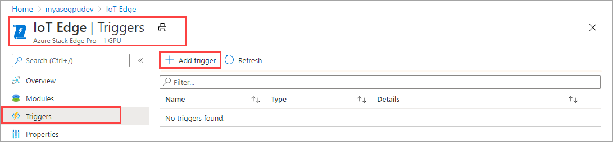

2. In **Add trigger** blade, provide a unique name for your trigger.
    
    <!--Trigger names can only contain numbers, lowercase letters, and hyphens. The share name must be between 3 and 63 characters long and begin with a letter or a number. Each hyphen must be preceded and followed by a non-hyphen character.-->

3. Select a **Type** for the trigger. Choose **File** when the trigger is in response to a file event. Select **Scheduled** when you want the trigger to start at a defined time and run at a specified repeat interval. Depending on your selection, a different set of options is presented.

    - **File trigger** - Choose from the dropdown list a mounted share. When a file event is fired in this share, the trigger would invoke an Azure Function.

        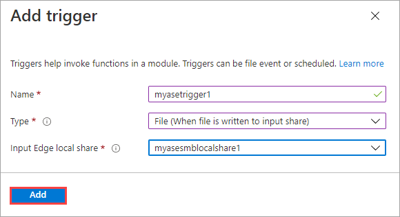

    - **Scheduled trigger** - Specify the start date/time, and the repeat interval in hours, minutes, or seconds. Also, enter the name for a topic. A topic will give you the flexibility to route the trigger to a module deployed on the device.

        An example route string is: `"route3": "FROM /* WHERE topic = 'topicname' INTO BrokeredEndpoint("modules/modulename/inputs/input1")"`.

        

4. Select **Add** to create the trigger. A notification shows that the trigger creation is in progress. After the trigger is created, the blade updates to reflect the new trigger.
 
    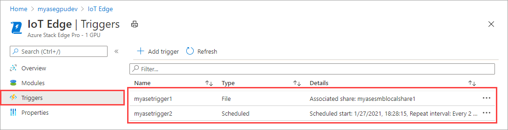

### Delete a trigger

Take the following steps in the Azure portal to delete a trigger.

1. From the list of triggers, select the trigger that you want to delete.

    

2. Right-click and then select **Delete**.

    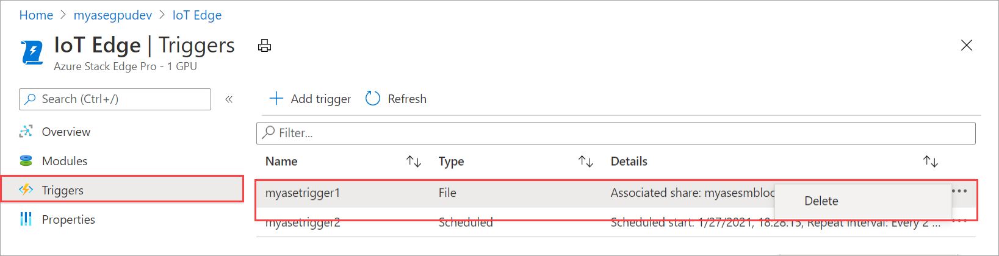

3. When prompted for confirmation, click **Yes**.

    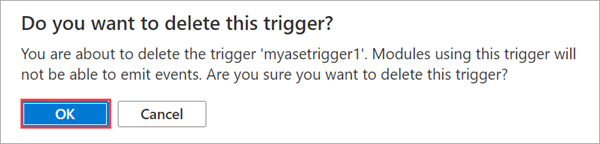

The list of triggers updates to reflect the deletion.

## Manage IoT Edge configuration

Use the Azure portal to view the compute configuration, remove an existing compute configuration, or to refresh the compute configuration to sync up access keys for the IoT device and IoT Edge device for your Azure Stack Edge Pro.

### View IoT Edge configuration

Take the following steps in the Azure portal to view the IoT Edge configuration for your device.

1. In the Azure portal, go to your Azure Stack Edge resource and then go to **IoT Edge**. After IoT Edge service is enabled on your device, the Overview page indicates that the IoT Edge service is running fine.

    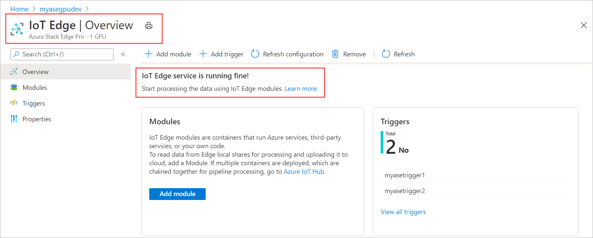

2. Go to **Properties** to view the IoT Edge configuration on your device. When you configured compute, you created an IoT Hub resource. Under that IoT Hub resource, an IoT device and an IoT Edge device are configured. Only the Linux modules are supported to run on the IoT Edge device.

    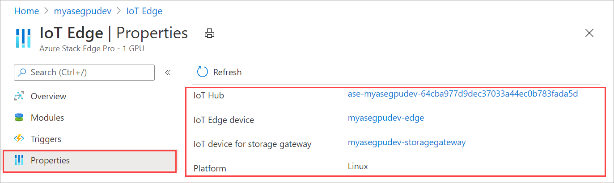

### Remove IoT Edge service

Take the following steps in the Azure portal to remove the existing IoT Edge configuration for your device.

1. In the Azure portal, go to your Azure Stack Edge resource and then go to **IoT Edge**. Go to **Overview** and select **Remove** on the command bar.

    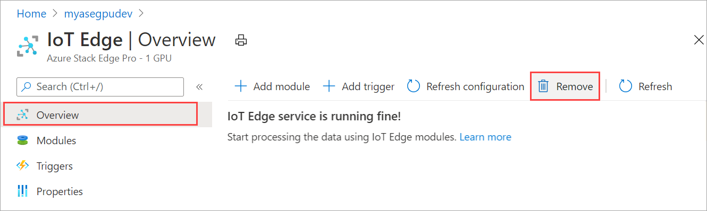

2. If you remove the IoT Edge service, the action is irreversible and can't be undone. The modules and triggers that you created will also be deleted. You will need to reconfigure your device in case you need to use IoT Edge again. When prompted for confirmation, select **OK**.

    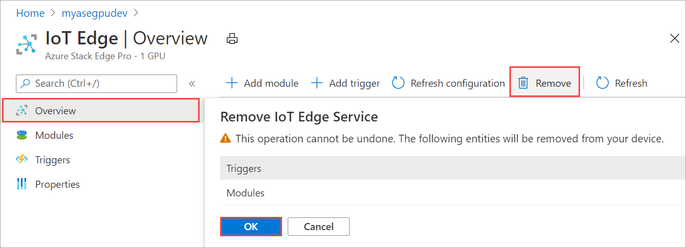

### Sync up IoT device and IoT Edge device access keys

When you configure compute on your Azure Stack Edge Pro, an IoT device and an IoT Edge device are created. These devices are automatically assigned symmetric access keys. As a security best practice, these keys are rotated regularly via the IoT Hub service.

To rotate these keys, you can go to the IoT Hub service that you created and select the IoT device or the IoT Edge device. Each device has a primary access key and a secondary access keys. Assign the primary access key to the secondary access key and then regenerate the primary access key.

If your IoT device and IoT Edge device keys have been rotated, then you need to refresh the configuration on your Azure Stack Edge Pro to get the latest access keys. The sync helps the device get the latest keys for your IoT device and IoT Edge device. Azure Stack Edge Pro uses only the primary access keys.

Take the following steps in the Azure portal to sync the access keys for your device.

1. In the Azure portal, go to your Azure Stack Edge resource and then go to **IoT Edge compute**. Go to **Overview** and select **Refresh configuration** on the command bar.

    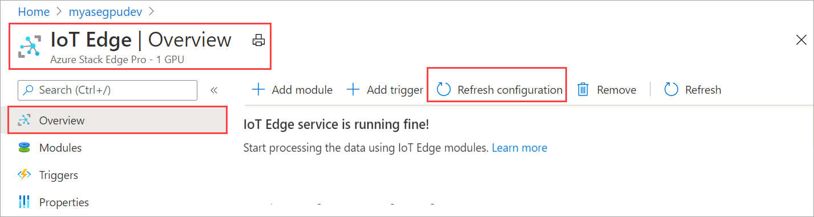

2. Select **Yes** when prompted for confirmation.

    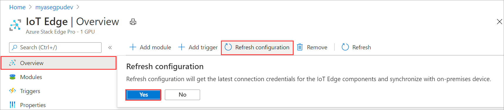

3. Exit out of the dialog once the sync is complete.

## Change external service IPs for containers

Kubernetes external service IPs are used to reach out to services that are exposed outside the Kubernetes cluster. After your device is activated, you can set or modify the external service IPs for containerized workloads for your device by accessing the local UI.

1. In the local UI of the device, go to **Compute**.
1. Select the port whose network is configured for compute. In the blade that opens up, specify (new) or modify (if existing) the Kubernetes external service IPs. These IPs are used for any services that need to be exposed outside of the Kubernetes cluster. 
    - You need a minimum of 1 service IP for the `edgehub` service that runs on your device and is used by IoT Edge modules. 
    - You will need an IP for each additional IoT Edge module or container that you intend to deploy. 
    - These are static, contiguous IPs.

    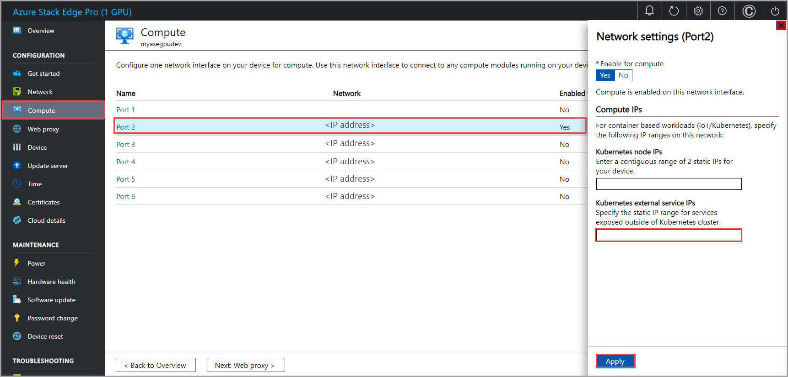

1. Select **Apply**. After the IPs are applied, your device does not need a restart or a reboot. The new IPs take effect immediately.

## Next steps

- Learn how to [troubleshoot IoT Edge issues on your Azure Stack Edge Pro GPU device](azure-stack-edge-gpu-troubleshoot-iot-edge.md).
