# Use alert processing rules to manage alert notifications on Azure Stack Edge devices

[!INCLUDE [applies-to-GPU-and-pro-r-and-mini-r-skus](../../includes/azure-stack-edge-applies-to-gpu-pro-r-mini-r-sku.md)]

This article describes how to create alert processing rules in the Azure portal. Alert processing rules trigger or suppress notifications for device events that occur within a resource group, an Azure subscription, or an individual Azure Stack Edge resource.  

## About alert processing rules

An alert processing rule can add action groups to alert notifications. Use alert notification preferences, like email or SMS messages, to notify users when alerts are triggered.

For more information about alert processing rules, see [Alert processing rules](../azure-monitor/alerts/alerts-processing-rules.md?tabs=portal). For more information about action groups, see [Create and manage action groups in the Azure portal](../azure-monitor/alerts/action-groups.md).

## Create an alert processing rule

Use the following steps in the Azure portal to create an alert processing rule for your Azure Stack Edge device.

> [!NOTE]
> These steps create an alert processing rule. The alert processing rule adds action groups to alert notifications. For details about creating an alert processing rule to suppress notifications, see [Alert processing rules](../azure-monitor/alerts/alerts-action-rules.md?tabs=portal).

1. Go to the Azure Stack Edge device in the [Azure portal](https://portal.azure.com), and select the **Alerts** menu item (under **Monitoring**). Then select **Alert processing rules**.

   [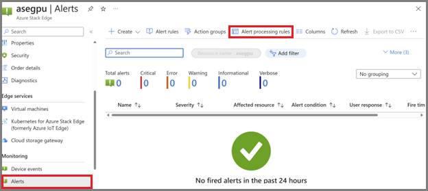](media/azure-stack-edge-gpu-manage-device-event-alert-notifications/azure-stack-edge-alert-processing-rules-01.png#lightbox)

2. On the **Alert processing rules** page, select **+ Create** to launch the **Create an alert processing rule** wizard.

   [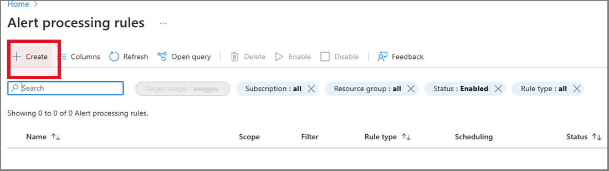](media/azure-stack-edge-gpu-manage-device-event-alert-notifications/azure-stack-edge-alert-processing-rules-create-rule-02.png#lightbox)

3. On the **Scope** page, select **+ Select scope**.

   [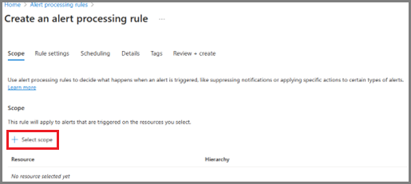](media/azure-stack-edge-gpu-manage-device-event-alert-notifications/azure-stack-edge-alert-processing-rules-select-scope-03.png#lightbox) 

1. Select a **Subscription** and optionally filter by **Resource types**. To filter by Azure Stack Edge resources, select **Resource types** for **Azure Stack Edge / Data Box Gateway** as shown in the following example.

   [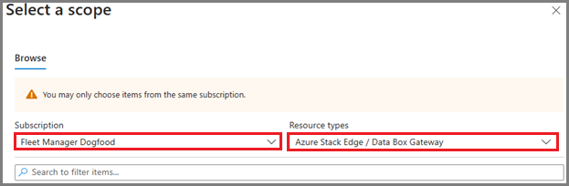](media/azure-stack-edge-gpu-manage-device-event-alert-notifications/azure-stack-edge-alert-processing-rules-select-subscription-04.png#lightbox)

1. The **Resource type** option lists the available resources based on your selection. Use the filter option to reduce the list of options. Select the **Checkbox** for the scope option you want to work with and then select **Apply**.

   [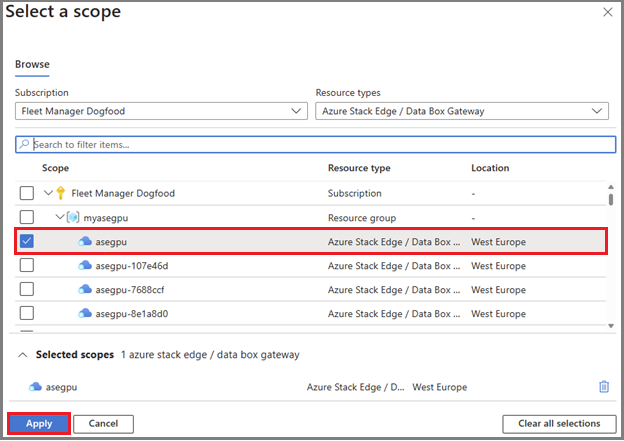](media/azure-stack-edge-gpu-manage-device-event-alert-notifications/azure-stack-edge-new-action-rule-scope-selection-05a.png#lightbox)

1. You can also use the **Filter** control in the following example to reduce the list of options to a subset of alerts within the selected scope.

   [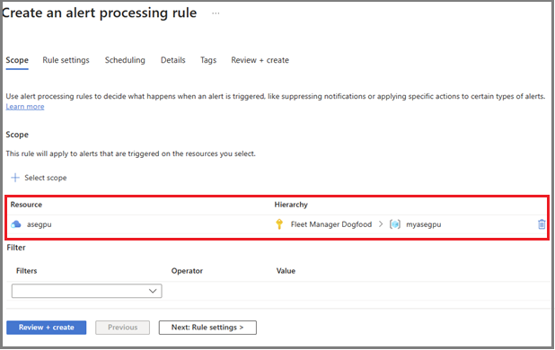](media/azure-stack-edge-gpu-manage-device-event-alert-notifications/azure-stack-edge-filter-scope-results-06a.png#lightbox)
   
1. On the **Add filters** pane, under **Filters**, add each filter you want to apply. For each filter, select the **Filter** type, **Operator**, and **Value**.

   For a list of filter options, see [Filter criteria](../azure-monitor/alerts/alerts-processing-rules.md?tabs=portal#scope-and-filters-for-alert-processing-rules).

   The filters in the following example apply to all alerts at Severity levels 2, 3, and 4 that the Monitor service raises for Azure Stack Edge resources. 

   [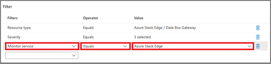](media/azure-stack-edge-gpu-manage-device-event-alert-notifications/azure-stack-edge-action-rule-filter-criteria-builder-07.png#lightbox)

1. On the **Rule Settings** page, select **Apply action group** to create a rule that sends notifications.

   Select an option to **+ Select action group** for an existing group or **+ Create action group** to create a new one.

    To create a new action group, select **+ Create action group** and follow the steps in [Alert processing rules](../azure-monitor/alerts/alerts-processing-rules.md#add-action-groups-to-all-alert-types).

   >[!NOTE]
   >Select the **Suppress notifications** option if you don't want to invoke notifications for alerts. For more information, see [Alert processing rules](../azure-monitor/alerts/alerts-processing-rules.md?tabs=portal#suppress-notifications-during-planned-maintenance).

   [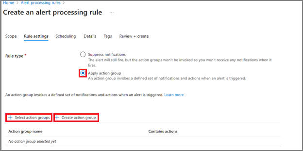](media/azure-stack-edge-gpu-manage-device-event-alert-notifications/azure-stack-edge-action-rule-setting-options-08.png#lightbox)

1. On the **Select action groups** page, select up to five action groups to attach to the alert processing rule, and then choose **Select**. 

   The new alert processing rule is added to the notification preferences of the action group.

   [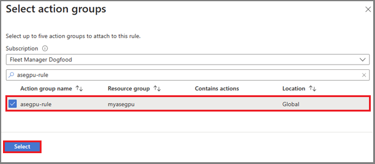](media/azure-stack-edge-gpu-manage-device-event-alert-notifications/azure-stack-edge-select-action-group-09a.png#lightbox) 

1. On the **Details** tab, assign the alert processing rule to a **Resource group** and then specify a **Name** and a **Description** (optional) for the new rule.

   The new rule is enabled by default. If you don't want to start using the rule immediately, leave the **Enable rule upon creation** option unchecked.

   [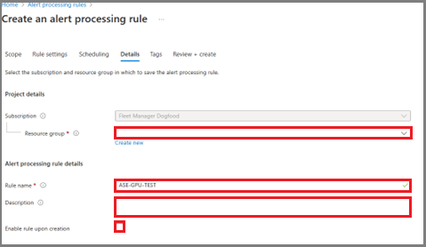](media/azure-stack-edge-gpu-manage-device-event-alert-notifications/azure-stack-edge-create-processing-rule-10.png#lightbox)

1. To continue, select **Review+Create**.

   [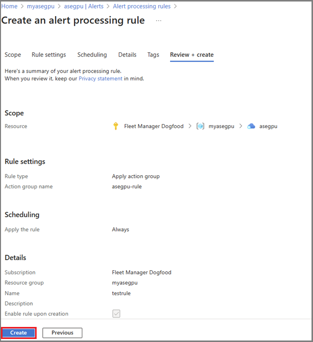](media/azure-stack-edge-gpu-manage-device-event-alert-notifications/azure-stack-edge-processing-rule-details-11a.png#lightbox)

1. Review your selections and then select **Create**.

   The **Alert processing rules** page launches, but you may not see the new rule immediately. The default view is **All** resource groups.

1. To view your new alert processing rule, select the resource group that contains the rule.

   [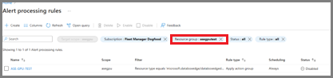](media/azure-stack-edge-gpu-manage-device-event-alert-notifications/azure-stack-edge-processing-rules-12.png#lightbox)   

## View notifications

Notifications go out when an event triggers an alert for a resource within the scope of an alert processing rule.

The action group for an alert processing rule determines who receives a notification and the type of notification to send. Notifications can be sent via email, SMS message, or both.

It may take a few minutes to receive notifications after an alert is triggered.

The email notification looks similar to the following example.

## Next steps

- [View device alerts](azure-stack-edge-alerts.md).
- [Work with alert metrics](../azure-monitor/alerts/alerts-metric.md).
- [Set up Azure Monitor](azure-stack-edge-gpu-enable-azure-monitor.md).
