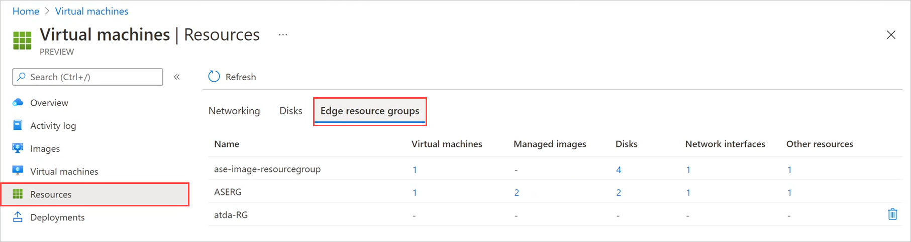
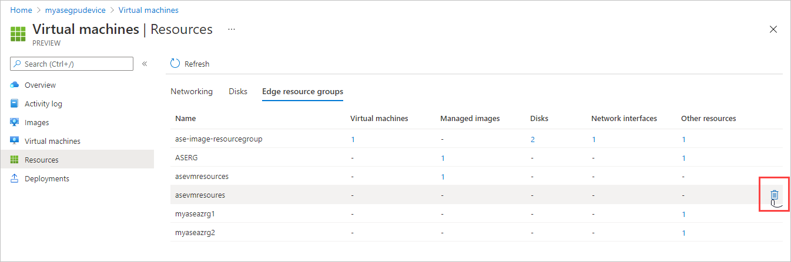
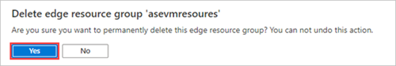

# Manage Edge resource groups on Azure Stack Edge Pro GPU devices

[!INCLUDE [applies-to-GPU-and-pro-r-and-mini-r-skus](../../includes/azure-stack-edge-applies-to-gpu-pro-r-mini-r-sku.md)]

Edge resource groups contain resources that are created on the device via the local Azure Resource Manager during virtual machine creation and deployment. These local resources can include virtual machines, VM images, disks, network interfaces, and other resource types such as Edge storage accounts.

This article describes how to view and delete Edge resource groups on an Azure Stack Edge Pro GPU device.

## View Edge resource groups

Follow these steps to view the Edge resource groups for the current subscription.

1. Go to **Virtual machines** on your device, and go to the **Resources** pane. Select **Edge resource groups**.

    

    > [!NOTE]
    > You can get the same listing by using [Get-AzResource](/powershell/module/az.resources/get-azresource) in Azure PowerShell after you set up the Azure Resource Manager environment on your device. For more information, see [Connect to Azure Resource Manager](azure-stack-edge-gpu-connect-resource-manager.md).

## Delete an Edge resource group

Follow these steps to delete an Edge resource group that's no longer in use.

> [!NOTE]
> - A resource group must be empty to be deleted. 
> - You can't delete the ASERG resource group. That resource group stores the ASEVNET virtual network, which is created automatically when you enable compute on your device.

1. Go to **Virtual machines** on your device, and go to the **Resources** pane. Select **Edge resource groups**.

    

1. Select the resource group that you want to delete. In the far right of the resource group, select the delete icon (trashcan).

   The delete icon is only displayed when a resource group doesn't contain any resources.

    

1. You'll see a message asking you to confirm that you want to delete the Edge resource group. The operation can't be reversed. Select **Yes**.

    

    When deletion is complete, the resource group is removed from the list.

## Next steps

- To learn how to administer your Azure Stack Edge Pro GPU device, see [Use local web UI to administer an Azure Stack Edge Pro GPU](azure-stack-edge-manage-access-power-connectivity-mode.md).

- [Set up the Azure Resource Manager environment on your device](azure-stack-edge-gpu-connect-resource-manager.md).