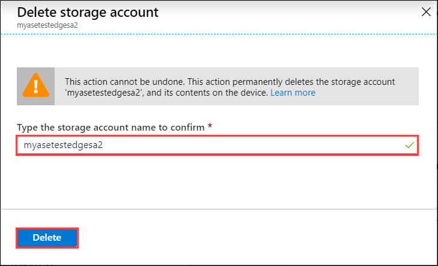
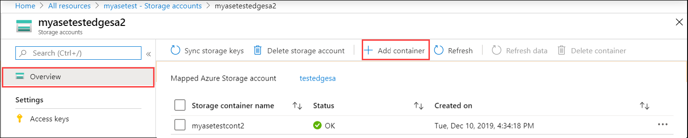
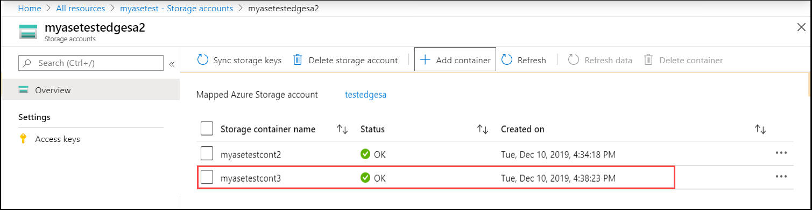

# Use the Azure portal to manage Edge storage accounts on your Azure Stack Edge Pro

[!INCLUDE [applies-to-GPU-and-pro-r-and-mini-r-skus](../../includes/azure-stack-edge-applies-to-gpu-pro-r-mini-r-sku.md)]

This article describes how to manage Edge storage accounts on your Azure Stack Edge Pro. You can manage the Azure Stack Edge Pro via the Azure portal or via the local web UI. Use the Azure portal to add or delete Edge storage accounts on your device.

## About Edge storage accounts

You can transfer data from your Azure Stack Edge Pro device via the SMB, NFS, or REST protocols. To transfer data to Blob storage using the REST APIs, you need to create Edge storage accounts on your Azure Stack Edge Pro. 

The Edge storage accounts that you add on the Azure Stack Edge Pro device are mapped to Azure Storage accounts. Any data written to the Edge storage accounts is automatically pushed to the cloud.

A diagram detailing the two types of accounts and how the data flows from each of these accounts to Azure is shown below:

In this article, you learn how to:

> [!div class="checklist"]
> * Add an Edge storage account
> * Delete an Edge storage account

## Add an Edge storage account

To create an Edge storage account, do the following procedure:

[!INCLUDE [Add an Edge storage account](../../includes/azure-stack-edge-gateway-add-storage-account.md)]

## Delete an Edge storage account

Take the following steps to delete an Edge storage account.

1. Go to **Configuration > Storage accounts** in your resource. From the list of storage accounts, select the storage account you want to delete. From the top command bar, select **Delete storage account**.

    

2. In the **Delete storage account** blade, confirm the storage account to delete and select **Delete**.

    

The list of storage accounts is updated to reflect the deletion.

## Add, delete a container

You can also add or delete the containers for these storage accounts.

To add a container, take the following steps:

1. Select the storage account that you want to manage. From the top command bar, select **+ Add container**.

    

2. Provide a name for your container. This container is created in your Edge storage account as well as the Azure storage account mapped to this account. 

    

The list of containers is updated to reflect the newly added container.

You can now select a container from this list and select **+ Delete container** from the top command bar. 

## Sync storage keys

You can synchronize the access keys for the Edge (local) storage accounts on your device. 

To sync the storage account access key, take the following steps:

1. In your resource, select the storage account that you want to manage. From the top command bar, select **Sync storage key**.

    

2. When prompted for confirmation, select **Yes**.

    

## Next steps

- Learn how to [Manage users via Azure portal](azure-stack-edge-gpu-manage-users.md).
