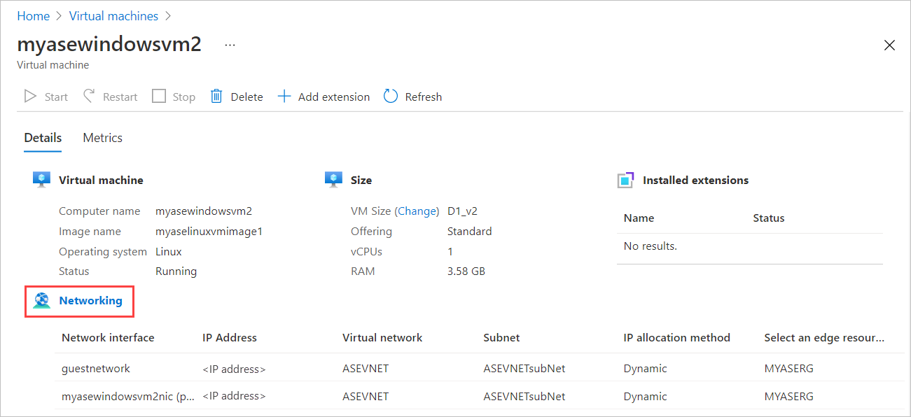
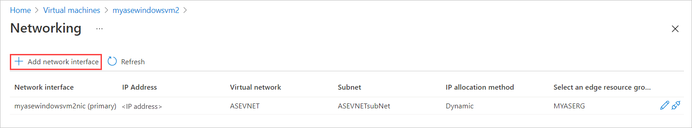
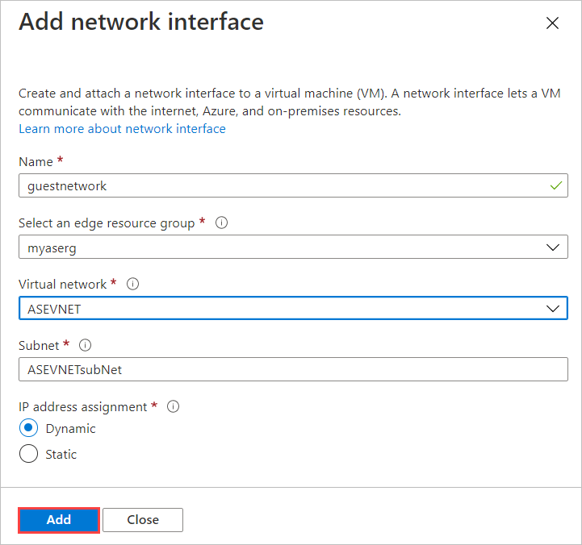
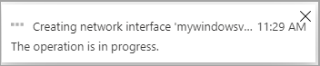
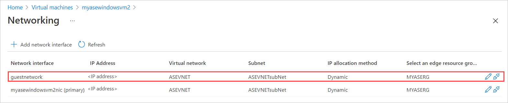
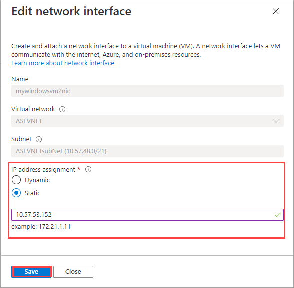
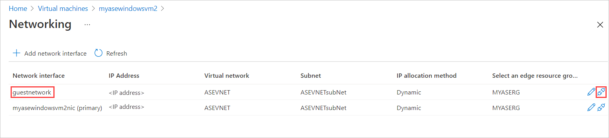

# Use the Azure portal to manage disks on the VMs on your Azure Stack Edge Pro GPU

[!INCLUDE [applies-to-GPU-and-pro-r-and-mini-r-skus](../../includes/azure-stack-edge-applies-to-gpu-pro-r-mini-r-sku.md)]

You can provision disks on the virtual machines (VMs) deployed on your Azure Stack Edge Pro device using the Azure portal. The disks are provisioned on the device via the local Azure Resource Manager and consume the device capacity. The operations such as adding a disk, detaching a disk can be done via the Azure portal which in turn makes calls to the local Azure Resource Manager to provision the storage. <!--Disks are provisioned in local ARM via the portal. Use the Storage RP/Disk RP-->

This article explains how to add a data disk to an existing VM, detach a data disk, and finally resize the VM itself via the Azure portal. 

        
## About disks on VMs

Your VM can have an OS disk and a data disk. Every virtual machine deployed on your device has one attached operating system disk. This OS disk has a pre-installed OS, which was selected when the VM was created. This disk contains the boot volume.
<!--Looks like we can't change the OS disk size from the portal. Is it possible to change these at all, via CLI or PS? Is the storage disk also on the ASE? Do we allow both managed and unmanaged disks as Az Stack does?-->

A data disk on the other hand, is a managed disk attached to the VM running on your device. A data disk is used to store application data. Data disks are typically SCSI drives. The size of the VM determines how many data disks you can attach to a VM and the type of storage you can use to host the disks.<!--I am assuming because of the presence of LUN in the portal that these are SCSI drives?-->

<!-- Do we have temp disk on VMs that run on ASE?-->
<!--cost of increasing the disk size other than the capacity it consumes -->
<!--do we allow features such as encryption or BitLocker for these disks.Didn't see anything in portal.-->
A VM deployed on your device may sometimes contain a temporary disk. The temporary disk provides short-term storage for applications and processes, and is intended to only store data such as page or swap files. Data on the temporary disk may be lost during a maintenance event or when you redeploy a VM. During a successful standard reboot of the VM, data on the temporary disk will persist. 

## Prerequisites

Before you begin to manage disks on the VMs running on your device via the Azure portal, make sure that:
<!--Does the VM needs to be stopped or in running state when adding a disk like Azure VM? I was able to add a data disk while the VM was stopped -->

1. You have enabled a network interface for compute on your device. This action creates a virtual switch on that network interface on your VM. 
    1. In the local UI of your device, go to **Compute**. Select the network interface that you will use to create a virtual switch.

        > [!IMPORTANT] 
        > You can only configure one port for compute.

    1. Enable compute on the network interface. Azure Stack Edge Pro GPU creates and manages a virtual switch corresponding to that network interface.

1. You have atleast one VM deployed on your device. To create this VM, see the instructions in [Deploy VM on your Azure Stack Edge Pro via the Azure portal](azure-stack-edge-gpu-deploy-virtual-machine-portal.md).

1. Your VM should be in **Running** state. To stop your VM, go to **Virtual machines > Overview** and select the VM you want to stop. In the VM properties page, select **Stop** and then select **Yes** when prompted for confirmation. Before you add, edit, or delete network interfaces, you must stop the VM.

    

## Add a data disk

Follow these steps to add a network interface to a virtual machine deployed on your device. 

1. Go to the virtual machine that you have stopped and then go to the **VM Properties** page. Select **Disks**.
    
    

2. In the **Disks** blade, from the command bar, select **+ Add network interface**.

    

3. In the **Add network interface** blade, enter the following parameters:

    
    |Column1  |Column2  |
    |---------|---------|
    |Name     | A unique name within the resource group. The name cannot be changed after the network interface is created. To manage multiple network interfaces easily, use the suggestions provided in the [Naming conventions](/azure/cloud-adoption-framework/ready/azure-best-practices/naming-and-tagging#resource-naming).     |
    |Virtual network| The virtual network associated with the virtual switch created on your device when you enabled compute on the network interface. There is only one virtual network associated with your device. |         
    |Subnet   | A subnet within the selected virtual network. This field is automatically populated with the subnet associated with the network interface on which you enabled compute. |       
    |IP assignment   | A static or a dynamic IP for your network interface. The static IP should be an available, free IP from the specified subnet range. Choose dynamic if a DHCP server exists in the environment.| 

    

4. You'll see a notification that the network interface creation is in progress.

    

5.  After the network interface is successfully created, the list of network interfaces refreshes to display the newly created interface.

    

## Edit a data disk

Follow these steps to edit a network interface associated with a virtual machine deployed on your device.

1. Go to the virtual machine that you have stopped and go to the **VM Properties** page. Select **Networking**.

1. In the list of network interfaces, select the interface that you wish to edit. In the far right of the network interface selected, select the edit icon (pencil).  

    

1. In the **Edit network interface** blade, you can only change the IP assignment of the network interface. The name, virtual network, and subnet associated with the network interface can't be changed once it is created. Change the **IP assignment** to static and save the changes.

    

1. The list of network interface refreshes to display the updated network interface.

## Detach a data disk

Follow these steps to detach or remove a network interface associated with a virtual machine deployed on your device.

1. Go to the virtual machine that you have stopped and go to the **VM Properties** page. Select **Disk**.

1. In the list of network interfaces, select the interface that you wish to edit. In the far right of the network interface selected, select the detach icon (unplug).  

    

1. After the interface is completely detached, the list of network interfaces is refreshed to display the remaining interfaces.

## Next steps

To learn how to deploy virtual machines on your Azure Stack Edge Pro device, see [Deploy virtual machines via the Azure portal](azure-stack-edge-gpu-deploy-virtual-machine-portal.md).
