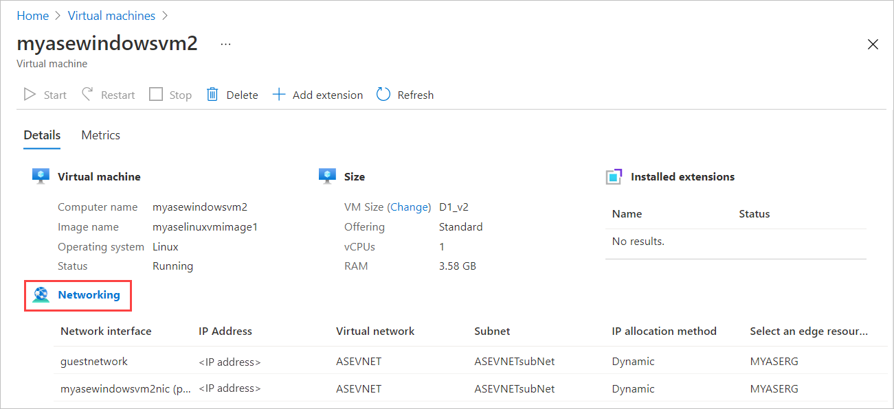
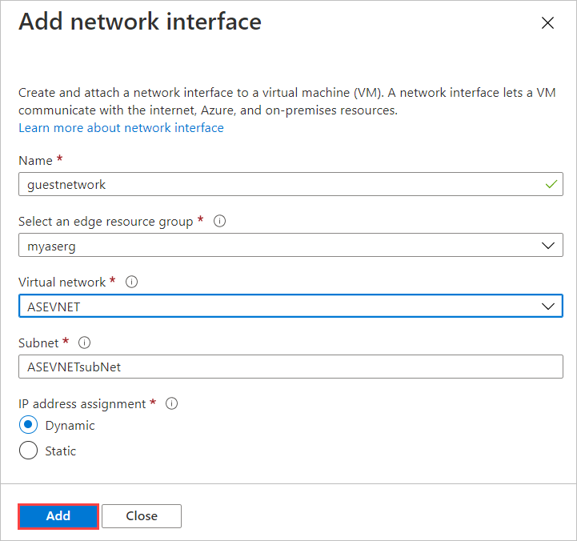
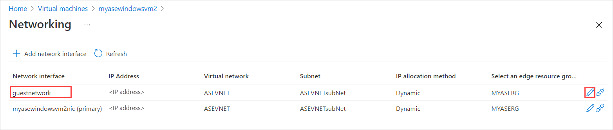
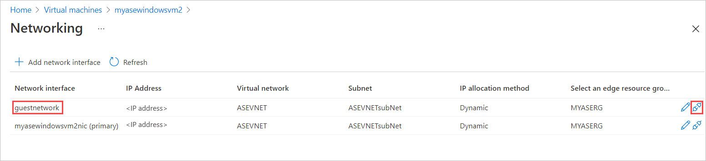
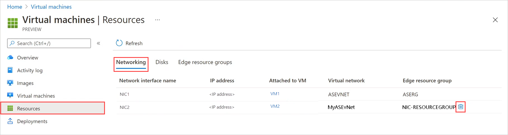

# Use the Azure portal to manage network interfaces on the VMs on your Azure Stack Edge Pro GPU

[!INCLUDE [applies-to-GPU-and-pro-r-and-mini-r-skus](../../includes/azure-stack-edge-applies-to-gpu-pro-r-mini-r-sku.md)]

You can create and manage virtual machines (VMs) on an Azure Stack Edge device using Azure portal, templates, Azure PowerShell cmdlets and via Azure CLI/Python scripts. This article describes how to manage the network interfaces on a VM running on your Azure Stack Edge device using the Azure portal.

When you create a VM, you specify one virtual network interface to be created. You may want to add one or more network interfaces to the virtual machine after it is created. You may also want to change the default network interface settings for an existing network interface.

This article explains how to add a network interface to an existing VM, change existing settings such as IP type (static vs. dynamic), and detach or delete an existing interface.

        
## About network interfaces on VMs

A network interface enables a virtual machine (VM) running on your Azure Stack Edge Pro device to communicate with Azure and on-premises resources. When you enable a port for compute network on your device, a virtual switch is created on that network interface. This virtual switch is then used to deploy compute workloads such as VMs or containerized applications on your device. 

Your device supports only one virtual switch but multiple virtual network interfaces. Each network interface on your VM has a static or a dynamic IP address assigned to it. With IP addresses assigned to multiple network interfaces on your VM, certain capabilities are enabled on your VM. For example, your VM can host multiple websites or services with different IP addresses and SSL certificates on a single server. A VM on your device can serve as a network virtual appliance, such as a firewall or a load balancer. <!--Is it possible to do that on ASE?-->

<!--There is a limit to how many virtual network interfaces can be created on the virtual switch on your device. See the Azure Stack Edge Pro limits article for details.--> 

## Prerequisites

Before you begin to manage VMs on your device via the Azure portal, make sure that:

1. You've access to an activated Azure Stack Edge Pro GPU device. You have enabled a network interface for compute on your device. This action creates a virtual switch on that network interface on your VM. 
    1. In the local UI of your device, go to **Compute**. Select the network interface that you will use to create a virtual switch.

        > [!IMPORTANT] 
        > You can only configure one port for compute.

    1. Enable compute on the network interface. Azure Stack Edge Pro GPU creates and manages a virtual switch corresponding to that network interface.

1. You have at least one VM deployed on your device. To create this VM, see the instructions in [Deploy VM on your Azure Stack Edge Pro via the Azure portal](azure-stack-edge-gpu-deploy-virtual-machine-portal.md).

1. Your VM should be in **Stopped** state. To stop your VM, go to **Virtual machines** and select the VM you want to stop. In the VM **Details** page, select **Stop** and then select **Yes** when prompted for confirmation. Before you add, edit, or delete network interfaces, you must stop the VM.

    

## Add a network interface

Follow these steps to add a network interface to a virtual machine deployed on your device.<!--There's no obvious way to add a new NIC to a VM or to an Edge resource group in the portal. To update these procedures, I need to create my own test VM, which I can start and stop, create a new NIC for, detach a NIC from the stopped VM, etc.-->

1. Go to the virtual machine that you have stopped, and select **Networking**.
    
    

2. In the **Networking** blade, from the command bar, select **+ Add network interface**.

    

3. In the **Add network interface** blade, enter the following parameters:

    |Field    |Description  |
    |---------|-------------|
    |Name     | A unique name within the edge resource group. The name cannot be changed after the network interface is created. To manage multiple network interfaces easily, use the suggestions provided in the [Naming conventions](/azure/cloud-adoption-framework/ready/azure-best-practices/naming-and-tagging#resource-naming).     |
    |Select an edge resource group |Select the edge resource group to add the network interface to.|   
    |Virtual network| The virtual network associated with the virtual switch created on your device when you enabled compute on the network interface. There is only one virtual network associated with your device.         |
    |Subnet     | A subnet within the selected virtual network. This field is automatically populated with the subnet associated with the network interface on which you enabled compute.         |
    |IP address assignment   | A static or a dynamic IP for your network interface. The static IP should be an available, free IP from the specified subnet range. Choose dynamic if a DHCP server exists in the environment.        |

    

4. You'll see a notification that the network interface creation is in progress.

    

5.  After the network interface is successfully created, the list of network interfaces refreshes to display the newly created interface.

    

## Edit a network interface

Follow these steps to edit a network interface associated with a virtual machine deployed on your device.

1. Go to the virtual machine that you have stopped, and select **Networking** in the virtual machine **Details**.

1. In the list of network interfaces, select the interface that you wish to edit. In the far right of the network interface selected, select the edit icon (pencil).  

    

1. In the **Edit network interface** blade, you can only change the IP assignment of the network interface. The name, edge resource group, virtual network, and subnet associated with the network interface can't be changed once it is created. Change the **IP assignment** to static, and save the changes.

    

1. The list of network interface refreshes to display the updated network interface.

## Detach a network interface

Follow these steps to detach or remove a network interface associated with a virtual machine deployed on your device.

1. Go to the virtual machine that you have stopped, and select **Networking** in the virtual machine **Details**.

1. In the list of network interfaces, select the interface that you wish to edit. In the far right of the network interface selected, select the detach icon (unplug).  

    

1. You'll see a message asking you to confirm that you want to detach the network interface. Select **Yes**.

    

    After the interface is completely detached, the list of network interfaces is refreshed to display the remaining interfaces.

## Delete a network interface

Follow these steps to delete a network interface that isn't attached to a virtual machine.

1. Go to **Virtual machines**, and then to the **Resources** page. Select **Networking**.
    
    

1. On the **Networking** blade, select the delete icon (trashcan) by the network interface you want to delete. The delete icon is only displayed for network interfaces that aren't attached to a VM.

    

1. You'll see a message asking you to confirm that you want to delete the network interface. The operation can't be reversed. Select **Yes**.

    
  
    After deletion of the network interface completes, the network interface is removed from the list.

## Next steps

To learn how to deploy virtual machines on your Azure Stack Edge Pro device, see [Deploy virtual machines via the Azure portal](azure-stack-edge-gpu-deploy-virtual-machine-portal.md).
