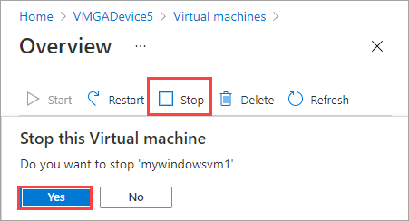
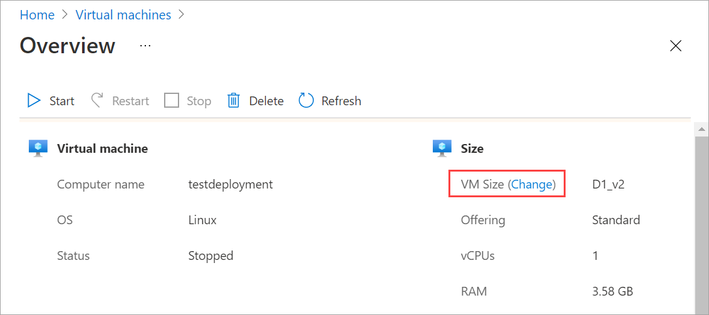
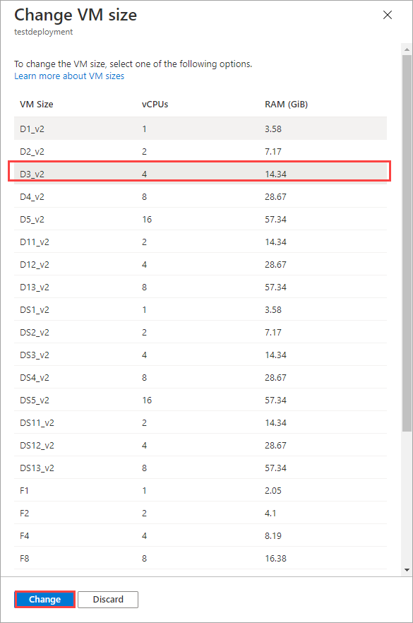
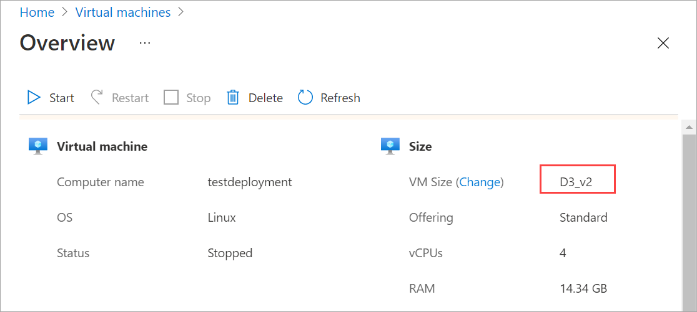

# Use the Azure portal to resize the VMs on your Azure Stack Edge Pro GPU

[!INCLUDE [applies-to-GPU-and-pro-r-and-mini-r-skus](../../includes/azure-stack-edge-applies-to-gpu-pro-r-mini-r-sku.md)]

This article explains how to resize the virtual machines (VMs) deployed on your Azure Stack Edge Pro GPU device.

       
## About VM sizing

The VM size determines the amount of compute resources (like CPU, GPU, and memory) that are made available to the VM. You should create virtual machines by using a VM size appropriate for your application workload. 

Even though all the machines will be running on the same hardware, machine sizes have different limits for disk access. This can help you manage overall disk access across your VMs. If a workload increases, you can also resize an existing virtual machine.

For more information, see [Supported VM sizes for your device](azure-stack-edge-gpu-virtual-machine-sizes.md).

## Prerequisites

Before you resize a VM running on your device via the Azure portal, make sure that:

1. You have at least one VM deployed on your device. To create this VM, see the instructions in [Deploy VM on your Azure Stack Edge Pro via the Azure portal](azure-stack-edge-gpu-deploy-virtual-machine-portal.md).

1. Your VM should be in **Stopped** state. To stop your VM, go to **Virtual machines > Overview** and select the VM you want to stop. In the Overview page, select **Stop** and then select **Yes** when prompted for confirmation. Before you resize your VM, you must stop the VM.

    

## Resize a VM

Follow these steps to resize a virtual machine deployed on your device. 

1. Go to the virtual machine that you have stopped, and select **VM size (change)** in the virtual machine **Details**.
    
    

2. In the **Change VM size** blade, from the command bar, select the **VM size** and then select **Change**.

    

3. You'll see a notification that the virtual machine is being updated. After the virtual machine is successfully updated, the **Overview** page refreshes to display the resized VM.

    

## Next steps

To learn how to deploy virtual machines on your Azure Stack Edge Pro device, see [Deploy virtual machines via the Azure portal](azure-stack-edge-gpu-deploy-virtual-machine-portal.md).
