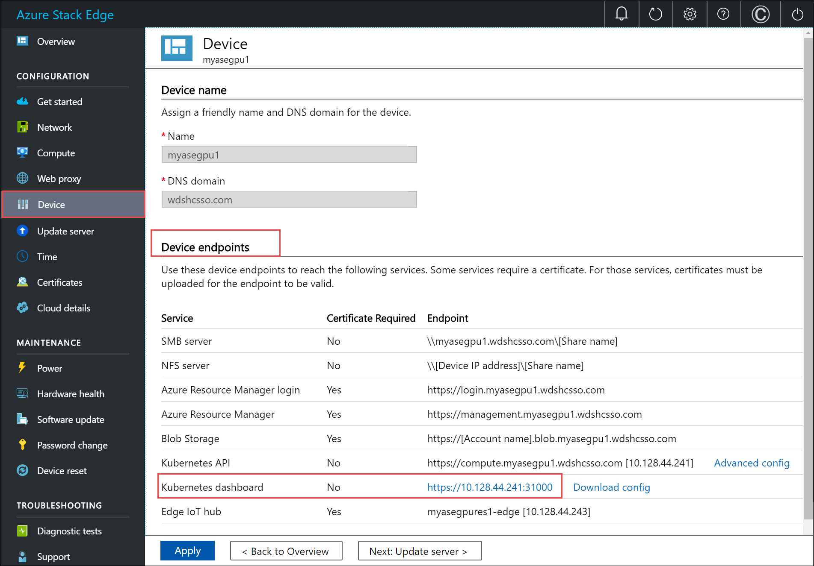
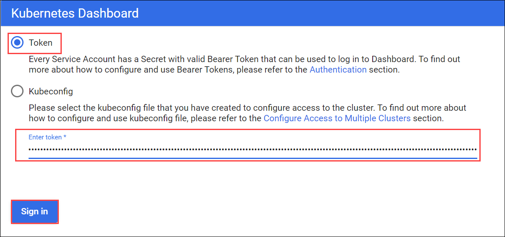

# Use Kubernetes dashboard to monitor your Azure Stack Edge GPU device

This article describes how to access and use the Kubernetes dashboard to monitor your Azure Stack Edge GPU device. To monitor your device, you can use charts in Azure portal, view the Kubernetes dashboard, or run `kubectl` commands via the PowerShell interface of the device. 

This article focuses only on the monitoring tasks that can be performed on the Kubernetes dashboard.

In this article, you learn how to:

> [!div class="checklist"]
>
> * Access the Kubernetes dashboard on your device
> * View modules deployed on your device
> * Get IP address for applications deployed on your device
> * View container logs for modules deployed on your device


## About Kubernetes Dashboard

Kubernetes Dashboard is a web-based user interface that you can use to troubleshoot your containerized applications. Kubernetes Dashboard is a UI-based alternative to the Kubernetes `kubectl` command line. 

On your Azure Stack Edge device, you can use the Kubernetes Dashboard in read-only mode to get an overview of the applications running on your Azure Stack Edge device, view status of Kubernetes cluster resources, and see any errors that have occurred on the device.

## Access dashboard

The Kubernetes Dashboard is read-only and runs on the Kubernetes master node at port 31000. Follow these steps to access the dashboard: 

1. In the local UI of your device, go to **Device** and then go to **Device endpoints**. Select the Kubernetes dashboard URL to open the dashboard in a browser.

    

1. On the **Kubernetes Dashboard sign in** page, select **token**. 
1. Provide a token. 
    1. To get the token, [Connect via PowerShell interface of your device](azure-stack-edge-gpu-connect-powershell-interface.md).
    1. Run the command: 
        `Get-HcsKubernetesDashboardToken`
    
    1. Copy the token string presented to you at the prompt. Here is a sample output:
        
        ```powershell
        [10.100.10.10]: PS>Get-HcsKubernetesDashboardToken
        eyJhbGciOiJSUzI1NiIsImtpZCI6IkpFTEtBYTMyZ0Ezb01OYTVFSnVaUV85OWtLdXNETTZQR0k0UlFybGdReFUifQ.eyJpc3MiOiJrdWJlcm5ldGVzL3NlcnZpY2VhY2NvdW50Iiwia3ViZXJuZXRlcy5pby9zZXJ2aWNlYWNjb3VudC9uYW1lc3BhY2UiOiJrdWJlcm5ldGVzLWRhc2hib2FyZCIsImt1YmVybmV0ZXMuaW8vc2VydmljZWFjY291bnQvc2VjcmV0Lm5hbWUiOiJrdWJlcm5ldGVzLWRhc2hib2FyZC10b2tlbi03czZ6ayIsImt1YmVybmV0ZXMuaW8vc2VydmljZWFjY291bnQvc2VydmljZS1hY2NvdW50Lm5hbWUiOiJrdWJlcm5ldGVzLWRhc2hib2FyZCIsImt1YmVybmV0ZXMuaW8vc2VydmljZWFjY291bnQvc2VydmljZS1hY2NvdW50LnVpZCI6IjU3NzY3ZDAzLTJlYWUtNDlkMi1hNDEyLTNkOTU3MDFiMThiMyIsInN1YiI6InN5c3RlbTpzZXJ2aWNlYWNjb3VudDprdWJlcm5ldGVzLWRhc2hib2FyZDprdWJlcm5ldGVzLWRhc2hib2FyZCJ9.UgNrpVYVJBEaWxFlljuENUQQmzFXMYG2VsJUIYFdp2AO20zX0k5dRvwcCpeGlqSKb9MyYjG0c6RmT9uCOZk-vAwt7btszQLD7KPCwh_nn_NiIyO8ApgGRYZP8NuP8CBTX3tl_hpwfHtZ0ksbuKAduIL-0uPF0rG5wgLk9cTEw6fKSc2UZW6bIzhNSp_uSiP6MexOS6OftF9JFZejkIGd33dSp-k-tgFlm2Zy96sdFJC0q-XsH7jygiVnfxA9XMs5wqW26LkCh0rfO2WI3C1XFK-4TpufRZLJHo5WPlu-Tnsxa8xmtk2jQ3us-sXcBRrvhPNPrNKkbqc9hbjmWfGD0Q
        [10.100.10.10]: PS>
        ```
        
1. Select **Sign in**.

    

6. You can now view the Kubernetes Dashboard for your Azure Stack Edge device in read-only mode.

    

## View module status

Compute modules are containers that have a business logic implemented. You can use the dashboard to verify if a compute module has deployed successfully on your Azure Stack Edge device.

TO view the module status, follow these steps on the dashboard:

1. In the left-pane of the dashboard, go to **Namespace**. Filter by the namespace where IoT Edge modules are displayed, in this case, **iotedge**.
1. In the left-pane, go to **Workloads > Deployments**.
1. In the right-pane, you will see all the modules deployed on your device. In this case, a GettingStartedWithGPU module was deployed on the Azure Stack Edge. You can see that the module was deployed.

    

 
## Get IP address for services or modules

You can use the dashboard to get the IP addresses of the services or modules that you want to expose outside of the Kubernetes cluster. 

You assign the IP range for these external services via the local web UI of the device in the **Compute network settings** page. After you have deployed IoT Edge modules, you may want to get the IP address assigned to a specific module or service. 

To get the IP address, follow these steps on the dashboard:

1. In the left-pane of the dashboard, go to **Namespace**. Filter by the namespace where an external service is deployed, in this case, **iotedge**.
1. In the left-pane, go to **Discovery and Load balancing > Services**.
1. In the right-pane, you will see all the services that are running in the `iotedge` namespace on your Azure Stack Edge device.

    

## View container logs

There are instances where you need to view the container logs. You can use the dashboard to get logs for a specific container that you have deployed on your Kubernetes cluster.

To view the container logs, follow these steps on the dashboard:

1. In the left-pane of the dashboard, go to **Namespace**. Filter by the namespace where the IoT Edge modules are deployed, in this case, **iotedge**.
1. In the left-pane, go to **Workloads > Pods**.
1. In the right-pane, you will see all the pods running on your device. Identify the pod that is running the module for which you want to view the logs. Select the vertical ellipsis for the pod that you identified and from the context menu, select **Logs**.

    

1. The logs are displayed in a logs viewer that is built into the dashboard. You can also download the logs.

    
    

## Next steps

Learn how to Troubleshoot Kubernetes issues <!--insert link-->.
