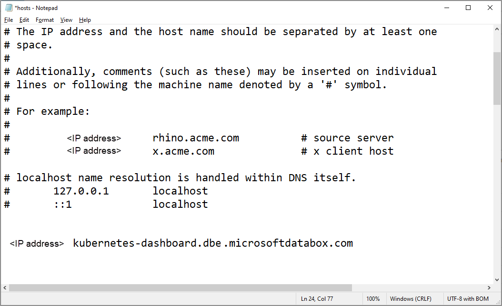

# Use Kubernetes dashboard to monitor your Azure Stack Edge Pro GPU device

[!INCLUDE [applies-to-GPU-and-pro-r-and-mini-r-skus](../../includes/azure-stack-edge-applies-to-gpu-pro-r-mini-r-sku.md)]

This article describes how to access and use the Kubernetes dashboard to monitor your Azure Stack Edge Pro GPU device. To monitor your device, you can use charts in Azure portal, view the Kubernetes dashboard, or run `kubectl` commands via the PowerShell interface of the device. 

This article focuses only on the monitoring tasks that can be performed on the Kubernetes dashboard.

In this article, you learn how to:

> [!div class="checklist"]
>
> * Access the Kubernetes dashboard on your device
> * View modules deployed on your device
> * Get IP address for applications deployed on your device
> * View container logs for modules deployed on your device

## About Kubernetes Dashboard

Kubernetes Dashboard is a web-based user interface that you can use to troubleshoot your containerized applications. Kubernetes Dashboard is a UI-based alternative to the Kubernetes `kubectl` command line. For more information, see [Kubernetes Dashboard](https://kubernetes.io/docs/tasks/access-application-cluster/web-ui-dashboard/). 

On your Azure Stack Edge Pro device, you can use the Kubernetes Dashboard in *read-only* mode to get an overview of the applications running on your Azure Stack Edge Pro device, view status of Kubernetes cluster resources, and see any errors that have occurred on the device.

## Access dashboard

The Kubernetes Dashboard is *read-only* and runs on the Kubernetes master node at port 31000. Follow these steps to access the dashboard: 

1. In the local UI of your device, go to **Device** and then go to **Device endpoints**. 
1. Copy the **Kubernetes dashboard** endpoint. Create a DNS entry into the `C:\Windows\System32\Drivers\etc\hosts` file of your client to connect to the Kubernetes dashboard. 

    `<IP address of the Kubernetes dashboard>    <Kubernetes dashboard endpoint suffix>` 
        
     

1. In the row for the **Kubernetes dashboard** endpoint, select **Download config**. This action downloads a `kubeconfig` that allows you to access the dashboard. Save the `config.json` file on your local system.   

1. Download the Kubernetes dashboard certificate from Local UI. 
    1. In the local UI of the device, go to **Certificates**.
    1. Locate the entry for **Kubernetes dashboard endpoint certificate**. To the right of this entry, select the **Download** to download the certificate on your client system that you'll use to access the dashboard. 

      

1. Install the downloaded certificate on the client. If using a Windows client, follow these steps: 
    1. Select the certificate and in the **Certificate Import Wizard**, select store location as **Local machine**. 

         
    
    1. Install the certificate on your Local machine in the trusted root store. 

         
1. Copy and use the Kubernetes dashboard URL to open the dashboard in a browser. On the **Kubernetes Dashboard sign in** page:
    
    1. Select **kubeconfig**. 
    1. Select the ellipsis **...**. Browse and point to the `kubeconfig` that you downloaded earlier on your local system. Select **Sign in**.
            

6. You can now view the Kubernetes Dashboard for your Azure Stack Edge Pro device in read-only mode.

    

## View module status

Compute modules are containers that have a business logic implemented. You can use the dashboard to verify if a compute module has deployed successfully on your Azure Stack Edge Pro device.

To view the module status, follow these steps on the dashboard:

1. In the left-pane of the dashboard, go to **Namespace**. Filter by the namespace where IoT Edge modules are displayed, in this case, **iotedge**.
1. In the left-pane, go to **Workloads > Deployments**.
1. In the right-pane, you will see all the modules deployed on your device. In this case, a GettingStartedWithGPU module was deployed on the Azure Stack Edge Pro. You can see that the module was deployed.

    

 
## Get IP address for services or modules

You can use the dashboard to get the IP addresses of the services or modules that you want to expose outside of the Kubernetes cluster. 

You assign the IP range for these external services via the local web UI of the device in the **Compute network settings** page. After you have deployed IoT Edge modules, you may want to get the IP address assigned to a specific module or service. 

To get the IP address, follow these steps on the dashboard:

1. In the left-pane of the dashboard, go to **Namespace**. Filter by the namespace where an external service is deployed, in this case, **iotedge**.
1. In the left-pane, go to **Discovery and Load balancing > Services**.
1. In the right-pane, you will see all the services that are running in the `iotedge` namespace on your Azure Stack Edge Pro device.

    

## View container logs

There are instances where you need to view the container logs. You can use the dashboard to get logs for a specific container that you have deployed on your Kubernetes cluster.

To view the container logs, follow these steps on the dashboard:

1. In the left-pane of the dashboard, go to **Namespace**. Filter by the namespace where the IoT Edge modules are deployed, in this case, **iotedge**.
1. In the left-pane, go to **Workloads > Pods**.
1. In the right-pane, you will see all the pods running on your device. Identify the pod that is running the module for which you want to view the logs. Select the vertical ellipsis for the pod that you identified and from the context menu, select **Logs**.

    

1. The logs are displayed in a logs viewer that is built into the dashboard. You can also download the logs.

    
    

## View CPU, memory usage

The Kubernetes dashboard for Azure Stack Edge Pro device also has a [Metrics server add-on](https://kubernetes.io/docs/tasks/debug-application-cluster/resource-metrics-pipeline/) that aggregates the CPU and memory usage across Kubernetes resources.
 
For example, you can view the CPU and memory consumed across deployments in all namespaces. 

You could also filter by a specific namespace. In the following example, you could view the CPU and memory consumption only for Azure Arc deployments.  

The Kubernetes metrics server provides autoscaling pipelines such as [Horizontal Pod Autoscaler](https://kubernetes.io/docs/tasks/run-application/horizontal-pod-autoscale/).

## Next steps

Learn how to [Monitor using Azure Monitor](azure-stack-edge-gpu-enable-azure-monitor.md).
Learn how to [Run diagnostics and collect logs](azure-stack-edge-gpu-troubleshoot.md)
