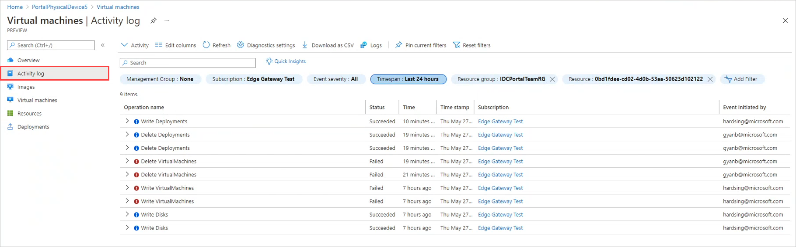
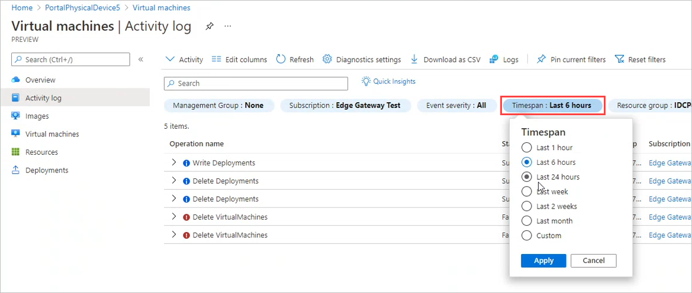
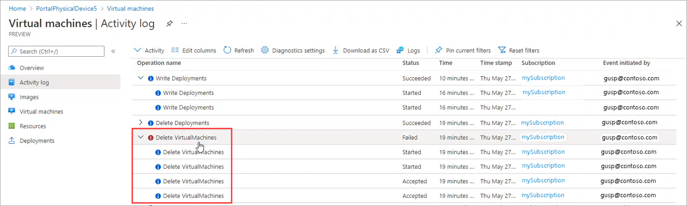

# Monitor VM activity on your Azure Stack Edge Pro GPU device

[!INCLUDE [applies-to-GPU-and-pro-r-and-mini-r-skus](../../includes/azure-stack-edge-applies-to-gpu-pro-r-mini-r-sku.md)]

This article describes how to view activity logs in the Azure portal for virtual machines on your Azure Stack Edge Pro GPU device.

> [!NOTE]
> You can zoom in on a VM's CPU and memory usage during periods of activity on the **Metrics** tab for the virtual machine. For more information, see [Monitor VM metrics](azure-stack-edge-gpu-monitor-virtual-machine-metrics.md).

## View activity logs

To view activity logs for the virtual machines on your Azure Stack Edge Pro GPU device, do these steps:

1. Go to the device and then to **Virtual Machines**. Select **Activity log**.

    

    You'll see the VM guest logs for virtual machines on the device.

1. Use filters above the list to target the activity you need to see.

    <!--Reshoot to remove pointer. Lightbox treatment?-->

1. Click the down arrow by an operation name to view the associated activity.

    <!--Reshoot to remove pointer. May be able to replace drop-down only.-->

On any **Activity log** pane in Azure, you can filter and sort activities, select columns to display, drill down to details for a specific activity, and get **Quick Insights** into errors, failed deployments, alerts, service health, and security changes over the last 24 hours. For more information about the logs and the filtering options, see [View activity logs](../azure-monitor/essentials/activity-log.md).

## Next steps

- [Troubleshoot VM deployment](azure-stack-edge-gpu-troubleshoot-virtual-machine-provisioning.md).
- [Collect VM guest logs in a Support package](azure-stack-edge-gpu-collect-virtual-machine-guest-logs.md).