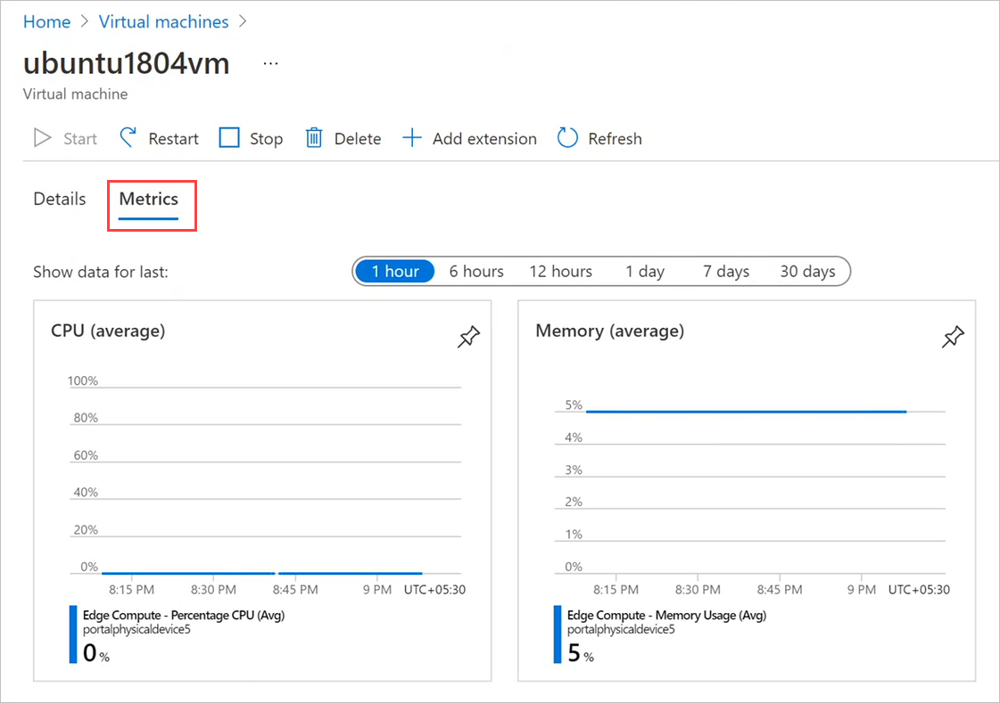
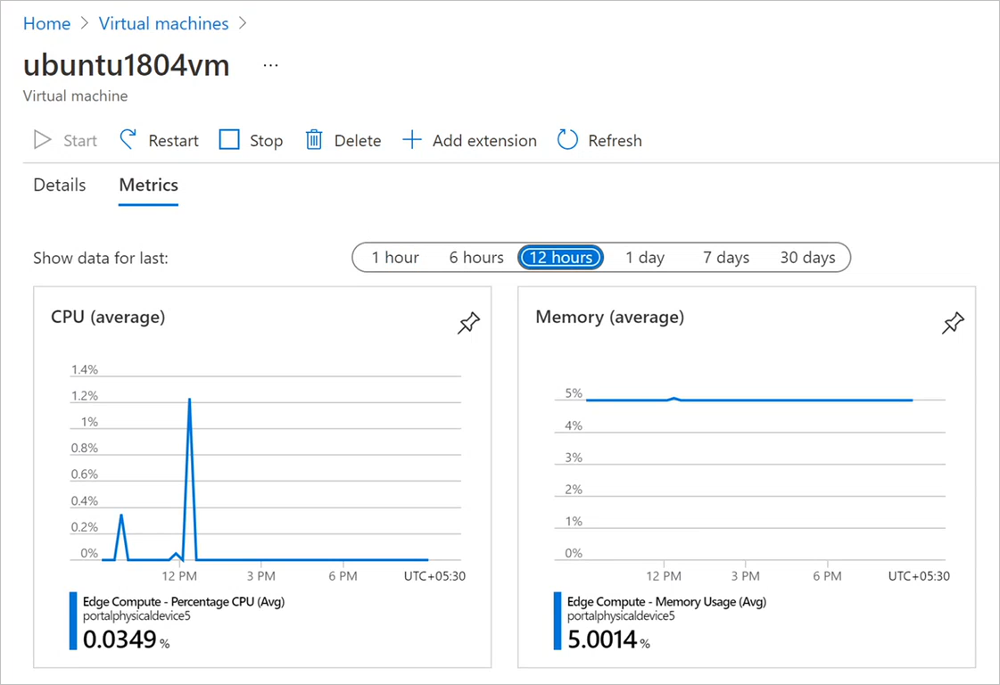

# Monitor VM GPU and memory metrics, activity logs on Azure Stack Edge Pro GPU devices

[!INCLUDE [applies-to-GPU-and-pro-r-and-mini-r-skus](../../includes/azure-stack-edge-applies-to-gpu-pro-r-mini-r-sku.md)]

INTRO TK

## Monitor GPU and memory metrics

1. Open the device in the Azure portal, and go to **Virtual Machines**. Select the virtual machine. Select **Activity log**.
 
    

## View activity logs

1. Open the device in the Azure portal, and go to **Virtual Machines**. Select the virtual machine. Then select **Activity log**.

    

2. By **Show data for last**, select the time span that you want to see. For example, select **7 days** to see a usage chart for the week.

   

## Next steps

To learn how to administer your Azure Stack Edge Pro GPU device, see [Use local web UI to administer an Azure Stack Edge Pro GPU](azure-stack-edge-manage-access-power-connectivity-mode.md).