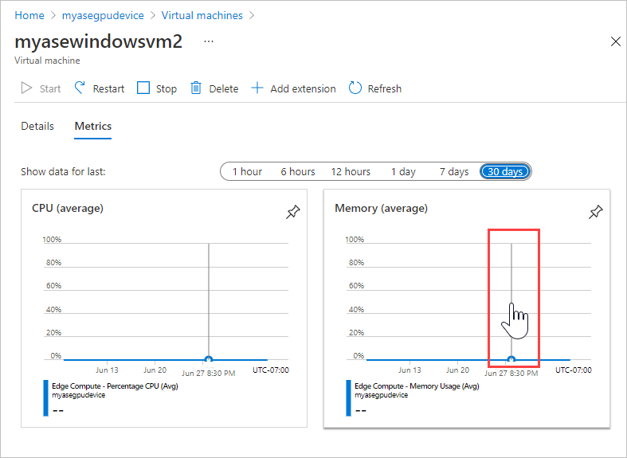
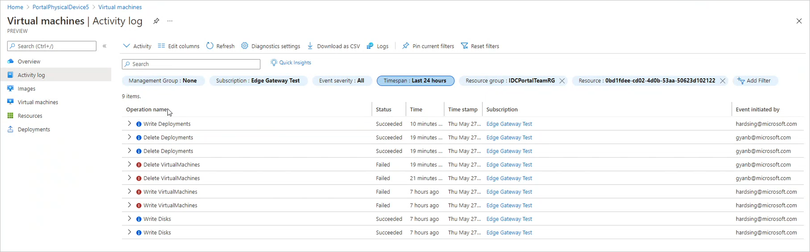

# Monitor VM GPU and memory metrics, activity on Azure Stack Edge Pro GPU devices

[!INCLUDE [applies-to-GPU-and-pro-r-and-mini-r-skus](../../includes/azure-stack-edge-applies-to-gpu-pro-r-mini-r-sku.md)]

You can view GPU and memory metrics and activity logs for the virtual machines deployed on you Azure Stack Edge Pro GPU devices in the Azure portal.  ADD DESCRIPTION OF ARTICLE GOALS.

## Monitor GPU and memory metrics

1. Open the device in the Azure portal, and go to **Virtual Machines**. Select the virtual machine. Select **Activity log**.
 
    

    By default, the graphs show average CPU and memory usage for the previous hour. To see data for a different period of time, select a different option by **Show data for last**.

    

    Point anywhere in either chart to display a vertical line with a hand that you can move left or right to view an earlier or later data sample.

    

*Is there any cost associated with viewing and manipulating these metrics?*

## View activity logs

On the **Activity log** pane for virtual machines, you can filter and sort the data, select columns to display, and drill down to details for a specific activity. For more information, see [View activity logs to monitor actions on resources](/azure/azure-resource-manager/management/view-activity-logs).

To view activity logs for the virtual machines on your Azure Stack Edge Pro GPU device, do these steps:

1. Go to the device and then to **Virtual Machines**. Select **Activity log**.

    

    You'll see the VM guest logs for virtual machines on the device. *Verify this.*

1. Use filters above the list to target the activity you need to see.

    

1. Click the down arrow by an operation name to view the associated activity.

    

For more information, see [View activity logs to monitor actions on resources](/azure/azure-resource-manager/management/view-activity-logs).

## Next steps

- To learn how to administer your Azure Stack Edge Pro GPU device, see [Use local web UI to administer an Azure Stack Edge Pro GPU](azure-stack-edge-manage-access-power-connectivity-mode.md).
- [Collect VM guest logs in a Support package]()