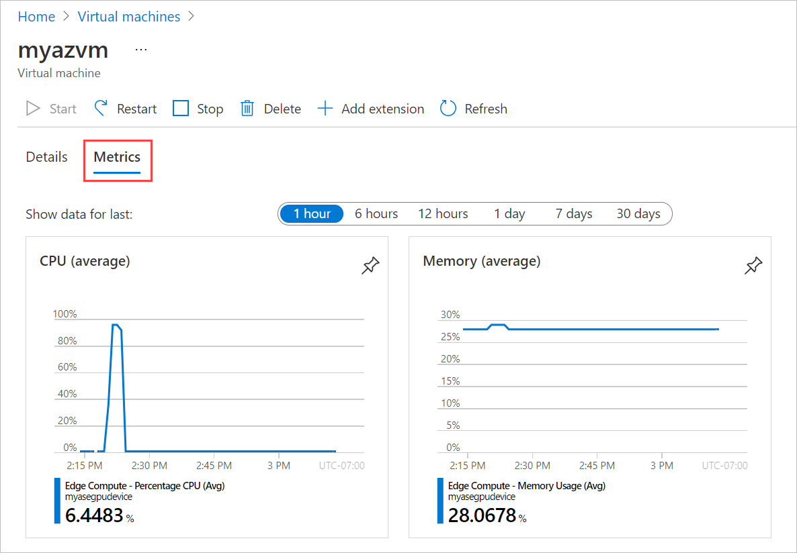
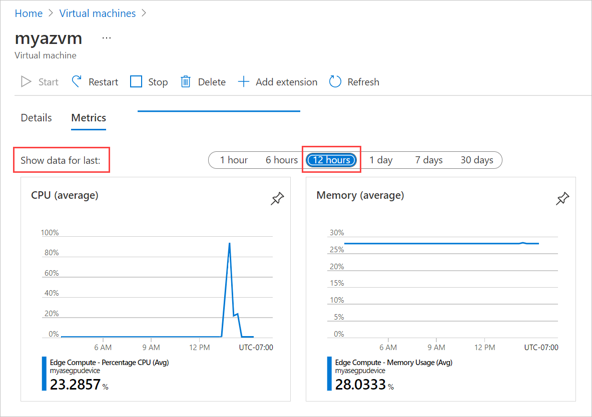
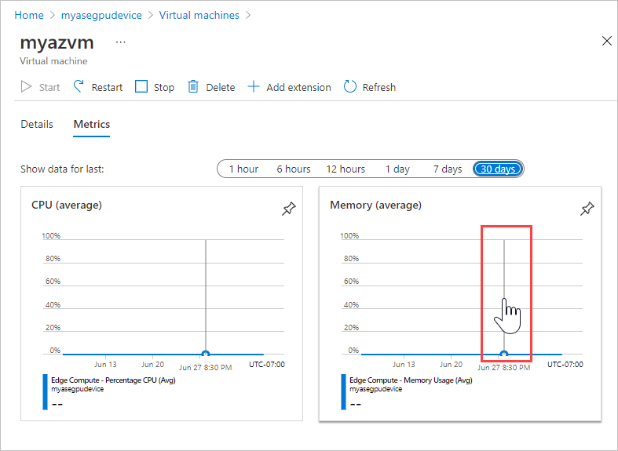

# Monitor VM metrics for CPU, memory on Azure Stack Edge Pro GPU

[!INCLUDE [applies-to-GPU-and-pro-r-and-mini-r-skus](../../includes/azure-stack-edge-applies-to-gpu-pro-r-mini-r-sku.md)]

This article describes how to monitor CPU and memory metrics for a virtual machine on your Azure Stack Edge Pro GPU device.

## About VM metrics

The **Metrics** tab for a virtual machine lets you view CPU and memory metrics, adjusting the time period and zooming in on periods of interest.

The VM metrics are based on CPU and memory usage data collected from the VM's guest operating system. Resource usage is sampled once per minute.

If a device is disconnected, metrics are cached on the device. When the device is reconnected, the metrics are pushed from the cache, and the VM **Metrics** are updated.

## Monitor CPU and memory metrics

1. Open the device in the Azure portal, and go to **Virtual Machines**. Select the virtual machine, and select **Metrics**.

    

2. By default, the graphs show average CPU and memory usage for the previous hour. To see data for a different time period, select a different option beside **Show data for last**.

    

3. Point anywhere in either chart with your mouse to display a vertical line with a hand that you can move left or right to view an earlier or later data sample. Click to open a detail view for that time period.

    

## Next steps

- [Monitor VM activity on your device](azure-stack-edge-gpu-monitor-virtual-machine-activity.md).
- [Collect VM guest logs in a Support package](azure-stack-edge-gpu-collect-virtual-machine-guest-logs.md).
