# Prepare generalized image from ISO to deploy VMs on Azure Stack Edge Pro GPU 

[!INCLUDE [applies-to-GPU-and-pro-r-and-mini-r-skus](../../includes/azure-stack-edge-applies-to-gpu-pro-r-mini-r-sku.md)]

To deploy VMs on your Azure Stack Edge Pro GPU device, you need to be able to create custom virtual machine (VM) images that you can use to create VMs. This article describes how to prepare a Windows VM image using ISO installation media, and then generalize that image so you can use it to deploy multiple new VMs on your Azure Stack Edge Pro GPU device.

To prepare a generalized image created from a Windows VHD or VHDX, see [Prepare a generalized image from a Windows VHD to deploy VMs on Azure Stack Edge Pro GPU](azure-stack-edge-gpu-prepare-windows-vhd-generalized-image.md).

## About VM images

A Windows VHD or VHDX can be used to create a *specialized* image or a *generalized* image. The following table summarizes key differences between the *specialized* and the *generalized* images.

[!INCLUDE [about-vm-images-for-azure-stack-edge](../../includes/azure-stack-edge-about-vm-images.md)]

## Workflow 

The high-level workflow to create a generalized Windows VHD using an ISO is:

1. Prepare the source VM using an ISO image:
   1. Create a new, blank, fixed-size VHD in Hyper-V Manager.
   1. Use that VHD to create a new virtual machine.
   1. Mount your ISO image on the DVD drive of the new VM.
1. Start the VM, and install the Windows operating system.
1. Generalize the VHD using the *sysprep* utility.
1. Copy the generalized image to Azure Blob storage.

## Prerequisites

Before you can create a generalized Windows VHD by using an ISO image, make sure that:

- You have an ISO image for the supported Windows version that you want to turn into a generalized VHD. Windows ISO images can be downloaded from the [Microsoft Evaluation Center](https://www.microsoft.com/en-us/evalcenter/).

- You have access to a Windows client with Hyper-V Manager installed.

- You have access to an Azure blob storage account to store your VHD after it is prepared.

## Prepare source VM using an ISO

When you use an ISO image to install the operating system on your VM image, you start by creating a blank, fixed-size VHD in Hyper-V Manager. You then use that VHD to create a virtual machine. Then you attach the ISO image to the VM.

#### Create new VHD in Hyper-V Manager

Your first step is to create a new Generation 1 VHD in Hyper-V Manager, which will be the source VHD for a new virtual machine.

To create the VHD, follow these steps:

1. Open Hyper-V Manager on your client system. On the **Action** menu, select **New** and then **Hard Disk**.

   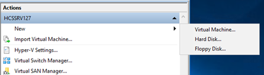

1. Under **Choose Disk Format**, select **VHD**. Then select **Next >**. 

   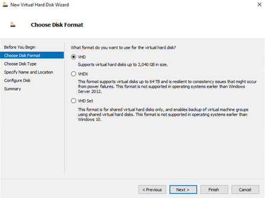

2. Under **Choose Disk Type**, select **Fixed size**. Then select **Next >**.

   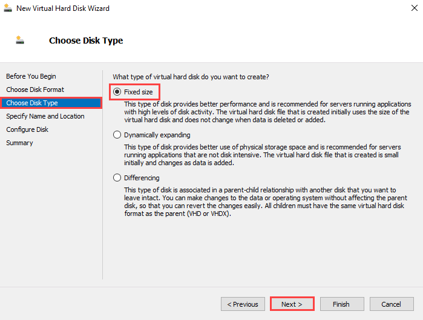

3. Under **Specify Name and Location**, enter a name and location for your new VHD. Then select **Next >**.

   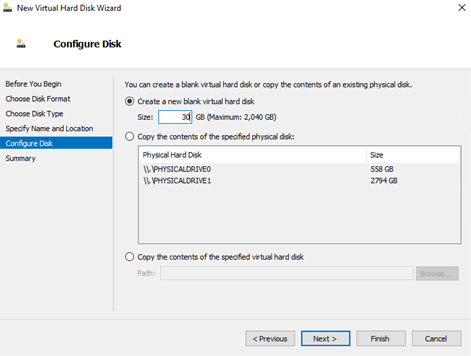

4. Under **Configure Disk**, select **Create a new blank virtual hard disk**, and enter the size of disk you would like to create (generally 20 GB and above for Windows Server). Then select **Next >**.

   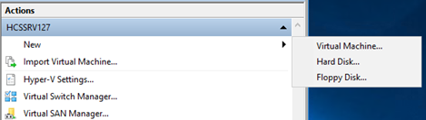

5. Under **Summary**, review your selections, and select **Finish** to create the new VHD. The process will take five or more minutes depending on the size of the VHD created.

   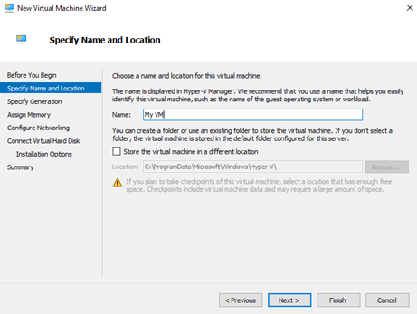

#### Create Hyper-V VM from VHD

Now you'll use the VHD you just created to create a new virtual machine.

To create your new virtual machine, follow these steps:

1. Open Hyper-V Manager on your Windows client.

2. On the **Actions** pane, select **New** and then **Virtual Machine**.

   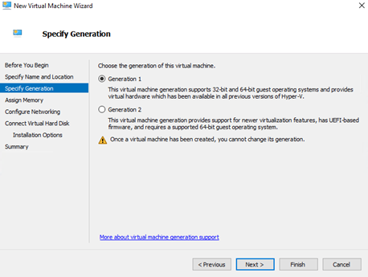

3. In the New Virtual Machine Wizard, specify the name and location of your VM.

   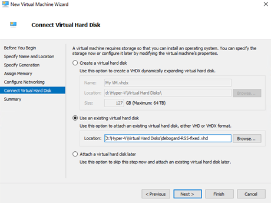

4. Under **Specify Generation**, select **Generation 1**. Then select **Next >**.

   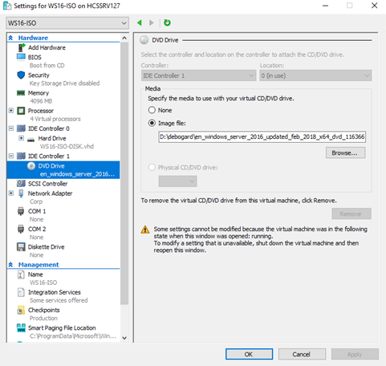

5. Under **Assign Memory**, assign the desired memory to the virtual machine. Then select **Next >**.

   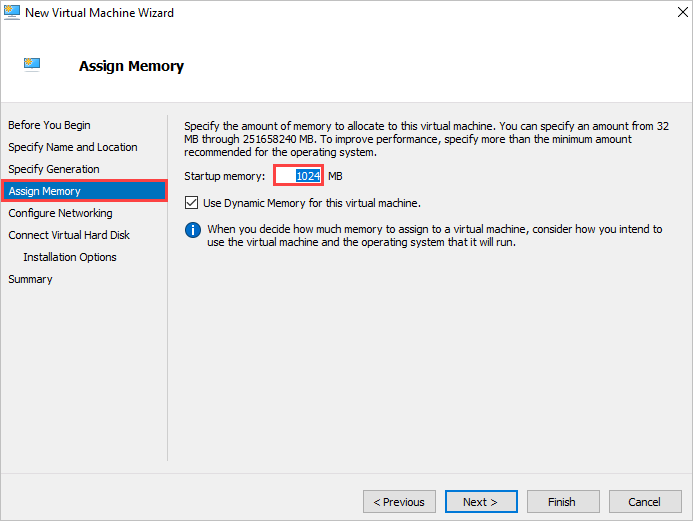

6. Under **Configure Networking**, enter your network configuration. Then select **Next >**.

   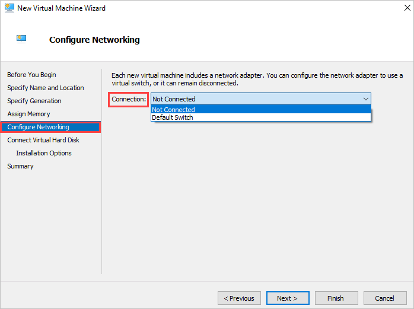

7. Under **Connect Virtual Hard Disk**, select **Use an existing virtual hard disk** and browse to the fixed VHD you created in the previous procedure. Then select **Next >**. 

   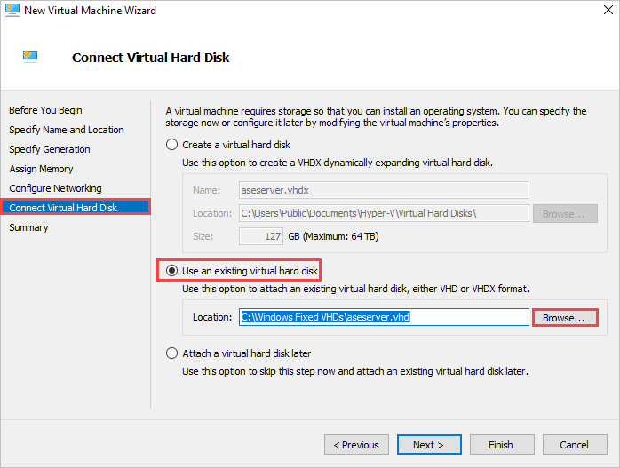

8. Review the summary, and select **Finish** to create the virtual machine. 

#### Mount ISO image on DVD drive of VM

After creating the new virtual machine, follow these steps to mount your ISO image on the DVD drive of the virtual machine:

1. In Hyper-V Manager, select the VM you just created, and then select **Settings**.
 
   

2. Under **BIOS**, ensure that **CD** is at the top of the **Startup order** list.

   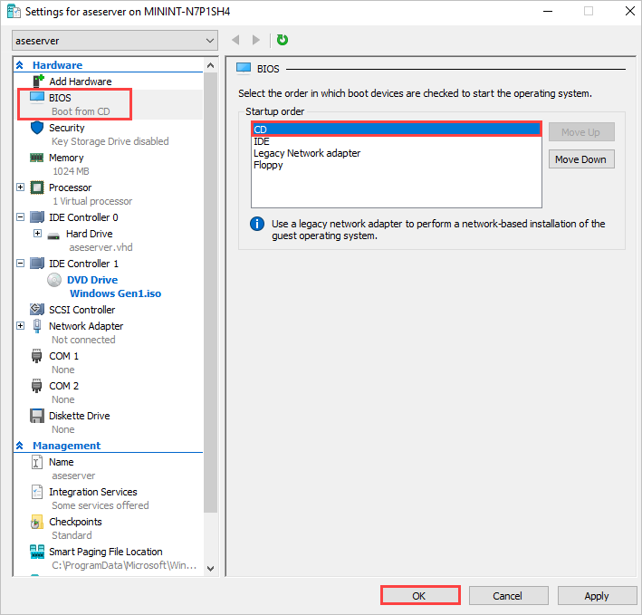

3. Under **DVD Drive**, select **Image file**, and browse to your ISO image.  

   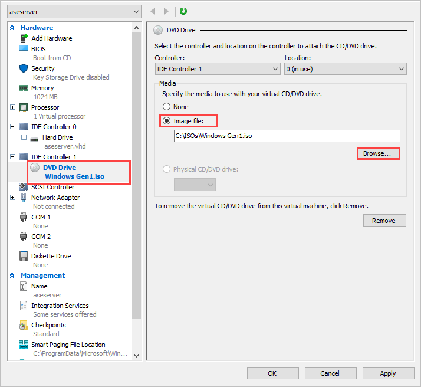

4. Select **OK** to save your VM settings.

## Start VM, and complete OS installation

To finish building your virtual machine, you need to start the virtual machine and walk through the operating system installation.

[!INCLUDE [Connect to Hyper-V VM](../../includes/azure-stack-edge-connect-to-hyperv-vm.md)]

## Generalize the VHD  

[!INCLUDE [Generalize the VHD](../../includes/azure-stack-edge-generalize-vhd.md)]

Your VHD can now be used to create a generalized image to use on Azure Stack Edge Pro GPU.

## Upload generalized VHD to Azure Blob storage

[!INCLUDE [Upload VHD to Blob storage](../../includes/azure-stack-edge-upload-vhd-to-blob-storage.md)]

## Next steps

- [Deploy a VM from a generalized image via Azure portal](azure-stack-edge-gpu-deploy-virtual-machine-portal.md)
- [Prepare a generalized image from a Windows VHD to deploy VMs on Azure Stack Edge Pro GPU](azure-stack-edge-gpu-prepare-windows-vhd-generalized-image.md)
- [Prepare a specialized image and deploy VMs using the image](azure-stack-edge-gpu-deploy-vm-specialized-image-powershell.md) 
