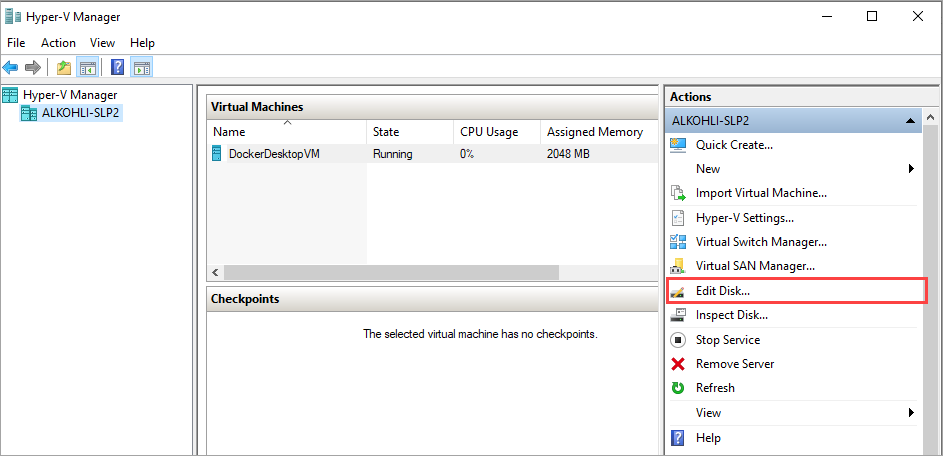
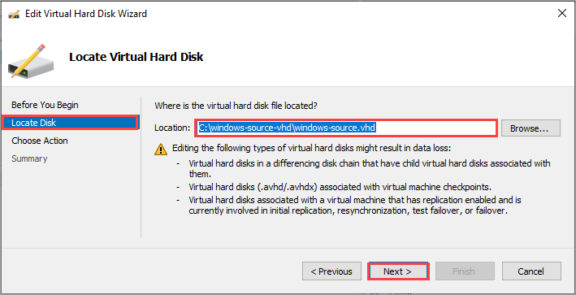
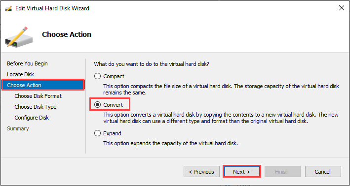
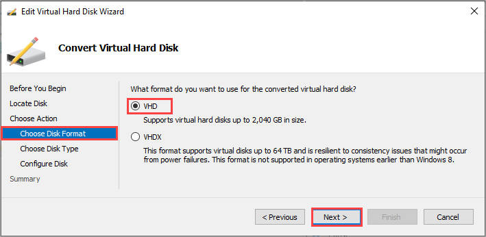
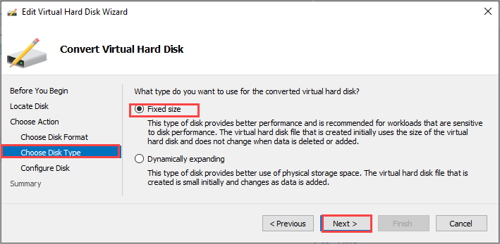
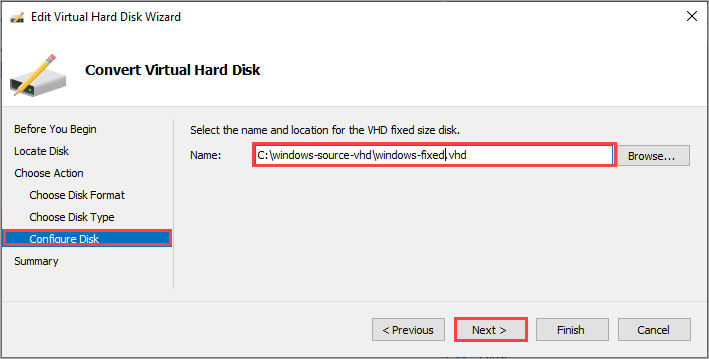
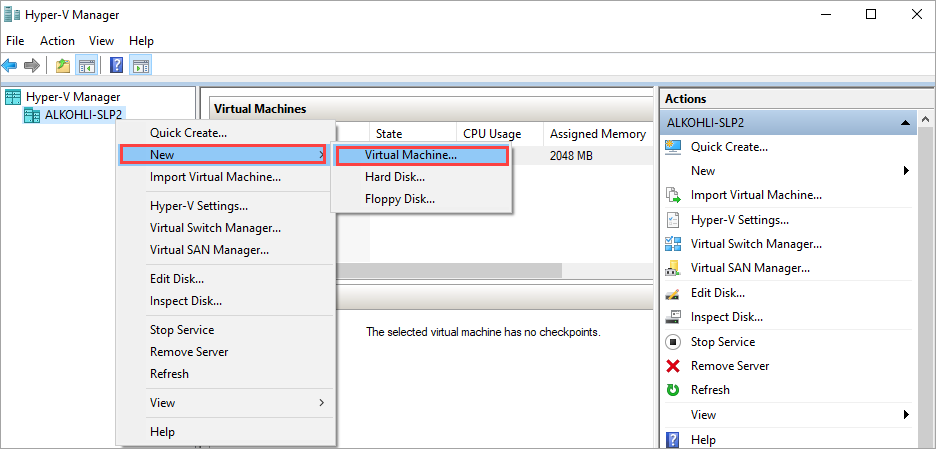
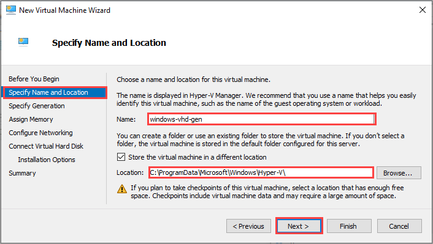
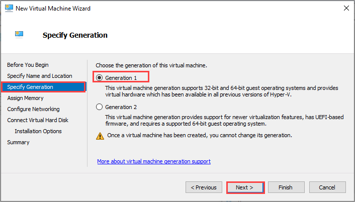
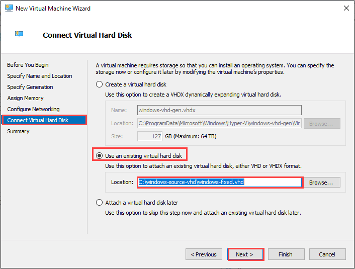

# Prepare generalized image from Windows VHD to deploy VMs on Azure Stack Edge Pro GPU

[!INCLUDE [applies-to-GPU-and-pro-r-and-mini-r-skus](../../includes/azure-stack-edge-applies-to-gpu-pro-r-mini-r-sku.md)]

To deploy VMs on your Azure Stack Edge Pro GPU device, you need to be able to create custom VM images that you can use to create VMs. This article describes how to prepare a generalized image from a Windows VHD or VHDX, which you can use to deploy virtual machines on Windows Stack Edge Pro GPU devices.

To prepare a generalized VM image using an ISO, see [Prepare a generalized image from an ISO to deploy VMs on Azure Stack Edge Pro GPU](azure-stack-edge-gpu-prepare-windows-generalized-image-iso.md).

## About VM images

A Windows VHD or VHDX can be used to create a *specialized* image or a *generalized* image. The following table summarizes key differences between the *specialized* and the *generalized* images.

[!INCLUDE [about-vm-images-for-azure-stack-edge](../../includes/azure-stack-edge-about-vm-images.md)]

## Workflow

The high-level workflow to prepare a Windows VHD to use as a generalized image, starting from the VHD or VHDX of an existing virtual machine, has the following steps:

1. Prepare the source VM from a Windows VHD:
   1. Convert the source VHD or VHDX to a fixed-size VHD.
   1. Use that VHD to create a new virtual machine.<!--Can this procedure be generalized and moved to an include file?-->
1. Start the VM, and install the Windows operating system.
1. Generalize the VHD using the *sysprep* utility.
1. Copy the generalized image to Blob storage.

## Prerequisites

Before you prepare a Windows VHD for use as a generalized image on an Azure Stack Edge Pro GPU device, make sure that:

- You have a VHD or a VHDX containing a supported version of Windows. 
- You have access to a Windows client with Hyper-V Manager installed. 
- You have access to an Azure Blob storage account to store your VHD after it is prepared.

## Prepare source VM from Windows VHD

When your VM source is a Windows VHD or VHDX, you first need to convert the Windows VHD to a fixed-size VHD. You will use the fixed-size VHD to create a new virtual machine.

> [!IMPORTANT]
> These procedures do not cover cases where the source VHD is configured with custom configurations and settings. For example, additional actions may be required to generalize a VHD containing custom firewall rules or proxy settings. For more information on these additional actions, see [Prepare a Windows VHD to upload to Azure - Azure Virtual Machines](../virtual-machines/windows/prepare-for-upload-vhd-image.md).

#### Convert source VHD to a fixed-size VHD

For your device, you'll need fixed-size VHDs to create VM images. You'll need to convert your source Windows VHD or VHDX to a fixed VHD. 

Follow these steps:

1. Open Hyper-V Manager on your client system. Go to **Edit Disk**.

    

1. On the **Before you begin** page, select **Next>**.

1. On the **Locate virtual hard disk** page, browse to the location of the source Windows VHD or VHDX that you wish to convert. Select **Next>**.

    

1. On the **Choose action** page, select **Convert** and select **Next>**.

    

1. On the **Choose disk format** page, select **VHD** format and then select **Next>**.

   

1. On the **Choose disk type** page, choose **Fixed size** and select **Next>**.

   

1. On the **Configure disk** page, browse to the location and specify a name for the fixed size VHD disk. Select **Next>**.

   

1. Review the summary and select **Finish**. The VHD or VHDX conversion takes a few minutes. The time for conversion depends on the size of the source disk.

<!--
1. Run PowerShell on your Windows client.
1. Run the following command:

    ```powershell
    Convert-VHD -Path <source VHD path> -DestinationPath <destination-path.vhd> -VHDType Fixed 
    ```
-->
You'll use this fixed-size VHD for all the subsequent steps in this article.

#### Create Hyper-V VM from the fixed-size VHD

1. In **Hyper-V Manager**, in the scope pane, right-click your system node to open the context menu, and then select **New** > **Virtual Machine**.

    

1. On the **Before you begin** page of the New Virtual Machine Wizard, select **Next**.

1. On the **Specify name and location** page, provide a **Name** and **location** for your virtual machine. Select **Next**.

    

1. On the **Specify generation** page, choose **Generation 1** for the .vhd device image type, and then select **Next**.    

    

1. Assign your desired memory and networking configurations.

1. On the **Connect virtual hard disk** page, choose **Use an existing virtual hard disk**, specify the location of the Windows fixed VHD that we created earlier, and then select **Next**.

    

1. Review the **Summary** and then select **Finish** to create the virtual machine.

Creation of the virtual machine takes several minutes.

The VM shows in the list of the virtual machines on your client system.

## Start VM, and install operating system

To finish building your virtual machine, you need to start the virtual machine and walk through the operating system installation.

[!INCLUDE [Connect to Hyper-V VM](../../includes/azure-stack-edge-connect-to-hyperv-vm.md)]

After you're connected to the VM, complete the Machine setup wizard, and then sign into the VM.<!--It's not clear what they are doing here. Where does the Machine setup wizard come in?-->

## Generalize the VHD  

[!INCLUDE [Generalize the VHD](../../includes/azure-stack-edge-generalize-vhd.md)]

Your VHD can now be used to create a generalized image to use on Azure Stack Edge Pro GPU.

## Upload generalized VHD to Azure Blob storage

[!INCLUDE [Upload VHD to Blob storage](../../includes/azure-stack-edge-upload-vhd-to-blob-storage.md)]

<!-- this should be added to deploy VM articles - If you experience any issues creating VMs from your new image, you can use VM console access to help troubleshoot. For information on console access, see [link].-->

## Next steps

Depending on the nature of deployment, you can choose one of the following procedures.

- [Deploy a VM from a generalized image via Azure portal](azure-stack-edge-gpu-deploy-virtual-machine-portal.md)
- [Prepare a generalized image from an ISO to deploy VMs on Azure Stack Edge Pro GPU](azure-stack-edge-gpu-prepare-windows-generalized-image-iso.md)
- [Prepare a specialized image and deploy VMs using the image](azure-stack-edge-gpu-deploy-vm-specialized-image-powershell.md) 
