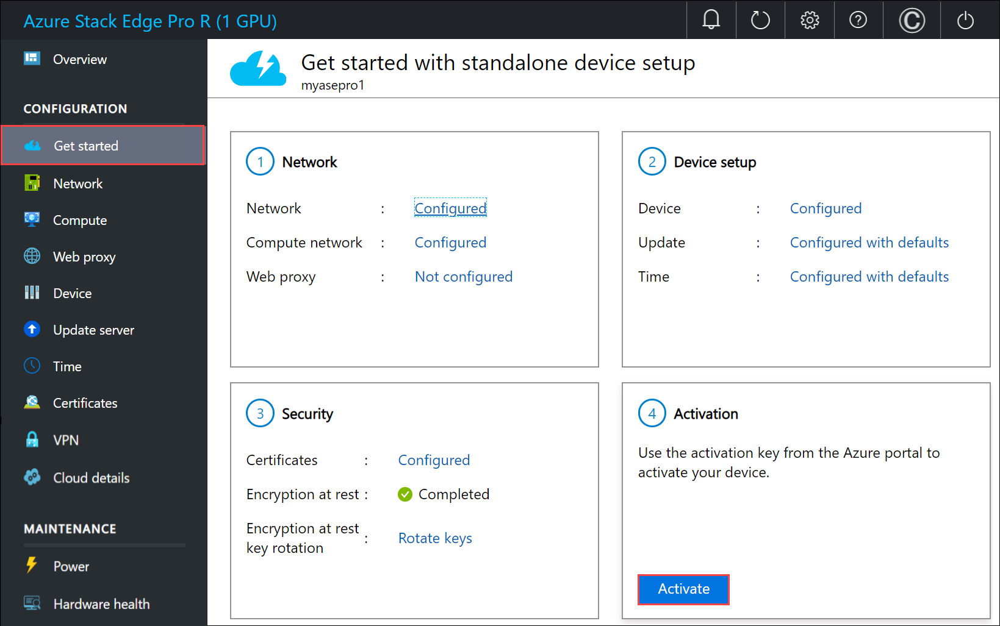
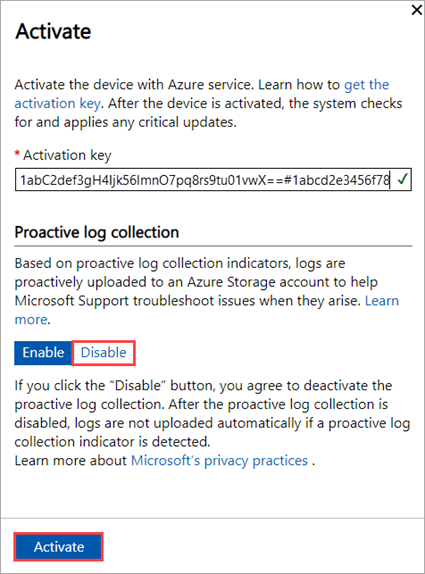

# Proactive log collection on your Azure Stack Edge device

You can enable proactive log collection on your Azure Stack Edge device based on the system health indicators to help efficiently troubleshoot any device issues. This article describes what is proactive log collection, how to enable it and how data is handled when proactive log collection is enabled.
   
The information in this article applies to Azure Stack Edge Pro GPU, Azure Stack Edge Pro R, and Azure Stack Edge Mini R devices.

## About proactive log collection

Microsoft Customer Support and Engineering teams use system logs from your Azure Stack Edge device to efficiently identify and fix issues that might come up during operation. Proactive log collection is a method that alerts Microsoft that an issue/event (see the Proactive log collection indicators section for events being tracked) has been detected by the customer’s Azure Stack Edge appliance. The support logs pertaining to the issue are automatically uploaded to an Azure Storage account managed and controlled by Microsoft. Microsoft Support and Microsoft engineers review these support logs to determine the best course of action to resolve the issue with the customer.    

> [!NOTE]
> These logs are only used for debugging purposes and providing support to the customers in case of issues. 

## Enabling proactive log collection

Proactive log collection is enabled by default. You can disable proactive log collection when trying to activate the device via the local UI. 

1. In the local web UI of the device, go to the **Get started** page.
2. On the **Activation** tile, select **Activate**. 

    
    
3. In the **Activate** pane:

   1. Enter the **Activation key** that you got in [Get the activation key for Azure Stack Edge Pro R](azure-stack-edge-pro-r-deploy-prep.md#get-the-activation-key).

      Once activated, proactive log collection is enabled by default, allowing Microsoft to collect logs based on the health status of the device. These logs are uploaded to an Azure Storage account. 

      You can disable proactive log collection to stop Microsoft from collecting logs.

   1. If you want to disable proactive log collection on the device, select **Disable**.

   1. Select **Activate**.

      <!--Updated screen needed. Reduce teh screen size.-->

<!--Updates to UI text:

"Based on system health proactive log collection indicators, logs are proactively uploaded to an Azure Storage account to help Microsoft Support troubleshoot issues if they arise. Learn more. (provide link) 

If you click the “Disable” button you agree to deactivate the proactive log collection. After the proactive log collection is disabled, logs will no longer be uploaded automatically when one of the proactive log collection indicators is detected. To learn more about Microsoft privacy practices, see the Microsoft Privacy Statement."-->

## Proactive log collection indicators

After the proactive log collection is enabled, logs are uploaded automatically when one of the following events is detected on the device:  

|Alert/Error/Condition  |Description  |
|---------|---------|
|AcsUnhealthyCondition     |Azure Consistent Services are unhealthy.         |
|IOTEdgeAgentNotRunningCondition      |IoT Edge Agent is not running.         |
|UpdateInstallFailedEvent | Could not install the update.        |

 
Microsoft will continue to add new events to the preceding list. No additional consent is needed for new events. Refer to this page to learn about the most up-to-date proactive log collection indicators.    
 

## Other log collection methods

Besides proactive log collection, which collects specific logs pertaining to a specific issue detected, there are other log collections that can provide much deeper understanding of the system health and behavior. Usually these other log collections can be executed during a support request or triggered by Microsoft based on telemetry data that the device provides.  

## Handling data

When proactive log collection is enabled, the customer agrees to Microsoft collecting logs from the Azure Stack Edge device as described herein. The customer also acknowledges and consents to the upload and retention of those logs in an Azure Storage account managed and controlled by Microsoft.

Microsoft uses the data for troubleshooting system health and issues only. The data is not used for marketing, advertising, or any other commercial purposes without the customer consent. 

The data Microsoft collects is handled as per our standard privacy practices. Should a customer decide to revoke its consent for proactive log collection, any data collected with consent prior to the revocation will not be affected.

## Next steps

Learn how to [Gather a support package](azure-stack-edge-gpu-troubleshoot.md#collect-support-package).