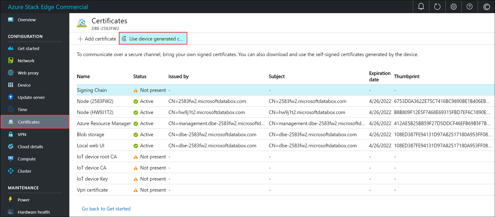
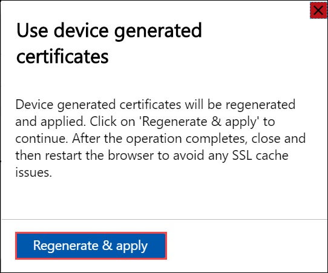
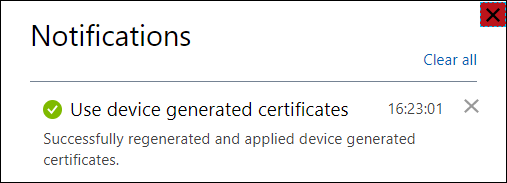
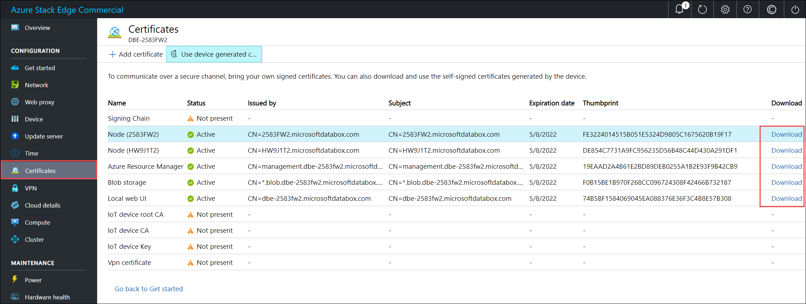
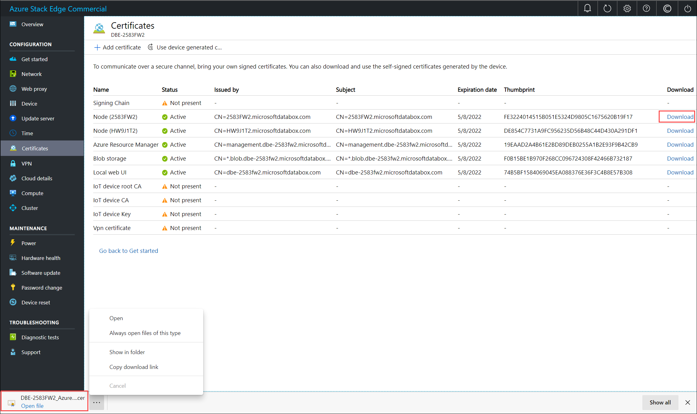
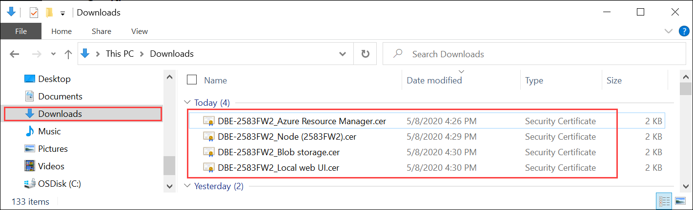

# Regenerate and download certificates for your Azure Stack Edge in local UI 

[!INCLUDE [applies-to-skus](../../includes/azure-stack-edge-applies-to-all-sku.md)]

On your Azure Stack Edge device, you can choose to Bring Your Own Certificates (BYOC) or use the certificates that are generated by the device. This article describes how to regenerate and download the device generated certificates for your Azure Stack Edge device in the local UI of the device. 

If you want to bring your own certificates, go to [Use the Azure Stack Readiness Checker tool to create certificates on your Azure Stack Edge device](azure-stack-edge-j-series-create-certificates-tool.md).

## Prerequisites

Before you regenerate and download certificates for Azure Stack Edge device, make sure that: 

- You've access to an Azure Stack Edge device. You have activated the device and completed all the steps outlined in [Tutorial: Activate your Azure Stack Edge device](azure-stack-edge-gpu-deploy-activate.md)
- You've a client running Windows 10 or Windows Server 2016 or later that you will use to connect to your Azure Stack Edge device. 

## Regenerate and download certificates 

Use these steps to regenerate and download the Azure Stack Edge device certificates:

1. In the local UI of your device, go to **Configuration > Certificates**. Select **Use device generated certificates**.

    

2. In the **Generate device certificates**, select **Regenerate & apply**.

    

    The device certificates are now regenerated and applied. 
    
    > [!IMPORTANT]
    > While the certificate regeneration operation is in progress, do not bring your own certificates and try to add those via the **+ Add certificate** option.

    You are notified when the operation is successfully completed. To avoid any potential cache issues, restart your browser. 
    
    

3. In the **Certificates** page, you will see the **Download** column is now populated and links to download the regenerated certificates are available. 

    

4. Select the download link for a certificate and when prompted, save the certificate. 

    

    Repeat this process for all the certificates that you wish to download. 
    
    

    The device generated certificates are saved as DER certificates with the following name format: 

    `<Device name>_<Endpoint name>.cer`. These certificates contain the public key for the corresponding certificates installed on the device. To import and install these certificates on the client that you are using to access the device, follow the steps in [Import certificates on the clients accessing your Azure Stack Edge device](azure-stack-edge-j-series-manage-certificates.md#import-certificates-on-the-client-accessing-the-device). 

    If using Azure Storage Explorer, you will need to install certificates on your client in PEM format and you will need to convert the device generated certificates into PEM format. 

    > [!IMPORTANT]
    > - The download link is only available for the device generated certificates and not if you bring your own certificates.
    > - You can decide to have a mix of device generated certificates and bring your own certificates as long as other certificate requirements are met. For more information, go to [Certificate requirements](azure-stack-edge-j-series-certificate-requirements.md).

## Next steps

[Deploy your Azure Stack Edge device](azure-stack-edge-gpu-deploy-prep.md)
