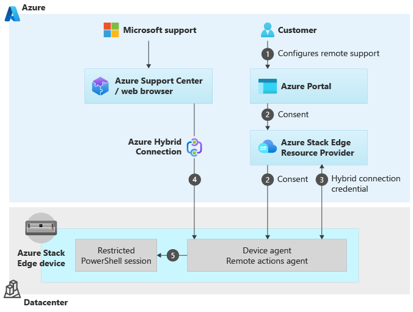
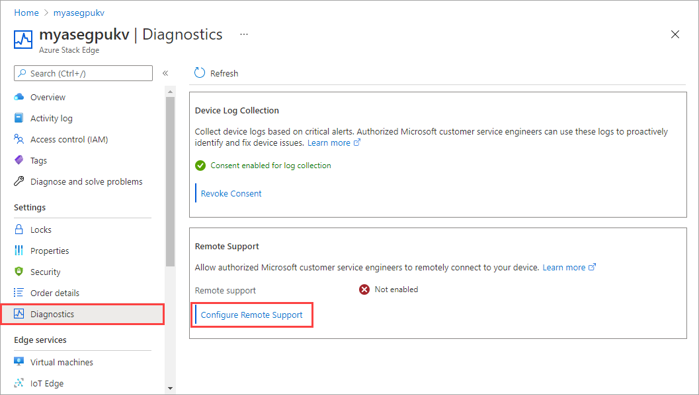
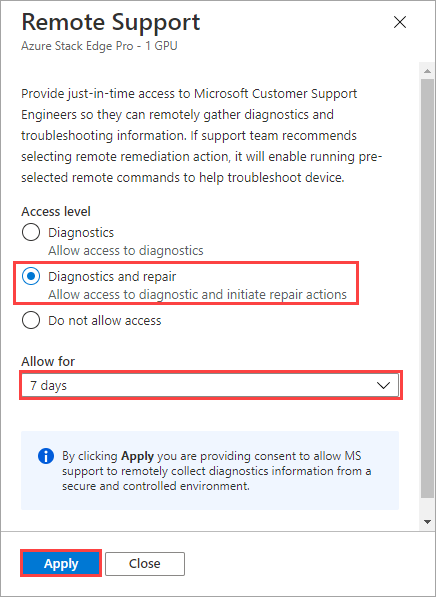
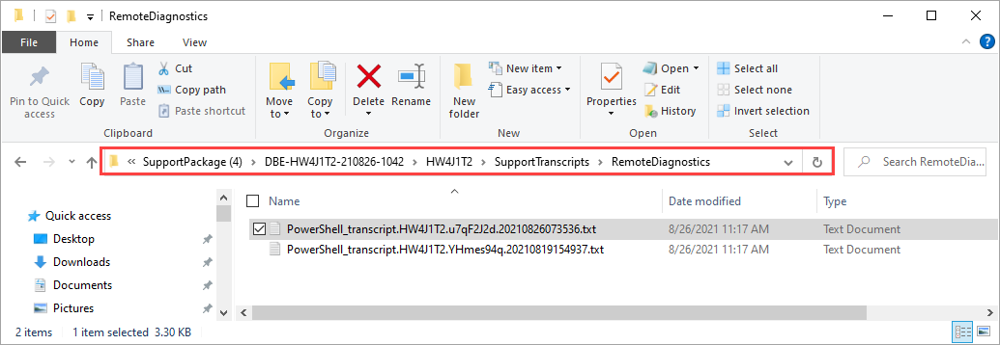

# Remote support and diagnostics for Azure Stack Edge 

[!INCLUDE [applies-to-GPU-and-pro-r-and-mini-r-skus](../../includes/azure-stack-edge-applies-to-gpu-pro-r-mini-r-sku.md)]


> [!IMPORTANT]
> Remote support applies to Azure Stack Edge version 2110 or later.

On your Azure Stack Edge device, you can enable remote support to allow Microsoft Engineers to diagnose and remediate issues by accessing your device remotely. When you enable this feature, you provide consent for the level of access and the duration of access. 

This article describes the remote support feature including when to use this feature, how the feature can be enabled, and provides a list of allowed operations that Microsoft Engineers can run on your device remotely.


## About remote support

If you experience an issue with Azure Stack Edge, typically, you should collect a support package and provide to Microsoft Support. In some cases, the logs do not have enough information to diagnose and remediate the issue. Microsoft Support then reaches out to you to get your consent for remote support.

Here are some benefits of remote support:

- You can resolve the issue faster as Microsoft Support doesn't need to arrange an in-person meeting.
- You can view the transcript of the remote support session including all the operations that were executed on the device.
- You are in full control of your data and can revoke consent at any time. If you forget to exit the session, the access to the session is automatically disabled once the access duration expires.

## How remote support works

The following illustration shows how the remote support works.



1. You provide consent for remote support for your device via the Azure portal. You also configure the level and the duration of access for your device.
1. The consent and request for remote support is sent from the Azure portal to the Azure Stack Edge Resource Provider (RP) which in turn sends it down to the device. The device agent asks the RP for the hybrid connection credential that it can connect to.
1. A hybrid connection credential is created that is used to establish an Azure hybrid connection. This connection is:
    
    - Device specific. Each device has its own connection and the connection is not shared.
    - Allows Microsoft Support to have a just-in-time (JIT) access to device over a secure, audited, and compliant channel.  
    - This connection uses an *https* protocol over port 443 and the traffic is encrypted with TLS 1.2.
     
1. The device agent starts listening onto that hybrid connection for any requests that are coming via the browser interface for the Azure Support Center. 
1. The browser requests to connect to the hybrid connection and the request is sent to the device to open a restricted PowerShell session. If the consent exists, the request is accepted. If the device doesn't have the consent, it just rejects that connection. 

Once the connection is established, all the communication occurs over this secure connection. 

The operations that Microsoft Support can perform over this connection are *restricted* based on the access level granted using [just enough administration](/powershell/scripting/learn/remoting/jea/overview) (JEA). For more information about cmdlets that Microsoft Support can execute during a remote support session, see the [list of allowed Microsoft Support operations](#operations-allowed-in-remote-support) in this article.


## Enable remote support

To configure remote support for your Azure Stack Edge device, follow these steps:

1. In the Azure portal, go to the Azure Stack Edge resource for your device and then go to **Diagnostics**.
1. By default, Microsoft does not have remote access to your device and remote support status is displayed as **Not enabled**. To enable this feature, select **Configure remote support**.

    

1. Select the **Access level** as **Diagnostics** to provide JIT access to Microsoft Support to remotely gather diagnostics information. If needed, Support team will recommend that you select **Diagnostics and repair** to allow remote remediation action. 

    Each access level enables a different set of remote commands on the device and hence, a different set of operations. 

    - Diagnostics allows mostly read operations and hence, mostly `Get` cmdlets are available.
    - Diagnostics and repair allows read-write access and hence, in addition to `Get` cmdlets, `Set`, `Add`, `Start`, `Restart`, `Stop`,`Invoke`, `Remove` cmdlets are also available.
    
    For more information, see a [List of all the Support operations allowed in each access level](#operations-allowed-in-remote-support).

1. Select the duration over which to provide remote access. The duration can be 7, 15, 21, or 30 days. At the end of this duration, the remote access to the device is automatically disabled. 

1. To revoke access at any time, set to **Do not allow access**. This action terminates any existing sessions does not allow new sessions to be established.

1. Once you have configured remote support, select **Apply** for the settings to take effect. When you select **Apply**, you provide consent to Microsoft to remotely collect diagnostics information from a secure and controlled environment.

        

## Remote support examples

The following example scenarios show you how to perform various operations when remote support is enabled on your device. 

To perform the remote support operations, you'll first need to [Connect to the PowerShell interface](azure-stack-edge-gpu-connect-powershell-interface.md#connect-to-the-powershell-interface) of the device and then run the cmdlets.

### List existing remote sessions

Use the `Get-HcsRemoteSupportSession` cmdlet to list all the remote sessions that were made to the device within the specified number of days.

```powershell
Get-HcsRemoteSupportSession -IncludeTranscriptContents $false -NumberOfDays <Number of days>
```
Here is an example output for all the remote support sessions configured in the past 10 days. 

```output
[10.126.76.20]: PS>Get-HcsRemoteSupportSession -IncludeTranscriptContents $false -NumberOfDays 10

SessionId                : 3c135cba-f479-4fef-8dbb-a2b52b744504
RemoteApplication        : Powershell
AccessLevel              : ReadWrite
ControlSession           : False
SessionStartTime         : 8/19/2021 10:41:03 PM +00:00
SessionEndTime           : 8/19/2021 10:44:31 PM +00:00
SessionTranscriptPath    : C:\ProgramData\JEAConfiguration\Transcripts\RemoteRepair\PowerShell_transcript.HW4J1T2.Lp+Myohb.20210
                           819154101.txt
SessionTranscriptContent :

SessionId                : c0f2d002-66a0-4d54-87e4-4b1b949ad686
RemoteApplication        : Powershell
AccessLevel              : ReadWrite
ControlSession           : False
SessionStartTime         : 8/19/2021 7:41:19 PM +00:00
SessionEndTime           : 8/19/2021 7:58:20 PM +00:00
SessionTranscriptPath    : C:\ProgramData\JEAConfiguration\Transcripts\RemoteRepair\PowerShell_transcript.HW4J1T2.j0lCd5Tm.20210
                           819124117.txt
SessionTranscriptContent :

SessionId                : ca038e58-5344-4377-ab9c-c857a27c8b73
RemoteApplication        : Powershell
AccessLevel              : ReadOnly
ControlSession           : False
SessionStartTime         : 8/19/2021 10:49:39 PM +00:00
SessionEndTime           : 8/20/2021 12:49:40 AM +00:00
SessionTranscriptPath    : C:\ProgramData\JEAConfiguration\Transcripts\RemoteDiagnostics\PowerShell_transcript.HW4J1T2.YHmes94q.
                           20210819154937.txt
SessionTranscriptContent :

[10.126.76.20]: PS>
```


### Get details on a specific remote session

Use the `Get-HcsRemoteSupportSession` cmdlet to get the details for remote session with the ID *SessionID*.

```powershell
Get-HcsRemoteSupportSession -SessionId <SessionId> -IncludeSessionTranscript $true
```

Here is an example output for a specific session in which the remote support was configured with the **Diagnostics** option. The `AccessLevel` in this case is `ReadOnly`.

```output
[10.126.76.20]: PS>Get-HcsRemoteSupportSession -SessionId 360706a2-c530-419f-932b-55403e19502e -IncludeTranscriptContents $true

SessionId                : 360706a2-c530-419f-932b-55403e19502e
RemoteApplication        : Powershell
AccessLevel              : ReadOnly
ControlSession           : False
SessionStartTime         : 8/26/2021 2:35:37 PM +00:00
SessionEndTime           :
SessionTranscriptPath    : C:\ProgramData\JEAConfiguration\Transcripts\RemoteDiagnostics\PowerShell_transcript.HW4J1T2.u7qF2J2d.
                           20210826073536.txt
SessionTranscriptContent : **********************
                           Windows PowerShell transcript start
                           Start time: 20210826073536
                           Username: WORKGROUP\HW4J1T2$
                           RunAs User: WORKGROUP\SYSTEM
                           Configuration Name: RemoteDiagnostics
                           Machine: HW4J1T2 (Microsoft Windows NT 10.0.17763.0)
                           Host Application: C:\Windows\system32\wsmprovhost.exe -Embedding
                           Process ID: 10976
                           PSVersion: 5.1.17763.10520
                           PSEdition: Desktop
                           PSCompatibleVersions: 1.0, 2.0, 3.0, 4.0, 5.0, 5.1.17763.10520
                           BuildVersion: 10.0.17763.10520
                           CLRVersion: 4.0.30319.42000
                           WSManStackVersion: 3.0
                           PSRemotingProtocolVersion: 2.3
                           SerializationVersion: 1.1.0.1
                           **********************
                           PS>CommandInvocation(Get-Command): "Get-Command"
                           >> ParameterBinding(Get-Command): name="Name"; value="Out-Default, Exit-PSSession"
                           >> ParameterBinding(Get-Command): name="CommandType"; value="Alias, Function, Filter, Cmdlet,
                           Configuration"
                           >> ParameterBinding(Get-Command): name="Module"; value=""
                           >> ParameterBinding(Get-Command): name="ListImported"; value="True"
                           >> ParameterBinding(Get-Command): name="ErrorAction"; value="SilentlyContinue"
                           >> CommandInvocation(Measure-Object): "Measure-Object"
                           >> CommandInvocation(Select-Object): "Select-Object"
                           >> ParameterBinding(Select-Object): name="Property"; value="Count"
                           >> ParameterBinding(Measure-Object): name="InputObject"; value="Out-Default"
                           >> ParameterBinding(Measure-Object): name="InputObject"; value="Exit-PSSession"
                           PS>ParameterBinding(Select-Object): name="InputObject";
                           value="Microsoft.PowerShell.Commands.GenericMeasureInfo"

                           Count
                           -----
                               2

                           PS>CommandInvocation(Get-Command): "Get-Command"
                           >> ParameterBinding(Get-Command): name="Name"; value="Out-Default, Exit-PSSession"
                           >> ParameterBinding(Get-Command): name="CommandType"; value="Alias, Function, Filter, Cmdlet,
                           Configuration"
                           >> ParameterBinding(Get-Command): name="Module"; value=""
                           >> ParameterBinding(Get-Command): name="ListImported"; value="True"
                           >> CommandInvocation(Select-Object): "Select-Object"
                           >> ParameterBinding(Select-Object): name="Property"; value="Name, Namespace, HelpUri, CommandType,
                           ResolvedCommandName, OutputType, Parameters"
                           >> ParameterBinding(Select-Object): name="InputObject"; value="Out-Default"

                           Name                : Out-Default
                           Namespace           : Microsoft.PowerShell.Core
                           HelpUri             : https://go.microsoft.com/fwlink/?LinkID=113362
                           CommandType         : Cmdlet
                           ResolvedCommandName :
                           OutputType          : {}
                           Parameters          : {[Transcript, System.Management.Automation.ParameterMetadata], [InputObject,
                                                 System.Management.Automation.ParameterMetadata], [Verbose,
                                                 System.Management.Automation.ParameterMetadata], [Debug,
                                                 System.Management.Automation.ParameterMetadata]...}

                           >> ParameterBinding(Select-Object): name="InputObject"; value="Exit-PSSession"
                           Name                : Exit-PSSession
                           Namespace           :
                           HelpUri             :
                           CommandType         : Function
                           ResolvedCommandName :
                           OutputType          : {}
                           Parameters          : {}


                           PS>CommandInvocation(Get-Command): "Get-Command"
                           CommandInvocation(Get-HcsApplianceInfo): "Get-HcsApplianceInfo"

[10.126.76.20]: PS>
```
Here is an example sample output when the **Diagnostics and repair** option was configured for remote support. The `AccessLevel` for remote support session is `ReadWrite`.

```output
[10.126.76.20]: PS>Get-HcsRemoteSupportSession -SessionId add360db-4593-4026-93d5-6d6d05d39046 -IncludeTranscriptContents $true

SessionId                : add360db-4593-4026-93d5-6d6d05d39046
RemoteApplication        : Powershell
AccessLevel              : ReadWrite
ControlSession           : False
SessionStartTime         : 8/26/2021 2:57:08 PM +00:00
SessionEndTime           :
SessionTranscriptPath    : C:\ProgramData\JEAConfiguration\Transcripts\RemoteRepair\PowerShell_transcript.HW4J1T2.ZroHb8Un.20210
                           826075705.txt
SessionTranscriptContent : **********************
                           Windows PowerShell transcript start
                           Start time: 20210826075705
                           Username: WORKGROUP\HW4J1T2$
                           RunAs User: WORKGROUP\SYSTEM
                           Configuration Name: RemoteRepair
                           Machine: HW4J1T2 (Microsoft Windows NT 10.0.17763.0)
                           Host Application: C:\Windows\system32\wsmprovhost.exe -Embedding
                           Process ID: 21832
                           PSVersion: 5.1.17763.10520
                           PSEdition: Desktop
                           PSCompatibleVersions: 1.0, 2.0, 3.0, 4.0, 5.0, 5.1.17763.10520
                           BuildVersion: 10.0.17763.10520
                           CLRVersion: 4.0.30319.42000
                           WSManStackVersion: 3.0
                           PSRemotingProtocolVersion: 2.3
                           SerializationVersion: 1.1.0.1
                           **********************
                           PS>CommandInvocation(Get-Command): "Get-Command"
                           >> ParameterBinding(Get-Command): name="Name"; value="Out-Default, Exit-PSSession"
                           >> ParameterBinding(Get-Command): name="CommandType"; value="Alias, Function, Filter, Cmdlet,
                           Configuration"
                           >> ParameterBinding(Get-Command): name="Module"; value=""
                           >> ParameterBinding(Get-Command): name="ListImported"; value="True"
                           >> ParameterBinding(Get-Command): name="ErrorAction"; value="SilentlyContinue"
                           >> CommandInvocation(Measure-Object): "Measure-Object"
                           >> CommandInvocation(Select-Object): "Select-Object"
                           >> ParameterBinding(Select-Object): name="Property"; value="Count"
                           >> ParameterBinding(Measure-Object): name="InputObject"; value="Out-Default"
                           >> ParameterBinding(Measure-Object): name="InputObject"; value="Exit-PSSession"
                           PS>ParameterBinding(Select-Object): name="InputObject";
                           value="Microsoft.PowerShell.Commands.GenericMeasureInfo"

                           Count
                           -----
                               2

                           PS>CommandInvocation(Get-Command): "Get-Command"
                           >> ParameterBinding(Get-Command): name="Name"; value="Out-Default, Exit-PSSession"
                           >> ParameterBinding(Get-Command): name="CommandType"; value="Alias, Function, Filter, Cmdlet,
                           Configuration"
                           >> ParameterBinding(Get-Command): name="Module"; value=""
                           >> ParameterBinding(Get-Command): name="ListImported"; value="True"
                           >> CommandInvocation(Select-Object): "Select-Object"
                           >> ParameterBinding(Select-Object): name="Property"; value="Name, Namespace, HelpUri, CommandType,
                           ResolvedCommandName, OutputType, Parameters"
                           >> ParameterBinding(Select-Object): name="InputObject"; value="Out-Default"

                           Name                : Out-Default
                           Namespace           : Microsoft.PowerShell.Core
                           HelpUri             : https://go.microsoft.com/fwlink/?LinkID=113362
                           CommandType         : Cmdlet
                           ResolvedCommandName :
                           OutputType          : {}
                           Parameters          : {[Transcript, System.Management.Automation.ParameterMetadata], [InputObject,
                                                 System.Management.Automation.ParameterMetadata], [Verbose,
                                                 System.Management.Automation.ParameterMetadata], [Debug,
                                                 System.Management.Automation.ParameterMetadata]...}

                           >> ParameterBinding(Select-Object): name="InputObject"; value="Exit-PSSession"
                           Name                : Exit-PSSession
                           Namespace           :
                           HelpUri             :
                           CommandType         : Function
                           ResolvedCommandName :
                           OutputType          : {}
                           Parameters          : {}

                           PS>CommandInvocation(Get-Command): "Get-Command"
[10.126.76.20]: PS>
```
 
### Collect remote session transcripts

Depending on your audit requirements, you may need to view the transcripts. Follow these steps to collect remote session transcripts:

1. In the local UI, go to **Troubleshooting > Support**. Gather a Support package.
1. Once the support package is collected, download the support package. Extract the zipped folder. The transcripts are located in **SupportTranscripts** folder in the support package. 

    


 
## Operations allowed in remote support

The following sections list the allowed cmdlets that Microsoft Support can execute during a remote support session. The cmdlet availability is broken down by the access level set to **Diagnostics** or **Diagnostics and repair**.

#### Azure Stack Edge cmdlets

| Cmdlets                      | Diagnostics | Diagnostics & repair | Description |
|-----------------------------------------------|-------------|---------------------|------------------------------------------------------------------------------------------------------------------------------------------------------------------------------------------------|
| Add-HcsExternalVirtualSwitch                  |             | Y                   | Creates a new external virtual switch to configure Kubernetes on your device.  |
| Add-HcsVirtualNetwork                         |             | Y                   | Creates a new virtual switch on a specified network interface.|
| Get-AcsHealthStatus                           | Y           | Y                   | Gets the health status of Azure Consistent Service Providers. |
| Get-AzureDataBoxEdgeRole                      | Y           | Y                   | Gets compute logs via the PowerShell interface if compute role is configured on your device .|
| Get-HcsApplianceInfo                          | Y           | Y                   | Gets information for your device such as ID, friendly name, software version, or system state.|
| Get-HcsApplianceSupportPackage                | Y           | Y                   | Collects support package for your device.     |
| Get-HcsArpResponse                            | Y           | Y                   |   |
| Get-HcsControllerSetupInformation             | Y           | Y                   | Gets the Microsoft.Hcs.Setup.ControllerInfo object. |
| Get-HcsDataBoxAccount                         | Y           | Y                   ||
| Get-HcsExternalVirtualSwitch                  | Y           | Y                   | Gets the switch Kubernetes should be configured on.   |
| Get-HcsGpuNvidiaSmi                           | Y           | Y                   | Gets the GPU driver information for your device.  |
| Get-HcsIPAddress                              | Y           | Y                   | Fetches network adapters configuration from datastore or system.   |
| Get-HcsIPAddressPool                          |             | Y                   | |
| Get-HcsKubeClusterInfo                        | Y           | Y                   | Gets Kubernetes cluster configuration information.|
| Get-HcsKubeClusterNetworkInfo                 | Y           | Y                   | Gets the Kubernetes service and pod subnets.                                                                                                                                                   |
| Get-HcsKubernetesAzureMonitorConfiguration    | Y           | Y                   | Gets information on the Azure Monitor running on the Kubernetes cluster on your device.                                                                                                        |
| Get-HcsKubernetesContainerRegistryInfo        | Y           | Y                   | Gets the details for the edge container registry on your device.                                                                                                                               |
| Get-HcsKubernetesDashboardToken               | Y           | Y                   | Gets the Kubernetes dashboard token to view the dashboard (you can do that same via the local UI.                                                                                               |
| Get-HcsKubernetesNamespaces                   | Y           | Y                   | Gets Kubernetes namespace that you 've configured.  |
| Get-HcsKubernetesUserConfig                   | Y           | Y                   | Gets the `kubeconfig` corresponding to a specific namespace that you've configured.  |
| Get-HcsLocalWebUICertificateHash              | Y           | Y                   | Gets the thumbprint of the configured local web UI certificate. |
| Get-HcsMacAddressPool                         |             | Y                   | Gets the Kubernetes VM Mac address pool.     |
| Get-HcsNetBmcInterface                        | Y           | Y                   | Gets the network configuration properties of the baseboard management controller (BMC) such as IPv4 address, IPv4 gateway, IPv4 subnet mask and whether DHCP is enabled or not on your device. |
| Get-HcsNetInterface                           | Y           | Y                   | Fetches the desired network configuration of the device.    |
| Get-HcsNetRoute                               | Y           | Y                   | Checks for all the custom route configurations that you added on your device. These routes do not include all the system routes or default routes that already exist on the device.            |
| Get-HcsNodeSecureEraseLogs                    | Y           | Y                   | to be removed, confirm from Ernie - Retrieves logs that confirm that drives in the device were securely erased during the previous reset to factory defaults.     |
| Get-HcsNodeSupportPackage                     | Y           | Y                   | Collects logs from your device and copies those logs to a specified network or local share in form of support package.   |
| Get-HcsRemoteSupportConsent                   | Y           | Y                   | Gets consent from the customer to enable remote support on the device.   |
| Get-HcsRestEndPoint                           | Y           | Y                   |  |
| Get-HcsSetupDesiredStateResult                | Y           | Y                   | Gets Desired State Configuration (DSC) result objects of some DSC executions for your device. |
| Get-HcsSmbConfiguration                       | Y           | Y                   | <!-- to be removed--> |
| Get-HcsSupportedVpnRegions                    | Y           | Y                   |   |
| Get-HcsSupportPackageUploadJob                | Y           | Y                   | Gets the status of a Support package upload job that is running.  |
| Get-HcsUpdateConfiguration                    | Y           | Y                   | Gets the update server settings such as server type, URI path to the server, configured for your Azure Stack Edge device.  |
| Get-HcsUpdateJob                              | Y           | Y                   | Fetches all the update jobs running on your device or the status of a given update job when the job ID is passed. |
| Get-HcsVirtualNetwork                         |             | Y                   | Identifies the virtual network and the subnet associated with a switch that you created on your device.   |
| Get-HcsVirtualSwitch                          | Y           | Y                   | Gets virtual switch associated with a specified network interface.  |
| Get-VMInGuestLogs                             |             | Y                   | Collects in-guest logs for failed VMs on your device.  |
| Invoke-AzureDataBoxEdgeRoleReconcile          |             | Y                   | Used to bring the Kubernetes cluster configuration up-to-date. |
| Invoke-AzureDataBoxEdgeRoleReconfigure        |             | Y                   | Used to change the configuration of the Kubernetes cluster.  |
| Remove-HcsIPAddressPool                       |             |                     | Removes the Kubernetes VM Mac address pool. |
| Remove-HcsKubeClusterNetworkInfo              |             | Y                   | Change the Kubernetes service subnets or pods.|
| Remove-HcsKubernetesAzureArcAgent             |             | Y                   | Removes the Azure Arc agent from the Kubernetes cluster on your device.  |
| Remove-HcsKubernetesAzureMonitorConfiguration |             | Y                   | Removes Azure Monitor from the Kubernetes cluster on your device and allows you to collect container logs and processor metrics from the Kubernetes cluster.  |
| Remove-HcsKubernetesContainerRegistry         |             | Y                   | Deletes the edge container registry from your device.   |
| Remove-HcsKubernetesNamespace                 |             | Y                   | Deletes a specified Kubernetes namespace. |
| Remove-HcsMacAddressPool                      |             | Y                   | Removes the Kubernetes VM Mac address pool.|
| Remove-HcsNetRoute                            |             | Y                   | Removes a route configuration that you added on your device. |
| Remove-HcsVirtualNetwork                      |             | Y                   | Removes a virtual network and the subnet associated with a switch that you created on your device. |
| Remove-HcsVirtualSwitch                       |             | Y                   | Removes a virtual switch associated with a port on your device.  |
| Restart-HcsNode                               |             | Y                   | Restarts a node on your device. For a single node device, this restarts the device and results in a downtime. |
| Set-AzureDataBoxEdgeRoleCompute               |             | Y                   | Used to configure compute through the Azure portal and creates and configures the Kubernetes cluster.   |
| Set-HcsCertificate                            |             | Y                   | Enables to bring your own certificates. |
| Set-HcsClusterLevelSecurity                   |             | Y                   | Configure the level of security of cluster traffic. This includes intra-node cluster traffic and traffic from Cluster Shared Volumes (CSV).    |
| Set-HcsClusterWitness                         |             | Y                   | Creates or configures a Windows cluster witness. A cluster witness helps establish a quorum when a node goes down in a 2-node device.     |
| Set-HcsEastWestCsvEncryption                  |             | Y                   | <!--can be removed, confirmed with Vibha/Deepan. Talk to Phani. -->  |
| Set-HcsExternalVirtualSwitch                  |             | Y                   | Configures an external virtual switch on the port for which you enabled compute on your device.  |
| Set-HcsIPAddress                              |             | Y                   | Updates network interface properties.                 |
| Set-HcsIPAddressPool                          |             |                     | Sets the Kubernetes VM Mac address pool.       |
| Set-HcsKubeClusterNetworkInfo                 |             | Y                   | Changes Kubernetes pod and service subnets before you configure compute from the Azure portal on your device.                                                                                  |
| Set-HcsKubernetesAzureArcAgent                |             | Y                   | Enables Azure Arc on Kubernetes cluster by installing the Arc agent on your device. |
| Set-HcsKubernetesAzureArcDataController       |             | Y                   | Creates a data controller on Kubernetes cluster on your device. |
| Set-HcsKubernetesAzureMonitorConfiguration    |             | Y                   | Enables Azure Monitor on the Kubernetes cluster on your device and allows you to collect container logs and processor metrics from the Kubernetes cluster.|
| Set-HcsKubernetesContainerRegistry            |             | Y                   | Enables edge container registry as an add-on for your device.                                                                                                                                  |
| Set-HcsMacAddressPool                         |             | Y                   | Sets the Kubernetes VM Mac address pool. |
| Set-HcsNetBmcInterface                        |             | Y                   | Enables or disables DHCP configuration for BMC. |
| Set-HcsNetInterface                           |             | Y                   | Configure IP address, subnet mask, and gateway for a network interface on your Azure Stack Edge device.|
| Set-HcsSmbServerEncryptionConfiguration       |             | Y                   | <!--to be removed, Ernie confirmed--> |
| Set-HcsSmbSigningConfiguration                |             | Y                   | <!--to be removed, Ernie confirmed--> |
| Set-HcsUpdateConfiguration                    |             | Y                   | Sets the update server settings for your device including the server type and the URI path to the server. You can choose to install updates from a Microsoft Update server or from Windows Server Update Services (WSUS) server.   |
| Set-HcsVirtualNetwork                         |             | Y                   |Creates a virtual network and the subnet associated with a switch that you created on your device. |
| Set-HcsVpnS2SInterface                        |             | Y                   | <!--VPN should be P2S-->  |
| Start-HcsGpuMPS                               |             | Y                   | Enables Multi-processor service (MPS) on your device.|
| Start-HcsSupportPackageUploadJob              | Y           | Y                   | Collects a support package with all the logs and uploads the package so that Microsoft can use it to debug any issues with your device.|
| Start-HcsUpdateJob                            |             | Y                   | Starts update job.|
| Stop-HcsGpuMPS                                |             | Y                   | Disables Multi-processor service (MPS) on your device. |
| Test-HcsKubernetesStatus                      | Y           | Y                   | Runs the Kubernetes diagnostics container. |

#### Generic network cmdlets

| Cmdlets   | Diagnostics | Diagnostics & repair | Description                                                                                                                            |
|---------------------------|-------------|----------------------|----------------------------------------------------------------------------------------------------------------------------------------|
| Find-NetRoute             | Y           | Y                    | Finds the best local IP address and the best route to reach a remote address.                                                          |
| Get-NetAdapter            | Y           | Y                    | Gets the basic network adapter properties.                                                                                             |
| Get-NetIPAddress          | Y           | Y                    | Gets the entire IP address configuration for the computer.                                                                             |
| Get-NetNat                | Y           | Y                    | Gets Network Address Translation (NAT) objects configured on a computer.                                                               |
| Get-NetNatExternalAddress | Y           | Y                    | Gets a list of external addresses configured on a network address translation (NAT) instance.                                          |
| Get-NetRoute              | Y           | Y                    | Gets IP route information from the IP routing table, including destination network prefixes, next hop IP addresses, and route metrics. |
| Get-NetCompartment        | Y           | Y                    | Gets network compartments in the protocol stack                                                                                        |
| Get-NetNeighbor           | Y           | Y                    | Gets neighbor cache entries.                                                                                                           |
| Get-NetAdapterSriov       | Y           | Y                    | Gets the SR-IOV properties of the network adapter.                                                                                     |
| Resolve-DnsName           |             | Y                    | Performs a DNS name query resolution for the specified name.                                                                           |


####  Multi-access Edge Computing (MEC) cmdlets

| Cmdlets | Diagnostics | Diagnostics & repair | Description                                                                                                       |
|-------------------------------------------|-------------|----------------------|-------------------------------------------------------------------------------------------------------------------|
| Get-MecVnf                                | Y           | Y                    | Gets a list of all multi-access edge compute virtual network function VMs deployed on your Azure Stack Edge.       |
| Get-MecVirtualMachine                     | Y           | Y                    | Gets a list of virtual machines created by multi-access edge compute virtual networks functions. functions.                    |
| Get-MecServiceConfig                      | Y           | Y                    | Gets multi-access edge compute service configuration that affects the virtual network functions. lifecycle workflow. |
| Get-MecInformation                        | Y           | Y                    | Gets multi-access edge compute information. For example, whether your Azure Stack Edge device has registered with the Azure Network Function Manager.

####  General-purpose OS cmdlets

| Cmdlets | Diagnostics | Diagnostics & repair | Description                                                                                                                  |
|----------------------------|-------------|----------------------|------------------------------------------------------------------------------------------------------------------------------|
| Select-String              | Y           | Y                    | Finds text in strings and files.                                                                                             |
| Write-Progress             | Y           | Y                    | Displays a progress bar within a PowerShell command window.                                                                  |
| Get-Command                | Y           | Y                    | Gets a list of commands that can be run in a session.                                                                        |
| Measure-Object             | Y           | Y                    | Calculates the numeric properties of objects, and the characters, words, and lines in string objects, such as files of text. |
| Select-Object              | Y           | Y                    | Selects objects or object properties.                                                                                        |
| Out-Default                |             | Y                    | Sends the output to the default formatter and to the default output cmdlet.                                                  |
| Get-WinEvent               | Y           | Y                    | Gets events from event logs and event tracing log files.                                                                     |
| Get-Counter                | Y           | Y                    | Gets performance counter data.                                                                                               |
| Get-Volume                 | Y           | Y                    | Gets the specified Volume object, or all Volume objects if no filter is provided.                                            |
| Get-Service                | Y           | Y                    | Gets objects that represent the services.                                                                                    |

#### Cluster cmdlets 

| Cmdlets       | Diagnostics | Diagnostics & repair | Description                                                                            |
|-----------------------|-------------|----------------------|----------------------------------------------------------------------------------------|
| Get-ClusterResource   | Y           | Y                    | Gets information about one or more resources in a failover cluster.                    |
| Get-Cluster           | Y           | Y                    | Gets information about failover cluster.                                               |
| Get-ClusterNode       | Y           | Y                    | Gets information about one or more nodes, or servers, in a failover cluster.           |
| Start-Cluster         |             | Y                    | Starts the Cluster service on all nodes of the cluster on which it is not yet started. |
| Start-ClusterResource |             | Y                    | Brings a resource online in a failover cluster.                                        |
| Stop-ClusterResource  |             | Y                    | Takes a resource offline in a failover cluster.                                        |


#### Hyper-V cmdlets

| Cmdlets      | Diagnostics | Diagnostics & repair | Description                                                                                                                                             |
|----------------------|-------------|----------------------|---------------------------------------------------------------------------------------------------------------------------------------------------------|
| Get-Vm               | Y           | Y                    | Gets the virtual machines on the computer.                                                                                                              |
| Get-VMNetworkAdapter | Y           | Y                    | Gets the virtual network adapters of a virtual machine, snapshot, management operating system, or of a virtual machine and management operating system. |
| Get-VMHardDiskDrive  | Y           | Y                    | Gets the virtual hard disk drives attached to one or more virtual machines.                                                                             |
| Get-VMSwitch         | Y           | Y                    |  Gets the list of virtual switches.                                                                                                                     |

## Next steps

[Contact Microsoft Support](azure-stack-edge-contact-microsoft-support.md).
