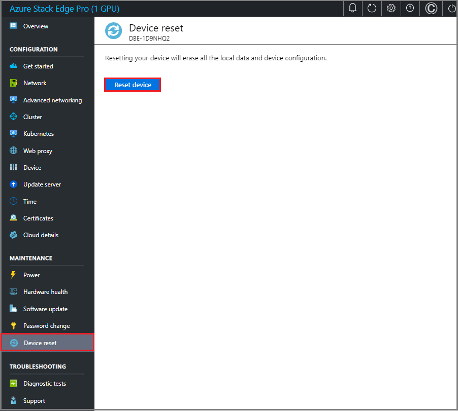
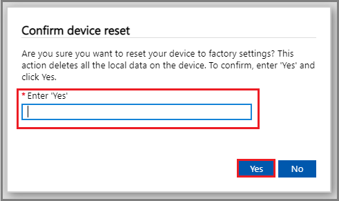
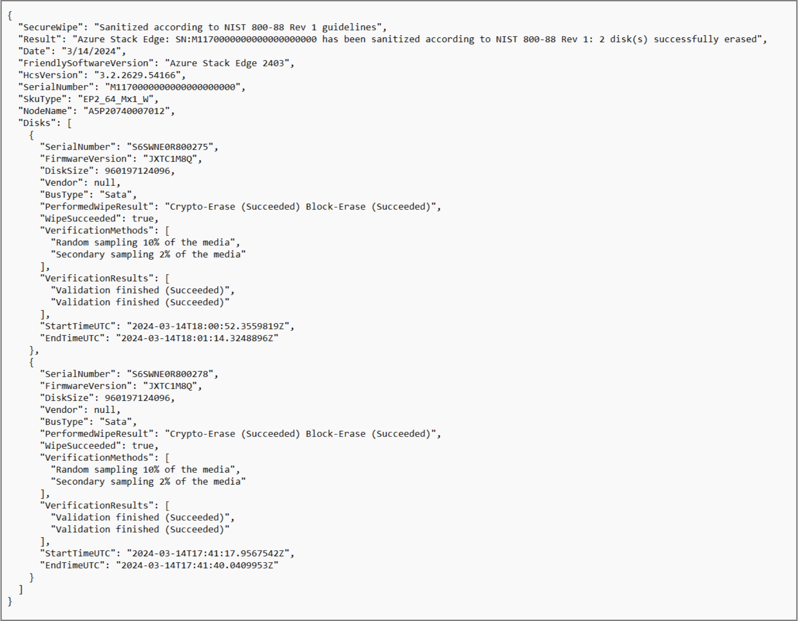
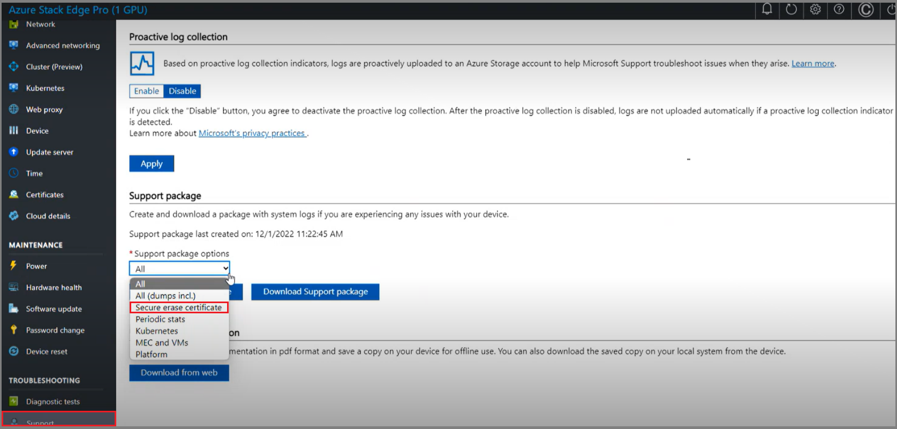

# Erase data from your Azure Stack Edge

[!INCLUDE [applies-to-GPU-and-pro-r-and-mini-r-skus](../../includes/azure-stack-edge-applies-to-gpu-pro-r-mini-r-sku.md)]

This article provides steps to reset an Azure Stack Edge device. The reset operation generates a Secure Erase Certificate that verifies details about your device in an erase record. You can also manually generate a Secure Erase Certificate.

The Secure Erase Certificate includes software version details about the device and disk-by-disk details including data erasure type, data erasure method, and erasure verification method. 
 
The following erase types are supported:

|Data erasure type |Description  |
|---------|---------|
|CryptoErase  |Sanitizes the encryption key, leaving the data on disk unrecoverable.  |
|BlockErase  |Deletes all user data from the disk.  |
|CryptoAndBlockErase  |Performs a crypto erase followed by a block erase.  |

## Reset the Azure Stack Edge device

1. In Azure portal for your Azure Stack Edge device, select **Device reset** in the left-hand navigation, then select **Reset device**.

   

1. On the Confirm device reset dialog, type **Yes** and then select **Yes** to confirm the reset operation.

   

1. Azure Stack Edge device reset operation generates a Secure Erase Certificate, as shown below:

   

## Download the Secure Erase Certificate for your device

Use the following steps to download a Secure Erase Certificate for your device after device reset:

1. On the Azure portal, select **Support** and then select **Secure erase certificate** from the **Support package options** dropdown.
1. Select **Secure erase certificate**.

   

1. Select **Create Support package** > **Download Support package** to download the certificate.

## Next steps

 - [What is Azure Stack Edge Pro 2?](azure-stack-edge-pro-2-overview.md)
